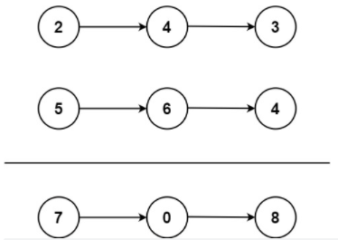

## 25、两数相加(LC 2)

给你两个 非空 的链表，表示两个非负的整数。它们每位数字都是按照 逆序 的方式存储的，并且每个节点只能存储 一位 数字。

请你将两个数相加，并以相同形式返回一个表示和的链表。

你可以假设除了数字 0 之外，这两个数都不会以 0 开头。

**示例**

示例1: 



```
	输入：l1 = [2,4,3], l2 = [5,6,4]
	输出：[7,0,8]
	解释：342 + 465 = 807.
示例 2：
	输入：l1 = [0], l2 = [0]
	输出：[0]
示例 3：
	输入：l1 = [9,9,9,9,9,9,9], l2 = [9,9,9,9]
	输出：[8,9,9,9,0,0,0,1]
```

**代码**

```c
struct ListNode* addTwoNumbers(struct ListNode* l1, struct ListNode* l2){
    //使用进位的思想来计算
    //获取两个链表的长度, 用来动态生成数组
    struct ListNode * p,*q,*t;
    t = malloc(sizeof(struct ListNode));
    p = l1;
    q = l2;
    int lenA = 0;
    int lenB = 0;
    while(p){
        lenA++;
        p = p->next;
    }
    while(q){
        lenB++;
        q = q->next;
    }
    //扩宽比较短的链表长度, 与长的链表长度一致 - 可以采用
    int tag = 0;    //进位标志
    int plus = 0;   //各位相加和
    int i = 0;      //当前是第几位
    int * nums = malloc(sizeof(int)* (lenA > lenB ? lenA + 1 : lenB + 1));        //获取最大的长度加1 相加最大进一位
    while(l1 || l2){
        if(!l1){
            plus = 0 + l2->val; 
        } else if(!l2){
            plus = l1->val + 0; 
        } else if(l1 && l2){
            plus = l1->val + l2->val;
        }
        
        //不考虑进位先赋值
        nums[i] = (plus+tag) % 10;    //个位 % 10 仍然为原数

        //当前位是否有向上一级的进位
        if(plus+tag >= 10)
            tag = 1;
        else
            tag = 0;
        
        i++;
        if(l1)
            l1 = l1->next;
        if(l2)
            l2 = l2->next;
    }

    int j = 0;
    q = t;
    for(j = 0;j < i;j++){
        struct ListNode * h = malloc(sizeof(struct ListNode));
        h->val = nums[j];
        t->next = h;
        t = t->next;
    }
    //9 + 9 = 18 8 1 没有 1 位, 这里加上
    if(tag == 1){
        struct ListNode * h = malloc(sizeof(struct ListNode));
        h->val = 1;
        t->next = h;
        t = t->next;
    }
    t->next = NULL;
    return q->next;
}
```

转为整型计算再分割存入链表 - 精度比较小, 限制在 int / long 范围内

```c
struct ListNode* addTwoNumbers(struct ListNode* l1, struct ListNode* l2){
    struct ListNode * p,*q,*t;
    p = l1;
    q = l2;
    t = malloc(sizeof(struct ListNode));
    int reverseA = 0;
    int reverseB = 0;
    //转为int计算再转为链表
    int i = 0;
    while(l1){
        reverseA += l1->val * pow(10,i);
        l1 = l1->next;
        i++;
    }
    i = 0;
    while(l2){
        reverseB += l2->val * pow(10,i);
        l2 = l2->next;
        i++;
    }
    int final = reverseA + reverseB;
    p = t;
    //将结果存到链表
    //处理边界条件 两个链表都为0的情况
    if(final == 0){
        struct ListNode * h = malloc(sizeof(struct ListNode));
        h->val = 0;    //各位开始存,结果是反的
        t->next = h;
        t = t->next;
    } else{
        while(final){
            struct ListNode * h = malloc(sizeof(struct ListNode));
            h->val = final % 10;    //各位开始存,结果是反的
            t->next = h;
            t = t->next;
            final/=10;
        }
    }
    t->next = NULL;
    return p->next;
}
```


## 26、2的幂

给你一个整数 n，请你判断该整数是否是 2 的幂次方。如果是，返回 true ；否则，返回 false 。

如果存在一个整数 x 使得$n = 2^x$ ，则认为 n 是 2 的幂次方。

**示例**

```c
示例 1：
	输入：n = 1
	输出：true
	解释：20 = 1
示例 2：
	输入：n = 16
	输出：true
	解释：24 = 16
示例 3：
	输入：n = 3
	输出：false
示例 4：
	输入：n = 4
	输出：true
示例 5：
	输入：n = 5
	输出：false
```

**代码**

**进制转换思想** 利用2的幂转换为2进制一定只含有一个1来判断是否是2的幂次 1 = 1  10 = 2  100 = 4 1000 = 8 

```c
bool isPowerOfTwo(int n){
    int tag = 0;
    while(n){
        tag += n % 2;
        n /= 2;
    }
    return tag == 1 ? true : false;
}
```

**暴力法**    这里可以通过一些方法来缩减复杂度, 先获取 n 的 i * i = n 的情况, 抛去 n % 2 != 0的情况等

```c
bool isPowerOfTwo(int n){
    int i;
    for(i = 0;i < n;i++){
        if(pow(2,i) == n)
            return true;
    }
    return false;
}
```


## 27、3的幂(LC 326)

给定一个整数，写一个函数来判断它是否是 3 的幂次方。如果是，返回 true ；否则，返回 false 。

整数 n 是 3 的幂次方需满足：存在整数 x 使得 n == $3^x$

**示例**

```
示例 1：
	输入：n = 27
	输出：true
示例 2：
	输入：n = 0
	输出：false
示例 3：
	输入：n = 9
	输出：true
示例 4：
	输入：n = 45
	输出：false
```

**代码**

**进制转换思想** 利用3的幂转换为3进制一定只含有一个1来判断是否是3的幂次  1 = 1  10 = 3  100 = 9 1000 = 27 

```c
bool isPowerOfThree(int n){
    int tag = 0;
    while(n){
        tag += n % 3;
        n /= 3;
    }
    return tag == 1 ? true : false;
}
```

