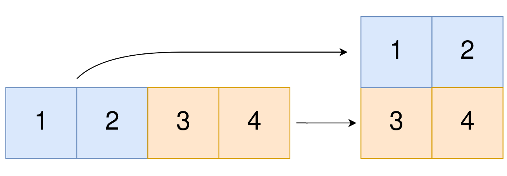

## 58、找到数组的中间位置(LC 1991)

给你一个下标从 **0** 开始的整数数组 `nums` ，请你找到 **最左边** 的中间位置 `middleIndex` （也就是所有可能中间位置下标最小的一个）。

中间位置 `middleIndex` 是满足 `nums[0] + nums[1] + ... + nums[middleIndex-1] == nums[middleIndex+1] + nums[middleIndex+2] + ... + nums[nums.length-1]` 的数组下标。

如果 `middleIndex == 0` ，左边部分的和定义为 `0` 。类似的，如果 `middleIndex == nums.length - 1` ，右边部分的和定义为 `0` 。

请你返回满足上述条件 **最左边** 的 `middleIndex` ，如果不存在这样的中间位置，请你返回 `-1` 。

 

**示例 1：**

```
输入：nums = [2,3,-1,8,4]
输出：3
解释：
下标 3 之前的数字和为：2 + 3 + -1 = 4
下标 3 之后的数字和为：4 = 4
```

**示例 2：**

```
输入：nums = [1,-1,4]
输出：2
解释：
下标 2 之前的数字和为：1 + -1 = 0
下标 2 之后的数字和为：0
```

**示例 3：**

```
输入：nums = [2,5]
输出：-1
解释：
不存在符合要求的 middleIndex 。
```

**示例 4：**

```
输入：nums = [1]
输出：0
解释：
下标 0 之前的数字和为：0
下标 0 之后的数字和为：0
```

**代码**

暴力法 迭代即可

```c
int findMiddleIndex(int* nums, int numsSize){
    //暴力法
    int i,j;
    int left = 0,right = 0;

    for(i = 0;i < numsSize;i++){
        right = 0;      //重置 right
    
        for(j = i+1;j < numsSize;j++)
            right += nums[j];

        if(left == right)
            return i;
        
        left += nums[i];

        //到最开始位置 一次判断
        if(right == 0 && i == 0)
            return 0;
    }
    //到最终位置还需要一次判断
    if(left - nums[numsSize-1] == 0)
        return numsSize;
    return -1;
}
```


## 59、将一维数组转变成二维数组(LC 2022)

给你一个下标从 **0** 开始的一维整数数组 `original` 和两个整数 `m` 和 `n` 。你需要使用 `original` 中 **所有** 元素创建一个 `m` 行 `n` 列的二维数组。

`original` 中下标从 `0` 到 `n - 1` （都 **包含** ）的元素构成二维数组的第一行，下标从 `n` 到 `2 * n - 1` （都 **包含** ）的元素构成二维数组的第二行，依此类推。

请你根据上述过程返回一个 `m x n` 的二维数组。如果无法构成这样的二维数组，请你返回一个空的二维数组。

 

**示例 1：**



```
输入：original = [1,2,3,4], m = 2, n = 2
输出：[[1,2],[3,4]]
解释：
构造出的二维数组应该包含 2 行 2 列。
original 中第一个 n=2 的部分为 [1,2] ，构成二维数组的第一行。
original 中第二个 n=2 的部分为 [3,4] ，构成二维数组的第二行。
```

**示例 2：**

```
输入：original = [1,2,3], m = 1, n = 3
输出：[[1,2,3]]
解释：
构造出的二维数组应该包含 1 行 3 列。
将 original 中所有三个元素放入第一行中，构成要求的二维数组。
```

**示例 3：**

```
输入：original = [1,2], m = 1, n = 1
输出：[]
解释：
original 中有 2 个元素。
无法将 2 个元素放入到一个 1x1 的二维数组中，所以返回一个空的二维数组。
```

**示例 4：**

```
输入：original = [3], m = 1, n = 2
输出：[]
解释：
original 中只有 1 个元素。
无法将 1 个元素放满一个 1x2 的二维数组，所以返回一个空的二维数组。
```

 **代码**

暴力模拟即可 

```c
/**
 * Return an array of arrays of size *returnSize.
 * The sizes of the arrays are returned as *returnColumnSizes array.
 * Note: Both returned array and *columnSizes array must be malloced, assume caller calls free().
 */
int** construct2DArray(int* original, int originalSize, int m, int n, int* returnSize, int** returnColumnSizes){
    if (m * n != originalSize) { /* 不能转换的情况 */
        *returnSize = 0;
        return NULL;
    }

    *returnColumnSizes = (int*)malloc(sizeof(int) * m);
    //重构数组
    int ** result = malloc(sizeof(int*) * m);
    int i,j,tag = 0;  

    for(i = 0;i < m;i++){
        result[i] = malloc(sizeof(int) * n);
        (*returnColumnSizes)[i] = n;
        for(j = 0;j < n;j++)
            result[i][j] = original[tag++];
    }
    *returnSize = m;
    return result;
}
```


## 60. 使每位学生都有座位的最少移动次数(LC 2037)

一个房间里有 `n` 个座位和 `n` 名学生，房间用一个数轴表示。给你一个长度为 `n` 的数组 `seats` ，其中 `seats[i]` 是第 `i` 个座位的位置。同时给你一个长度为 `n` 的数组 `students` ，其中 `students[j]` 是第 `j` 位学生的位置。

你可以执行以下操作任意次：

- 增加或者减少第 `i` 位学生的位置，每次变化量为 `1` （也就是将第 `i` 位学生从位置 `x` 移动到 `x + 1` 或者 `x - 1`）

请你返回使所有学生都有座位坐的 **最少移动次数** ，并确保没有两位学生的座位相同。

请注意，初始时有可能有多个座位或者多位学生在 **同一** 位置。

 

**示例 1：**

```
输入：seats = [3,1,5], students = [2,7,4]
输出：4
解释：学生移动方式如下：
- 第一位学生从位置 2 移动到位置 1 ，移动 1 次。
- 第二位学生从位置 7 移动到位置 5 ，移动 2 次。
- 第三位学生从位置 4 移动到位置 3 ，移动 1 次。
总共 1 + 2 + 1 = 4 次移动。
```

**示例 2：**

```
输入：seats = [4,1,5,9], students = [1,3,2,6]
输出：7
解释：学生移动方式如下：
- 第一位学生不移动。
- 第二位学生从位置 3 移动到位置 4 ，移动 1 次。
- 第三位学生从位置 2 移动到位置 5 ，移动 3 次。
- 第四位学生从位置 6 移动到位置 9 ，移动 3 次。
总共 0 + 1 + 3 + 3 = 7 次移动。
```

**示例 3：**

```
输入：seats = [2,2,6,6], students = [1,3,2,6]
输出：4
解释：学生移动方式如下：
- 第一位学生从位置 1 移动到位置 2 ，移动 1 次。
- 第二位学生从位置 3 移动到位置 6 ，移动 3 次。
- 第三位学生不移动。
- 第四位学生不移动。
总共 1 + 3 + 0 + 0 = 4 次移动。
```

**代码**

快速排序 将 `seats` & `students` 进行排序, 排序后的按位对应结果就是最优结果。

还有一种就是按照 `students` 的初始先后进行选择, 最终不一定是全局最优,但对有 rank 的个体而言是最优的, 当然这种方法不是该题目的解法。

```c
int cmp(const void *a,const void *b){
    return *(int*)a - *(int*)b;
}

int minMovesToSeat(int* seats, int seatsSize, int* students, int studentsSize){
    //实质上就是找 学生位置 from 和 target 最接近的点, 也即排序问题
    // o(n^2)
    qsort(seats,seatsSize,sizeof(int),cmp);
    qsort(students,studentsSize,sizeof(int),cmp);

    int i,times = 0;
    for(i = 0;i < studentsSize;i++) 
        times += abs(seats[i] - students[i]);
    return times;
}
```

