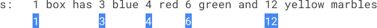
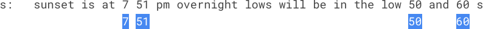

## 61、检查句子中的数字是否递增(LC 2042)

句子是由若干 **token** 组成的一个列表，**token** 间用 **单个** 空格分隔，句子没有前导或尾随空格。每个 token 要么是一个由数字 `0-9` 组成的不含前导零的 **正整数** ，要么是一个由小写英文字母组成的 **单词** 。

- 示例，`"a puppy has 2 eyes 4 legs"` 是一个由 7 个 token 组成的句子：`"2"` 和 `"4"` 是数字，其他像 `"puppy"` 这样的 tokens 属于单词。

给你一个表示句子的字符串 `s` ，你需要检查 `s` 中的 **全部** 数字是否从左到右严格递增（即，除了最后一个数字，`s` 中的 **每个** 数字都严格小于它 **右侧** 的数字）。

如果满足题目要求，返回 `true` ，否则，返回 `false` 。

 

**示例 1：**



```
输入：s = "1 box has 3 blue 4 red 6 green and 12 yellow marbles"
输出：true
解释：句子中的数字是：1, 3, 4, 6, 12 。
这些数字是按从左到右严格递增的 1 < 3 < 4 < 6 < 12 。
```

**示例 2：**

```
输入：s = "hello world 5 x 5"
输出：false
解释：句子中的数字是：5, 5 。这些数字不是严格递增的。
```

**示例 3：**



```
输入：s = "sunset is at 7 51 pm overnight lows will be in the low 50 and 60 s"
输出：false
解释：s 中的数字是：7, 51, 50, 60 。这些数字不是严格递增的。
```

**示例 4：**

```
输入：s = "4 5 11 26"
输出：true
解释：s 中的数字是：4, 5, 11, 26 。
这些数字是按从左到右严格递增的：4 < 5 < 11 < 26 。
```

 **代码**

暴力法 实际的进行转换

```c
/*
 * 输入: 将字符串根据字符 ch 进行划分
 * 输出: 划分后的二维数组
 * 可接受: ss1bb1  以1位分割符
*/
char ** splitAsChar(char * str,char ch,int * returnsize){
    //首先记录字符长度
    int length = 1,i;
    char * head = str;
    while(*head){
        if(*head == ch)
            length++;
        head++;
    }

    //生成二维数组
    int ** result = malloc(sizeof(char*) * length);
    for(i = 0;i < length;i++)
        result[i] = malloc(sizeof(char) * 20);

    //开始分割
    head = str;
    char temp[10];
    int tag = 0,cur = 0;
    while(*head){
        if(*head != ch){
            temp[tag++] = *head;
            temp[tag] = '\0';
        } else{
            strcpy(result[cur++],temp);
            temp[tag] = '\0';
            tag = 0;
        }
        head++;
    }
    //末尾没有进行赋值
    strcpy(result[cur],temp);

    *returnsize = length;
    return result;
}

/*
 * 输入: 可转换为数字的字符数组
 * 输出: 转换后的数字 -1 代表转化失败;
*/
int strToInt(char * str){
    int length = strlen(str);
    int i;
    int * nums = malloc(sizeof(int) * length);
    for(i = 0;i < length;i++){
        //转换失败
        if(str[i] - '0' > 9 || str[i] - '0' < 0)
            return -1;
        else
            nums[i] = str[i] - '0';
    }
        
    //合并数组为整数
    double result = 0;
    for(i = length - 1;i >= 0;i--)
        result += nums[i] * pow(10,length - i - 1);
    return result;
}

bool areNumbersAscending(char * s){
    //分割数组
    int size,i,tag = 0;
    char ** str = splitAsChar(s,' ',&size);
    int * nums = malloc(sizeof(int) * size);
    //转换合适的字符串为数字
    for(i = 0;i < size;i++){
        if(strToInt(str[i]) != -1)
            nums[tag++] = strToInt(str[i]);
    }


    for(i = 0;i < tag-1;i++){
        printf("%d %d  ",nums[i],nums[i+1]);
        if(nums[i] >= nums[i+1])
            return false;
    }
    return true;
}
```


## 62、数组中第 K 个独一无二的字符串(LC 2053)

**独一无二的字符串** 指的是在一个数组中只出现过 **一次** 的字符串。

给你一个字符串数组 `arr` 和一个整数 `k` ，请你返回 `arr` 中第 `k` 个 **独一无二的字符串** 。如果 **少于** `k` 个独一无二的字符串，那么返回 **空字符串** `""` 。

注意，按照字符串在原数组中的 **顺序** 找到第 `k` 个独一无二字符串。

 

**示例 1:**

```
输入：arr = ["d","b","c","b","c","a"], k = 2
输出："a"
解释：
arr 中独一无二字符串包括 "d" 和 "a" 。
"d" 首先出现，所以它是第 1 个独一无二字符串。
"a" 第二个出现，所以它是 2 个独一无二字符串。
由于 k == 2 ，返回 "a" 。
```

**示例 2:**

```
输入：arr = ["aaa","aa","a"], k = 1
输出："aaa"
解释：
arr 中所有字符串都是独一无二的，所以返回第 1 个字符串 "aaa" 。
```

**示例 3：**

```
输入：arr = ["a","b","a"], k = 3
输出：""
解释：
唯一一个独一无二字符串是 "b" 。由于少于 3 个独一无二字符串，我们返回空字符串 "" 。
```

**代码**

```c
char * kthDistinct(char ** arr, int arrSize, int k){
    //设置一个间接数组,对唯一性进行检验
    int * nums = malloc(sizeof(int) * arrSize);
    int tag = 1,i = 0,j = 0;
    for(i = 0;i < arrSize;i++)  nums[i] = 0;

    for(i = 0;i < arrSize;i++){
        for(j = 0;j < arrSize;j++){
            //跳过自身
            if(i == j)
                continue;
            if(!strcmp(arr[i],arr[j]))
                break;
        }
        if(j == arrSize)
            nums[i] = tag++;
    }

    //根据 k 查找
    tag = -1;
    for(i = 0;i < arrSize;i++)
        if(k == nums[i]){
            tag = i;
            break;
        } 
    
    return tag == -1 ? "" : arr[tag];
}
```


## 63、适龄的朋友(LC 825)

`难度中等`

在社交媒体网站上有 `n` 个用户。给你一个整数数组 `ages` ，其中 `ages[i]` 是第 `i` 个用户的年龄。

如果下述任意一个条件为真，那么用户 `x` 将不会向用户 `y`（`x != y`）发送好友请求：

- `age[y] <= 0.5 * age[x] + 7`
- `age[y] > age[x]`
- `age[y] > 100 && age[x] < 100`

否则，`x` 将会向 `y` 发送一条好友请求。

注意，如果 `x` 向 `y` 发送一条好友请求，`y` 不必也向 `x` 发送一条好友请求。另外，用户不会向自己发送好友请求。

返回在该社交媒体网站上产生的好友请求总数。

 

**示例 1：**

```
输入：ages = [16,16]
输出：2
解释：2 人互发好友请求。
```

**示例 2：**

```
输入：ages = [16,17,18]
输出：2
解释：产生的好友请求为 17 -> 16 ，18 -> 17 。
```

**示例 3：**

```
输入：ages = [20,30,100,110,120]
输出：3
解释：产生的好友请求为 110 -> 100 ，120 -> 110 ，120 -> 100 。
```

**代码**

超时代码 复杂度 $O(n^2)$

```c
int numFriendRequests(int* ages, int agesSize){
    //实际就是双重循环嵌套进行条件遍历
    printf("%d\n",agesSize);
    int i,j,times = 0;
    for(i = 0;i < agesSize;i++){
        for(j = 0;j < agesSize;j++){
            if(i == j)
                continue;
            printf("%d %d\n",ages[i],ages[j]);
            if(ages[j] <= 0.5 * ages[i ] + 7)
                continue;
            if(ages[j] > ages[i])
                continue;
            times++;
        }
    }
    return times;
}
```

`LeetCode` 解法, 添加注释

```c
int cmp(const void *a,const void *b){
    return *(int*)a - *(int*)b;
}

int numFriendRequests(int* ages, int agesSize){
    //首先按照从小到大排序
    qsort(ages, agesSize, sizeof(int), cmp);
    //定义左右指针
    int left = 0, right = 0, times = 0;
    for (int i = 0; i < agesSize; ++i) {
        //显然,在年龄 <= 14 时不满足要求
        //y <= 14  && y >14
        if (ages[i] < 15) {
            continue;
        }
        //得到 ages[i] 的左界
        while (ages[left] <= 0.5 * ages[i] + 7) {
            ++left;
        }
        //得到 ages[i] 的右界
        while (right < agesSize - 1 && ages[right + 1] <= ages[i]) {
            ++right;
        }
        times += right - left;
    }
    return times;
}
```

将 ages[i] < 15 的进行剔除, 降低复杂度

```c
int cmp(const void *a,const void *b){
    return *(int*)a - *(int*)b;
}

int numFriendRequests(int* ages, int agesSize){
    //首先按照从小到大排序
    qsort(ages, agesSize, sizeof(int), cmp);
    //首先剔除 ages[i] < 15 的元素
    int i,tag = 0;
    for(i = 0;i < agesSize;i++)
    //获取对应的 最先到大的年龄元素
        if(ages[i] >= 15)
            break;
    tag = i;
    //剔除
    for(i = 0;i < agesSize - tag;i++)
        ages[i] = ages[i+tag];
    
    agesSize -= tag;
    //定义左右指针
    int left = 0, right = 0, times = 0;
    for (int i = 0; i < agesSize; ++i) {
        //得到 ages[i] 的左界
        while (ages[left] <= 0.5 * ages[i] + 7) {
            ++left;
        }
        //得到 ages[i] 的右界
        while (right < agesSize - 1 && ages[right + 1] <= ages[i]) {
            ++right;
        }
        times += right - left;
    }
    return times;
}
```

