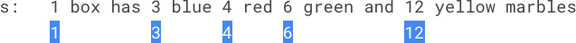
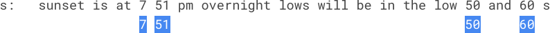

## 1、独一无二的出现次数(LC 1207)

给你一个整数数组 arr，请你帮忙统计数组中每个数的出现次数。

如果每个数的出现次数都是独一无二的，就返回 true；否则返回 false。

**示例**

```
示例 1：
    输入：arr = [1,2,2,1,1,3]
    输出：true
    解释：在该数组中，1 出现了 3 次，2 出现了 2 次，3 只出现了 1 次。没有两个数的出现次数相同。
示例 2：
    输入：arr = [1,2]
    输出：false
示例 3：
    输入：arr = [-3,0,1,-3,1,1,1,-3,10,0]
    输出：true
```

**代码**

间接数组计算出现次数, 在对出现次数排序, 判断是否出现重复。

```c
int cmp(const void *a,const void *b){
    return *(int*)a - *(int*)b;
}

bool uniqueOccurrences(int* arr, int arrSize){
    //1、快排 + 比较 记录出现次数, 最后比较
    //2、声明 N 个空间,记录出现次数 模拟 Hash 表
    //采用快排 + 比较 的方法
    qsort(arr,arrSize,sizeof(int),cmp);
    int * nums = malloc(sizeof(int)*arrSize);
    //初始化赋值 初始为 1
    int i;
    for(i = 0;i < arrSize;i++)  nums[i] = 1;
    //比较
    int cur = 0,tag = 0;
    for(i = 1;i < arrSize;i++,cur++){
        if(arr[cur] == arr[i]){
            nums[tag]++;
            continue;
        }
        tag++;
    }
    tag += 1;       //少加了一次, 因为比较的是下标
    //在判断 nums 数组是否重复
    qsort(nums,tag,sizeof(int),cmp);
    cur = nums[0];
    cur = 0;
    for(i = 1;i < tag;i++,cur++){
        //printf("%d ",nums[i]);
        if(nums[cur] == nums[i])
            return false;
    }
    return true;
}
```


## 2、玩筹码(LC 1217)

示例

数轴上放置了一些筹码，每个筹码的位置存在数组 chips 当中。

你可以对 任何筹码 执行下面两种操作之一（不限操作次数，0 次也可以）：

将第 i 个筹码向左或者右移动 2 个单位，代价为 0。
将第 i 个筹码向左或者右移动 1 个单位，代价为 1。
最开始的时候，同一位置上也可能放着两个或者更多的筹码。

返回将所有筹码移动到同一位置（任意位置）上所需要的最小代价。

**示例**

 ```
 示例 1：
 输入：chips = [1,2,3]
 输出：1
 解释：第二个筹码移动到位置三的代价是 1，第一个筹码移动到位置三的代价是 0，总代价为 1。
 示例 2：
 输入:chips = [2,2,2,3,3]
 输出：2
 解释：第四和第五个筹码移动到位置二的代价都是 1，所以最小总代价为 2。
 ```

**代码**

1.首先分析发现：偶数位置转移到任意偶数位置代价为0，同理奇数位置转移到任意奇数位置代价也为0；
2.其次，我们简化筹码位置，将所有偶数集中到2X位置，所有奇数集中到2X+1（或2X-1）位置；
3.要想代价最小，就是移动数量最小的集合。
4.综合分析，发现实际上就是统计奇数和偶数的个数，取小者。

时间复杂度O(n),空间复杂度O(1)。

```c
int minCostToMoveChips(int* chips, int chipsSize){
    int odd = 0, even = 0;
    for(int i = 0; i < chipsSize; i++)
    {
        if(chips[i]%2)
            odd++;
        else
            even++;
    }
    return (odd <= even)? odd: even;
}
```


## 3、距离顺序排列矩阵单元格(LC 1030)

给出 R 行 C 列的矩阵，其中的单元格的整数坐标为 (r, c)，满足 0 <= r < R 且 0 <= c < C。

另外，我们在该矩阵中给出了一个坐标为 (r0, c0) 的单元格。

返回矩阵中的所有单元格的坐标，并按到 (r0, c0) 的距离从最小到最大的顺序排，其中，两单元格(r1, c1) 和 (r2, c2) 之间的距离是曼哈顿距离，|r1 - r2| + |c1 - c2|。（你可以按任何满足此条件的顺序返回答案。）

 **示例**

```
示例 1：
    输入：R = 1, C = 2, r0 = 0, c0 = 0
    输出：[[0,0],[0,1]]
    解释：从 (r0, c0) 到其他单元格的距离为：[0,1]
示例 2：
    输入：R = 2, C = 2, r0 = 0, c0 = 1
    输出：[[0,1],[0,0],[1,1],[1,0]]
    解释：从 (r0, c0) 到其他单元格的距离为：[0,1,1,2]
    [[0,1],[1,1],[0,0],[1,0]] 也会被视作正确答案。
示例 3：
    输入：R = 2, C = 3, r0 = 1, c0 = 2
    输出：[[1,2],[0,2],[1,1],[0,1],[1,0],[0,0]]
    解释：从 (r0, c0) 到其他单元格的距离为：[0,1,1,2,2,3]
    其他满足题目要求的答案也会被视为正确，例如 [[1,2],[1,1],[0,2],[1,0],[0,1],[0,0]]。
```

**代码**

存放距离 + 排序

```c
int r0, c0;
//比较函数, 根据 当前点到目标点的哈曼顿距离 返回比较结果
int cmp(void* _a, void* _b) {
    int *a = *(int**)_a, *b = *(int**)_b;
    return fabs(a[0] - r0) + fabs(a[1] - c0) - fabs(b[0] - r0) - fabs(b[1] - c0);
}

int** allCellsDistOrder(int rows, int cols, int rCenter, int cCenter, int* returnSize, int** returnColumnSizes){
    //计算二维矩阵距离 点 (r0,c0) 的距离并保存
    //定义间接数组存放保存数据
    r0 = rCenter, c0 = cCenter;     //修改参数名便于计算
    int length = rows * cols;       //数组空间大小
    int ** nums = malloc(sizeof(int*) * length);     //一维数组存放结果
    *returnColumnSizes = malloc(sizeof(int) * length);
    for (int i = 0; i < length; i++) {
        (*returnColumnSizes)[i] = 2;        //返回的数组大小每列 = 2
        nums[i] = malloc(sizeof(int) * 2);  //为结果数组分配空间
    }
    int tag = 0;
    for (int i = 0; i < rows; i++) {
        for (int j = 0; j < cols; j++) {
            nums[tag][0] = i;
            nums[tag][1] = j;
            tag++;
        }
    }
    *returnSize = tag;
    qsort(nums, length, sizeof(int*), cmp);
    return nums;
}
```


## 4、分糖果(LC 1103)

排排坐，分糖果。

我们买了一些糖果 candies，打算把它们分给排好队的 n = num_people 个小朋友。

给第一个小朋友 1 颗糖果，第二个小朋友 2 颗，依此类推，直到给最后一个小朋友 n 颗糖果。

然后，我们再回到队伍的起点，给第一个小朋友 n + 1 颗糖果，第二个小朋友 n + 2 颗，依此类推，直到给最后一个小朋友 2 * n 颗糖果。

重复上述过程（每次都比上一次多给出一颗糖果，当到达队伍终点后再次从队伍起点开始），直到我们分完所有的糖果。注意，就算我们手中的剩下糖果数不够（不比前一次发出的糖果多），这些糖果也会全部发给当前的小朋友。

返回一个长度为 num_people、元素之和为 candies 的数组，以表示糖果的最终分发情况（即 ans[i] 表示第 i 个小朋友分到的糖果数）。

 **示例**

```
示例 1：
    输入：candies = 7, num_people = 4
    输出：[1,2,3,1]
    解释：
    第一次，ans[0] += 1，数组变为 [1,0,0,0]。
    第二次，ans[1] += 2，数组变为 [1,2,0,0]。
    第三次，ans[2] += 3，数组变为 [1,2,3,0]。
    第四次，ans[3] += 1（因为此时只剩下 1 颗糖果），最终数组变为 [1,2,3,1]。
示例 2：
    输入：candies = 10, num_people = 3
    输出：[5,2,3]
    解释：
    第一次，ans[0] += 1，数组变为 [1,0,0]。
    第二次，ans[1] += 2，数组变为 [1,2,0]。
    第三次，ans[2] += 3，数组变为 [1,2,3]。
    第四次，ans[0] += 4，最终数组变为 [5,2,3]。
```

**代码**

简单迭代 模拟发糖

```c
/**
 * Note: The returned array must be malloced, assume caller calls free().
 */
int* distributeCandies(int candies, int num_people, int* returnSize){
    *returnSize = num_people;
    int * nums = malloc(sizeof(int) * num_people);
    int i = 0;
    //为数组赋值
    for(i = 0;i < num_people;i++) 
        nums[i] = 0;
    int n = 1;
    while(candies){
        for(i = 0;i < num_people;i++){
            //printf("%d %d ",n,i);
            
            if(candies > n){
                nums[i] += n;
                candies -= n;
            }
            else{
                nums[i] += candies;
                candies = 0;
            }
            n++;
        }
    }
    return nums;
}
```


## 5、IP 地址无效化(LC 1108)

给你一个有效的 IPv4 地址 address，返回这个 IP 地址的无效化版本。

所谓无效化 IP 地址，其实就是用 "[.]" 代替了每个 "."。

 **示例**

```
示例 1：
    输入：address = "1.1.1.1"
    输出："1[.]1[.]1[.]1"
示例 2：
    输入：address = "255.100.50.0"
    输出："255[.]100[.]50[.]0"
```

**代码**

替换即可

```c
char * defangIPaddr(char * address){
    //间接替换
    char * change = malloc((strlen(address) + 10) * sizeof(char));
    char str[4] = "[.]";
    int i = 0,tag = 0,j;
    for(i = 0;i < strlen(address);i++){
        if(address[i] == '.'){
            for(j = 0;j < 3;j++)
                change[tag++] = str[j]; 
            continue;
        }
        change[tag++] = address[i];
    }
    change[tag] = '\0'; 
    printf("%s ",change);
    return change;
}
```


## 6、第 N 个斐波那契数(LC 1137)

泰波那契序列 Tn 定义如下： 

T0 = 0, T1 = 1, T2 = 1, 且在 n >= 0 的条件下 Tn+3 = Tn + Tn+1 + Tn+2

给你整数 n，请返回第 n 个泰波那契数 Tn 的值。

**示例**

```
示例 1：
    输入：n = 4
    输出：4
    解释：
    T_3 = 0 + 1 + 1 = 2
    T_4 = 1 + 1 + 2 = 4
示例 2：
    输入：n = 25
    输出：1389537
```

**代码**

递归 超时,复杂度比较高

```c
int fib(int n){
    if(n == 0)
        return 0;
    if(n == 1)
        return 1;
    if(n == 2)
        return 1;
    return fib(n-1) + fib(n-2) + fib(n-3);
}

int tribonacci(int n){
    return fib(n);
}
```

使用项值间距 迭代

```c
int tribonacci(int n){
    //反向思考 T(2) = 1
    //T(3) = T(2) + T(1) + T(0)
    //  pre1 和 pre2 是 T(n) 与 T(n-1) 之间的差值
    int res = 0, pre1 = 0, pre2 = 1;
    while (n--)
    {
        res += pre1 + pre2;     // 2
        pre1 = res - pre1 - pre2;
        pre2 = res - pre1 - pre2;
    }
    return res;
}
```


## 7、拼写单词(LC 1160)

给你一份『词汇表』（字符串数组） words 和一张『字母表』（字符串） chars。

假如你可以用 chars 中的『字母』（字符）拼写出 words 中的某个『单词』（字符串），那么我们就认为你掌握了这个单词。

注意：每次拼写（指拼写词汇表中的一个单词）时，chars 中的每个字母都只能用一次。

返回词汇表 words 中你掌握的所有单词的 长度之和。

**示例**

```
示例 1：
    输入：words = ["cat","bt","hat","tree"], chars = "atach"
    输出：6
    解释： 
    可以形成字符串 "cat" 和 "hat"，所以答案是 3 + 3 = 6。
示例 2：
    输入：words = ["hello","world","leetcode"], chars = "welldonehoneyr"
    输出：10
    解释：
    可以形成字符串 "hello" 和 "world"，所以答案是 5 + 5 = 10。
```

**代码**

暴力法 记录主串出现情况和出现次数   字串 出现情况和出现次数进行比较即可

```c
int countCharacters(char ** words, int wordsSize, char * chars){
    //去重
    int * nums = malloc(sizeof(int) * 26);
    int * times = malloc(sizeof(int) * 26);
    int result = 0;
    int i,j,k;
    for(i = 0;i < 26;i++)   times[i] = 0;

    while(*chars){
        nums[*chars - 'a']  = 1;
        times[*chars - 'a']++;
        chars++;
    }
    //比较
    for(i = 0;i < wordsSize;i++){
        int tag = 0;
        int * temp1 = malloc(sizeof(int) * 26);
        int * temp2 = malloc(sizeof(int) * 26);
        for(k = 0;k < 26;k++)   temp2[k] = 0;
        for(j = 0;j < strlen(words[i]);j++){
            temp1[words[i][j] - 'a']  = 1;
            temp2[words[i][j] - 'a']++;
        }

        for(j = 0;j < 26;j++){
            if(nums[j] != 1 && temp1[j] == 1){
                tag = 1;
                break;
            } 
            if(times[j] < temp2[j]){
                tag = 1;
                break;
            }
        }
        
        if(tag == 0)
            result += strlen(words[i]);
        free(temp1);
        free(temp2);
    }
    return result;
}
```


## 8、按既定顺序创建目标数组(LC 1389)

给你两个整数数组 nums 和 index。你需要按照以下规则创建目标数组：

目标数组 target 最初为空。
按从左到右的顺序依次读取 nums[i] 和 index[i]，在 target 数组中的下标 index[i] 处插入值 nums[i] 。
重复上一步，直到在 nums 和 index 中都没有要读取的元素。
请你返回目标数组。

题目保证数字插入位置总是存在。

**示例**

```
示例 1：
    输入：nums = [0,1,2,3,4], index = [0,1,2,2,1]
    输出：[0,4,1,3,2]
    解释：
    nums       index     target
    0            0        [0]
    1            1        [0,1]
    2            2        [0,1,2]
    3            2        [0,1,3,2]
    4            1        [0,4,1,3,2]
示例 2：
    输入：nums = [1,2,3,4,0], index = [0,1,2,3,0]
    输出：[0,1,2,3,4]
    解释：
    nums       index     target
    1            0        [1]
    2            1        [1,2]
    3            2        [1,2,3]
    4            3        [1,2,3,4]
    0            0        [0,1,2,3,4]
示例 3：
    输入：nums = [1], index = [0]
    输出：[1]
```

**代码**

迭代 直接按照数组插入的方式进行插入即可, 也即向后整体移动, 然后插入到 *index* 位置。

```c
int * createTargetArray(int* nums, int numsSize, int* index, int indexSize, int* returnSize){
    //插入问题
    * returnSize = numsSize;
    int i,j; 
    int * result = malloc(sizeof(int) * numsSize);
    for(i = 0;i < numsSize;i++){
        for(j = i - 1;j >= index[i];j--){
            result[j+1] = result[j];
        }
        result[index[i]] = nums[i];
    }
    return result;
}
```


## 9、找出数组中的幸运数(LC 1394)

在整数数组中，如果一个整数的出现频次和它的数值大小相等，我们就称这个整数为「幸运数」。

给你一个整数数组 arr，请你从中找出并返回一个幸运数。

如果数组中存在多个幸运数，只需返回 最大 的那个。
如果数组中不含幸运数，则返回 -1 。

**示例**

```
示例 1：
    输入：arr = [2,2,3,4]
    输出：2
    解释：数组中唯一的幸运数是 2 ，因为数值 2 的出现频次也是 2 。
示例 2：
    输入：arr = [1,2,2,3,3,3]
    输出：3
    解释：1、2 以及 3 都是幸运数，只需要返回其中最大的 3 。
示例 3：
    输入：arr = [2,2,2,3,3]
    输出：-1
    解释：数组中不存在幸运数。
示例 4：
    输入：arr = [5]
    输出：-1
示例 5：
    输入：arr = [7,7,7,7,7,7,7]
    输出：7
```

**代码**

快排 + 计数, 排序后根据次序,比较重复次数,然后再把次数和数据值进行比较, 最终返回其中最大的值

```c
int cmp(const void *a,const void *b){
    return *(int*)a - *(int*)b;
}

int findLucky(int* arr, int arrSize){
    //思路: 快速排序 + 一次遍历
    qsort(arr,arrSize,sizeof(int),cmp);
    int tag = arr[0],flag = 1,i;
    int max = 0;
    for(i = 1;i < arrSize;i++){
        if(tag == arr[i])
            flag++;
        else if(tag != arr[i]){
            if(flag == tag)
                max = fmax(max,tag);
            //重置
            tag = arr[i];
            flag = 1;
        }
    }
    //最后一次没有比较
    if(flag == tag)
        max = fmax(max,tag);
    return max == 0 ? -1 : max;
}
```


## 10、好数对的数目(LC 1512)

给你一个整数数组 nums 。

如果一组数字 (i,j) 满足 nums[i] == nums[j] 且 i < j ，就可以认为这是一组 好数对 。

返回好数对的数目。

 **示例**

```
示例 1：
    输入：nums = [1,2,3,1,1,3]
    输出：4
    解释：有 4 组好数对，分别是 (0,3), (0,4), (3,4), (2,5) ，下标从 0 开始
示例 2：
    输入：nums = [1,1,1,1]
    输出：6
    解释：数组中的每组数字都是好数对
示例 3：
    输入：nums = [1,2,3]
    输出：0
```

**代码**

暴力法  效率比较低

```c
int numIdenticalPairs(int* nums, int numsSize){
    //思路: 按顺序找 重复次数
    //暴力法
    int i,j,count=0;
    for(i = 0;i < numsSize;i++){
        for(j = i+1;j < numsSize;j++){
            if(nums[i] == nums[j])
                count++;
        }
    }
    return count;
}
```


## 11、一维数组的动态和(LC 1480)

给你一个数组 nums 。数组「动态和」的计算公式为：runningSum[i] = sum(nums[0]…nums[i]) 。

请返回 nums 的动态和。

 **示例**

```
示例 1：
    输入：nums = [1,2,3,4]
    输出：[1,3,6,10]
    解释：动态和计算过程为 [1, 1+2, 1+2+3, 1+2+3+4] 。
示例 2：
    输入：nums = [1,1,1,1,1]
    输出：[1,2,3,4,5]
    解释：动态和计算过程为 [1, 1+1, 1+1+1, 1+1+1+1, 1+1+1+1+1] 。
示例 3：
    输入：nums = [3,1,2,10,1]
    输出：[3,4,6,16,17]
```

**代码**

动态规划思想 + 迭代

```c
int* runningSum(int* nums, int numsSize, int* returnSize){
    //一次遍历使用计数法 动态规划的思想, 保存中间值
    * returnSize = numsSize;
    int sum = 0,i = 0;
    int * result= malloc(sizeof(int) * numsSize);
    for(i = 0;i < numsSize;i++){
        result[i] = sum + nums[i];
        sum += nums[i];
    }
    return result;
}
```


## 12、重新排列数组(LC 1470)

给你一个数组 nums ，数组中有 2n 个元素，按 [x1,x2,...,xn,y1,y2,...,yn] 的格式排列。

请你将数组按 [x1,y1,x2,y2,...,xn,yn] 格式重新排列，返回重排后的数组。

 **示例**

```
示例 1：
    输入：nums = [2,5,1,3,4,7], n = 3
    输出：[2,3,5,4,1,7] 
    解释：由于 x1=2, x2=5, x3=1, y1=3, y2=4, y3=7 ，所以答案为 [2,3,5,4,1,7]
示例 2：
    输入：nums = [1,2,3,4,4,3,2,1], n = 4
    输出：[1,4,2,3,3,2,4,1]
示例 3：
    输入：nums = [1,1,2,2], n = 2
    输出：[1,2,1,2]
```

**代码**

将数组分割为两半, 一半为x, 一般为y。

```c
int* shuffle(int* nums, int numsSize, int n, int* returnSize){
    //取前n条数据分配
    * returnSize = numsSize;
    int * result = malloc(sizeof(int) * numsSize);
    int i,tag=0;
    for(i = 0;i < numsSize/2;i++){
        result[tag++] = nums[i];
        result[tag++] = nums[numsSize/2 + i];
    }
    return result;
}
```


## 13、数组中两元素的最大乘积(LC 1464)

给你一个整数数组 nums，请你选择数组的两个不同下标 i 和 j，使 (nums[i]-1)*(nums[j]-1) 取得最大值。

请你计算并返回该式的最大值。

**示例**

```
示例 1：
    输入：nums = [3,4,5,2]
    输出：12 
    解释：如果选择下标 i=1 和 j=2（下标从 0 开始），则可以获得最大值，(nums[1]-1)*(nums[2]-1) = (4-1)*(5-1) = 3*4 = 12 。 
示例 2：
    输入：nums = [1,5,4,5]
    输出：16
    解释：选择下标 i=1 和 j=3（下标从 0 开始），则可以获得最大值 (5-1)*(5-1) = 16 。
示例 3：
    输入：nums = [3,7]
    输出：12
```

**代码**

数组中所有数值值减1, 求最大值和次大值取乘积

```c
int maxProduct(int* nums, int numsSize){
    //既然取的是 (nums[i]-1)*(nums[j]-1) 首先把数组值全部 -1
    int i;
    for(i = 0;i < numsSize;i++)     nums[i]--;
    //然后寻找最大值和次大值
    int max1 = 0,max2 = 0;
    for(i = 0;i < numsSize;i++){
        if(max1 <= nums[i]){
            max2 = max1;
            max1 = nums[i];
        }
        if(max1 != nums[i])
            max2 = fmax(max2,nums[i]);
    }
    return max1 * max2;
}
```


## 14、矩阵中的幸运数(LC 1380)

给你一个 m * n 的矩阵，矩阵中的数字 各不相同 。请你按 任意 顺序返回矩阵中的所有幸运数。

幸运数是指矩阵中满足同时下列两个条件的元素：

在同一行的所有元素中最小
在同一列的所有元素中最大

**示例**

```
示例 1：
    输入：matrix = [[3,7,8],[9,11,13],[15,16,17]]
    输出：[15]
    解释：15 是唯一的幸运数，因为它是其所在行中的最小值，也是所在列中的最大值。
示例 2：
    输入：matrix = [[1,10,4,2],[9,3,8,7],[15,16,17,12]]
    输出：[12]
    解释：12 是唯一的幸运数，因为它是其所在行中的最小值，也是所在列中的最大值。
示例 3：
    输入：matrix = [[7,8],[1,2]]
    输出：[7]
```

**代码**

计算出 每一行的最小值 每一列的最大值, 然后进行比较即可  比暴力法节省运算时间, 复杂度 $O(n^2)$

```c
/**
 * Note: The returned array must be malloced, assume caller calls free().
 */
int* luckyNumbers (int** matrix, int matrixSize, int* matrixColSize, int* returnSize){
    //计算出 每一行的最小值 每一列的最大值, 然后进行比较即可 
    int i,j,tag = 0,tag1 = 0;
    int * nums = malloc(sizeof(int) * matrixSize * matrixColSize[0]);
    int * maxvalues = malloc(sizeof(int) * matrixColSize[0]);
    int * minvalues = malloc(sizeof(int) * matrixSize);
    //求行最小
    for(i = 0;i < matrixSize;i++){
        //判断是否是最大或是最小
        minvalues[i] = matrix[i][0];
        for(j = 0;j < matrixColSize[0];j++){
            minvalues[i] = fmin(matrix[i][j],minvalues[i]);
        }
    }
    //求列最大
    for(i = 0;i < matrixColSize[0];i++){
        //判断是否是最大或是最小
        maxvalues[i] = 0;
        for(j = 0;j < matrixSize;j++){
            maxvalues[i] = fmax(matrix[j][i],maxvalues[i]);
        }
    }

    for(i = 0;i < matrixSize;i++)
        for(j = 0;j < matrixColSize[0];j++){
            printf("%d %d %d\n",maxvalues[j],minvalues[i],matrix[i][j]);
            if(minvalues[i] == matrix[i][j] && maxvalues[j] == matrix[i][j]){
                nums[tag++] = matrix[i][j];
            }
        }
    * returnSize = tag;
    return nums;
}
```


## 15、非递增排序的最小子序列(LC 1403)

给你一个数组 nums，请你从中抽取一个子序列，满足该子序列的元素之和 严格 大于未包含在该子序列中的各元素之和。

如果存在多个解决方案，只需返回 长度最小 的子序列。如果仍然有多个解决方案，则返回 元素之和最大 的子序列。

与子数组不同的地方在于，「数组的子序列」不强调元素在原数组中的连续性，也就是说，它可以通过从数组中分离一些（也可能不分离）元素得到。

注意，题目数据保证满足所有约束条件的解决方案是 唯一 的。同时，返回的答案应当按 非递增顺序 排列。

**示例**

```c
示例 1：
    输入：nums = [4,3,10,9,8]
    输出：[10,9] 
    解释：子序列 [10,9] 和 [10,8] 是最小的、满足元素之和大于其他各元素之和的子序列。但是 [10,9] 的元素之和最大。 
示例 2：
    输入：nums = [4,4,7,6,7]
    输出：[7,7,6] 
    解释：子序列 [7,7] 的和为 14 ，不严格大于剩下的其他元素之和（14 = 4 + 4 + 6）。因此，[7,6,7] 是满足题意的最小子序列。注意，元素按非递增顺序返回。  
示例 3：
    输入：nums = [6]
    输出：[6]
```

**代码**

排序 + 依次累加比较

```c
int cmp(const void *a,const void *b){
    return *(int*)a - *(int*)b;
}

int* minSubsequence(int* nums, int numsSize, int* returnSize){
    //首先进行排序
    qsort(nums,numsSize,sizeof(int),cmp);
    //从最大的值开始取, 每次 + 1个值, 直到大于
    int i,j,sum = 0,sum1 = 0;
    for(i = numsSize - 1;i >= 0;i--){
        sum += nums[i];
        sum1 = 0;
        for(j = 0;j < i;j++){
            sum1 += nums[j];
        }
        if(sum > sum1)
            break;
    }

    //保存结果
    int * result = malloc(sizeof(int) * numsSize);
    int tag = 0;
    for(j = numsSize - 1;j >= i;j--)
        result[tag++] = nums[j];
    
    *returnSize = tag;
    return result;
}
```


## 16、逐步求和得到正数的最小值(LC 1413)

给你一个整数数组 nums 。你可以选定任意的 正数 startValue 作为初始值。

你需要从左到右遍历 nums 数组，并将 startValue 依次累加上 nums 数组中的值。

请你在确保累加和始终大于等于 1 的前提下，选出一个最小的 正数 作为 startValue 。

**示例**

```c
示例 1：
    输入：nums = [-3,2,-3,4,2]
    输出：5
    解释：如果你选择 startValue = 4，在第三次累加时，和小于 1 。
                    累加求和
                    startValue = 4 | startValue = 5 | nums
                      (4 -3 ) = 1  | (5 -3 ) = 2    |  -3
                      (1 +2 ) = 3  | (2 +2 ) = 4    |   2
                      (3 -3 ) = 0  | (4 -3 ) = 1    |  -3
                      (0 +4 ) = 4  | (1 +4 ) = 5    |   4
                      (4 +2 ) = 6  | (5 +2 ) = 7    |   2
示例 2：
    输入：nums = [1,2]
    输出：1
    解释：最小的 startValue 需要是正数。
示例 3：
    输入：nums = [1,-2,-3]
    输出：5
```

**代码**

以下两个代码思路一样, 该题我们只需要保证数组每一项累加和 $sum + value  >= 1$ , 也即只需要保证 $value >= 1 - sum$ 。 对于该式我们只需要保证 $1 - sum$ 取最大, 也即 $sum$ 取最小, 即可保证 $value$始终满足 $value$与所有的累加和之和都大于1( 当然根据题意, $value$ 应该取正数, 因此 $value \in (1,N)$)。

```c
int minStartValue(int* nums, int numsSize){
    int i,temp = 0;
    int * result = malloc(sizeof(int)*numsSize);
    //直接计算需要满足题意的每一项所对应的累加和值 , 然后取最大即可
    //value + sum[i] >= 1  => value >= 1 - sum[i]    
    //取最小的 sum[i] 或 0, value 取值应该在 1 - +无穷
    for(i = 0;i < numsSize;i++){
        temp += nums[i];
        result[i] = temp;
    }

    //取最小值 然后取反 + 1即可, 满足 value - min >= 1
    int min = 0;
    for(i = 0;i < numsSize;i++)
        min = fmin(min,result[i]);
    return abs(min) + 1;
}
```

```c
int minStartValue(int* nums, int numsSize){
    int i,temp = 0;
    int * result = malloc(sizeof(int)*numsSize);
    //直接计算需要满足题意的每一项所对应的累加和值 , 然后取最大即可
    for(i = 0;i < numsSize;i++){
        temp += nums[i];
        result[i] = temp;
    }

    //取最小值 然后取反 + 1即可, 满足 value - min >= 1
    int min = 0;
    for(i = 0;i < numsSize;i++)
        min = fmin(min,result[i]);
    return abs(min) + 1;
}
```


## 17、拥有最多糖果的孩子(LC 1431)

给你一个数组 candies 和一个整数 extraCandies ，其中 candies[i] 代表第 i 个孩子拥有的糖果数目。

对每一个孩子，检查是否存在一种方案，将额外的 extraCandies 个糖果分配给孩子们之后，此孩子有 最多 的糖果。注意，允许有多个孩子同时拥有 最多 的糖果数目。

 **示例**

```
示例 1：
    输入：candies = [2,3,5,1,3], extraCandies = 3
    输出：[true,true,true,false,true] 
    解释：
    孩子 1 有 2 个糖果，如果他得到所有额外的糖果（3个），那么他总共有 5 个糖果，他将成为拥有最多糖果的孩子。
    孩子 2 有 3 个糖果，如果他得到至少 2 个额外糖果，那么他将成为拥有最多糖果的孩子。
    孩子 3 有 5 个糖果，他已经是拥有最多糖果的孩子。
    孩子 4 有 1 个糖果，即使他得到所有额外的糖果，他也只有 4 个糖果，无法成为拥有糖果最多的孩子。
    孩子 5 有 3 个糖果，如果他得到至少 2 个额外糖果，那么他将成为拥有最多糖果的孩子。
示例 2：
    输入：candies = [4,2,1,1,2], extraCandies = 1
    输出：[true,false,false,false,false] 
    解释：只有 1 个额外糖果，所以不管额外糖果给谁，只有孩子 1 可以成为拥有糖果最多的孩子。
示例 3：
    输入：candies = [12,1,12], extraCandies = 10
    输出：[true,false,true]
```

**代码**

取最大值,  遍历数组分配额外糖果后跟 *max* 比较, 返回 *true* 或 *false*

```c
bool* kidsWithCandies(int* candies, int candiesSize, int extraCandies, int* returnSize){
    //首先取最大值
    int i,max = 0;
    * returnSize = candiesSize;
    for(i = 0;i < candiesSize;i++)
        max = fmax(max,candies[i]);

    bool * str = malloc(sizeof(bool) * candiesSize);
    for(i = 0;i < candiesSize;i++){
        if(candies[i] + extraCandies >= max)
            str[i] = true;
        else
            str[i] = false;
    }
    return str;
}
```


## 18、在既定时间内做作业的学生人数(LC 1450)

给你两个整数数组 startTime（开始时间）和 endTime（结束时间），并指定一个整数 queryTime 作为查询时间。

已知，第 i 名学生在 startTime[i] 时开始写作业并于 endTime[i] 时完成作业。

请返回在查询时间 queryTime 时正在做作业的学生人数。形式上，返回能够使 queryTime 处于区间 [startTime[i], endTime[i]]（含）的学生人数。

 **示例**

```
示例 1：
    输入：startTime = [1,2,3], endTime = [3,2,7], queryTime = 4
    输出：1
    解释：一共有 3 名学生。
    第一名学生在时间 1 开始写作业，并于时间 3 完成作业，在时间 4 没有处于做作业的状态。
    第二名学生在时间 2 开始写作业，并于时间 2 完成作业，在时间 4 没有处于做作业的状态。
    第三名学生在时间 3 开始写作业，预计于时间 7 完成作业，这是是唯一一名在时间 4 时正在做作业的学生。
示例 2：
    输入：startTime = [4], endTime = [4], queryTime = 4
    输出：1
    解释：在查询时间只有一名学生在做作业。
示例 3：
    输入：startTime = [4], endTime = [4], queryTime = 5
    输出：0
示例 4：
    输入：startTime = [1,1,1,1], endTime = [1,3,2,4], queryTime = 7
    输出：0
示例 5：
    输入：startTime = [9,8,7,6,5,4,3,2,1], endTime = [10,10,10,10,10,10,10,10,10], queryTime = 5
    输出：5
```

**代码**

```c
int busyStudent(int* startTime, int startTimeSize, int* endTime, int endTimeSize, int queryTime){
    //暴力遍历
    int i,j,count = 0;
    for(i = 0,j = 0;i < startTimeSize && j < endTimeSize;i++,j++){
        if(queryTime <= endTime[j] && queryTime >= startTime[i])
            count++;
    }
    return count;
}
```


## 19、商品折扣后的最终价格(LC 1475)

给你一个数组 prices ，其中 prices[i] 是商店里第 i 件商品的价格。

商店里正在进行促销活动，如果你要买第 i 件商品，那么你可以得到与 prices[j] 相等的折扣，其中 j 是满足 j > i 且 prices[j] <= prices[i] 的 最小下标 ，如果没有满足条件的 j ，你将没有任何折扣。

请你返回一个数组，数组中第 i 个元素是折扣后你购买商品 i 最终需要支付的价格。

 **示例**

```
示例 1：
    输入：prices = [8,4,6,2,3]
    输出：[4,2,4,2,3]
    解释：
    商品 0 的价格为 price[0]=8 ，你将得到 prices[1]=4 的折扣，所以最终价格为 8 - 4 = 4 。
    商品 1 的价格为 price[1]=4 ，你将得到 prices[3]=2 的折扣，所以最终价格为 4 - 2 = 2 。
    商品 2 的价格为 price[2]=6 ，你将得到 prices[3]=2 的折扣，所以最终价格为 6 - 2 = 4 。
    商品 3 和 4 都没有折扣。
示例 2：
    输入：prices = [1,2,3,4,5]
    输出：[1,2,3,4,5]
    解释：在这个例子中，所有商品都没有折扣。
示例 3：
    输入：prices = [10,1,1,6]
    输出：[9,0,1,6]
```

**代码**

暴力法

```c
int* finalPrices(int* prices, int pricesSize, int* returnSize){
    //暴力法,直接依次计算
    int i,j;
    * returnSize = pricesSize;
    int * nums = malloc(sizeof(int)*pricesSize);
    for(i = 0;i < pricesSize;i++){
        //得出折扣
        for(j = i+1;j < pricesSize;j++)
            if(prices[j] <= prices[i])
                break;
        if(j == pricesSize)
            nums[i] = prices[i] - 0;
        else
            nums[i] = prices[i] - prices[j];
    }
    return nums;
}
```


## 20、去掉最低工资和最高工资的平均值(LC 1491)

给你一个整数数组 salary ，数组里每个数都是 唯一 的，其中 salary[i] 是第 i 个员工的工资。

请你返回去掉最低工资和最高工资以后，剩下员工工资的平均值。

 **示例**

```
示例 1：
    输入：salary = [4000,3000,1000,2000]
    输出：2500.00000
    解释：最低工资和最高工资分别是 1000 和 4000 。
    去掉最低工资和最高工资以后的平均工资是 (2000+3000)/2= 2500
示例 2：
    输入：salary = [1000,2000,3000]
    输出：2000.00000
    解释：最低工资和最高工资分别是 1000 和 3000 。
    去掉最低工资和最高工资以后的平均工资是 (2000)/1= 2000
示例 3：
    输入：salary = [6000,5000,4000,3000,2000,1000]
    输出：3500.00000
示例 4：
    输入：salary = [8000,9000,2000,3000,6000,1000]
    输出：4750.00000
```

**代码**

暴力法

```c
/*
 * 输入: 数组 数组大小 可返回的最大值下标位置
 * 输出: 最大值
*/
int getMax(int * nums,int numsSize,int * index){
    int i = 0,max = 0;
    for(i = 0;i < numsSize;i++){
        if(max < nums[i]){
            max = nums[i];
            *index = i;
        }
    }
    return max;
}

/*
 * 输入: 数组 数组大小 可返回的最小值下标位置
 * 输出: 最小值
*/
int getMin(int * nums,int numsSize,int * index){
    if(numsSize == -1)
        return -1;
    int i = 0,min = nums[0];
    for(i = 0;i < numsSize;i++){
        if(min > nums[i]){
            min = nums[i];
            *index = i;
        }
    }
    return min;
}

double average(int* salary, int salarySize){
    //取最大值和最小值
    int maxIndex,minIndex = 0;
    getMax(salary,salarySize,&maxIndex);
    getMin(salary,salarySize,&minIndex);
    int i;
    double avg = 0;
    for(i = 0;i < salarySize;i++){
        printf("%d %d ",maxIndex,minIndex);
        if(i == maxIndex || i == minIndex)
            continue;
        avg += salary[i];
    }
    avg /= (salarySize-2);
    return avg;
}
```


## 21、判断是否形成等差数列(LC 1502)

给你一个数字数组 arr 。

如果一个数列中，任意相邻两项的差总等于同一个常数，那么这个数列就称为 等差数列 。

如果可以重新排列数组形成等差数列，请返回 true ；否则，返回 false 。

**示例**

```
示例 1：
    输入：arr = [3,5,1]
    输出：true
    解释：对数组重新排序得到 [1,3,5] 或者 [5,3,1] ，任意相邻两项的差分别为 2 或 -2 ，可以形成等差数列。
示例 2：
    输入：arr = [1,2,4]
    输出：false
    解释：无法通过重新排序得到等差数列。
```

**代码**

根据等差数列的求和公式 以及 等差d, 判断排序后的数组是否满足条件。

```c
int cmp(const void *a,const void *b){
    return *(int*)a - *(int*)b;
}


bool canMakeArithmeticProgression(int* arr, int arrSize){
    //排序 + 测试
    //1、排序
    qsort(arr,arrSize,sizeof(int),cmp);
    //首先判断其数列和能否满足 n(a1 + an)/2
    double sum = 0;
    int i;
    for(i = 0;i <arrSize;i++)   sum += arr[i];
    if(sum != (double)arrSize* (arr[0] + arr[arrSize-1]) / 2)
        return false;
    //然后判断是否等差
    int d = (arr[arrSize-1] - arr[0]) / (arrSize-1);
    for(i = arrSize - 1;i > 0;i--)
        if(arr[i] - arr[i-1] != d)
            return false;
    return true;
}
```


## 22、唯一元素的和（LC 1748）

给你一个整数数组 nums 。数组中唯一元素是那些只出现 恰好一次 的元素。

请你返回 nums 中唯一元素的 和 。

**示例**

```
示例 1：
    输入：nums = [1,2,3,2]
    输出：4
    解释：唯一元素为 [1,3] ，和为 4 。
示例 2：
    输入：nums = [1,1,1,1,1]
    输出：0
    解释：没有唯一元素，和为 0 。
示例 3 ：
    输入：nums = [1,2,3,4,5]
    输出：15
    解释：唯一元素为 [1,2,3,4,5] ，和为 15 。
```

**代码**
快排 + 去重

```c
int cmp(const void *a,const void *b){
    return *(int*)a - *(int*)b;
}

int sumOfUnique(int* nums, int numsSize){
    //边界条件
    if(numsSize == 1)
        return nums[0];
    qsort(nums,numsSize,sizeof(int),cmp);   //快速排序
    //得到不重复的数字
    int i = 0,sum = 0,value = 0;    //value 标识当前比较值
    for(i = 0;i < numsSize - 1;i++){
        if(nums[i] == nums[i+1]){
            value = nums[i];
            continue;
        }
        //标识完成 
        if(nums[i] == value)
            continue;
        sum += nums[i];
    }
    //判断最后一位
    if(nums[numsSize - 2] != nums[numsSize - 1])
        sum += nums[numsSize - 1];
    return sum;
}
```


## 23、最少操作使数组递增(LC 1827)

给你一个整数数组 nums （下标从 0 开始）。每一次操作中，你可以选择数组中一个元素，并将它增加 1 。

比方说，如果 nums = [1,2,3] ，你可以选择增加 nums[1] 得到 nums = [1,3,3] 。
请你返回使 nums 严格递增 的 最少 操作次数。

我们称数组 nums 是 严格递增的 ，当它满足对于所有的 0 <= i < nums.length - 1 都有 nums[i] < nums[i+1] 。一个长度为 1 的数组是严格递增的一种特殊情况。

**示例**

```
示例 1：
    输入：nums = [1,1,1]
    输出：3
    解释：你可以进行如下操作：

    1) 增加 nums[2] ，数组变为 [1,1,2] 。
    2) 增加 nums[1] ，数组变为 [1,2,2] 。
    3) 增加 nums[2] ，数组变为 [1,2,3] 。
示例 2：
    输入：nums = [1,5,2,4,1]
    输出：14
示例 3：
    输入：nums = [8]
    输出：0
```

**代码**

```c
int minOperations(int* nums, int numsSize){
    //严格递增的含义就是元素必须是递增的，不能存在相等
    //1、查找到第一个冲突的位置，也即不递增
    //边界条件
    if(numsSize == 1)
        return 0;
    int i,index = 0,value = 0;
    for(i = 0;i < numsSize - 1;i++){
        //从下一个位置开始
        if(nums[i] >= nums[i+1]){
            index = i + 1;
            value = nums[i] + 1;
            break;
        }
    }
    //开始操作
    int times = 0;  //相加次数
    for(i = index;i < numsSize;i++){
        if(value > nums[i]){
            times += value - nums[i];
            value++;
        } else if(value < nums[i]){
            value = nums[i] + 1;
        } else  
            value++;
    }
    return times;
}
```


## 24、判断句子是否是全字母句(LC 1832)

全字母句 指包含英语字母表中每个字母至少一次的句子。

给你一个仅由小写英文字母组成的字符串 sentence ，请你判断 sentence 是否为 全字母句 。

如果是，返回 true ；否则，返回 false 。

**示例**

```
示例 1：
    输入：sentence = "thequickbrownfoxjumpsoverthelazydog"
    输出：true
    解释：sentence 包含英语字母表中每个字母至少一次。
示例 2：
    输入：sentence = "leetcode"
    输出：false
```

**代码**

间接数组 + 哈希思想

```c
bool checkIfPangram(char * sentence){
    //间接数组 + 哈希思想
    int nums[26] = {0};
    int i;
    for(i = 0;i < strlen(sentence);i++)
        nums[sentence[i] - 'a'] = 1;
    for(i = 0;i < 26;i++)
        if(nums[i] == 0)
            break;
    return i == 26;
}
```


## 25、K进制表示下的各位数字总和(LC 1837)

给你一个整数 n（10 进制）和一个基数 k ，请你将 n 从 10 进制表示转换为 k 进制表示，计算并返回转换后各位数字的 总和 。

转换后，各位数字应当视作是 10 进制数字，且它们的总和也应当按 10 进制表示返回。

**示例**

```
示例 1：
    输入：n = 34, k = 6
    输出：9
    解释：34 (10 进制) 在 6 进制下表示为 54 。5 + 4 = 9 。
示例 2：
    输入：n = 10, k = 10
    输出：1
    解释：n 本身就是 10 进制。 1 + 0 = 1 。
```

**代码**

```c
int sumBase(int n, int k){
    int sum = 0;
    while(n){
        sum += n % k;
        n /= k;
    }
    return sum;
}
```


## 26、将所有数字用字符替换(LC 1844)

给你一个下标从 0 开始的字符串 s ，它的 偶数 下标处为小写英文字母，奇数 下标处为数字。

定义一个函数 shift(c, x) ，其中 c 是一个字符且 x 是一个数字，函数返回字母表中 c 后面第 x 个字符。

比方说，shift('a', 5) = 'f' 和 shift('x', 0) = 'x' 。
对于每个 奇数 下标 i ，你需要将数字 s[i] 用 shift(s[i-1], s[i]) 替换。

请你替换所有数字以后，将字符串 s 返回。题目 保证 shift(s[i-1], s[i]) 不会超过 'z' 。

**示例**

```
示例 1：
    输入：s = "a1c1e1"
    输出："abcdef"
    解释：数字被替换结果如下：

    - s[1] -> shift('a',1) = 'b'
    - s[3] -> shift('c',1) = 'd'
    - s[5] -> shift('e',1) = 'f'
示例 2：
    输入：s = "a1b2c3d4e"
    输出："abbdcfdhe"
    解释：数字被替换结果如下：

    - s[1] -> shift('a',1) = 'b'
    - s[3] -> shift('b',2) = 'd'
    - s[5] -> shift('c',3) = 'f'
    - s[7] -> shift('d',4) = 'h'
```

**代码**

```c
char shift(char a,int count){
    return a + count;
}

char * replaceDigits(char * s){
    int i;
    for(i = 0;i < strlen(s);i++){
        if(s[i] >= '0' && s[i] <= '9')
            s[i] = shift(s[i-1],s[i] - '0');
    }
    return s;
}
```


## 27、矩阵对角线元素的和(LC 1572)

给你一个正方形矩阵 `mat`，请你返回矩阵对角线元素的和。

请你返回在矩阵主对角线上的元素和副对角线上且不在主对角线上元素的和。

**示例**


```
示例  1：
    输入：mat = [[1,2,3],
                [4,5,6],
                [7,8,9]]
    输出：25
    解释：对角线的和为：1 + 5 + 9 + 3 + 7 = 25
    请注意，元素 mat[1][1] = 5 只会被计算一次。
示例  2：
    输入：mat = [[1,1,1,1],
                [1,1,1,1],
                [1,1,1,1],
                [1,1,1,1]]
    输出：8
示例 3：
    输入：mat = [[5]]
    输出：5
```

**代码**

简单迭代

```c
int diagonalSum(int** mat, int matSize, int* matColSize){
    //计算主副对角线元素之和 去除重复元素
    //计算元素和
    int i,j,sum = 0;
    for(i = 0;i < matSize;i++){
        for(j = 0;j < matColSize[0];j++){
            //主对角线元素
            if(i == j)  sum += mat[i][j];  
            //副对角线元素
            else if(matSize - i - 1 == j)   sum += mat[i][j];  
        }
    }
    return sum;
}
```


## 28、所有奇数长度子数组的和(LC 1588)

给你一个正整数数组 arr ，请你计算所有可能的奇数长度子数组的和。

子数组 定义为原数组中的一个连续子序列。

请你返回 arr 中 所有奇数长度子数组的和 。

**示例**

```
示例 1：
    输入：arr = [1,4,2,5,3]
    输出：58
    解释：所有奇数长度子数组和它们的和为：
    [1] = 1
    [4] = 4
    [2] = 2
    [5] = 5
    [3] = 3
    [1,4,2] = 7
    [4,2,5] = 11
    [2,5,3] = 10
    [1,4,2,5,3] = 15
    我们将所有值求和得到 1 + 4 + 2 + 5 + 3 + 7 + 11 + 10 + 15 = 58
示例 2：
    输入：arr = [1,2]
    输出：3
    解释：总共只有 2 个长度为奇数的子数组，[1] 和 [2]。它们的和为 3 。
示例 3：
    输入：arr = [10,11,12]
    输出：66
```

**代码**

暴力法 根据题目逐步划分数组然后求和, 这里实现了取子数组的算法

```c
/*
 * 输入: 数组 数组大小 起始下标 终止下标 结果数组大小
 * 输出: 数组值 / NULL
*/
int * getSubArr(int * nums,int numsSize,int start,int end,int * returnSize){
    int i,j,tag = 0;
    //判断错误
    if(start < 0 || end > numsSize - 1){
        printf("参数错误!");
        return NULL;
    }

    int * result = malloc(sizeof(int) * (end - start + 1));
    for(i = start;i <= end;i++)
        result[tag++] = nums[i];
    *returnSize = tag;
    return result;
}

int sumOddLengthSubarrays(int* arr, int arrSize){
    //暴力法
    int divide = 1,i,j,tag = 0,sum = 0;
    while(divide <= arrSize){
        for(i = 0;i < arrSize;i++){
            if(i + divide > arrSize)
                break;
            //取值
            int size;
            int * temp = getSubArr(arr,arrSize,i,i+divide-1,&size);
            for(j = 0;j < size;j++){
                sum += temp[j];
            }
        }
        divide += 2;
    }
    return sum;
}
```


## 29、括号的最大嵌套深度(LC 1614)

如果字符串满足以下条件之一，则可以称之为 有效括号字符串（valid parentheses string，可以简写为 VPS）：

字符串是一个空字符串 ""，或者是一个不为 "(" 或 ")" 的单字符。
字符串可以写为 AB（A 与 B 字符串连接），其中 A 和 B 都是 有效括号字符串 。
字符串可以写为 (A)，其中 A 是一个 有效括号字符串 。
类似地，可以定义任何有效括号字符串 S 的 嵌套深度 depth(S)：

depth("") = 0
depth(C) = 0，其中 C 是单个字符的字符串，且该字符不是 "(" 或者 ")"
depth(A + B) = max(depth(A), depth(B))，其中 A 和 B 都是 有效括号字符串
depth("(" + A + ")") = 1 + depth(A)，其中 A 是一个 有效括号字符串
例如：""、"()()"、"()(()())" 都是 有效括号字符串（嵌套深度分别为 0、1、2），而 ")(" 、"(()" 都不是 有效括号字符串 。

给你一个 有效括号字符串 s，返回该字符串的 s 嵌套深度 。

 **示例**

```
示例 1：
    输入：s = "(1+(2*3)+((8)/4))+1"
    输出：3
    解释：数字 8 在嵌套的 3 层括号中。
示例 2：
    输入：s = "(1)+((2))+(((3)))"
    输出：3
示例 3：
    输入：s = "1+(2*3)/(2-1)"
    输出：1
示例 4：
    输入：s = "1"
    输出：0
```

**代码**

直接遍历所有的嵌套层数, 然后得出最大的嵌套层数即可

```c
int maxDepth(char * s){
    //按照括号的匹配 进行层次的计算
    //实质上就是用 cur 记录当前字符被 几层括号 包裹
    //然后使用 max 记录 cur 遍历过字符的最大嵌套层数
    int i,max = 0,tag = -1;      //tag 用来识别是 0 左括号 还是 1 右括号
    int cur = 0;        //记录当前遍历字符前 有几层括号嵌套
    for(i = 0;i < strlen(s);i++){
        //如果有'(' 代表多一层嵌套
        if(s[i] == '('){
            tag = 0;
            cur++;      //嵌套层数 + 1
        }
            
        //如果有')' 代表少一层嵌套 嵌套终止 ()
        if(s[i] == ')'){
            cur--;
            tag = 1;
        }

        max = fmax(cur,max);
    }
    return max;
}
```


## 30、删除某些元素后的数组均值(LC 1619)

给你一个整数数组 arr ，请你删除最小 5% 的数字和最大 5% 的数字后，剩余数字的平均值。

与 标准答案 误差在 10-5 的结果都被视为正确结果。

**示例**

```
示例 1：
    输入：arr = [1,2,2,2,2,2,2,2,2,2,2,2,2,2,2,2,2,2,2,3]
    输出：2.00000
    解释：删除数组中最大和最小的元素后，所有元素都等于 2，所以平均值为 2 。
示例 2：
    输入：arr = [6,2,7,5,1,2,0,3,10,2,5,0,5,5,0,8,7,6,8,0]
    输出：4.00000
示例 3：
    输入：arr = [6,0,7,0,7,5,7,8,3,4,0,7,8,1,6,8,1,1,2,4,8,1,9,5,4,3,8,5,10,8,6,6,1,0,6,10,8,2,3,4]
    输出：4.77778
示例 4：
    输入：arr = [9,7,8,7,7,8,4,4,6,8,8,7,6,8,8,9,2,6,0,0,1,10,8,6,3,3,5,1,10,9,0,7,10,0,10,4,1,10,6,9,3,6,0,0,2,7,0,6,7,2,9,7,7,3,0,1,6,1,10,3]
    输出：5.27778
示例 5：
    输入：arr = [4,8,4,10,0,7,1,3,7,8,8,3,4,1,6,2,1,1,8,0,9,8,0,3,9,10,3,10,1,10,7,3,2,1,4,9,10,7,6,4,0,8,5,1,2,1,6,2,5,0,7,10,9,10,3,7,10,5,8,5,7,6,7,6,10,9,5,10,5,5,7,2,10,7,7,8,2,0,1,1]
    输出：5.29167
```

**代码**

快排 + 删除

```c
int cmp(const void *a,const void *b){
    return *(int*)a - *(int*)b;
}

double trimMean(int* arr, int arrSize){
    //删除最大、最小的 5% 元素
    int delRange = arrSize * 0.05;
    int i;
    //排序
    qsort(arr,arrSize,sizeof(int),cmp);
    //删除最小 设为0
    for(i = 0;i < delRange;i++)
        arr[i] = 0;
    //删除最大
    for(i = arrSize - delRange;i < arrSize;i++)
        arr[i] = 0;
    //相加
    double sum = 0;
    for(i = 0;i < arrSize;i++)
        sum += arr[i];

    sum /= (arrSize - 2 * delRange);
    return sum;
}
```


## 31、根据频率将数组升序排序(LC 1636)

**示例**

```c
给你一个整数数组 nums ，请你将数组按照每个值的频率 升序 排序。如果有多个值的频率相同，请你按照数值本身将它们 降序 排序。 
请你返回排序后的数组。
示例 1：
    输入：nums = [1,1,2,2,2,3]
    输出：[3,1,1,2,2,2]
    解释：'3' 频率为 1，'1' 频率为 2，'2' 频率为 3 。
示例 2：
    输入：nums = [2,3,1,3,2]
    输出：[1,3,3,2,2]
    解释：'2' 和 '3' 频率都为 2 ，所以它们之间按照数值本身降序排序。
示例 3：
    输入：nums = [-1,1,-6,4,5,-6,1,4,1]
    输出：[5,-1,4,4,-6,-6,1,1,1]
```

**代码**

哈希思想 + 快排

```c
#define NUM_MAX 201
int g_hash[NUM_MAX];
//最烦的点在于 指针访问的越界, 定义 Map 结构体无法实现,产生未知的错误
//该方法实际上是是空间换时间的方法, 它将所有的数按照hash 的方式记录出现次数存放到 hash table
//然后排序的时候根据 hashtable 的值按照从大到小的顺序排序

//cmp 比较的不是两个数的 value 而是 两个数对应 hashtable 的值
int cmp(const void *a, const void *b)
{
    int tmpa = *(int *)a + 100;
    int tmpb = *(int *)b + 100;
    // 如果频率相等，数字降序排序
    if (g_hash[tmpb] == g_hash[tmpa]) {
        return tmpb - tmpa;
    }
    // 如果频率不等，频率升序排序
    return g_hash[tmpa] - g_hash[tmpb];
}

int *frequencySort(int *nums, int numsSize, int *returnSize)
{
    int i;
    memset(g_hash, 0, sizeof(int) * NUM_MAX);
    for (i = 0; i < numsSize; i++) {
        g_hash[nums[i] + 100]++;
    }
    qsort(nums, numsSize, sizeof(int), cmp);

    *returnSize = numsSize;
    return nums;
}
```


## 32、能否连接形成数组(LC 1640)

**示例**

```
给你一个整数数组 arr ，数组中的每个整数 互不相同 。另有一个由整数数组构成的数组 pieces，其中的整数也 互不相同 。请你以 任意顺序 连接 pieces 中的数组以形成 arr 。但是，不允许 对每个数组 pieces[i] 中的整数重新排序。
如果可以连接 pieces 中的数组形成 arr ，返回 true ；否则，返回 false 。
示例 1：
    输入：arr = [85], pieces = [[85]]
    输出：true
示例 2：
    输入：arr = [15,88], pieces = [[88],[15]]
    输出：true
    解释：依次连接 [15] 和 [88]
示例 3：
    输入：arr = [49,18,16], pieces = [[16,18,49]]
    输出：false
    解释：即便数字相符，也不能重新排列 pieces[0]
示例 4：
    输入：arr = [91,4,64,78], pieces = [[78],[4,64],[91]]
    输出：true
    解释：依次连接 [91]、[4,64] 和 [78]
示例 5：
    输入：arr = [1,3,5,7], pieces = [[2,4,6,8]]
    输出：false
```

**代码**

判断内部顺序是否出错或者内部元素是否出现在 *arr* 数组中即可, 因此我们对其进行遍历, 复杂度为 $O(n^2)$

```c
bool canFormArray(int* arr, int arrSize, int** pieces, int piecesSize, int* piecesColSize){
    //实质上就是判断链接pieces 是否能够构成 数组 arr
    // 判断 pieces 内部数组的排序是否符合 arr 的排序
    // 由于无法修改 pieces 内部的排序情况, 因此只要判断内部顺序是否出错
    //暴力法判断
    int i,j;
    for(i = 0;i < piecesSize;i++){
        //寻找初始下标
        for(j = 0;j < arrSize;j++){
            if(pieces[i][0] == arr[j])
                break;
        }
        //存在了不在 arr 出现的值, false
        if(j == arrSize)
            return false;
        int index = j;
        //开始依次比较
        for(j = 0;j < piecesColSize[i] && index < arrSize;j++,index++){
            if(pieces[i][j] != arr[index])
                break; 
        }
        //没有匹配上, 代表顺序出错/没有该数字
        if(j != piecesColSize[i])
            return false;
    }
    return true;
}
```


## 33、拆炸弹(LC 1652)

**代码**

你有一个炸弹需要拆除，时间紧迫！你的情报员会给你一个长度为 n 的 循环 数组 code 以及一个密钥 k 。

为了获得正确的密码，你需要替换掉每一个数字。所有数字会 同时 被替换。

如果 k > 0 ，将第 i 个数字用 接下来 k 个数字之和替换。
如果 k < 0 ，将第 i 个数字用 之前 k 个数字之和替换。
如果 k == 0 ，将第 i 个数字用 0 替换。
由于 code 是循环的， code[n-1] 下一个元素是 code[0] ，且 code[0] 前一个元素是 code[n-1] 。

给你 循环 数组 code 和整数密钥 k ，请你返回解密后的结果来拆除炸弹！

**示例**

```
示例 1：
    输入：code = [5,7,1,4], k = 3
    输出：[12,10,16,13]
    解释：每个数字都被接下来 3 个数字之和替换。解密后的密码为 [7+1+4, 1+4+5, 4+5+7, 5+7+1]。注意到数组是循环连接的。
示例 2：
    输入：code = [1,2,3,4], k = 0
    输出：[0,0,0,0]
    解释：当 k 为 0 时，所有数字都被 0 替换。
示例 3：
    输入：code = [2,4,9,3], k = -2
    输出：[12,5,6,13]
    解释：解密后的密码为 [3+9, 2+3, 4+2, 9+4] 。注意到数组是循环连接的。如果 k 是负数，那么和为 之前 的数字。
```

**代码**

暴力法 按照题意进行迭代即可, $k > 0$ 遍历 k 次 元素 i 之后 k 个元素的和(取循环 % )

```c
/**
 * Note: The returned array must be malloced, assume caller calls free().
 */
int* decrypt(int* code, int codeSize, int k, int* returnSize)
{
    *returnSize = codeSize;
    int i,j;
    int * nums=(int*)malloc(sizeof(int)*codeSize);
    memset(nums,0,sizeof(int)*codeSize);
    if(k==0)
        return nums;
    if(k > 0)
    {
        for(i = 0;i < codeSize;i++)
        {
            int sum = 0,count = 1;
            j = i+1;
            while(count<=k)
            {
                j %= codeSize;      //循环取模
                sum += code[j++];
                count++;
            }
            nums[i]=sum;
        }
    }
    else
    {
        k = -k;
        for(i = 0;i < codeSize;i++)
        {
            int sum = 0,count = 1;
            j = i-1;
            while(count <= k)
            {
                if(j < 0)
                    j += codeSize;
                sum += code[j--];
                count++;
            }
            nums[i] = sum;
        }
    }
    return nums;
}
```


## 34、检查两个字符串数组是否相等(LC 1662)

给你两个字符串数组 word1 和 word2 。如果两个数组表示的字符串相同，返回 true ；否则，返回 false 。

数组表示的字符串 是由数组中的所有元素 按顺序 连接形成的字符串。

**示例**

```c
示例 1：
    输入：word1 = ["ab", "c"], word2 = ["a", "bc"]
    输出：true
    解释：
    word1 表示的字符串为 "ab" + "c" -> "abc"
    word2 表示的字符串为 "a" + "bc" -> "abc"
    两个字符串相同，返回 true
示例 2：
    输入：word1 = ["a", "cb"], word2 = ["ab", "c"]
    输出：false
示例 3：
    输入：word1  = ["abc", "d", "defg"], word2 = ["abcddefg"]
    输出：true
```

**代码**

二维字符数组转一维数组, 然后按位比较即可。 注意改代码仅可在 LeetCode 编译器上运行, 其他 C IDE 编译无法通过

```c
/*
 * 输入: 数组 数组大小
 * 输出: 平铺后的一维字符数组
*/
char * flatten(char ** str,int strSize){
    //统计长度
    int i,j,length = 0;
    for(i = 0;i < strSize;i++)
        for(j = 0;j < strlen(str[i]);j++)
            length++;
    //平铺
    char * result = malloc(sizeof(char) * (length+1));
    int tag = 0;    //记录下标
    for(i = 0;i < strSize;i++)
        for(j = 0;j < strlen(str[i]);j++)
            result[tag++] = str[i][j];
    result[tag] = '\0';     //标识终止符
    return result;
}


bool arrayStringsAreEqual(char ** word1, int word1Size, char ** word2, int word2Size){
    //二维字符串转一维
    char * str1 = flatten(word1,word1Size);
    char * str2 = flatten(word2,word2Size);
    if(strlen(str1) != strlen(str2))
        return false;
    while(*str1){
        if(*str1 != *str2)
            return false;
        str1++;
        str2++;
    }
    return true;
}
```


## 35、截断句子(LC 1816)

句子 是一个单词列表，列表中的单词之间用单个空格隔开，且不存在前导或尾随空格。每个单词仅由大小写英文字母组成（不含标点符号）。

例如，"Hello World"、"HELLO" 和 "hello world hello world" 都是句子。
给你一个句子 s 和一个整数 k ，请你将 s 截断 ，使截断后的句子仅含 前 k 个单词。返回 截断 s 后得到的句子。

**示例**

```
示例 1：
    输入：s = "Hello how are you Contestant", k = 4
    输出："Hello how are you"
    解释：
    s 中的单词为 ["Hello", "how" "are", "you", "Contestant"]
    前 4 个单词为 ["Hello", "how", "are", "you"]
    因此，应当返回 "Hello how are you"
示例 2：
    输入：s = "What is the solution to this problem", k = 4
    输出："What is the solution"
    解释：
    s 中的单词为 ["What", "is" "the", "solution", "to", "this", "problem"]
    前 4 个单词为 ["What", "is", "the", "solution"]
    因此，应当返回 "What is the solution"
示例 3：
    输入：s = "chopper is not a tanuki", k = 5
    输出："chopper is not a tanuki"
```

**代码**

直接再字符串上操作, 由于字符串是按格式输入的, 只需要识别空格个数并在 k 位置划分即可。

```c
char * truncateSentence(char * s, int k){
    //划分句子
    int i,tag = 0;
    for(i = 0;i < strlen(s);i++){
        if(s[i] == ' ')
            tag++;
        if(tag == k)
            s[i] = '\0';
    }
    return s;
}
```


## 36、统计有序矩阵中的负数

给你一个 m * n 的矩阵 grid，矩阵中的元素无论是按行还是按列，都以非递增顺序排列。 

请你统计并返回 grid 中 负数 的数目。

**示例**

```
示例 1：
    输入：grid = [[4,3,2,-1],[3,2,1,-1],[1,1,-1,-2],[-1,-1,-2,-3]]
    输出：8
    解释：矩阵中共有 8 个负数。
示例 2：
    输入：grid = [[3,2],[1,0]]
    输出：0
示例 3：
    输入：grid = [[1,-1],[-1,-1]]
    输出：3
示例 4：
    输入：grid = [[-1]]
    输出：1
```

**代码**

暴力迭代

```c
int countNegatives(int** grid, int gridSize, int* gridColSize){
    //暴力法,遍历所有的矩阵值
    int i,j,count = 0;
    for(i = 0;i < gridSize;i++){
        for(j = 0;j < gridColSize[0];j++){
            if(grid[i][j] < 0)
                count++;
        }
    }
    return count;
}
```

还可以考虑矩阵的特性,减少遍历次数


## 37、9 和 6 组成的最大数字(LC 1323)

给你一个仅由数字 6 和 9 组成的正整数 num。

你最多只能翻转一位数字，将 6 变成 9，或者把 9 变成 6 。

请返回你可以得到的最大数字。

 **示例**

```
示例 1：
    输入：num = 9669
    输出：9969
    解释：
    改变第一位数字可以得到 6669 。
    改变第二位数字可以得到 9969 。
    改变第三位数字可以得到 9699 。
    改变第四位数字可以得到 9666 。
    其中最大的数字是 9969 。
示例 2：
    输入：num = 9996
    输出：9999
    解释：将最后一位从 6 变到 9，其结果 9999 是最大的数。
示例 3：
    输入：num = 9999
    输出：9999
    解释：无需改变就已经是最大的数字了。
```

**代码**

引用了拆分和合并函数, 这里先拆分进行修改, 再合并得到结果

```c
/*
 * 输入: 数字 可返回的数字位数
 * 输出: 数字拆分后的一维数组(倒序)
*/
int * splitDigit(int num,int * size){
    //记录数字位数
    int length = 0,temp = num;
    while(temp){
        temp /= 10;
        length++;
    }
    *size = length;

    //划分数组
    int * nums = malloc(sizeof(int) * length);
    temp = num;
    int i = 0;
    while(temp){
        nums[i++] = temp % 10;
        temp /= 10;
    }
    return nums;
}

/*
 * 输入: 拆分后的数组 长度 
 * 输出: 合并后的数字
*/
int digitCombination(int * nums,int size){
    int i,result = 0;
    for(i = 0;i < size;i++)
        result += nums[i] * pow(10,i);
    return result;
}

int maximum69Number (int num){
    //无脑转9 显然转最高位是最划算的
    int length,i;
    int * nums = splitDigit(num,&length);
    for(i = length - 1;i >= 0;i--){
        if(nums[i] == 6){
            nums[i] = 9;
            break;
        }
    }
    //合并数字
    return digitCombination(nums,length);
}
```


## 38、旅行终点站(LC 1436)

给你一份旅游线路图，该线路图中的旅行线路用数组 paths 表示，其中 paths[i] = [cityAi, cityBi] 表示该线路将会从 cityAi 直接前往 cityBi 。请你找出这次旅行的终点站，即没有任何可以通往其他城市的线路的城市。

题目数据保证线路图会形成一条不存在循环的线路，因此恰有一个旅行终点站。

 ```c
 示例 1：
     输入：paths = [["London","New York"],["New York","Lima"],["Lima","Sao Paulo"]]
     输出："Sao Paulo" 
     解释：从 "London" 出发，最后抵达终点站 "Sao Paulo" 。本次旅行的路线是 "London" -> "New York" -> "Lima" -> "Sao Paulo" 。
 示例 2：
     输入：paths = [["B","C"],["D","B"],["C","A"]]
     输出："A"
     解释：所有可能的线路是：
     "D" -> "B" -> "C" -> "A". 
     "B" -> "C" -> "A". 
     "C" -> "A". 
     "A". 
     显然，旅行终点站是 "A" 。
 示例 3：
     输入：paths = [["A","Z"]]
     输出："Z"
 ```

**代码**

暴力法

```c
char * destCity(char *** paths, int pathsSize, int* pathsColSize){
    //暴力算法,直接查找
    int i = 0,j;
    char * start = paths[0][0];
    char * end = paths[0][1];
    if(pathsSize == 1)
        return end;

    int tag;        //跳出条件
    while(1){
        tag = 0;
        for(i = 1;i < pathsSize;i++){
            for(j = 0;j < 1;j++){
                //寻找下一站
                if(!strcmp(end,paths[i][j])){
                    start = paths[i][j];
                    end = paths[i][j+1];
                    tag = 1;        //找到了,不用跳出
                    break;
                }
            }
            if(tag == 1)
                break;
        }
        if(tag == 0)
            break;
    }
    return end;
}
```


## 39、通过翻转子数组使两个数组相等(LC 1460)

给你两个长度相同的整数数组 target 和 arr 。

每一步中，你可以选择 arr 的任意 非空子数组 并将它翻转。你可以执行此过程任意次。

如果你能让 arr 变得与 target 相同，返回 True；否则，返回 False 。

**示例**

```
示例 1：
    输入：target = [1,2,3,4], arr = [2,4,1,3]
    输出：true
    解释：你可以按照如下步骤使 arr 变成 target：
    1- 翻转子数组 [2,4,1] ，arr 变成 [1,4,2,3]
    2- 翻转子数组 [4,2] ，arr 变成 [1,2,4,3]
    3- 翻转子数组 [4,3] ，arr 变成 [1,2,3,4]
    上述方法并不是唯一的，还存在多种将 arr 变成 target 的方法。
示例 2：
    输入：target = [7], arr = [7]
    输出：true
    解释：arr 不需要做任何翻转已经与 target 相等。
示例 3：
    输入：target = [1,12], arr = [12,1]
    输出：true
示例 4：
    输入：target = [3,7,9], arr = [3,7,11]
    输出：false
    解释：arr 没有数字 9 ，所以无论如何也无法变成 target 。
示例 5：
    输入：target = [1,1,1,1,1], arr = [1,1,1,1,1]
    输出：true
```

**代码**

判断两个数组元素是否相同,只要相同就可以通过翻转实现数组相等

```c
int cmp(const void *a,const void *b){
    return *(int*)a - *(int*)b;
}

bool canBeEqual(int* target, int targetSize, int* arr, int arrSize){
    //判断两个数组元素是否相同,只要相同就可以通过翻转实现数组相等
    if(arrSize != targetSize)
        return false;
    qsort(target,targetSize,sizeof(int),cmp);
    qsort(arr,arrSize,sizeof(int),cmp);
    int i;
    for(i = 0;i < targetSize;i++){
        if(target[i] != arr[i])
            return false;
    }
    return true;
}
```


## 40、重新排列字符串

给你一个字符串 s 和一个 长度相同 的整数数组 indices 。

请你重新排列字符串 s ，其中第 i 个字符需要移动到 indices[i] 指示的位置。

返回重新排列后的字符串。

 **示例**

```
示例 1：
    输入：s = "codeleet", indices = [4,5,6,7,0,2,1,3]
    输出："leetcode"
    解释：如图所示，"codeleet" 重新排列后变为 "leetcode" 。
示例 2：
    输入：s = "abc", indices = [0,1,2]
    输出："abc"
    解释：重新排列后，每个字符都还留在原来的位置上。
示例 3：
    输入：s = "aiohn", indices = [3,1,4,2,0]
    输出："nihao"
示例 4：
    输入：s = "aaiougrt", indices = [4,0,2,6,7,3,1,5]
    输出："arigatou"
示例 5：
    输入：s = "art", indices = [1,0,2]
    输出："rat"
```

**代码**

```c
char * restoreString(char * s, int* indices, int indicesSize){
    //实质上就是 间接数组 操作
    char * temp = malloc(sizeof(char) * (indicesSize+1));
    int i;
    for(i = 0;i < indicesSize;i++){
        temp[indices[i]] = s[i];
    }
    temp[i] = '\0';
    return temp;
}
```


## 41、字符串转化后的各位数字之和

给你一个由小写字母组成的字符串 s ，以及一个整数 k 。

首先，用字母在字母表中的位置替换该字母，将 s 转化 为一个整数（也就是，'a' 用 1 替换，'b' 用 2 替换，... 'z' 用 26 替换）。接着，将整数 转换 为其 各位数字之和 。共重复 转换 操作 k 次 。

例如，如果 s = "zbax" 且 k = 2 ，那么执行下述步骤后得到的结果是整数 8 ：

转化："zbax" ➝ "(26)(2)(1)(24)" ➝ "262124" ➝ 262124
转换 #1：262124 ➝ 2 + 6 + 2 + 1 + 2 + 4 ➝ 17
转换 #2：17 ➝ 1 + 7 ➝ 8
返回执行上述操作后得到的结果整数。

 **示例**

```
示例 1：
    输入：s = "iiii", k = 1
    输出：36
    解释：操作如下：
    - 转化："iiii" ➝ "(9)(9)(9)(9)" ➝ "9999" ➝ 9999
    - 转换 #1：9999 ➝ 9 + 9 + 9 + 9 ➝ 36
      因此，结果整数为 36 。
示例 2：
    输入：s = "leetcode", k = 2
    输出：6
    解释：操作如下：
    - 转化："leetcode" ➝ "(12)(5)(5)(20)(3)(15)(4)(5)" ➝ "12552031545" ➝ 12552031545
    - 转换 #1：12552031545 ➝ 1 + 2 + 5 + 5 + 2 + 0 + 3 + 1 + 5 + 4 + 5 ➝ 33
    - 转换 #2：33 ➝ 3 + 3 ➝ 6
      因此，结果整数为 6 。
```

**代码**

根据题意对字符串进行转换, 转化完成后就开始 k 的迭代, 直到 k = 0。 这里使用的是整型数字拆分的思想, 调用了之前使用的函数。

```c
/*
 * 输入: 数字 可返回的数字位数
 * 输出: 数字拆分后的一维数组(正序 - 翻转即可) positive order
*/
int * splitDigitPO(int num,int * size){
    //记录数字位数
    int length = 0,temp = num;
    while(temp){
        temp /= 10;
        length++;
    }
    *size = length;

    //划分数组
    int * nums = malloc(sizeof(int) * length);
    temp = num;
    int i = 0;
    while(temp){
        nums[i++] = temp % 10;
        temp /= 10;
    }

    //翻转
    for(i = 0;i < length/2;i++){
        int temp = nums[i];
        nums[i] = nums[length-i-1];
        nums[length-i-1] = temp;
    }
    return nums;
}

int getLucky(char * s, int k){
    //首先转化对应的字符串
    int result = 0;
    int * nums;
    int size = strlen(s);
    int temp = 0;
    while(*s){
        temp += *s - 'a' + 1;
        while(temp){
            result += temp % 10;
            temp/=10;
        }
        s++;
    }  

    k--;    //转换算作一次
    printf("%d ",result);
    int i,tag;
    while(k--){
        nums = splitDigitPO(result,&size);
        result = 0;
        for(i = 0;i < size;i++)
            result += nums[i];
    }
    return result;
}
```


## 42、作为子字符串出现在单词中的字符串数目

给你一个字符串数组 patterns 和一个字符串 word ，统计 patterns 中有多少个字符串是 word 的子字符串。返回字符串数目。

子字符串 是字符串中的一个连续字符序列。

 **示例**

```
示例 1：
    输入：patterns = ["a","abc","bc","d"], word = "abc"
    输出：3
    解释：
    - "a" 是 "abc" 的子字符串。
    - "abc" 是 "abc" 的子字符串。
    - "bc" 是 "abc" 的子字符串。
    - "d" 不是 "abc" 的子字符串。
      patterns 中有 3 个字符串作为子字符串出现在 word 中。
示例 2：
    输入：patterns = ["a","b","c"], word = "aaaaabbbbb"
    输出：2
    解释：

    - "a" 是 "aaaaabbbbb" 的子字符串。
    - "b" 是 "aaaaabbbbb" 的子字符串。
    - "c" 不是 "aaaaabbbbb" 的字符串。
      patterns 中有 2 个字符串作为子字符串出现在 word 中。
示例 3：
    输入：patterns = ["a","a","a"], word = "ab"
    输出：3
    解释：patterns 中的每个字符串都作为子字符串出现在 word "ab" 中。
```

**代码**

该题之前做过类似的, 所以这里就不再实现, 直接调用 `string.h api`, 如果实现的话可以考虑 hash 思想减小时间复杂度。

```c
int numOfStrings(char ** patterns, int patternsSize, char * word){
    int count = 0;
    for(int i = 0; i < patternsSize; i++) {
        if (strstr(word, patterns[i])) {
            count++;
        }
    }
    return count;
}
```


## 43、使用特殊打字机键入单词的最少时间

有一个特殊打字机，它由一个 圆盘 和一个 指针 组成， 圆盘上标有小写英文字母 'a' 到 'z'。只有 当指针指向某个字母时，它才能被键入。指针 初始时 指向字符 'a' 。


每一秒钟，你可以执行以下操作之一：

将指针 顺时针 或者 逆时针 移动一个字符。
键入指针 当前 指向的字符。
给你一个字符串 word ，请你返回键入 word 所表示单词的 最少 秒数 。

**示例**

```
示例 1：
    输入：word = "abc"
    输出：5
    解释：
    单词按如下操作键入：

    - 花 1 秒键入字符 'a' in 1 ，因为指针初始指向 'a' ，故不需移动指针。
    - 花 1 秒将指针顺时针移到 'b' 。
    - 花 1 秒键入字符 'b' 。
    - 花 1 秒将指针顺时针移到 'c' 。
    - 花 1 秒键入字符 'c' 。
示例 2：
    输入：word = "bza"
    输出：7
    解释：
    单词按如下操作键入：

    - 花 1 秒将指针顺时针移到 'b' 。
    - 花 1 秒键入字符 'b' 。
    - 花 2 秒将指针逆时针移到 'z' 。
    - 花 1 秒键入字符 'z' 。
    - 花 1 秒将指针顺时针移到 'a' 。
    - 花 1 秒键入字符 'a' 。
示例 3：
    输入：word = "zjpc"
    输出：34
    解释：
    单词按如下操作键入：

    - 花 1 秒将指针逆时针移到 'z' 。
    - 花 1 秒键入字符 'z' 。
    - 花 10 秒将指针顺时针移到 'j' 。
    - 花 1 秒键入字符 'j' 。
    - 花 6 秒将指针顺时针移到 'p' 。
    - 花 1 秒键入字符 'p' 。
    - 花 13 秒将指针逆时针移到 'c' 。
    - 花 1 秒键入字符 'c' 。。
```

**代码**

主体是选取逆时针还是顺时针旋转, 只要进行比较获取最佳旋转方向即可得到结果。

```c
int minTimeToType(char * word){
    //由于是判断最小秒数,首先计算逆时针转还是顺时针转
    int sum = 0;
    char * pre = word;
    char * cur = word+1;
    //首先计算 pre 的移动次数
    //逆时针更好
    if(abs(*pre - 'a') > abs(26 - abs(*pre - 'a')))
        sum += abs(26 - abs(*pre - 'a'));
    //顺时针更好
    else
        sum += abs(*pre - 'a');
    sum++;

    while(*cur){
        //逆时针更好
        if(abs(*pre - *cur) > abs(26 - abs(*pre - *cur)))
            sum += abs(26 - abs(*pre - *cur));
        //顺时针更好
        else
            sum += abs(*pre - *cur);
        sum++;
        cur++;
        pre++;
    }
    return sum;
}
```


## 44、找出数组的最大公约数

给你一个整数数组 nums ，返回数组中最大数和最小数的 最大公约数 。

两个数的 最大公约数 是能够被两个数整除的最大正整数。

 **示例**

```
示例 1：
    输入：nums = [2,5,6,9,10]
    输出：2
    解释：
    nums 中最小的数是 2
    nums 中最大的数是 10
    2 和 10 的最大公约数是 2
示例 2：
    输入：nums = [7,5,6,8,3]
    输出：1
    解释：
    nums 中最小的数是 3
    nums 中最大的数是 8
    3 和 8 的最大公约数是 1
示例 3：
    输入：nums = [3,3]
    输出：3
    解释：
    nums 中最小的数是 3
    nums 中最大的数是 3
    3 和 3 的最大公约数是 3
```

**代码**

简单题

```c
int findGCD(int* nums, int numsSize){
    //获取 min 和 max
    int min = nums[0],max = nums[0];
    int i;
    for(i = 0;i < numsSize;i++){
        min = fmin(min,nums[i]);
        max = fmax(max,nums[i]);
    }

    //求最大公约数
    int num = 0;
    i = 1;
    while(i <= min){
        if(min % i == 0 && max % i == 0)
            num = fmax(num,i);
        i++;
    }
    return num;
}
```


## 45、交替合并字符串

给你两个字符串 word1 和 word2 。请你从 word1 开始，通过交替添加字母来合并字符串。如果一个字符串比另一个字符串长，就将多出来的字母追加到合并后字符串的末尾。

返回 合并后的字符串 。

 **示例**

```
示例 1：
    输入：word1 = "abc", word2 = "pqr"
    输出："apbqcr"
    解释：字符串合并情况如下所示：
    word1：  a   b   c
    word2：    p   q   r
    合并后：  a p b q c r
示例 2：
    输入：word1 = "ab", word2 = "pqrs"
    输出："apbqrs"
    解释：注意，word2 比 word1 长，"rs" 需要追加到合并后字符串的末尾。
    word1：  a   b 
    word2：    p   q   r   s
    合并后：  a p b q   r   s
示例 3：
    输入：word1 = "abcd", word2 = "pq"
    输出："apbqcd"
    解释：注意，word1 比 word2 长，"cd" 需要追加到合并后字符串的末尾。
    word1：  a   b   c   d
    word2：    p   q 
    合并后：  a p b q c   d
```

**代码**

```c
char * mergeAlternately(char * word1, char * word2){
    //两个指针 进行移动即可
    char * result = malloc(sizeof(char) * (strlen(word1) + strlen(word2) + 6));
    int tag = 0;
    while(1){
        if(*word1){
            result[tag++] = *word1;
            word1++;
        }
        if(*word2){
            result[tag++] = *word2;
            word2++;
        }

        if(*word1 == NULL && *word2 == NULL)
            break;
    }
    result[tag] = '\0';
    return result;
}
```


## 46、统计匹配检索规则的物品数量(LC 1773)

给你一个数组 items ，其中 items[i] = [typei, colori, namei] ，描述第 i 件物品的类型、颜色以及名称。

另给你一条由两个字符串 ruleKey 和 ruleValue 表示的检索规则。

如果第 i 件物品能满足下述条件之一，则认为该物品与给定的检索规则 匹配 ：

ruleKey == "type" 且 ruleValue == typei 。
ruleKey == "color" 且 ruleValue == colori 。
ruleKey == "name" 且 ruleValue == namei 。
统计并返回 匹配检索规则的物品数量 。

**示例**

```
示例 1：
    输入：items = [["phone","blue","pixel"],["computer","silver","lenovo"],["phone","gold","iphone"]], ruleKey = "color", ruleValue = "silver"
    输出：1
    解释：只有一件物品匹配检索规则，这件物品是 ["computer","silver","lenovo"] 。
示例 2：
    输入：items = [["phone","blue","pixel"],["computer","silver","phone"],["phone","gold","iphone"]], ruleKey = "type", ruleValue = "phone"
    输出：2
    解释：只有两件物品匹配检索规则，这两件物品分别是 ["phone","blue","pixel"] 和 ["phone","gold","iphone"] 。注意，["computer","silver","phone"] 未匹配检索规则。
```

**代码**

```c
int countMatches(char *** items, int itemsSize, int* itemsColSize, char * ruleKey, char * ruleValue){
    char str[3][10] = {"type","color","name"};
    int i,index = 0;
    for(i = 0;i < 3;i++)
        if(!strcmp(str[i],ruleKey)){
            index = i;
            break;
        }
            
    int j,count = 0;
    for(j = 0;j < itemsSize;j++){
        if(!strcmp(items[j][index],ruleValue))
            count++;
    }
    return count;
}
```


## 47、找出星型图的中心结点(LC 1791)

有一个无向的 星型 图，由 n 个编号从 1 到 n 的节点组成。星型图有一个 中心 节点，并且恰有 n - 1 条边将中心节点与其他每个节点连接起来。

给你一个二维整数数组 edges ，其中 edges[i] = [ui, vi] 表示在节点 ui 和 vi 之间存在一条边。请你找出并返回 edges 所表示星型图的中心节点。

**示例**


```
示例 1：
    输入：edges = [[1,2],[2,3],[4,2]]
    输出：2
    解释：如上图所示，节点 2 与其他每个节点都相连，所以节点 2 是中心节点。
示例 2：
    输入：edges = [[1,2],[5,1],[1,3],[1,4]]
    输出：1
```

**代码**

```c
int cmp(const void *a,const void *b){
    return *(int*)a - *(int*)b;
}

int findCenter(int** edges, int edgesSize, int* edgesColSize){
    //显然找中心就是找每条边中都出现的那个点
    //思路: 降维到一维数组 + 排序计数
    int i,j,tag=0;
    int * nums = malloc(sizeof(int) * edgesSize * 2);
    for(i = 0;i < edgesSize;i++)
        for(j = 0;j < edgesColSize[i];j++)
            nums[tag++] = edges[i][j];
    
    //排序
    qsort(nums,edgesSize * 2,sizeof(int),cmp);

    //查找计数
    int max = 0,count = 0;
    for(i = 0;i < edgesSize * 2 - 1;i++){
        printf("%d ",nums[i]);
        if(nums[i] == nums[i+1])
            count++;
        else{
            max = fmax(max,count);
            count = 0;
        }
        
        //次数比较只能比较到前一位
        if(max == edgesSize - 1)
            return nums[i];
    }
    //这里需要处理边界条件
    return count == edgesSize - 1 ? nums[i-1] : 0;
}
```


## 48、拥有最多糖果的孩子

给你一个数组 candies 和一个整数 extraCandies ，其中 candies[i] 代表第 i 个孩子拥有的糖果数目。

对每一个孩子，检查是否存在一种方案，将额外的 extraCandies 个糖果分配给孩子们之后，此孩子有 最多 的糖果。注意，允许有多个孩子同时拥有 最多 的糖果数目。

 **示例**

```
示例 1：
    输入：candies = [2,3,5,1,3], extraCandies = 3
    输出：[true,true,true,false,true] 
    解释：
    孩子 1 有 2 个糖果，如果他得到所有额外的糖果（3个），那么他总共有 5 个糖果，他将成为拥有最多糖果的孩子。
    孩子 2 有 3 个糖果，如果他得到至少 2 个额外糖果，那么他将成为拥有最多糖果的孩子。
    孩子 3 有 5 个糖果，他已经是拥有最多糖果的孩子。
    孩子 4 有 1 个糖果，即使他得到所有额外的糖果，他也只有 4 个糖果，无法成为拥有糖果最多的孩子。
    孩子 5 有 3 个糖果，如果他得到至少 2 个额外糖果，那么他将成为拥有最多糖果的孩子。
示例 2：
    输入：candies = [4,2,1,1,2], extraCandies = 1
    输出：[true,false,false,false,false] 
    解释：只有 1 个额外糖果，所以不管额外糖果给谁，只有孩子 1 可以成为拥有糖果最多的孩子。
示例 3：
    输入：candies = [12,1,12], extraCandies = 10
    输出：[true,false,true]
```

**代码**

简单题 - 考思路

```c
bool* kidsWithCandies(int* candies, int candiesSize, int extraCandies, int* returnSize){
    //实质上就是找最大值 然后判断 cur + extraCandy >= max 
    //找最大值
    int max = candies[0],i;
    for(i = 0;i < candiesSize;i++)
        max = fmax(max,candies[i]);

    bool * result = malloc(sizeof(bool) * candiesSize);
    for(i = 0;i < candiesSize;i++){
        if(candies[i] + extraCandies >= max)
            result[i] = true;
        else
            result[i] = false;
    }
    *returnSize = candiesSize;
    return result;
}
```


## 49、换酒问题

小区便利店正在促销，用 numExchange 个空酒瓶可以兑换一瓶新酒。你购入了 numBottles 瓶酒。

如果喝掉了酒瓶中的酒，那么酒瓶就会变成空的。

请你计算 最多 能喝到多少瓶酒。

 **示例**

```
示例 1：
    输入：numBottles = 9, numExchange = 3
    输出：13
    解释：你可以用 3 个空酒瓶兑换 1 瓶酒。
    所以最多能喝到 9 + 3 + 1 = 13 瓶酒。
示例 2：
    输入：numBottles = 15, numExchange = 4
    输出：19
    解释：你可以用 4 个空酒瓶兑换 1 瓶酒。
    所以最多能喝到 15 + 3 + 1 = 19 瓶酒。
示例 3：
    输入：numBottles = 5, numExchange = 5
    输出：6
示例 4：
    输入：numBottles = 2, numExchange = 3
    输出：2
```

**代码**

取模运算 + 除法运算, 实质上就是一个不断取 剩余空瓶 的过程, 如果喝掉的空瓶不足以兑换新酒的话就退出即可。

```c
int numWaterBottles(int numBottles, int numExchange){
    //取模运算 + 除法
    int count = numBottles;
    while(numBottles >= numExchange){
        int temp = numBottles / numExchange;
        numBottles %= numExchange;
        numBottles += temp;

        count += temp;
    }
    return count;
}
```


## 50、数组的相对排序

给你两个数组，arr1 和 arr2，

arr2 中的元素各不相同
arr2 中的每个元素都出现在 arr1 中
对 arr1 中的元素进行排序，使 arr1 中项的相对顺序和 arr2 中的相对顺序相同。未在 arr2 中出现过的元素需要按照升序放在 arr1 的末尾。

**示例**

```
输入：arr1 = [2,3,1,3,2,4,6,7,9,2,19], arr2 = [2,1,4,3,9,6]
输出：[2,2,2,1,4,3,3,9,6,7,19]
```

**代码**

  1、根据 `arr2` 中出现的数组进行排序

  2、对剩余未出现的元素进行升序排序 + 暴力迭代

```c
int cmp(const void *a,const void *b){
    return *(int*)a - *(int*)b;
}

int* relativeSortArray(int* arr1, int arr1Size, int* arr2, int arr2Size, int* returnSize){
    //1、根据 arr2 中出现的数组进行排序
    //2、对剩余未出现的元素进行升序排序
    //暴力选择
    int * nums = malloc(sizeof(int) * arr1Size);
    int * temp = malloc(sizeof(int) * arr1Size);
    int i,j,tag1=0,tag2=0;
    for(i = 0;i < arr2Size;i++){
        for(j = 0;j < arr1Size;j++){
            if(arr1[j] == arr2[i])
                nums[tag1++] = arr1[j];
        }        
    }
    //2、对剩余元素升序排序
    for(i = 0;i < arr1Size;i++){
        for(j = 0;j < arr2Size;j++){
            if(arr1[i] == arr2[j])
                break;
        }        
        if(j == arr2Size)
            temp[tag2++] = arr1[i];
    }
    qsort(temp,tag2,sizeof(int),cmp);
    for(i = 0;i < tag2;i++)
        nums[tag1++] = temp[i];
    * returnSize = arr1Size;
    return nums; 
}
```


## 51、奇数值单元格的数目

给你一个 m x n 的矩阵，最开始的时候，每个单元格中的值都是 0。

另有一个二维索引数组 indices，indices[i] = [ri, ci] 指向矩阵中的某个位置，其中 ri 和 ci 分别表示指定的行和列（从 0 开始编号）。

对 indices[i] 所指向的每个位置，应同时执行下述增量操作：

ri 行上的所有单元格，加 1 。
ci 列上的所有单元格，加 1 。
给你 m、n 和 indices 。请你在执行完所有 indices 指定的增量操作后，返回矩阵中 奇数值单元格 的数目。

 **示例**


```
示例 1：
    输入：m = 2, n = 3, indices = [[0,1],[1,1]]
    输出：6
    解释：最开始的矩阵是 [[0,0,0],[0,0,0]]。
    第一次增量操作后得到 [[1,2,1],[0,1,0]]。
    最后的矩阵是 [[1,3,1],[1,3,1]]，里面有 6 个奇数。
示例 2：
    输入：m = 2, n = 2, indices = [[1,1],[0,0]]
    输出：0
    解释：最后的矩阵是 [[2,2],[2,2]]，里面没有奇数。
```

**代码**

```c
int oddCells(int m, int n, int** indices, int indicesSize, int* indicesColSize){
    //indices  [0,1]  0行加1 1列加1
    int i,j;
    int nums[m][n];
    for(i = 0;i < m;i++)
        for(j = 0;j < n;j++)
            nums[i][j] = 0;
    
    //初始化数组
    for(i = 0;i < m;i++)
        for(j = 0;j < n;j++)
            nums[i][j] = 0;
    
    for(i = 0;i < indicesSize;i++){
        int line = indices[i][0];
        int row = indices[i][1];
        for(j = 0;j < n;j++)
            nums[line][j]++;
        for(j = 0;j < m;j++)
            nums[j][row]++;
    }

    //寻找奇数
    int count = 0;
    for(i = 0;i < m;i++)
        for(j = 0;j < n;j++)
            if(nums[i][j] % 2 != 0)
                count++;

    return count;
}
```


## 52、统计位数为偶数的数字

给你一个整数数组 nums，请你返回其中位数为 偶数 的数字的个数。

**示例**

```
示例 1：
    输入：nums = [12,345,2,6,7896]
    输出：2
    解释：
    12 是 2 位数字（位数为偶数） 
    345 是 3 位数字（位数为奇数）  
    2 是 1 位数字（位数为奇数） 
    6 是 1 位数字 位数为奇数） 
    7896 是 4 位数字（位数为偶数）  
    因此只有 12 和 7896 是位数为偶数的数字
示例 2：
    输入：nums = [555,901,482,1771]
    输出：1 
    解释： 
    只有 1771 是位数为偶数的数字。
```

**代码**

```c
int findNumbers(int* nums, int numsSize){
    //迭代统计
    int i,times = 0;
    for(i = 0;i < numsSize;i++){
        int count = 0;
        while(nums[i]){
            nums[i] /= 10;
            count++;
        }   
        if(count % 2 == 0)
            times++;
    }
    return times;
}
```


## 53、将句子排序(LC 1859)

一个 句子 指的是一个序列的单词用单个空格连接起来，且开头和结尾没有任何空格。每个单词都只包含小写或大写英文字母。

我们可以给一个句子添加 从 1 开始的单词位置索引 ，并且将句子中所有单词 打乱顺序 。

比方说，句子 "This is a sentence" 可以被打乱顺序得到 "sentence4 a3 is2 This1" 或者 "is2 sentence4 This1 a3" 。
给你一个 打乱顺序 的句子 s ，它包含的单词不超过 9 个，请你重新构造并得到原本顺序的句子。

 **示例**

```
示例 1：
    输入：s = "is2 sentence4 This1 a3"
    输出："This is a sentence"
    解释：将 s 中的单词按照初始位置排序，得到 "This1 is2 a3 sentence4" ，然后删除数字。
示例 2：
    输入：s = "Myself2 Me1 I4 and3"
    输出："Me Myself and I"
    解释：将 s 中的单词按照初始位置排序，得到 "Me1 Myself2 and3 I4" ，然后删除数字。
```

**代码**

思路比较简单, 就是使用二维数组 res 存放正确顺序的字母结果, 如果打乱后是 4 2 1 3, 就根据迭代把 4对应的单词 存到 res [4-1] 位置, 最后再进行拼接, 存放到一维数组即可。

```c
#define N 10
#define M 200

char * sortSentence(char * s)
{
    int slen = strlen(s);
    char *res = (char *)calloc((slen + 1), sizeof(char));

    char sa[N][M];
    for (int i = 0; i < N; i++) {
        memset(sa[i], '\0', sizeof(sa[i]));
    }

    char space[] = " ";
    char *p = NULL;
    int num  = 0, cnt = 0;
    char *word = strtok_r(s, space, &p);
    while (word != NULL) {
        num = *(word + strlen(word) - 1) - '0';
        strncpy(sa[num], word, strlen(word) - 1);
        word = strtok_r(NULL, space, &p);
        cnt++;
    }

    for (int i = 1; i <= cnt; i++) {
        strncat(res, sa[i], strlen(sa[i]));
        if (i != cnt) {
            strcat(res, " ");
        }

    }

    return res;
}
```


## 54、哪种连续子字符串更长(LC 1869)

给你一个二进制字符串 s 。如果字符串中由 1 组成的 最长 连续子字符串 严格长于 由 0 组成的 最长 连续子字符串，返回 true ；否则，返回 false 。

例如，s = "110100010" 中，由 1 组成的最长连续子字符串的长度是 2 ，由 0 组成的最长连续子字符串的长度是 3 。
注意，如果字符串中不存在 0 ，此时认为由 0 组成的最长连续子字符串的长度是 0 。字符串中不存在 1 的情况也适用此规则。

**示例**

```
示例 1：
    输入：s = "1101"
    输出：true
    解释：
    由 1 组成的最长连续子字符串的长度是 2："1101"
    由 0 组成的最长连续子字符串的长度是 1："1101"
    由 1 组成的子字符串更长，故返回 true 。
示例 2：
    输入：s = "111000"
    输出：false
    解释：
    由 1 组成的最长连续子字符串的长度是 3："111000"
    由 0 组成的最长连续子字符串的长度是 3："111000"
    由 1 组成的子字符串不比由 0 组成的子字符串长，故返回 false 。
示例 3：
    输入：s = "110100010"
    输出：false
    解释：
    由 1 组成的最长连续子字符串的长度是 2："110100010"
    由 0 组成的最长连续子字符串的长度是 3："110100010"
    由 1 组成的子字符串不比由 0 组成的子字符串长，故返回 false 。
```

**代码**

```c
bool checkZeroOnes(char * s){
    int max1 = 0,max2 = 0;      //0 和 1 的最长子串
    int time1 = 0,time2 = 0;
    while(*s){
        if(*s == '1'){
            time1++;
            time2 = 0;
        } else if(*s == '0'){
            time2++;
            time1 = 0;
        }
        max1 = fmax(max1,time1);
        max2 = fmax(max2,time2);
        s++;
    }
    return max1 > max2;
}
```


## 55、差的绝对值为 K 的数对数目(LC 2006)

给你一个整数数组 nums 和一个整数 k ，请你返回数对 (i, j) 的数目，满足 i < j 且 |nums[i] - nums[j]| == k 。

|x| 的值定义为：

如果 x >= 0 ，那么值为 x 。
如果 x < 0 ，那么值为 -x 。

**示例**

```
示例 1：
    输入：nums = [1,2,2,1], k = 1
    输出：4
    解释：差的绝对值为 1 的数对为：

    - [1,2,2,1]
    - [1,2,2,1]
    - [1,2,2,1]
    - [1,2,2,1]
示例 2：
    输入：nums = [1,3], k = 3
    输出：0
    解释：没有任何数对差的绝对值为 3 。
示例 3：
    输入：nums = [3,2,1,5,4], k = 2
    输出：3
    解释：差的绝对值为 2 的数对为：

    - [3,2,1,5,4]
    - [3,2,1,5,4]
    - [3,2,1,5,4]
```

**代码**

暴力迭代即可

```c
int countKDifference(int* nums, int numsSize, int k){
    //暴力法
    int i,j,count = 0;
    for(i = 0;i < numsSize - 1;i++){
        for(j = i+1;j < numsSize;j++){
            if(abs(nums[i] - nums[j]) == k)
                count++;
        }
    }
    return count;
}
```


## 56. 执行操作后的变量值

存在一种仅支持 4 种操作和 1 个变量 `X` 的编程语言：

- `++X` 和 `X++` 使变量 `X` 的值 **加** `1`
- `--X` 和 `X--` 使变量 `X` 的值 **减** `1`

最初，`X` 的值是 `0`

给你一个字符串数组 `operations` ，这是由操作组成的一个列表，返回执行所有操作后， `X` 的 **最终值** 。

 

**示例 1：**

```
输入：operations = ["--X","X++","X++"]
输出：1
解释：操作按下述步骤执行：
最初，X = 0
--X：X 减 1 ，X =  0 - 1 = -1
X++：X 加 1 ，X = -1 + 1 =  0
X++：X 加 1 ，X =  0 + 1 =  1
```

**示例 2：**

```
输入：operations = ["++X","++X","X++"]
输出：3
解释：操作按下述步骤执行： 
最初，X = 0
++X：X 加 1 ，X = 0 + 1 = 1
++X：X 加 1 ，X = 1 + 1 = 2
X++：X 加 1 ，X = 2 + 1 = 3
```

**示例 3：**

```
输入：operations = ["X++","++X","--X","X--"]
输出：0
解释：操作按下述步骤执行：
最初，X = 0
X++：X 加 1 ，X = 0 + 1 = 1
++X：X 加 1 ，X = 1 + 1 = 2
--X：X 减 1 ，X = 2 - 1 = 1
X--：X 减 1 ，X = 1 - 1 = 0
```


**代码**

```c
int finalValueAfterOperations(char ** operations, int operationsSize){
    char str[4][10] = {"--X","X++","X--","++X"};
    int x = 0,i,j;
    for(i = 0;i <operationsSize;i++){
        for(j = 0;j < 4;j++)
            if(!strcmp(str[j],operations[i]))
                break;
        if(j % 2 == 0)
            x--;
        else
            x++;
    }
    return x;
}
```


## 57、反转单词前缀(LC 2000)

给你一个下标从 0 开始的字符串 word 和一个字符 ch 。找出 ch 第一次出现的下标 i ，反转 word 中从下标 0 开始、直到下标 i 结束（含下标 i ）的那段字符。如果 word 中不存在字符 ch ，则无需进行任何操作。

例如，如果 word = "abcdefd" 且 ch = "d" ，那么你应该 反转 从下标 0 开始、直到下标 3 结束（含下标 3 ）。结果字符串将会是 "dcbaefd" 。
返回 结果字符串 。

**示例 1：**

```
输入：word = "abcdefd", ch = "d"
输出："dcbaefd"
解释："d" 第一次出现在下标 3 。 
反转从下标 0 到下标 3（含下标 3）的这段字符，结果字符串是 "dcbaefd" 。
```

**示例 2：**

```
输入：word = "xyxzxe", ch = "z"
输出："zxyxxe"
解释："z" 第一次也是唯一一次出现是在下标 3 。
反转从下标 0 到下标 3（含下标 3）的这段字符，结果字符串是 "zxyxxe" 。
```

**示例 3：**

```
输入：word = "abcd", ch = "z"
输出："abcd"
解释："z" 不存在于 word 中。
无需执行反转操作，结果字符串是 "abcd" 。
```


**代码**

存放在 ch 之前的字符到字符串 `str`, 然后对 `str` 翻转再赋值给原字符串。

```c
/*
 * 输入: 字符数组 长度
 * 输出: 翻转后的数组
*/
char * reverseChar(char * str,int size){
    int i,j;
    for(i = 0;i < size/2;i++){
        int temp = str[i];
        str[i] = str[size-i-1];
        str[size-i-1] = temp;
    }
    return str;
}

char * reversePrefix(char * word, char ch){
    int tag = 0,i = 0;
    char * s = word;
    char * str = malloc(sizeof(char) * strlen(word));
    while(*s){         
        str[tag++] = *s;
        if(*s == ch){
            i = 1;  //证明存在 ch
            break;
        }
        s++;
    }
    //无需翻转
    if(i != 1)
        return word;

    str = reverseChar(str,tag);
    for(i = 0;i < tag;i++){
        word[i] = str[i];
    }
    return word;
}
```


## 58、找到数组的中间位置(LC 1991)

给你一个下标从 **0** 开始的整数数组 `nums` ，请你找到 **最左边** 的中间位置 `middleIndex` （也就是所有可能中间位置下标最小的一个）。

中间位置 `middleIndex` 是满足 `nums[0] + nums[1] + ... + nums[middleIndex-1] == nums[middleIndex+1] + nums[middleIndex+2] + ... + nums[nums.length-1]` 的数组下标。

如果 `middleIndex == 0` ，左边部分的和定义为 `0` 。类似的，如果 `middleIndex == nums.length - 1` ，右边部分的和定义为 `0` 。

请你返回满足上述条件 **最左边** 的 `middleIndex` ，如果不存在这样的中间位置，请你返回 `-1` 。

 

**示例 1：**

```
输入：nums = [2,3,-1,8,4]
输出：3
解释：
下标 3 之前的数字和为：2 + 3 + -1 = 4
下标 3 之后的数字和为：4 = 4
```

**示例 2：**

```
输入：nums = [1,-1,4]
输出：2
解释：
下标 2 之前的数字和为：1 + -1 = 0
下标 2 之后的数字和为：0
```

**示例 3：**

```
输入：nums = [2,5]
输出：-1
解释：
不存在符合要求的 middleIndex 。
```

**示例 4：**

```
输入：nums = [1]
输出：0
解释：
下标 0 之前的数字和为：0
下标 0 之后的数字和为：0
```

**代码**

暴力法 迭代即可

```c
int findMiddleIndex(int* nums, int numsSize){
    //暴力法
    int i,j;
    int left = 0,right = 0;

    for(i = 0;i < numsSize;i++){
        right = 0;      //重置 right
    
        for(j = i+1;j < numsSize;j++)
            right += nums[j];

        if(left == right)
            return i;
        
        left += nums[i];

        //到最开始位置 一次判断
        if(right == 0 && i == 0)
            return 0;
    }
    //到最终位置还需要一次判断
    if(left - nums[numsSize-1] == 0)
        return numsSize;
    return -1;
}
```


## 59、将一维数组转变成二维数组(LC 2022)

给你一个下标从 **0** 开始的一维整数数组 `original` 和两个整数 `m` 和 `n` 。你需要使用 `original` 中 **所有** 元素创建一个 `m` 行 `n` 列的二维数组。

`original` 中下标从 `0` 到 `n - 1` （都 **包含** ）的元素构成二维数组的第一行，下标从 `n` 到 `2 * n - 1` （都 **包含** ）的元素构成二维数组的第二行，依此类推。

请你根据上述过程返回一个 `m x n` 的二维数组。如果无法构成这样的二维数组，请你返回一个空的二维数组。

 

**示例 1：**


```
输入：original = [1,2,3,4], m = 2, n = 2
输出：[[1,2],[3,4]]
解释：
构造出的二维数组应该包含 2 行 2 列。
original 中第一个 n=2 的部分为 [1,2] ，构成二维数组的第一行。
original 中第二个 n=2 的部分为 [3,4] ，构成二维数组的第二行。
```

**示例 2：**

```
输入：original = [1,2,3], m = 1, n = 3
输出：[[1,2,3]]
解释：
构造出的二维数组应该包含 1 行 3 列。
将 original 中所有三个元素放入第一行中，构成要求的二维数组。
```

**示例 3：**

```
输入：original = [1,2], m = 1, n = 1
输出：[]
解释：
original 中有 2 个元素。
无法将 2 个元素放入到一个 1x1 的二维数组中，所以返回一个空的二维数组。
```

**示例 4：**

```
输入：original = [3], m = 1, n = 2
输出：[]
解释：
original 中只有 1 个元素。
无法将 1 个元素放满一个 1x2 的二维数组，所以返回一个空的二维数组。
```

 **代码**

暴力模拟即可 

```c
/**
 * Return an array of arrays of size *returnSize.
 * The sizes of the arrays are returned as *returnColumnSizes array.
 * Note: Both returned array and *columnSizes array must be malloced, assume caller calls free().
 */
int** construct2DArray(int* original, int originalSize, int m, int n, int* returnSize, int** returnColumnSizes){
    if (m * n != originalSize) { /* 不能转换的情况 */
        *returnSize = 0;
        return NULL;
    }

    *returnColumnSizes = (int*)malloc(sizeof(int) * m);
    //重构数组
    int ** result = malloc(sizeof(int*) * m);
    int i,j,tag = 0;  

    for(i = 0;i < m;i++){
        result[i] = malloc(sizeof(int) * n);
        (*returnColumnSizes)[i] = n;
        for(j = 0;j < n;j++)
            result[i][j] = original[tag++];
    }
    *returnSize = m;
    return result;
}
```


## 60. 使每位学生都有座位的最少移动次数(LC 2037)

一个房间里有 `n` 个座位和 `n` 名学生，房间用一个数轴表示。给你一个长度为 `n` 的数组 `seats` ，其中 `seats[i]` 是第 `i` 个座位的位置。同时给你一个长度为 `n` 的数组 `students` ，其中 `students[j]` 是第 `j` 位学生的位置。

你可以执行以下操作任意次：

- 增加或者减少第 `i` 位学生的位置，每次变化量为 `1` （也就是将第 `i` 位学生从位置 `x` 移动到 `x + 1` 或者 `x - 1`）

请你返回使所有学生都有座位坐的 **最少移动次数** ，并确保没有两位学生的座位相同。

请注意，初始时有可能有多个座位或者多位学生在 **同一** 位置。

 

**示例 1：**

```
输入：seats = [3,1,5], students = [2,7,4]
输出：4
解释：学生移动方式如下：
- 第一位学生从位置 2 移动到位置 1 ，移动 1 次。
- 第二位学生从位置 7 移动到位置 5 ，移动 2 次。
- 第三位学生从位置 4 移动到位置 3 ，移动 1 次。
总共 1 + 2 + 1 = 4 次移动。
```

**示例 2：**

```
输入：seats = [4,1,5,9], students = [1,3,2,6]
输出：7
解释：学生移动方式如下：
- 第一位学生不移动。
- 第二位学生从位置 3 移动到位置 4 ，移动 1 次。
- 第三位学生从位置 2 移动到位置 5 ，移动 3 次。
- 第四位学生从位置 6 移动到位置 9 ，移动 3 次。
总共 0 + 1 + 3 + 3 = 7 次移动。
```

**示例 3：**

```
输入：seats = [2,2,6,6], students = [1,3,2,6]
输出：4
解释：学生移动方式如下：
- 第一位学生从位置 1 移动到位置 2 ，移动 1 次。
- 第二位学生从位置 3 移动到位置 6 ，移动 3 次。
- 第三位学生不移动。
- 第四位学生不移动。
总共 1 + 3 + 0 + 0 = 4 次移动。
```

**代码**

快速排序 将 `seats` & `students` 进行排序, 排序后的按位对应结果就是最优结果。

还有一种就是按照 `students` 的初始先后进行选择, 最终不一定是全局最优,但对有 rank 的个体而言是最优的, 当然这种方法不是该题目的解法。

```c
int cmp(const void *a,const void *b){
    return *(int*)a - *(int*)b;
}

int minMovesToSeat(int* seats, int seatsSize, int* students, int studentsSize){
    //实质上就是找 学生位置 from 和 target 最接近的点, 也即排序问题
    // o(n^2)
    qsort(seats,seatsSize,sizeof(int),cmp);
    qsort(students,studentsSize,sizeof(int),cmp);

    int i,times = 0;
    for(i = 0;i < studentsSize;i++) 
        times += abs(seats[i] - students[i]);
    return times;
}
```


## 61、检查句子中的数字是否递增(LC 2042)

句子是由若干 **token** 组成的一个列表，**token** 间用 **单个** 空格分隔，句子没有前导或尾随空格。每个 token 要么是一个由数字 `0-9` 组成的不含前导零的 **正整数** ，要么是一个由小写英文字母组成的 **单词** 。

- 示例，`"a puppy has 2 eyes 4 legs"` 是一个由 7 个 token 组成的句子：`"2"` 和 `"4"` 是数字，其他像 `"puppy"` 这样的 tokens 属于单词。

给你一个表示句子的字符串 `s` ，你需要检查 `s` 中的 **全部** 数字是否从左到右严格递增（即，除了最后一个数字，`s` 中的 **每个** 数字都严格小于它 **右侧** 的数字）。

如果满足题目要求，返回 `true` ，否则，返回 `false` 。

 

**示例 1：**



```
输入：s = "1 box has 3 blue 4 red 6 green and 12 yellow marbles"
输出：true
解释：句子中的数字是：1, 3, 4, 6, 12 。
这些数字是按从左到右严格递增的 1 < 3 < 4 < 6 < 12 。
```

**示例 2：**

```
输入：s = "hello world 5 x 5"
输出：false
解释：句子中的数字是：5, 5 。这些数字不是严格递增的。
```

**示例 3：**



```
输入：s = "sunset is at 7 51 pm overnight lows will be in the low 50 and 60 s"
输出：false
解释：s 中的数字是：7, 51, 50, 60 。这些数字不是严格递增的。
```

**示例 4：**

```
输入：s = "4 5 11 26"
输出：true
解释：s 中的数字是：4, 5, 11, 26 。
这些数字是按从左到右严格递增的：4 < 5 < 11 < 26 。
```

 **代码**

暴力法 实际的进行转换

```c
/*
 * 输入: 将字符串根据字符 ch 进行划分
 * 输出: 划分后的二维数组
 * 可接受: ss1bb1  以1位分割符
*/
char ** splitAsChar(char * str,char ch,int * returnsize){
    //首先记录字符长度
    int length = 1,i;
    char * head = str;
    while(*head){
        if(*head == ch)
            length++;
        head++;
    }

    //生成二维数组
    int ** result = malloc(sizeof(char*) * length);
    for(i = 0;i < length;i++)
        result[i] = malloc(sizeof(char) * 20);

    //开始分割
    head = str;
    char temp[10];
    int tag = 0,cur = 0;
    while(*head){
        if(*head != ch){
            temp[tag++] = *head;
            temp[tag] = '\0';
        } else{
            strcpy(result[cur++],temp);
            temp[tag] = '\0';
            tag = 0;
        }
        head++;
    }
    //末尾没有进行赋值
    strcpy(result[cur],temp);

    *returnsize = length;
    return result;
}

/*
 * 输入: 可转换为数字的字符数组
 * 输出: 转换后的数字 -1 代表转化失败;
*/
int strToInt(char * str){
    int length = strlen(str);
    int i;
    int * nums = malloc(sizeof(int) * length);
    for(i = 0;i < length;i++){
        //转换失败
        if(str[i] - '0' > 9 || str[i] - '0' < 0)
            return -1;
        else
            nums[i] = str[i] - '0';
    }
        
    //合并数组为整数
    double result = 0;
    for(i = length - 1;i >= 0;i--)
        result += nums[i] * pow(10,length - i - 1);
    return result;
}

bool areNumbersAscending(char * s){
    //分割数组
    int size,i,tag = 0;
    char ** str = splitAsChar(s,' ',&size);
    int * nums = malloc(sizeof(int) * size);
    //转换合适的字符串为数字
    for(i = 0;i < size;i++){
        if(strToInt(str[i]) != -1)
            nums[tag++] = strToInt(str[i]);
    }


    for(i = 0;i < tag-1;i++){
        printf("%d %d  ",nums[i],nums[i+1]);
        if(nums[i] >= nums[i+1])
            return false;
    }
    return true;
}
```


## 62、数组中第 K 个独一无二的字符串(LC 2053)

**独一无二的字符串** 指的是在一个数组中只出现过 **一次** 的字符串。

给你一个字符串数组 `arr` 和一个整数 `k` ，请你返回 `arr` 中第 `k` 个 **独一无二的字符串** 。如果 **少于** `k` 个独一无二的字符串，那么返回 **空字符串** `""` 。

注意，按照字符串在原数组中的 **顺序** 找到第 `k` 个独一无二字符串。

 

**示例 1:**

```
输入：arr = ["d","b","c","b","c","a"], k = 2
输出："a"
解释：
arr 中独一无二字符串包括 "d" 和 "a" 。
"d" 首先出现，所以它是第 1 个独一无二字符串。
"a" 第二个出现，所以它是 2 个独一无二字符串。
由于 k == 2 ，返回 "a" 。
```

**示例 2:**

```
输入：arr = ["aaa","aa","a"], k = 1
输出："aaa"
解释：
arr 中所有字符串都是独一无二的，所以返回第 1 个字符串 "aaa" 。
```

**示例 3：**

```
输入：arr = ["a","b","a"], k = 3
输出：""
解释：
唯一一个独一无二字符串是 "b" 。由于少于 3 个独一无二字符串，我们返回空字符串 "" 。
```

**代码**

```c
char * kthDistinct(char ** arr, int arrSize, int k){
    //设置一个间接数组,对唯一性进行检验
    int * nums = malloc(sizeof(int) * arrSize);
    int tag = 1,i = 0,j = 0;
    for(i = 0;i < arrSize;i++)  nums[i] = 0;

    for(i = 0;i < arrSize;i++){
        for(j = 0;j < arrSize;j++){
            //跳过自身
            if(i == j)
                continue;
            if(!strcmp(arr[i],arr[j]))
                break;
        }
        if(j == arrSize)
            nums[i] = tag++;
    }

    //根据 k 查找
    tag = -1;
    for(i = 0;i < arrSize;i++)
        if(k == nums[i]){
            tag = i;
            break;
        } 
    
    return tag == -1 ? "" : arr[tag];
}
```


## 63、适龄的朋友(LC 825)

`难度中等`

在社交媒体网站上有 `n` 个用户。给你一个整数数组 `ages` ，其中 `ages[i]` 是第 `i` 个用户的年龄。

如果下述任意一个条件为真，那么用户 `x` 将不会向用户 `y`（`x != y`）发送好友请求：

- `age[y] <= 0.5 * age[x] + 7`
- `age[y] > age[x]`
- `age[y] > 100 && age[x] < 100`

否则，`x` 将会向 `y` 发送一条好友请求。

注意，如果 `x` 向 `y` 发送一条好友请求，`y` 不必也向 `x` 发送一条好友请求。另外，用户不会向自己发送好友请求。

返回在该社交媒体网站上产生的好友请求总数。

 

**示例 1：**

```
输入：ages = [16,16]
输出：2
解释：2 人互发好友请求。
```

**示例 2：**

```
输入：ages = [16,17,18]
输出：2
解释：产生的好友请求为 17 -> 16 ，18 -> 17 。
```

**示例 3：**

```
输入：ages = [20,30,100,110,120]
输出：3
解释：产生的好友请求为 110 -> 100 ，120 -> 110 ，120 -> 100 。
```

**代码**

超时代码 复杂度 $O(n^2)$

```c
int numFriendRequests(int* ages, int agesSize){
    //实际就是双重循环嵌套进行条件遍历
    printf("%d\n",agesSize);
    int i,j,times = 0;
    for(i = 0;i < agesSize;i++){
        for(j = 0;j < agesSize;j++){
            if(i == j)
                continue;
            printf("%d %d\n",ages[i],ages[j]);
            if(ages[j] <= 0.5 * ages[i ] + 7)
                continue;
            if(ages[j] > ages[i])
                continue;
            times++;
        }
    }
    return times;
}
```

`LeetCode` 解法, 添加注释

```c
int cmp(const void *a,const void *b){
    return *(int*)a - *(int*)b;
}

int numFriendRequests(int* ages, int agesSize){
    //首先按照从小到大排序
    qsort(ages, agesSize, sizeof(int), cmp);
    //定义左右指针
    int left = 0, right = 0, times = 0;
    for (int i = 0; i < agesSize; ++i) {
        //显然,在年龄 <= 14 时不满足要求
        //y <= 14  && y >14
        if (ages[i] < 15) {
            continue;
        }
        //得到 ages[i] 的左界
        while (ages[left] <= 0.5 * ages[i] + 7) {
            ++left;
        }
        //得到 ages[i] 的右界
        while (right < agesSize - 1 && ages[right + 1] <= ages[i]) {
            ++right;
        }
        times += right - left;
    }
    return times;
}
```

将 ages[i] < 15 的进行剔除, 降低复杂度

```c
int cmp(const void *a,const void *b){
    return *(int*)a - *(int*)b;
}

int numFriendRequests(int* ages, int agesSize){
    //首先按照从小到大排序
    qsort(ages, agesSize, sizeof(int), cmp);
    //首先剔除 ages[i] < 15 的元素
    int i,tag = 0;
    for(i = 0;i < agesSize;i++)
    //获取对应的 最先到大的年龄元素
        if(ages[i] >= 15)
            break;
    tag = i;
    //剔除
    for(i = 0;i < agesSize - tag;i++)
        ages[i] = ages[i+tag];
    
    agesSize -= tag;
    //定义左右指针
    int left = 0, right = 0, times = 0;
    for (int i = 0; i < agesSize; ++i) {
        //得到 ages[i] 的左界
        while (ages[left] <= 0.5 * ages[i] + 7) {
            ++left;
        }
        //得到 ages[i] 的右界
        while (right < agesSize - 1 && ages[right + 1] <= ages[i]) {
            ++right;
        }
        times += right - left;
    }
    return times;
}
```


## 64、长度为三且各字符不同的子字符串(LC 1876)

`难度简单`

如果一个字符串不含有任何重复字符，我们称这个字符串为 **好** 字符串。

给你一个字符串 `s` ，请你返回 `s` 中长度为 **3** 的 **好子字符串** 的数量。

注意，如果相同的好子字符串出现多次，每一次都应该被记入答案之中。

**子字符串** 是一个字符串中连续的字符序列。

 

**示例 1：**

```
输入：s = "xyzzaz"
输出：1
解释：总共有 4 个长度为 3 的子字符串："xyz"，"yzz"，"zza" 和 "zaz" 。
唯一的长度为 3 的好子字符串是 "xyz" 。
```

**示例 2：**

```
输入：s = "aababcabc"
输出：4
解释：总共有 7 个长度为 3 的子字符串："aab"，"aba"，"bab"，"abc"，"bca"，"cab" 和 "abc" 。
好子字符串包括 "abc"，"bca"，"cab" 和 "abc" 。
```

 **代码**

`滑动窗口` + `暴力`

```c
bool compare(char a,char b){
    return  a == b;
}

int countGoodSubstrings(char * s){
    //暴力法
    int length = strlen(s);
    int i,j,times = 0;
    //窗口大小为 3, 进行滑动
    for(i = 0;i < length - 2;i++){
        if(!compare(s[i],s[i+1]) && !compare(s[i],s[i+2]) && !compare(s[i+1],s[i+2]))
            times++;
    }
    return times;
}
```


## 65、检查某单词是否等于两单词之和(LC 1880)

`难度简单`

字母的 **字母值** 取决于字母在字母表中的位置，**从 0 开始** 计数。即，`'a' -> 0`、`'b' -> 1`、`'c' -> 2`，以此类推。

对某个由小写字母组成的字符串 `s` 而言，其 **数值** 就等于将 `s` 中每个字母的 **字母值** 按顺序 **连接** 并 **转换** 成对应整数。

- 例如，`s = "acb"` ，依次连接每个字母的字母值可以得到 `"021"` ，转换为整数得到 `21` 。

给你三个字符串 `firstWord`、`secondWord` 和 `targetWord` ，每个字符串都由从 `'a'` 到 `'j'` （**含** `'a'` 和 `'j'` ）的小写英文字母组成。

如果 `firstWord` 和 `secondWord` 的 **数值之和** 等于 `targetWord` 的数值，返回 `true` ；否则，返回 `false` 。

 

**示例 1：**

```
输入：firstWord = "acb", secondWord = "cba", targetWord = "cdb"
输出：true
解释：
firstWord 的数值为 "acb" -> "021" -> 21
secondWord 的数值为 "cba" -> "210" -> 210
targetWord 的数值为 "cdb" -> "231" -> 231
由于 21 + 210 == 231 ，返回 true
```

**示例 2：**

```
输入：firstWord = "aaa", secondWord = "a", targetWord = "aab"
输出：false
解释：
firstWord 的数值为 "aaa" -> "000" -> 0
secondWord 的数值为 "a" -> "0" -> 0
targetWord 的数值为 "aab" -> "001" -> 1
由于 0 + 0 != 1 ，返回 false
```

**示例 3：**

```
输入：firstWord = "aaa", secondWord = "a", targetWord = "aaaa"
输出：true
解释：
firstWord 的数值为 "aaa" -> "000" -> 0
secondWord 的数值为 "a" -> "0" -> 0
targetWord 的数值为 "aaaa" -> "0000" -> 0
由于 0 + 0 == 0 ，返回 true
```

**代码**

使用封装好的 api 完成转换

```c
/*
 * 输入: 可转换为数字的字符数组
 * 输出: 转换后的数字
*/
int strToInt(char * str){
    int length = strlen(str);
    int i;
    int * nums = malloc(sizeof(int) * length);
    for(i = 0;i < length;i++)
        nums[i] = str[i] - 'a';

    //合并数组为整数
    double result = 0;
    for(i = length - 1;i >= 0;i--)
        result += nums[i] * pow(10,length - i - 1);
    return result;
}


bool isSumEqual(char * firstWord, char * secondWord, char * targetWord){
    return strToInt(firstWord) + strToInt(secondWord) == strToInt(targetWord);
}
```


## 66、检查数组是否经排序和轮转得到(LC 1752)

`难度简单`

给你一个数组 `nums` 。`nums` 的源数组中，所有元素与 `nums` 相同，但按非递减顺序排列。

如果 `nums` 能够由源数组轮转若干位置（包括 0 个位置）得到，则返回 `true` ；否则，返回 `false` 。

源数组中可能存在 **重复项** 。

**注意：**我们称数组 `A` 在轮转 `x` 个位置后得到长度相同的数组 `B` ，当它们满足 `A[i] == B[(i+x) % A.length]` ，其中 `%` 为取余运算。

 

**示例 1：**

```
输入：nums = [3,4,5,1,2]
输出：true
解释：[1,2,3,4,5] 为有序的源数组。
可以轮转 x = 3 个位置，使新数组从值为 3 的元素开始：[3,4,5,1,2] 。
```

**示例 2：**

```
输入：nums = [2,1,3,4]
输出：false
解释：源数组无法经轮转得到 nums 。
```

**示例 3：**

```
输入：nums = [1,2,3]
输出：true
解释：[1,2,3] 为有序的源数组。
可以轮转 x = 0 个位置（即不轮转）得到 nums 。
```

**示例 4：**

```
输入：nums = [1,1,1]
输出：true
解释：[1,1,1] 为有序的源数组。
轮转任意个位置都可以得到 nums 。
```

**示例 5：**

```
输入：nums = [2,1]
输出：true
解释：[1,2] 为有序的源数组。
可以轮转 x = 5 个位置，使新数组从值为 2 的元素开始：[2,1] 。
```

**代码**

`数学题`

```c
bool check(int* nums, int numsSize){
    int i;
    int cnt = 0;
    // 遍历整个数组, 后一个数小于前一个数的次数不能超过 1
    // 为什么 <= 1 ?
    // 因为超过两次的话, 根据轮转的规则:
    // 整体数组向右移动一位, 也即 
    // 1 2 3  -> 3 1 2 (1次轮转)
    // 3 1 2  -> 2 3 1 (2次轮转)
    for (i = 1; i <= numsSize; i++) {
        if (nums[i % numsSize] < nums[i - 1] && ++cnt > 1) {
            return false;
        }
    }
    return true;
}
```


## 67、 生成交替二进制字符串的最少操作数(LC 1758)

`难度简单`

给你一个仅由字符 `'0'` 和 `'1'` 组成的字符串 `s` 。一步操作中，你可以将任一 `'0'` 变成 `'1'` ，或者将 `'1'` 变成 `'0'` 。

**交替字符串** 定义为：如果字符串中不存在相邻两个字符相等的情况，那么该字符串就是交替字符串。例如，字符串 `"010"` 是交替字符串，而字符串 `"0100"` 不是。

返回使 `s` 变成 **交替字符串** 所需的 **最少** 操作数。

 

**示例 1：**

```
输入：s = "0100"
输出：1
解释：如果将最后一个字符变为 '1' ，s 就变成 "0101" ，即符合交替字符串定义。
```

**示例 2：**

```
输入：s = "10"
输出：0
解释：s 已经是交替字符串。
```

**示例 3：**

```
输入：s = "1111"
输出：2
解释：需要 2 步操作得到 "0101" 或 "1010" 。
```

**代码**

跟着目标走, 最终结果一定为  $ 0101... $    或   $1010...$   的一种

```c
int minOperations(char * s){
    //查找有无重复出现
    int times1 = 0,times2 = 0,i;
    //拷贝一份
    char * temp = malloc(sizeof(char) * (strlen(s)+1));
    for(i = 0;i < strlen(s);i++)
        temp[i] = s[i];
    temp[i] = '\0';
    //变换以 0 开头或以 1 开头
    temp[0] = s[0] == '0' ? '1' : '0';
    times2++;

    for(i = 0;i < strlen(s) - 1;i++){
        if(s[i] == s[i+1]){
            s[i+1] = s[i+1] == '0' ? '1' : '0';
            times1++; 
        }
        if(temp[i] == temp[i+1]){
            temp[i+1] = temp[i+1] == '0' ? '1' : '0';
            times2++; 
        }
    }
    return fmin(times1,times2);
}
```


