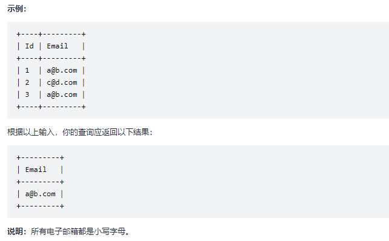

> > **Day Practise - 3 problems one day**
> >
> > 2021.9.16	1 - 3
> >
> > 2021.9.17	4 - 6
> >
> > 2021.9.18	7 - 9
> >
> > 2021.9.19	10 - 12
> >
> > 2021.9.20	13 - 15
> >
> > 2021.9.21	16 - 18
> >
> > 2021.9.22	 19 - 21       	 3h
> >
> > 2021.9.23 	 22 - 24       	2h
> >
> > 2021.9.24	  25 - 27           1h40m
> >
> > 2021.9.25 	 28 - 30       	1h8m
> >
> > 2021.9.26  	31 - 33     	  1h28m
> >
> > 2021.9.27 	 34 - 36       	34m 
> >
> > 2021.9.28  	37 - 39       	2h10m  40 - 1h40m
> >
> > 2021.9.29 	 40 - 42        	2h    42 - 45(SQL)
> >
> > 2021.9.30	  43 - 45 
>
> 
>
> ## 1、二分查找
>
>  查找元素在数组中的下标
>
> ```c
> int search(int* nums, int numsSize, int target){
>     int low = 0;
>     int high = numsSize - 1;
>     int mid = 0;
>     while(low <= high){
>         mid = (low + high) / 2;
>         if(nums[mid] < target){
>             low = mid + 1;
>         } else if(nums[mid] > target){
>             high = mid - 1;
>         } else if(nums[mid] == target){
>             return mid;
>         }
>     }
>     return -1;          //未查找到相关信息
> }
> ```
>
> 
>
> ## 2、搜索插入位置
>
> 给定一个排序数组和一个目标值，在数组中找到目标值，并返回其索引。如果目标值不存在于数   组中，返回它将会被按顺序插入的位置。
>
>  **示例**
>
> ```
> 输入 
> 	nums = [1,3,5,6], target = 5
> 输出 
> 	2
> ```
>
> **代码**
>
> ```c
> int searchInsert(int* nums, int numsSize, int target){
>     int left = 0;
>     int right = numsSize - 1;
>     int mid;
>     //二分查找
>     while (left <= right)
>     {
>         mid = (left + right) / 2;
>         if (nums[mid] < target) {
>             left = mid + 1;
>         }
>         else if (nums[mid] > target) {
>             right = mid - 1;
>         }
>         else {
>             return mid;
>         }
>     }
>     //没有找到，返回它将会被按顺序插入的位置。
>     return (nums[mid] > target) ? mid : mid + 1;
> }
> ```
>
> 
>
> ## 3、翻转整形数字
>
> 给你一个 32 位的有符号整数 x ，返回将 x 中的数字部分反转后的结果。如果反转后整数超过 32 位的有符号整数的范围 [−231, 231 − 1] ，就返回 0。
>
> **示例**
>
> ```
> 示例 1：
> 	输入：x = 123 
> 	输出：321
> 示例 2：
> 	输入：x = -123 
> 	输出：-321
> ```
>
> **代码**
>
> ```c
> int reverse(int x){
>   int rev = 0;
>     while (x != 0) {
>         if (rev < INT_MIN / 10 || rev > INT_MAX / 10) {
>             return 0;
>         }
>         int digit = x % 10;
>         x /= 10;
>         rev = rev * 10 + digit;
>     }
>     return rev;
> }
> ```
>
>  自行编写 - code::blocks 无错
>
> ```c
> int reverse(int x){
>     int t = x,i;
>     int length = 0;
> 
>     while(t){
>         length+=1;
>         t /= 10;
>     }
> 
>     //定义数组
>     int * nums;
>     nums = (int *)malloc(sizeof(int) * length);
> 
>     for(i = 0;i < length;i++){
>         nums[i] = x % 10;
>         x /= 10;
>     }
> 
>     int result = 0;
>     for(i = length;i > 0;i--){
>         result += nums[length-i]  * pow(10,i-1);
>     }
> 
>     //验证边界条件
>     if (result < INT_MIN / 10  || result > INT_MAX / 10) {
>         return 0;
>     }
>     return result;
> }
> ```
>
> 
>
> ## 4、判断是否是回文整数
>
>  给你一个整数 x ，如果 x 是一个回文整数，返回 true ；否则，返回 false 。
>
>  回文数是指正序（从左向右）和倒序（从右向左）读都是一样的整数。例如，121 是回文，而 123  
>
>  不是。
>
> ```c
>  bool isPalindrome(int x) {
>         int rev = 0;
>         int input = x;
>         while (x != 0) {
>             if (rev < INT_MIN / 10 || rev > INT_MAX / 10) {
>                 return 0;
>             }
>             int digit = x % 10;
>             x /= 10;
>             rev = rev * 10 + digit;
>         }
>         
>         if(rev == input && input >= 0)
>             return true;
>         else{
>             return false;
>         }
> }
> ```
>
> 
>
> ## 5、灰度直方图(CCF 2021 1)
>
> 
>
> **示例**
>
> ```
> 样例输入
> 	4 4 16 0 1 2 3 4 5 6 7 8 9 10 11 12 13 14 15
> 样例输出
> 	1 1 1 1 1 1 1 1 1 1 1 1 1 1 1 1
> 解析
> 	给定矩阵大小  n × m  矩阵元素最大值 ≤ L
> 	输入n m L 三个值判断图像的灰度直方图数组,也即数组位置0 - L对应在矩阵中元素的出现次数。
> ```
>
> **解答**
>
> 这里直接使用了暴力法,使用三层遍历进行统计,数组大小限制在500 × 500 以及动态分配数组空间
>
> **代码**
>
> ```c
> #include <stdio.h>
> #include <stdlib.h>
> #include <malloc.h>
> 
> 
> int main()
> {
>     int n,m,L;
>     int * nums;
>     int i,j,k;
>     scanf("%d%d%d",&n,&m,&L);
>     nums = (int *)malloc(sizeof(int) * L);
>     for(i = 0;i < L;i++)
>         nums[i] = 0;
> 
>     int array[500][500];
>     for(i = 0;i < n;i++){
>         for(j = 0;j < m;j++){
>             scanf("%d",&array[i][j]);
>         }
>     }
> 
>     for(i = 0;i < n;i++){
>         for(j = 0;j < m;j++){
>             for(k = 0;k < L;k++)
>                 if(array[i][j] == k)
>                     nums[k]++;
>         }
>     }
> 
>     for(i = 0;i < L;i++)
>         printf("%d ",nums[i]);
> 
>     return 0;
> }
> ```
>
> 
>
> ## 6、罗马数字转整数
>
> 
>
> **示例**
>
> ```
> 示例 1:
> 	输入: "III"
> 	输出: 3
> ```
>
> **代码**
>
> 暴力法, 也即先解决大部分,然后处理边界尽量使其符合规则(这里可以使用数组简化代码,后面有机会再修改)。
>
> ```c
> int romanToInt(char * s){
>     int result = 0;
>     while(*s){
>         //以下的IF做边界的处理
>         if(*s == 'I' && *(s+1) == 'V')
>         {
>             result += 4;
>             s+=2;
>             continue;
>         }
>         else if(*s == 'I' && *(s+1) == 'X')
>         {
>             result += 9;
>             s+=2;
>             continue;
>         }
>         else if(*s == 'X' && *(s+1) == 'L')
>         {
>             result += 40;
>             s+=2;
>             continue;
>         }
>         else if(*s == 'X' && *(s+1) == 'C')
>         {
>             result += 90;
>             s+=2;
>             continue;
>         }
>         else if(*s == 'C' && *(s+1) == 'D')
>         {
>             result += 400;
>             s+=2;
>             continue;
>         }
>         else if(*s == 'C' && *(s+1) == 'M')
>         {
>             result += 900;
>             s+=2;
>             continue;
>         }
> 
>         //以下做常规操作
>         if(*s == 'I')
>             result += 1;
>         else if(*s == 'V')
>             result += 5;
>         else if(*s == 'X')
>             result += 10;
>         else if(*s == 'L')
>             result += 50;
>         else if(*s == 'C')
>             result += 100;
>         else if(*s == 'D')
>             result += 500;
>         else if(*s == 'M')
>             result += 1000;
>         s++;
>     }
>     return result;
> }
> ```
>
> 官方解法
>
> ```c
> int romanToInt(char* s) {
>     int symbolValues[26];
>     symbolValues['I' - 'A'] = 1;
>     symbolValues['V' - 'A'] = 5;
>     symbolValues['X' - 'A'] = 10;
>     symbolValues['L' - 'A'] = 50;
>     symbolValues['C' - 'A'] = 100;
>     symbolValues['D' - 'A'] = 500;
>     symbolValues['M' - 'A'] = 1000;
>     int ans = 0;
>     int n = strlen(s);
>     for (int i = 0; i < n; ++i) {
>         int value = symbolValues[s[i] - 'A'];
>         if (i < n - 1 && value < symbolValues[s[i + 1] - 'A']) {
>             ans -= value;
>         } else {
>             ans += value;
>         }
>     }
>     return ans;
> }
> ```
>
> 
>
> ## 7、有序数组的平方
>
> 给你一个按 **非递减顺序** 排序的整数数组 nums，返回 每个数字的平方 组成的新数组，要求也按 **非递减顺序** 排序。
>
> **示例**
>
> ```
> 示例 1：
>     输入：nums = [-4,-1,0,3,10]
>     输出：[0,1,9,16,100]
> 示例 2：
>     输入：nums = [-7,-3,2,3,11] 
>     输出：[4,9,9,49,121]
> ```
>
> **代码**
>
> 组的动态分配、pow函数获取平方后的结果再进行冒泡排序 复杂度O(n²)
>
> ```c
> int * sortedSquares(int* nums, int numsSize, int* returnSize){
>     int i,j;
>     int * array = (int *)malloc(sizeof(int)*numsSize);
>     for(i = 0;i < numsSize;i++){
>         array[i] = pow(nums[i],2);
>     }
> 
>     for(i = 0;i < numsSize - 1;i++){
>         for(j = 0;j < numsSize - i -1;j++){
>             if(array[j] > array[j+1]){
>                 int temp = array[j];
>                 array[j] = array[j+1];
>                 array[j+1] = temp;
>             }
>         }
>     }
> 
>     * returnSize = numsSize;
>     return array;
> }
> ```
>
> 
>
> ## 8、旋转数组
>
> 给定一个数组，将数组中的元素向右移动 k 个位置，其中 k 是非负数。
>
> **示例**
>
> ```
> 示例 1:
> 	输入: nums = [1,2,3,4,5,6,7], k = 3
> 	输出: [5,6,7,1,2,3,4]
> 解释:
> 	向右旋转 1 步: [7,1,2,3,4,5,6]
> 	向右旋转 2 步: [6,7,1,2,3,4,5]
> 	向右旋转 3 步: [5,6,7,1,2,3,4]
> ```
>
> **代码**
>
> 该算法使用了暴力解法,也即直接在数组上进行操作,模拟旋转的情景,也即通过对数组元素的一次右移动,因此复杂度较高。
>
> ```c
> void rotate(int* nums, int numsSize, int k){
>     int i,temp,j;
>     for(i = 0;i < k;i++){
>         temp = nums[numsSize-1];    //获取最后的元素
>         //向后覆盖
>         for(j = numsSize - 1;j > 0;j--)
>             nums[j] = nums[j-1];        //覆盖
>         //恢复队首元素
>         nums[0] = temp;
>     }
> }
> ```
>
> 该算法借用了辅助空间,直接算出旋转后的结果然后赋值回结果数组。难点在于,对数组下标旋转后位置的确定和逻辑抽取。
>
> ```c
> void rotate(int* nums, int numsSize, int k){
>     int i,temp,j;
>     int * array = (int *)malloc(sizeof(int)*numsSize);
>     for(i = 0;i < numsSize;i++){
>         array[(i+ k) % numsSize] = nums[i];
>     }
>     for(i = 0;i < numsSize;i++){
>         nums[i] = array[i];
>     }
> }
> ```
>
> 
>
> 
>
> ## 9、移动零元素
>
> 给定一个数组 nums，编写一个函数将所有 0 移动到数组的末尾，同时保持非零元素的相对顺序。
>
> **示例**
>
> ```
> 示例:
> 	输入: [0,1,0,3,12]
> 	输出: [1,3,12,0,0]
> 说明
> 	必须在原数组上操作，不能拷贝额外的数组。
> 	尽量减少操作次数。
> ```
>
> **代码**
>
> 该算法利用了插入排序的思想,首先统计0的个数以便后续的覆盖,然后将每个元素按次序插入到final位置(也即最终位置),最后恢复零元素。
>
> ```c
> void moveZeroes(int* nums, int numsSize){
>     int i;
>     int count = 0;
>     //统计0的个数
>     for(i = 0;i < numsSize;i++)
>         if(nums[i] == 0)
>             count++;
>     
>     //移动元素
>     int final = 0;      //记录已经移动到指定位置的元素个数
>     for(i = 0;i < numsSize;i++){
>         if(nums[i]){
>             nums[final] = nums[i];
>             final++;
>         } 
>     }
> 
>     //恢复0放置到末尾
>     for(i = 0;i < count;i++){
>         nums[final+i] = 0;
>     }
> }
> ```
>
> 
>
> ## 10、两数之和
>
> 给定一个整数数组 nums 和一个整数目标值 target，请你在该数组中找出 **和为目标值** target 的那 两个 整数，并返回它们的数组下标。
>
> 你可以假设每种输入只会对应一个答案。但是，数组中同一个元素在答案里不能重复出现。
>
> **示例**
>
> ```
> 示例 1：
> 	输入：nums = [2,7,11,15], target = 9
> 	输出：[0,1]
> 	解释：因为 nums[0] + nums[1] == 9 ，返回 [0, 1] 。
> ```
>
> **代码**
>
> 算法通过暴力迭代的方式完成计算
>
> ```c
> int* twoSum(int* nums, int numsSize, int target, int* returnSize){
>     int i,j;
>     //暴力迭代完成查找
>     for(i = 0;i < numsSize;i++){
>         for(j = i+1;j < numsSize;j++){
>             if(nums[i] + nums[j] == target){
>                 int * result = (int *)malloc(sizeof(int)*2);
>                 result[0] = i;
>                 result[1] = j;
>                 *returnSize = 2;
>                 return result;
>             }
>         }
>     }
>     *returnSize = 0;
>     return NULL;
> }
> ```
>
> 
>
> ## 11、期末预测之安全指数
>
> 
>
> **示例**
>
> ```
> 样例1
> 	输入	6 2 60 10 100 0 70 0 0 -10 50 10 60
> 	输出	1220
> ```
>
> **代码**
>
> 该题比较简单,读懂意思即可做出来,实质上就是做一个max(0,x)操作和求和。
>
> ```c
> #include <stdio.h>
> #include <stdlib.h>
> 
> int ReLU(int nums[100000][2],int n){
>     int i,j;
>     int result = 0;
>     for(i = 0;i < n;i++){
>         result += nums[i][0] * nums[i][1];
>     }
>     return result > 0 ? result : 0;
> }
> 
> int main()
> {
>     int nums[100000][2];        //数据
>     int n,i,j;
>     scanf("%d",&n);
>     for(i = 0;i < n;i++){
>         for(j = 0;j < 2;j++){
>             scanf("%d",&nums[i][j]);
>         }
>     }
>     printf("%d",ReLU(nums,n));
>     return 0;
> }
> ```
>
> 
>
> ## 12、翻转字符串
>
> 编写一个函数，其作用是将输入的字符串反转过来。输入字符串以字符数组 char[] 的形式给出。不要给另外的数组分配额外的空间，你必须原地修改输入数组、使用 O(1) 的额外空间解决这一问题。
>
> 你可以假设数组中的所有字符都是 ASCII 码表中的可打印字符。
>
> **示例**
>
> ```
> 示例 1：
> 	输入：["h","e","l","l","o"] 
> 	输出：["o","l","l","e","h"]
> ```
>
> **代码**
>
> 算法将对应位置的字符进行交换,执行次数为 length / 2 长度
>
> ```c
> void reverseString(char* s, int sSize){
>     int i;
>     for(i = 0;i < sSize/2;i++){
>         char temp;
>         temp = s[i];
>         s[i] = s[sSize-i-1];
>         s[sSize-i-1] = temp;
>     }
> }
> ```
>
> 
>
> ## 13、翻转字符串中的单词
>
> 给定一个字符串，你需要反转字符串中每个单词的字符顺序，同时仍保留空格和单词的初始顺序。
>
> **示例**
>
> ```
> 输入："Let's take LeetCode contest"
> 输出："s'teL ekat edoCteeL tsetnoc"
> ```
>
> **代码**
>
> 该算法是在官方解答的基础上得到的,基本想法都与其一致。
>
> 开辟一个新字符串。然后从头到尾遍历原字符串，直到找到空格为止，此时找到了一个单词，并能得到单词的起止位置。随后，根据单词的起止位置，可以将该单词逆序放到新字符串当中。如此循环多次，直到遍历完原字符串，就能得到翻转后的结果。
>
> ```c
> char * reverseWords(char * s) {
>     int length = strlen(s);
>     char * result = (char*)malloc(sizeof(char) * (length + 1));
>     result[length] = 0;
>     int i = 0,j;
>     int start;
>     while(1){
>         start = i;      //开始赋值的位置
>         while(s[i] != ' ' && i < length)
>             i++;
> 
>         for(j = start;j < i;j++){
>             result[j] = s[start + i - 1 - j];     //因为i-1不变,需要再加一个自变量
>         }
> 
>         while(s[i] == ' ' && i < length){
>             result[i] = ' ';
>             i++;
>         }
> 
>         if(i >= length){
>             break;
>         }
>     }
> 
>     return result;
> }
> ```
>
> 
>
> ## 14、链表的中间结点
>
> 给定一个头结点为 head 的非空单链表，返回链表的中间结点。如果有两个中间结点，则返回第二个中间结点。
>
> **示例**
>
> ```
> 示例 1
> 	输入：[1,2,3,4,5]
> 	输出：此列表中的结点 3 (序列化形式：[3,4,5])
> 	返回的结点值为 3 。 (测评系统对该结点序列化表述是 [3,4,5])。
> 	注意，我们返回了一个 ListNode 类型的对象 ans，这样：
> 	ans.val = 3, ans.next.val = 4, ans.next.next.val = 5, 以及 	
> 	ans.next.next.next = NULL.
> 
> 示例 2
> 	输入：[1,2,3,4,5,6]
> 	输出：此列表中的结点 4 (序列化形式：[4,5,6])
> 	由于该列表有两个中间结点，值分别为 3 和 4，我们返回第二个结点。
> ```
>
> **解答**
>
> 该算法通过链表的长度来判定中位数所处的位置,然后的得到相应的结果。
>
> ```c
> struct ListNode* middleNode(struct ListNode* head){
>     struct ListNode * p,*q,*result;
>     //result = (ListNode *)malloc(sizeof(ListNode));
>     p = head;
>     q = head;
> 
>     int length = 0;     //获取链表的长度
> 
>     while(p){
>         length++;
>         p = p->next;
>     }
> 
>     int tag = 0;
>     if(length % 2 != 0){
>         tag = length / 2;
>         while(tag--){
>             q = q->next;
>         }
>         result = q;
>     } else if(length % 2 == 0){
>         tag = length / 2;
>         while(tag--)
>             q = q->next;
>         result = q;
>     }
>     return result;
> }
> ```
>
> 
>
> ## 15、翻转字符串
>
> 给你一个链表，删除链表的倒数第 n 个结点，并且返回链表的头结点。
>
> **示例**
>
> ```
> 示例 1：
> 	输入：head = [1,2,3,4,5], n = 2 
> 	输出：[1,2,3,5]
> 示例 2：
> 	输入：head = [1], n = 1 
> 	输出：[]
> ```
>
> **代码**
>
> 该算法使用了大量的中间变量,首先把不带头结点转化为带头结点简化运算,然后做带头结点的头部部分处理。
>
> ```c
> struct ListNode* removeNthFromEnd(struct ListNode* head, int n){
>     //不带头结点结构
>     struct ListNode * p,* q,*result;
>     p = (struct ListNode *)malloc(sizeof(struct ListNode));
>     q = (struct ListNode *)malloc(sizeof(struct ListNode));
>     //构造头结点
>     p->next = head;
>     q->next = head;
>     result = q;
>     int length = 0;
>     //获取链表长度
>     while(p->next){
>         length++;
>         p = p->next;
>     }
> 
>     //移动结点到要移除位置的头接结点
>     int i;
>     for(i = 0;i < length - n;i++){
>         q = q->next;
>     }
> 
>     //进行头结点的处理
>     if(length > 0)
>         q->next = q->next->next;        //移除结点
>     else if(length == 1)
>         q->next = NULL;
>     return result->next;
> }
> ```
>
> 
>
> ## 16、无重复字符的最长子串
>
> 给定一个字符串 s ，请你找出其中不含有重复字符的 最长子串 的长度。
>
> **示例**
>
> ```
> 示例 1:
> 	输入: s = "abcabcbb"
> 	输出: 3 
> 	解释: 因为无重复字符的最长子串是 "abc"，所以其长度为 3。
> 示例 2:
> 	输入: s = "bbbbb"
> 	输出: 1
> 	解释: 因为无重复字符的最长子串是 "b"，所以其长度为 1。
> ```
>
> **代码**
>
> 该算法花了2小时才写出来,基本上是使用了BF也即滑动的方式进行重复比较匹配串的比较位置与之前相比是否有重复,得出相应的结果。
>
> ```c
> //串的匹配
> int lengthOfLongestSubstring(char * s){
>     //记录串中出现的所有字符
>     char * str;
>     str = (char *)malloc(sizeof(char) * strlen(s) + 1);
>     int i,j,k;
>     int length = 0;
>     int max = 0,result = 0;
>     int flag = 0;       //匹配位置
>     for(i = 0;i < strlen(s);i++){
> 
>         //判断匹配串是否重复
>         for(j = 0;j < length;j++){
>             //与之前匹配的发生了重复
>             if(s[i] == str[j]){
>                 break;
>             }
>         }
> 
>         //如果不重复
>         if(j == length){
>             str[length++] = s[i];       //为匹配串赋值
>             max++;
>         }
>         //如果重复
>         else if(j != length){
>             if(result < max)
>                 result = max;
>             max = 0;  //最大值重置
>             length = 0;  //匹配串长度重置
>             strcpy(str,"");   //清除str数组
>             flag++;   //滑动位置前进
>             i = flag-1;       //进行滑动 这里-1的目的是抹去for循环i++的作用
>         }
>     }
>     //在尾部获取到max时可能不会出现重复,也即result不会进行赋值,因此要再判断
>     if(result < max)
>         result = max;
>     return result;
> }
> ```
>
> 
>
> ## 17、字符串的排列(排列的概念不理解)
>
> 给你两个字符串 s1 和 s2 ，写一个函数来判断 s2 是否包含 s1 的排列。
>
> 换句话说，s1 的排列之一是 s2 的 子串 。
>
> **示例**
>
> ```
> 示例 1：
> 	输入：s1 = "ab" s2 = "eidbaooo"
> 	输出：true
> 	解释：s2 包含 s1 的排列之一 ("ba").
> ```
>
> **代码**
>
> 官方解答
>
> ```c
> bool checkInclusion(char* s1, char* s2) {
>     int n = strlen(s1), m = strlen(s2);
>     if (n > m) {
>         return false;
>     }
>     int cnt[26];
>     memset(cnt, 0, sizeof(cnt));
>     for (int i = 0; i < n; ++i) {
>         --cnt[s1[i] - 'a'];
>     }
>     int left = 0;
>     for (int right = 0; right < m; ++right) {
>         int x = s2[right] - 'a';
>         ++cnt[x];
>         while (cnt[x] > 0) {
>             --cnt[s2[left] - 'a'];
>             ++left;
>         }
>         if (right - left + 1 == n) {
>             return true;
>         }
>     }
>     return false;
> }
> ```
>
> 
>
> ## 18、最长公共前缀
>
> 编写一个函数来查找字符串数组中的最长公共前缀。
>
> 如果不存在公共前缀，返回空字符串 ""。
>
> **示例**
>
> ```
> 示例 1：
> 	输入：strs = ["flower","flow","flight"] 
> 	输出："fl"
> ```
>
> 
>
> **代码**
>
> ```java
> class Solution {
>     public String longestCommonPrefix(String[] strs) {
>         if (strs == null || strs.length == 0) {
>             return "";
>         }
>         int length = strs[0].length();
>         int count = strs.length;
>         for (int i = 0; i < length; i++) {
>             char c = strs[0].charAt(i);
>             for (int j = 1; j < count; j++) {
>                 if (i == strs[j].length() || strs[j].charAt(i) != c) {
>                     return strs[0].substring(0, i);
>                 }
>             }
>         }
>         return strs[0];
>     }
> }
> ```
>
> 
>
> 
>
> ## 19、合并两个有序链表
>
> 将两个升序链表合并为一个新的 **升序** 链表并返回。新链表是通过拼接给定的两个链表的所有节点组成的。 
>
> **示例**
>
> ```
> 示例 1：
> 	输入：l1 = [1,2,4], l2 = [1,3,4] 
> 	输出：[1,1,2,3,4,4]
> 示例 2：
> 	输入：l1 = [], l2 = [] 
> 	输出：[]
> ```
>
> **代码**
>
> 题目给的测试环境是不带头结点的,因此需要为它构造头结点。主要思想是首先将两个链表进行合并,合并之后对链表的值进行冒泡,最后赋值回链表即可(这里可以直接用链表进行冒泡排序。
>
> ```c
> struct ListNode* mergeTwoLists(struct ListNode* l1, struct ListNode* l2){
>     struct ListNode * head1 = (struct ListNode*)malloc(sizeof(struct ListNode));
>     struct ListNode * head2 = (struct ListNode*)malloc(sizeof(struct ListNode));
>     head1->next = l1;
>     head2->next = l2;
>     struct ListNode *p,*q,*k;
>     int i,j;
>     p = head1;
>     q = head2;
>     k = head1;
>     while(p->next){
>         p = p->next;
>     }
>     p->next = q->next;        //链接两个链表
> 
>     //计算长度
>     int length = 0;
>     while(k->next){
>         k = k->next;
>         length++;
>     }
> 
>     int * nums = (int *)malloc(sizeof(int) * length);
>     //赋值
>     k = head1->next;
>     i = 0;
>     while(k){
>         nums[i++] = k->val;
>         k = k->next;
>     }
> 
>     for(i = 0;i < length - 1;i++){
>         for(j = 0;j < length - i - 1;j++){
>             if(nums[j] > nums[j+1]){
>                 int temp = nums[j];
>                 nums[j] = nums[j+1];
>                 nums[j+1] = temp;
>             }
>         }
>     }
> 
>     p = head1->next;
>     i = 0;
>     while(p){
>         p->val = nums[i++];
>         p = p->next;
>     }
> 
>     return head1->next;
> }
> ```
>
> 
>
> ## 20、删除有序数组中的重复项
>
> 给你一个有序数组 nums ，请你 原地 删除重复出现的元素，使每个元素 只出现一次 ，返回删除后数组的新长度。
>
> 不要使用额外的数组空间，你必须在 原地 修改输入数组 并在使用 O(1) 额外空间的条件下完成。
>
> **示例**
>
> ```
> 示例 1：
> 	输入：nums = [1,1,2]
> 	输出：2, nums = [1,2]
> 	解释：函数应该返回新的长度 2 ，并且原数组 nums 的前两个元素被修改为 1, 2 。不需要考虑数组
> 	中超出新长度后面的元素。
> ```
>
> **代码**
>
> 该算法使用了插入排序的思想,把有序数组的每个不同值的元素按排列顺序插入到数组的 tag 位置中,并及时更新tag。同时为了降低复杂度,我们将重复元素进行比较,将循序变量 i 进行更新,使其跳过调用重复变量的循环,藉此降低时间复杂度。
>
> ```c
> int removeDuplicates(int* nums, int numsSize){
>     int tag = 0;
>     int i,j;
>     for(i = 0;i < numsSize;i++){
>         int temp = nums[i];
>         for(j = i;j < numsSize-1 && temp == nums[j+1];j++){
>             i++;        //后跳
>         }
>         nums[tag++] = temp;
>     }
>     return tag;
> }
> ```
>
> 
>
> ## 21、移除元素
>
> 给你一个数组 nums 和一个值 val，你需要 原地 移除所有数值等于 val 的元素，并返回移除后数组的新长度。
>
> 不要使用额外的数组空间，你必须仅使用 O(1) 额外空间并 原地 修改输入数组。
>
> 元素的顺序可以改变。你不需要考虑数组中超出新长度后面的元素。
>
> **示例**
>
> ```
> 示例 1：
> 	输入：nums = [3,2,2,3], val = 3
> 	输出：2, nums = [2,2]
> 解释：函数应该返回新的长度 2, 并且 nums 中的前两个元素均为 2。你不需要考虑数组中超出新长度后面的元素。例如，函数返回的新长度为 2 ，而 nums = [2,2,3,3] 或 nums = [2,2,0,0]，也会被视作正确答案。
> ```
>
> **代码**
>
> 该算法在 20 的基础上修改了循环条件。以及在数组值不等于要删除的元素是执行插入操作,等于删除元素值时执行后跳,也即忽略赋值。
>
> ```c
> int removeElement(int* nums, int numsSize, int val){
>     int tag = 0;
>     int i,j;
>     for(i = 0;i < numsSize;i++){
>         for(j = i;j < numsSize-1 && val == nums[j];j++){
>             i++;        //后跳
>         }
>         //边界条件 - 最后一个元素值判断
>         if(i == numsSize-1 && val == nums[i])
>             break;
>         nums[tag++] = nums[i];
>     }
>     return tag;
> }
> ```
>
> 
>
> ## 22、实现strStr()
>
> 实现 strStr() 函数。
>
> 给你两个字符串 haystack 和 needle ，请你在 haystack 字符串中找出 needle 字符串出现的第一个位置（下标从 0 开始）。如果不存在，则返回 -1 。
>
> **示例**
>
> ```
> 当 needle 是空字符串时，我们应当返回什么值呢？这是一个在面试中很好的问题。
> 对于本题而言，当 needle 是空字符串时我们应当返回 0 。这与 C 语言的 strstr() 以及 Java 的 indexOf() 定义相符。
> 示例 1：
> 	输入：haystack = "hello", needle = "ll"    
> 	输出：2
> ```
>
> **代码**
>
> 官方解法
>
> ```c
> int strStr(char* haystack, char* needle) {
>     int n = strlen(haystack), m = strlen(needle);
>     for (int i = 0; i + m <= n; i++) {
>         bool flag = true;
>         for (int j = 0; j < m; j++) {
>             if (haystack[i + j] != needle[j]) {
>                 flag = false;
>                 break;
>             }
>         }
>         if (flag) {
>             return i;
>         }
>     }
>     return -1;
> }
> ```
>
> 自己解法
>
> 该算法主体是优化的 BF 算法,执行可以通过,但是无端报运行错误和超时错误,可能算法的效率不高。KMP算法应该是最优的,但是这里不想抄作业,所以实现了优化的BF算法,重点在于失匹后的主串移动。
>
> ```c
> int strStr(char * haystack, char * needle){
>     int i;
>     int tag = 0;
>     int hayLength = strlen(haystack);
>     int temp = hayLength;
>     //为空串
>     if(strlen(needle) == 0)
>         return 0;
>     if(strlen(needle) > strlen(haystack))
>         return -1;
> 
>     //BF解法
>     while(*haystack){
>         //字符串匹配
>         for(i = 0;i < strlen(needle);i++){
>             //匹配失败
>             if(*(haystack+i) != *(needle+i))
>                 break;
>         }
>         //匹配成功
>         if(i == strlen(needle))
>             break;
>         if(temp + i <=  hayLength)
>             haystack += i;      //KMP后跳 - 优化
> 
>         tag++;
>         haystack++;
>         temp--;     //记录剩余长度
>     }
> 
>     //没有查找到
>     if(tag == hayLength)
>         return -1;
> 
>     return tag;
> }
> ```
>
> 
>
> ## 23、最大子序和(动态规划)
>
> 给定一个整数数组 nums ，找到一个具有最大和的连续子数组（子数组最少包含一个元素），返回其最大和。
>
> **示例**
>
> ```
> 示例 1：
> 	输入：nums = [-2,1,-3,4,-1,2,1,-5,4]
> 	输出：6
> 	解释：连续子数组 [4,-1,2,1] 的和最大，为 6 。
> ```
>
> **代码**
>
> 官方算法 **动态规划解法 (减去多余计算的树结点)**
>
> 以当前点作为结束点,存储之前运算的最优结果。
>
> 对于该题而言,如序列: -1 1 -1 3
>
> 将其对应f(1)、f(2)、f(3)、f(4), 从0下标开始的计算存储了每个下标为结束点的最优结果。
>
> 也即: f(1) = -1,f(2) = 1,f(3) = 1,f(4) = 3,因此最终结果为 3。
>
> ```c
> int maxSubArray(int* nums, int numsSize) {
>     int pre = 0, maxAns = nums[0];
>     for (int i = 0; i < numsSize; i++) {
>         pre = fmax(pre + nums[i], nums[i]);
>         maxAns = fmax(maxAns, pre);
>     }
>     return maxAns;
> }
> ```
>
> **算法：**
>
> 一下算法使用暴力法,也即滑窗的方式(间隔为i(1 - numsSize))不断滑动比较,循环获取所有可构建连续子序列的和并逐个比较得出结果。但根据循环结构来看,其复杂度比较高,三层for的话接近$O(n^3)。$
>
> ```c
> int maxSubArray(int* nums, int numsSize){
>     int tag = 0;        //控制每次相加项个数
>     int i,j,k;
>     int max = nums[0];
>     int temp = 0;
>     for(i = 0;i < numsSize;i++){
>         tag = i+1;          //控制每次相加次数 1 2 3 4 5
> 
>         //numsSize - i + 1      1 9 - 2 8 - 3 7 - 4 6
>         for(j = 0;j < numsSize - i;j++){
>             for(k = 0;k < tag;k++){
>                 //防止下标越界
>                 if(k+j >= numsSize)
>                     break;
> 
>                 temp += nums[k+j];
>             }
>             if(max < temp)
>                 max = temp;
>             temp = 0;       //重置为0进行下一次相加
>         }
>     }
>     return max;
> }
> ```
>
> 
>
> ## 24、最后一个单词的长度
>
> 给你一个字符串 s，由若干单词组成，单词前后用一些空格字符隔开。返回字符串中最后一个单词的长度。
>
> 单词 是指仅由字母组成、不包含任何空格字符的最大子字符串。
>
> **示例**
>
> ```
> 示例 1：
> 	输入：s = "Hello World"
> 	输出：5
> ```
>
> **代码**
>
> 该算法使用了双指针的思想,也即使用 pre 和 cur 来保存单词长度的记录。pre 在当前字符非空时更新,cur在字符空值时置为0以便重新计算。 这样不断滑动,当 s 终止返回结果。
>
> ```c
> int lengthOfLastWord(char * s){
>     int i;
>     int length = strlen(s);
>     int preLength = 0;     //记录单词长度
>     int curLength = 0;
>     while(*s){
>         if(*s != ' '){
>             curLength++;
>             preLength = curLength;
>         }
> 
>         printf("%d %d\n",curLength,preLength);
>         if(*s == ' '){
>             curLength = 0;
>         }
>         s++;
>     }
>     return preLength;
> }
> ```
>
> 
>
> ## 25、加一
>
> 给定一个由 整数 组成的 非空 数组所表示的非负整数，在该数的基础上加一。
>
> 最高位数字存放在数组的首位， 数组中每个元素只存储单个数字。
>
> 你可以假设除了整数 0 之外，这个整数不会以零开头。
>
> **示例**
>
> ```
> 示例 1：
> 	输入：digits = [1,2,3]
> 	输出：[1,2,4]
> 	解释：输入数组表示数字 123。
> ```
>
> **代码**
>
> 该算法从最后一位开始计算,如果最后一位+1后需要仅为,则依次进行仅为判断,最后在结果数组添加1格空间并重置完成计算。
>
> ```c
> int* plusOne(int* digits, int digitsSize, int* returnSize)
> {
>    for(int i=digitsSize-1;i>=0;i--)
>    {
>        if(digits[i]+1==10)
>        {
>            digits[i]=0;
>        }
>        else
>        {
>            digits[i]=digits[i]+1;
>            *returnSize=digitsSize;
>            return digits;
>        }
>    }
>     *returnSize=digitsSize+1;
>     int *ret=(int*)malloc(sizeof(int)*(digitsSize+1));
>     memset(ret,0,sizeof(int)*(digitsSize+1));
>     ret[0]=1;
>     return ret;
> }
> ```
>
> 
>
> **解答:**
>
> 拆分法,通过整型数字的合并和拆分完成结果运算,但是受限于整型的空间大小限制,可以考虑使用多个整型数字来完成操作,比较麻烦。
>
> ```c
> int* plusOne(int* digits, int digitsSize, int* returnSize){
>     //将数组中的数转换为一个真实的数 也即整形数字合并和拆分
>     int i;
>     int result = 0;
>     for(i = 0;i < digitsSize;i++){
>         result += digits[i] * pow(10,digitsSize-i-1);
>     }
> 
>     //添加数字
>     result += 1;
> 
>     //判断数字位数
>     int length = 0;
>     int temp = result;
>     while(temp){
>         length++;
>         temp /= 10;
>     }
> 
>     *returnSize = length;
>     int * nums = (int *)malloc(sizeof(int) * length);
> 
>    //拆分数字
>     for(i = length - 1;i >= 0;i--){
>         nums[i] = result % 10;
>         result /= 10;
>     }
>     return nums;
> }
> ```
>
> 
>
> ## 26、x的平方根
>
> 给你一个非负整数 x ，计算并返回 x 的 平方根 。
>
> 由于返回类型是整数，结果只保留 整数部分 ，小数部分将被 舍去 。
>
> 注意：不允许使用任何内置指数函数和算符，例如 pow(x, 0.5) 或者 x ** 0.5 。
>
> **示例**
>
> ```
> 示例 1：
> 	输入：x = 4
> 	输出：2
> ```
>
> 
>
> **代码**
>
> ​		进行开方函数的模拟,最大的核心就是精度的确定。对于该题而言,由于要求返回一个整数,所以算法精度不需要太高。因此我们在这里将他的精度设置为0.01,然后使用二分法进行遍历,就可以完成函数模拟。  
>
> ​		其中 fabs() 是用于计算浮点类型数据绝对值的函数。
>
> ```c
> int mySqrt(int x){
>     //假如是正常的整数
>     int i;
>     int result = 0;
>     //x = 1时比较特殊,这里做二分法的话向下取整只能得到0
>     if(x == 1)
>         return 1;
> 
>     //二分法
>     double low,high,mid;
>     low = 0;
>     high = x;
> 
>     while(fabs(mid * mid - x) >= 0.01){
>         mid = (low + high) / 2.0;
> 
>         if(mid * mid - x < 0){
>             low = mid;
>         } else if(mid * mid - x > 0){
>             high = mid;
>         }
>     }
>     result = (int)mid;
>     return result;
> }
> ```
>
> 
>
> ## 27、爬楼梯问题(经典动态规划)
>
> 假设你正在爬楼梯。需要 n 阶你才能到达楼顶。
>
> 每次你可以爬 1 或 2 个台阶。你有多少种不同的方法可以爬到楼顶呢？
>
> 注意：给定 n 是一个正整数。
>
> **示例**
>
> ```
> 示例 1：
>     输入： 2
>     输出： 2
>     解释： 有两种方法可以爬到楼顶。
>     \1.  1 阶 + 1 阶
>     \2.  2 阶
> ```
>
> **代码**
>
> 对于该算法如下面注释一样,它采用经典的动态规划思想,也是多个题解中比较容易理解的一种方法。
>
> ```c
> int climbStairs(int n){
>     /** 使用动态规划的思想
>      * f(n) = f(n - 1) + f(n - 2)
>      * 比较类似于 斐波那契数列  每一层的爬取方法是 前两层的和
>     */
>     int step1 = 0,step2 = 0,final = 1;      //final = 1 因为 f(1) = 1 f(0) = 0 从1开始计算
>     int i;
>     for(i = 1;i <= n;i++){
>         step1 = step2;
>         step2 = final;
>         final = step1 + step2;
>     }
>     return final;
> }
> ```
>
> 
>
> ## 28、删除链表中的重复元素
>
> 存在一个按升序排列的链表，给你这个链表的头节点 head ，请你删除所有重复的元素，使每个元素 **只出现一次** 。返回同样按升序排列的结果链表。
>
> **示例**
>
> ```
> 示例:
> 	输入：head = [1,1,2]
> 	输出：[1,2]
> ```
>
> **代码**
>
> 该题属于链表的常规泛,由于是有序的情况,那么只需要进行双指针滑动即可保证结点元素值的唯一性,总结来说就是遍历链表。 还可以使用辅助空间的方式实现,但是该解法效率不高。
>
> ```c
> struct ListNode* deleteDuplicates(struct ListNode* head){
>     //当链表为空时
>     if (!head) {
>         return head;
>     }
> 
>     //空指针问题 不能使用 NULL->val 这样的形式
>     struct ListNode * p = head;
>     while (p->next) {
>         //如果前一个指针的数值和后一个指针数值相同则删除    
>         if (p->val == p->next->val) {
>             struct ListNode * h = p->next;
>             p->next = p->next->next;
>             free(h);        //释放链表结点空间
>         } else 
>             p = p->next;
>     }
> 
>     return head;
> }
> ```
>
> 
>
> ## 29、合并两个有序数组
>
> 给你两个按 非递减顺序 排列的整数数组 nums1 和 nums2，另有两个整数 m 和 n ，分别表示 nums1 和 nums2 中的元素数目。
>
> 请你 合并 nums2 到 nums1 中，使合并后的数组同样按 非递减顺序 排列。
>
> 注意：最终，合并后数组不应由函数返回，而是存储在数组 nums1 中。为了应对这种情况，nums1 的初始长度为 m + n，其中前 m 个元素表示应合并的元素，后 n 个元素为 0 ，应忽略。nums2 的长度为 n 。
>
> **示例**
>
> ```
> 示例 1：
>     输入：nums1 = [1,2,3,0,0,0], m = 3, nums2 = [2,5,6], n = 3
>     输出：[1,2,2,3,5,6]
>     解释：需要合并 [1,2,3] 和 [2,5,6] 。
>     合并结果是 [1,2,2,3,5,6] ，其中斜体加粗标注的为 nums1 中的元素。
> ```
>
> **代码**
>
> 该算法首先在 nums1 中存放两个结果数组,然后冒泡排序即可得到结果。
>
> ```c
> void merge(int* nums1, int nums1Size, int m, int* nums2, int nums2Size, int n){
>     int i,j;
>     int totalSize = m + n;
>     for(i = 0;i < n;i++){
>         nums1[i+m] = nums2[i];   //从赋值完的位置继续赋值
>     }
> 
>     //冒泡排序
>     for(i = 0;i < totalSize - 1;i++){
>         for(j = 0;j < totalSize - i - 1;j++){
>             if(nums1[j] > nums1[j+1]){
>                 int temp = nums1[j];
>                 nums1[j] = nums1[j+1];
>                 nums1[j+1] = temp;
>             }
>         }
>     }
> }
> ```
>
> 
>
> 
>
> ## 30、二叉树的中序遍历
>
> 给定一个二叉树的根节点 root ，返回它的 **中序** 遍历。
>
> **示例**
>
> ```
> 示例 3：
> 	输入：root = [1]
> 	输出：[1]
> ```
>
> **代码**
>
> 主要使用递归完成中序遍历,一个比较麻烦的点是 存储结点遍历数据到数组中, 这里使用了自定义函数来完成这个部分。
>
> ```c
> int* inorderTraversal(struct TreeNode* root, int* returnSize){
>     int* res = malloc(sizeof(int) * 501);   //分配要求的最大空间
>     *returnSize = 0;    //数据返回个数
>     inorder(root, res, returnSize);
>     return res;
> }
> 
> void inorder(struct TreeNode* root, int* res, int* resSize) {
>     //节点为空则跳出  - 递归出口
>     if (!root) {
>         return;
>     }
>     inorder(root->left, res, resSize);      //左递归
>     res[(*resSize)++] = root->val;          //传值到结果数组
>     inorder(root->right, res, resSize);     //右递归
> }
> ```
>
> 
>
> 
>
> ## 31、相同的树
>
> 给你两棵二叉树的根节点 p 和 q ，编写一个函数来检验这两棵树是否相同。
>
> 如果两个树在结构上相同，并且节点具有相同的值，则认为它们是相同的。
>
> **示例 1：**
>
> **输入：**p = [1,2,3], q = [1,2,3]
>
> **输出：**true
>
> **解答:**
>
> 同样使用了递归的方法,考虑到所有树不相同的情况并且天啊及递归出口即可完成函数递归。
>
> ```c
> bool isSameTree(struct TreeNode* p, struct TreeNode* q){
>     //递归出口 - 都访问完了,没有false情况
>     if(p==NULL && q==NULL) 
>         return true;
>     //当p空,q非空时 - 不会出现p、q同时非空的情况,因为上面已考虑
>     if(p==NULL||q==NULL) 
>         return false;
>     //两个结点的值不相同时
>     if(p->val != q->val) 
>         return false;
>     //左右递归
>     return isSameTree(p->left,q->left) && isSameTree(p->right,q->right);
> }
> ```
>
> 
>
> 
>
> ## 32、对称二叉树
>
> 给定一个二叉树，检查它是否是镜像对称的。
>
> **示例 1：**
>
> 
>
> **解答:** 
>
> 该题和上一题的比较两棵树书否相同的思路是一样的, 在这里我们比较一棵树是否是镜像对称的, 可以将树的根节点的左右子树看做两棵树, 然后对两棵树进行结点比较, 只要给定了树镜像对称或不对称的情况或条件即可完成。
>
> ```c
> //传递数的左右子树进行比较 同空 true : 不同空 false : 值不同 false - 递归直到比较完毕
> bool Compare(struct TreeNode * p,struct TreeNode* q){
>     //同空 true
>     if(p==NULL && q==NULL)
>         return true;
>     //不同空 false
>     if(p==NULL || q==NULL)
>         return false;
>     //值不同 false
>     if(p->val!=q->val)
>         return false;
>     return Compare(p->left,q->right) && Compare(p->right,q->left);
> }
> 
> bool isSymmetric(struct TreeNode* root){
>     if(root==NULL)
>         return true;
>     return Compare(root->left,root->right);
> }
> ```
>
> 
>
> ## 33、二叉树的最大深度
>
> 二叉树的深度为根节点到最远叶子节点的最长路径上的节点数。
>
> 
>
> **代码**
>
> 该算法比较简单, 主要使用了递归的思想。 我们将比较深度的过程看做遍历结点的过程, 分别递归遍历左右子树, 每访问一层深度计数加1, 同时我们使用 fmax 函数获取到最深层数作为结果返回, 这样即可得到最大深度。
>
> ```c
> int maxDepth(struct TreeNode* root){
>     if(!root)
>         return 0;
>     
>     return fmax(maxDepth(root->left),maxDepth(root->right)) + 1;
> }
> ```
>
> 
>
> 
>
> ## 34、验证回文串
>
> 给定一个字符串，验证它是否是回文串，只考虑字母和数字字符，可以忽略字母的大小写。
>
> **说明：**本题中，我们将空字符串定义为有效的回文串。
>
> **示例**
>
> ```
> 示例 1:
> 	输入: "A man, a plan, a canal: Panama"
> 	输出: true
> 	解释："amanaplanacanalpanama" 是回文串
> ```
>
> **代码**
>
> 该题首先需要考虑题目所说的忽略大小写、空格、字符等条件,允许为数字, 也即首先需要对字符串坐出一定的处理。 处理完的字符串在进行相关的 回文串 判断。
>
> ```c
> bool isPalindrome(char * s){
>     //处理字符串 - 去除符号
>     int slength = strlen(s);
>     char * str = (char *)malloc(sizeof(char) * slength);
>     char * temp = str;
>     int length = 0;
>     while(*s){
>         if(*s >= 65 && *s <= 90){
>             *str++ = *s + 32;      //转化为小写
>             length++;
> 
>         } else if(*s >= 97 && *s <= 122){
>             *str++ = *s;
>             length++;
>         } else if(*s >= '0' && *s <= '9'){
>             *(str++) = *s;
>             length++;
>         }
>         s++;
>     }
> 
>     //判断是否是回文子串
>     int i,tag = 1;
>     for(i = 0;i < length;i++){
>         if(temp[i] != temp[length - i -1])
>             tag = 0;
>     }
>     if(tag == 1)
>         return true;
>     else
>         return false;
> 
> }
> ```
>
> 
>
> 
>
> ## 35、只出现一次的数字
>
> 给定一个**非空**整数数组，除了某个元素只出现一次以外，其余每个元素均出现两次。找出那个只出现了一次的元素。
>
> **示例**
>
> ```
> 示例 1:
> 	输入: [2,2,1]
> 	输出: 1
> ```
>
> **代码**
>
> 暴力算法, 通过不断的遍历来达到排除的效果, 最坏的情况时间复杂度为 $O(n^2)$
>
> ```c
> int singleNumber(int* nums, int numsSize){
>     // n方 复杂度的情况
>     int i,j;
>     int result = 0;
>     for(i = 0;i < numsSize;i++){
>         for(j = 0;j < numsSize;j++){
>             if(i == j)
>                 continue;
>             if(nums[i] == nums[j]){
>                 break;
>             }
>         }
>         if(j == numsSize)
>             result = nums[i];
>     }
> 
>     return result;
> }
> ```
>
> 
>
> 
>
> ## 36、环形链表(快慢指针)
>
> **示例**
>
> 给定一个链表，判断链表中是否有环。
>
> 如果链表中有某个节点，可以通过连续跟踪 next 指针再次到达，则链表中存在环。 为了表示给定链表中的环，我们使用整数 pos 来表示链表尾连接到链表中的位置（索引从 0 开始）。 如果 pos 是 -1，则在该链表中没有环。注意：pos 不作为参数进行传递，仅仅是为了标识链表的实际情况。
>
> 如果链表中存在环，则返回 true 。 否则，返回 false 。
>
> 
>
> **代码**
>
> 本算法使用了快慢指针的方法, 也慢指针移动慢、快指针移动快, 加入快指针追上了慢指针, 那么就一定存在环, 否则不存在。
>
> ```c
> bool hasCycle(struct ListNode *head) {
>     //边界条件 空链表,单节点链表无环
>     if (head == NULL || head->next == NULL) {
>         return false;
>     }
> 
>     //定义快慢指针 快指针每次移动两步 慢指针每次一步
>     // 为什么两步?  因为如果两个指针加速度也即移动步数相同保持相对静止
>     struct ListNode* slow = head;
>     struct ListNode* fast = head->next;
>     while (slow != fast) {
>         //判断是否真正到达了链表结尾
>         if (fast == NULL || fast->next == NULL) {
>             return false;
>         }
>         slow = slow->next;
>         fast = fast->next->next;
>     }
>     return true;
> }
> ```
>
> 
>
> 
>
> ## 37、二叉树的前序遍历(递归)
>
> 给你二叉树的根节点 root ，返回它节点值的 **前序** 遍历。
>
> 
>
> **代码**
>
> 常规算法, 递归方式实现。 重点在于存储结果数据, 使用了两个函数, 一个函数用来生成结果数组和数据返回数据并调用递归实现遍历, 一个实现二叉树前序遍历。
>
> ```c
> int* preorderTraversal(struct TreeNode* root, int* returnSize){
>     int* res = malloc(sizeof(int) * 501);   //分配要求的最大空间
>     *returnSize = 0;    //数据返回个数
>     inorder(root, res, returnSize);
>     return res;
> }
> 
> void inorder(struct TreeNode* root, int* res, int* resSize) {
>     //节点为空则跳出  - 递归出口
>     if (!root) {
>         return;
>     }
> 
>     res[(*resSize)++] = root->val;          //传值到结果数组
>     inorder(root->left, res, resSize);      //左递归
>     inorder(root->right, res, resSize);     //右递归
> }
> ```
>
> 
>
> 
>
> ## 38、二叉树的后序遍历(递归)
>
> 给定一个二叉树，返回它的 *后序* 遍历。
>
> **示例**
>
> ```
> 示例:
> 	输入: [1,null,2,3]     1    \     2    /   3 
> 	输出: [3,2,1]
> ```
>
> **解答:**
>
> 常规算法, 递归方式实现。 重点在于存储结果数据, 使用了两个函数, 一个函数用来生成结果数组和数据返回数据并调用递归实现遍历, 一个实现二叉树后序遍历。
>
> ```c
> int* postorderTraversal(struct TreeNode* root, int* returnSize){
>     int* res = malloc(sizeof(int) * 501);   //分配要求的最大空间
>     *returnSize = 0;    //数据返回个数
>     inorder(root, res, returnSize);
>     return res;
> }
> 
> void inorder(struct TreeNode* root, int* res, int* resSize) {
>     //节点为空则跳出  - 递归出口
>     if (!root) {
>         return;
>     }
>     //左右根
>     inorder(root->left, res, resSize);      //左递归
>     inorder(root->right, res, resSize);     //右递归
>     res[(*resSize)++] = root->val;          //传值到结果数组
> }
> ```
>
> 
>
> 
>
> ## 39、相交链表
>
> 给你两个单链表的头节点 headA 和 headB ，请你找出并返回两个单链表相交的起始节点。如果两个链表没有交点，返回 null 。
>
> 图示两个链表在节点 c1 开始相交：
>
> 
>
> **代码**
>
> 该题依旧采用的暴力法, 选取一个链表作为主表, 一个链表作为副表。 主表做外层循环, 副表做内层循环, 外层指针每次 + 1, 内层则遍历全表, 这样进行对比, 如果连个指针值相同那么存在相交返回结果; 否则返回NULL。
>
> ```c
> struct ListNode * getIntersectionNode(struct ListNode *headA, struct ListNode *headB) {
>     //暴力法
>     //两者循环遍历
>     struct ListNode * p,* q;
>     p = headA;
>     //外层为 headA 的循环 1 - size次
>     while(p){
>         //内层为 headB 的循环 sizeA * (1 - sizeB)
>         q = headB;
>         while(q){
>             if(p == q){
>                 return p;
>             }
>             q = q->next;
>         }
>         p = p->next;
>     }
>     return NULL;
> }
> ```
>
> 
>
> 
>
> ## 40、Excel 表列名称(进制转换算法)
>
> **示例**
>
> ```
> 给你一个整数 columnNumber ，返回它在 Excel 表中相对应的列名称。
> 例如：
> A -> 1 B -> 2 C -> 3 ... Z -> 26 AA -> 27 AB -> 28 
> ```
>
> **代码**
>
> 该算法思路是借用了 整数的位分割 ,也即把改题目看做是 10 -> 26进制数的转换, 将转换后的 26进制各位进行分割, 然后转换为相应的字符串即可完成结果。
>
> ```c
> void reverse(char* str, int strSize) {
>     int left = 0, right = strSize - 1;
>     while (left < right) {
>         char tmp = str[left];
>         str[left] = str[right], str[right] = tmp;
>         left++;
>         right--;
>     }
> }
> 
> char* convertToTitle(int columnNumber) {
>     char* ans = malloc(sizeof(char) * 8);
>     int ansSize = 0;
> 
>     while (columnNumber > 0) {
>         --columnNumber;
>         ans[ansSize++] = columnNumber % 26 + 'A';
>         columnNumber /= 26;
>     }
>     ans[ansSize] = '\0';
>     reverse(ans, ansSize);
>     return ans;
> }
> ```
>
> 
>
> 
>
> ## 41、多数元素
>
> 给定一个大小为 n 的数组，找到其中的多数元素。多数元素是指在数组中出现次数 大于 ⌊ n/2 ⌋ 的元素。
>
> 你可以假设数组是非空的，并且给定的数组总是存在多数元素。
>
> **示例**
>
> ```
> 示例 1：
> 	输入：[3,2,3]
> 	输出：3
> ```
>
> **代码**
>
> **巧妙解法(**摩尔投票法**):**
>
> 类比投票, 投一个人票数+1, 投另一个人票数-1, 只有当1个人的票数超过了 n/2 才会返回结果, 这也是算法巧妙的地方。
>
> ```c
> int majorityElement(int* nums, int numsSize){
>      int * stack=malloc(sizeof(int)*numsSize);      //生成 numsSize 大小的数组
>      int top=-1;
>      for(int i=0;i<numsSize;i++){
>          if(top==-1){
>              stack[++top]=nums[i];
>          }
>          else if(stack[top]==nums[i]){
>              stack[++top]=nums[i];
>          }
>          else top--;
>      }
>      return stack[0];
> }
> ```
>
> **暴力解法:**
>
> O(n`2) 先排序就可以得到一个有序的排序序列, 相同的元素总是挨在一起, 那么现在我们只需要考虑求出出现次数最多的元素即可。 这里使用双指针思想, 遍历求最大次数。
>
> 优化 - 可以考虑使用更高性能的排序算法, 这里求最大出现次数。 - 可以优化到O(nlogN)
>
> 另外我们可以将双指针思想直接使用, 也即每次求一个元素的次数。
>
> ```c
> int majorityElement(int* nums, int numsSize){
>     //O(n`2)算法
>     //冒泡排序
>     int i,j;
>     for(i = 0;i < numsSize;i++){
>         for(j = 0;j < numsSize - i - 1;j++){
>             if(nums[j] > nums[j+1]){
>                 int temp = nums[j];
>                 nums[j] = nums[j+1];
>                 nums[j+1] = temp; 
>             }
>         }
>     }
> 
>     //现在的值都是有序的 所以这里使用双指针的思想 max保存最大值 cur保存当前存放的值
>     int maxValue = 0,maxTimes = 0;
>     int curValue = nums[0],curTimes = 0;
>     for(i = 0;i < numsSize;i++){
>         if(curValue == nums[i]){
>             curTimes++;     //出现次数+1
>             continue;
>         }
> 
>         if(maxTimes < curTimes){
>             maxValue = curValue;
>             maxTimes = curTimes;
>         }
>         //更新当前 指向变量的值
>         curValue = nums[i];
>         curTimes = 1;
>     }
> 
>         if(maxTimes < curTimes){
>             maxValue = curValue;
>             maxTimes = curTimes;
>         }
> 
>     return maxValue;
> }
> ```
>
> 
>
> 
>
> ## 42、组合两个表(SQL)
>
> 
>
> 编写一个 SQL 查询，满足条件：无论 person 是否有地址信息，都需要基于上述两表提供 person 的以下信息：
>
> FirstName, LastName, City, State
>
> **解法:**
>
> 由于要获取两个表的信息, 同时 City 与 State 位于右侧, 因此使用 left join (左外连接)链接两个表。
>
> ```sql
> select FirstName, LastName , City, State
> from Person left join Address
> on Person.PersonId = Address.PersonId;
> ```
>
> 
>
> 
>
> ## 43、查找比经理薪资高的员工(SQL)
>
> 
>
> **解法:**
>
> 由于在一个表上要获取超过经理薪酬的员工, 那么就需要使用双层循环。 这里定义表头为 'Enployee' 外层 a 内层 b, 当员工 a 的经理编号 等于 b 的编号 并且 a的薪酬大于 b(经理)的薪酬则返回结果。
>
> ```sql
> SELECT 
>     a.Name AS 'Employee'
> FROM
>     Employee AS a,
>     Employee AS b
> WHERE
>     a.ManagerId = b.Id AND a.Salary > b.Salary;
> ```
>
> 
>
> 
>
> ## 44、查找重复的电子邮箱(SQL)
>
>  编写一个 SQL 查询，查找 Person 表中所有重复的电子邮箱。
>
> 
>
> **代码**
>
> ```sql
> SELECT DISTINCT 
>     a.Email AS 'Email' 
> FROM 
>     Person AS a,
>     Person AS b
> WHERE 
>     a.Email = b.Email AND a.Id != b.Id;
> ```
>
> 
>
> 
>
> ## 45、从不订购的客户(SQL)
>
> 某网站包含两个表，Customers 表和 Orders 表。编写一个 SQL 查询，找出所有从不订购任何东西的客户。
>
> 
>
> **代码**
>
> not in 关键字用于判断不在 查询结果内的数据
>
> ```
> select customers.name as 'Customers' 
> from customers 
> where customers.id not in (  
> 		select customerid from orders 
> );
> ```
>
> 
>
> 
