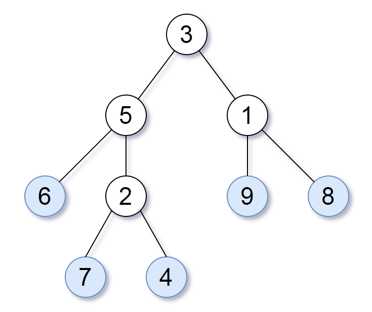
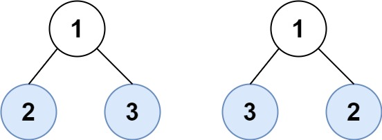

### 1 [交替合并字符串](https://leetcode.cn/problems/merge-strings-alternately/)

> 给你两个字符串 word1 和 word2 。请你从 word1 开始，通过交替添加字母来合并字符串。如果一个字符串比另一个字符串长，就将多出来的字母追加到合并后字符串的末尾。
>
> 返回 合并后的字符串 。

 ```
 示例 1：
 输入：word1 = "abc", word2 = "pqr"
 输出："apbqcr"
 解释：字符串合并情况如下所示：
 word1：  a   b   c
 word2：    p   q   r
 合并后：  a p b q c r
 示例 2：
 输入：word1 = "ab", word2 = "pqrs"
 输出："apbqrs"
 解释：注意，word2 比 word1 长，"rs" 需要追加到合并后字符串的末尾。
 word1：  a   b 
 word2：    p   q   r   s
 合并后：  a p b q   r   s
 示例 3：
 输入：word1 = "abcd", word2 = "pq"
 输出："apbqcd"
 解释：注意，word1 比 word2 长，"cd" 需要追加到合并后字符串的末尾。
 word1：  a   b   c   d
 word2：    p   q 
 合并后：  a p b q c   d
 ```

**题解**

```java
    public String mergeAlternately(String word1, String word2) {
        int length = word1.length() + word2.length();
        char []str = new char[length];
        int pre = 0,next = 0,tag = 0;
        for(int i = 0;i < length; i++){
            if(pre < word1.length()){
                str[tag++] = word1.charAt(pre++);
            }
            if(next < word2.length()){
                str[tag++] = word2.charAt(next++);
            }
        }
        return new String(str);
    }
```


### 2 [字符串的最大公因子](https://leetcode.cn/problems/greatest-common-divisor-of-strings/)

> 对于字符串 s 和 t，只有在 s = t + ... + t（t 自身连接 1 次或多次）时，我们才认定 “t 能除尽 s”。
>
> 给定两个字符串 str1 和 str2 。返回 最长字符串 x，要求满足 x 能除尽 str1 且 x 能除尽 str2 。
>

```
示例 1：
输入：str1 = "ABCABC", str2 = "ABC"
输出："ABC"
示例 2：
输入：str1 = "ABABAB", str2 = "ABAB"
输出："AB"
示例 3：
输入：str1 = "LEET", str2 = "CODE"
输出：""
```


```java
class Solution {
    public String gcdOfStrings(String str1, String str2) {
        if(!(str1 + str2).equals(str2 + str1)){
            return "";
        }
        return str1.substring(0, gcd(str1.length(), str2.length()));
    }

    //最大公因子算法 a = 24 b = 4 => return = 4
    public int gcd(int a,int b){
        int tag = a % b;
        while(tag != 0){
            a = b;
            b = tag;
            tag = a % b;
        }
        return b;
    }
}
```


### 3 [拥有最多糖果的孩子](https://leetcode.cn/problems/kids-with-the-greatest-number-of-candies/)

> 给你一个数组 candies 和一个整数 extraCandies ，其中 candies[i] 代表第 i 个孩子拥有的糖果数目。
>
> 对每一个孩子，检查是否存在一种方案，将额外的 extraCandies 个糖果分配给孩子们之后，此孩子有 最多 的糖果。注意，允许有多个孩子同时拥有 最多 的糖果数目。

```
示例 1：
输入：candies = [2,3,5,1,3], extraCandies = 3
输出：[true,true,true,false,true] 
解释：
孩子 1 有 2 个糖果，如果他得到所有额外的糖果（3个），那么他总共有 5 个糖果，他将成为拥有最多糖果的孩子。
孩子 2 有 3 个糖果，如果他得到至少 2 个额外糖果，那么他将成为拥有最多糖果的孩子。
孩子 3 有 5 个糖果，他已经是拥有最多糖果的孩子。
孩子 4 有 1 个糖果，即使他得到所有额外的糖果，他也只有 4 个糖果，无法成为拥有糖果最多的孩子。
孩子 5 有 3 个糖果，如果他得到至少 2 个额外糖果，那么他将成为拥有最多糖果的孩子。
示例 2：
输入：candies = [4,2,1,1,2], extraCandies = 1
输出：[true,false,false,false,false] 
解释：只有 1 个额外糖果，所以不管额外糖果给谁，只有孩子 1 可以成为拥有糖果最多的孩子。
示例 3：
输入：candies = [12,1,12], extraCandies = 10
输出：[true,false,true]
```

**题解**

```java
class Solution {
    public List<Boolean> kidsWithCandies(int[] candies, int extraCandies) {
        //记录最大的糖果数
        int max = -1;
        for(int i = 0; i < candies.length; i++){
            if(max < candies[i]){
                max = candies[i];
            }
        }
        List<Boolean> condition = new ArrayList<>();
        for (int i = 0; i < candies.length; i++) {
            if(candies[i] + extraCandies >= max){
                condition.add(true);
            } else{
                condition.add(false);
            }
        }
        return condition;
    }
}
```


### 4 种花问题

> 假设有一个很长的花坛，一部分地块种植了花，另一部分却没有。可是，花不能种植在相邻的地块上，它们会争夺水源，两者都会死去。
>
> 给你一个整数数组 flowerbed 表示花坛，由若干 0 和 1 组成，其中 0 表示没种植花，1 表示种植了花。另有一个数 n ，能否在不打破种植规则的情况下种入 n 朵花？能则返回 true ，不能则返回 false 。

```java
示例 1：
输入：flowerbed = [1,0,0,0,1], n = 1
输出：true
示例 2：
输入：flowerbed = [1,0,0,0,1], n = 2
输出：false
```

题解

```java
class Solution {
    public boolean canPlaceFlowers(int[] flowerbed, int n) {
        //暴力插入, 不断判定在0的位置插入数据是否可行
        int count = 0;
        for (int i = 0; i < flowerbed.length; i++) {
            if(flowerbed[i] == 1)
                continue;
            if(check(flowerbed, i)){
                count++;
                flowerbed[i] = 1;
            }
        }
        // 使用 Lambda 表达式打印整型数组
        Arrays.stream(flowerbed).forEach(num -> System.out.print(num + " "));
        return count >= n;
    }

    public boolean check(int[] flowerbed, int index) {
        if(flowerbed.length == 1 && flowerbed[index] == 0){
            return true;
        }
        if(index == 0){
            return flowerbed[index + 1] == 0;
        }
        if(index == flowerbed.length-1){
            return flowerbed[index - 1] == 0;
        }
        return flowerbed[index-1] == 0 && flowerbed[index+1] == 0;
    }
}
```


### 5 [反转字符串中的元音字母](https://leetcode.cn/problems/reverse-vowels-of-a-string/)

给你一个字符串 s ，仅反转字符串中的所有元音字母，并返回结果字符串。

元音字母包括 'a'、'e'、'i'、'o'、'u'，且可能以大小写两种形式出现不止一次。

`示例`

```java
示例 1：
输入：s = "hello"
输出："holle"
示例 2：
输入：s = "leetcode"
输出："leotcede"
```


**题解**

```java
package Solutions;

import java.util.ArrayList;
import java.util.Arrays;
import java.util.List;

public class Solution {
    public static String reverseVowels(String s) {
        //双指针
        char[] chars = s.toCharArray();
        int pre = 0, tail = s.length()-1;
        //初始化下标指针
        while(pre < tail){
            while(pre < tail && !checkChar(chars[pre])){
                pre++;
            }

            while(pre < tail && !checkChar(chars[tail])){
                tail--;
            }
            System.out.println(pre);
            System.out.println(tail);
            char temp = chars[pre];
            chars[pre] = chars[tail];
            chars[tail] = temp;
            pre++;
            tail--;
        }
        return new String(chars);
    }

    public static Boolean checkChar(char ch){
        return (ch == 'a' || ch == 'e' || ch == 'i' || ch == 'o' || ch == 'u' ||
                ch == 'A' || ch == 'E' || ch == 'I' || ch == 'O' || ch == 'U');
    }


    public static void main(String[] args) {
        System.out.println(reverseVowels("hello"));
    }
}
```


### [6. 反转字符串中的单词](https://leetcode.cn/problems/reverse-words-in-a-string/)

> 给你一个字符串 s ，请你反转字符串中 单词 的顺序。
>
> 单词 是由非空格字符组成的字符串。s 中使用至少一个空格将字符串中的 单词 分隔开。
>
> 返回 单词 顺序颠倒且 单词 之间用单个空格连接的结果字符串。
>
> 注意：输入字符串 s中可能会存在前导空格、尾随空格或者单词间的多个空格。返回的结果字符串中，单词间应当仅用单个空格分隔，且不包含任何额外的空格。

 ```
 示例 1：
 输入：s = "the sky is blue"
 输出："blue is sky the"
 示例 2：
 输入：s = "  hello world  "
 输出："world hello"
 解释：反转后的字符串中不能存在前导空格和尾随空格。
 示例 3：
 输入：s = "a good   example"
 输出："example good a"
 解释：如果两个单词间有多余的空格，反转后的字符串需要将单词间的空格减少到仅有一个。
 ```

**题解**

```java
class Solution {
    public String reverseWords(String s) {
        String[] splits = s.split(" ");
        // 使用 Lambda 表达式打印整型数组
        List<String> strs = new ArrayList<>();
        Arrays.stream(splits).forEach(num -> {
            System.out.print(num + " " + num.length() +"\n");
            if(num.length() != 0){
                strs.add(num);
            }
        });
        String str = "";
        for (int i = 0; i < strs.size(); i++) {
            str = str + strs.get(strs.size() - i - 1);
            if(i != strs.size() - 1){
                str += " ";
            }
        }
        System.out.println(str);
        return str;
    }
}
```


### 7 [除自身以外数组的乘积](https://leetcode.cn/problems/product-of-array-except-self/)

> 给你一个整数数组 nums，返回 数组 answer ，其中 answer[i] 等于 nums 中除 nums[i] 之外其余各元素的乘积 。
>
> 题目数据 保证 数组 nums之中任意元素的全部前缀元素和后缀的乘积都在  32 位 整数范围内。
>
> *请不要使用除法，且在 O(n) 时间复杂度内完成此题。*

 ```
 示例 1:
 输入: nums = [1,2,3,4]
 输出: [24,12,8,6]
 示例 2:
 输入: nums = [-1,1,0,-3,3]
 输出: [0,0,9,0,0]
 ```

**题解**

```java
public int[] productExceptSelf(int[] nums) {
    /**
         * 双指针: left 记录从左到右累乘的结果; right 记录从右到左累乘的结果
         * 在 [1,2,3,4] 数组中 index = 0 时. left 记录值为空, right 记录值为 2*3*4
         */
    int []arrs = new int[nums.length];
    for (int i = 0; i < nums.length; i++) {
        arrs[i] = 1;
    }
    int left = 1, right = 1;
    for (int i = 0; i < nums.length; i++) {
        arrs[i] *= left;
        left *= nums[i];

        arrs[nums.length - i - 1] *= right;
        right *= nums[nums.length - i - 1];
    }
    return arrs;
}
```


### 8 [递增的三元子序列](https://leetcode.cn/problems/increasing-triplet-subsequence/)

> 给你一个整数数组 nums ，判断这个数组中是否存在长度为 3 的递增子序列。
>
> 如果存在这样的三元组下标 (i, j, k) 且满足 i < j < k ，使得 nums[i] < nums[j] < nums[k] ，返回 true ；否则，返回 false 。

```
示例 1：

输入：nums = [1,2,3,4,5]
输出：true
解释：任何 i < j < k 的三元组都满足题意
示例 2：

输入：nums = [5,4,3,2,1]
输出：false
解释：不存在满足题意的三元组
示例 3：

输入：nums = [2,1,5,0,4,6]
输出：true
解释：三元组 (3, 4, 5) 满足题意，因为 nums[3] == 0 < nums[4] == 4 < nums[5] == 6
```


```java
class Solution {
    public boolean increasingTriplet(int[] nums) {
        //贪心算法: 使用变量暂存走过的路径; first 与 second
        if(nums.length < 3){
            return false;
        }
        int first = nums[0], second = Integer.MAX_VALUE;
        for (int i = 1; i < nums.length; i++) {
            ///如果当前值大于second, 代表找到了一条长度为3的通路
            if(nums[i] > second){
                return true;
            } 
            //如果值大于first, 代表找到了一个更小的值作为中点
            else if(nums[i] > first){
                second = nums[i];
            } 
            //如果值 < first, 代表找到了更小的值作为起点
            else{
                first = nums[i];
            }
        }
        return false;
    }
}
```


### 9 [压缩字符串](https://leetcode.cn/problems/string-compression/)

> 给你一个字符数组 chars ，请使用下述算法压缩：
>
> 从一个空字符串 s 开始。对于 chars 中的每组 连续重复字符 ：
>
> 如果这一组长度为 1 ，则将字符追加到 s 中。
> 否则，需要向 s 追加字符，后跟这一组的长度。
> 压缩后得到的字符串 s 不应该直接返回 ，需要转储到字符数组 chars 中。需要注意的是，如果组长度为 10 或 10 以上，则在 chars 数组中会被拆分为多个字符。 请在修改完输入数组后 ，返回该数组的新长度。
>
> 你必须设计并实现一个只使用常量额外空间的算法来解决此问题。

 ```java
 示例 1：
 输入：chars = ["a","a","b","b","c","c","c"]
 输出：返回 6 ，输入数组的前 6 个字符应该是：["a","2","b","2","c","3"]
 解释："aa" 被 "a2" 替代。"bb" 被 "b2" 替代。"ccc" 被 "c3" 替代。
 示例 2：
 输入：chars = ["a"]
 输出：返回 1 ，输入数组的前 1 个字符应该是：["a"]
 解释：唯一的组是“a”，它保持未压缩，因为它是一个字符。
 示例 3：
 输入：chars = ["a","b","b","b","b","b","b","b","b","b","b","b","b"]
 输出：返回 4 ，输入数组的前 4 个字符应该是：["a","b","1","2"]。
 解释：由于字符 "a" 不重复，所以不会被压缩。"bbbbbbbbbbbb" 被 “b12” 替代。
 ```


**题解**

```java
    public static int compress(char[] chars) {
        if(chars.length == 1){
            return 1;
        }
        int []returned;
        int index = 0;
        for (int i = 0; i < chars.length; ) {
            returned = checkCount(chars, i);
            chars[index++] = chars[i];
            if(returned[0] > 1){
                char []charTemp = intToChar(returned[0]);
                for(int j = 0; j < charTemp.length; j++){
                    chars[index++] = charTemp[j];
                }
            }
            i += returned[0];
        }
        return index;
    }

    public static char[] intToChar(int num){
        ArrayList<Character> chars = new ArrayList<Character>();
        while(num >= 1){
            chars.add((char) ((char)num % 10 + '0'));
            num /= 10;
        }
        //翻转字符串
        char[] charTemp = new char[chars.size()];
        for (int i = 0; i < chars.size(); i++) {
            charTemp[i] = chars.get(chars.size() - i - 1);
        }
        System.out.println(charTemp);
        return charTemp;
    }


    public static int[] checkCount(char[] chars, int pre){
        int tail = pre + 1;
        int []returned = {1,0};
        for (int i = pre; i < chars.length; i++) {
            if(tail >= chars.length){
                break;
            }
            if(chars[pre] == chars[tail]){
                returned[0]++;
                tail++;
            } else{
                returned[1] = tail;
                break;
            }
        }
        System.out.println(returned[0] + " " + returned[1]);
        return returned;
    }
```


## 双指针

### 10 [移动零](https://leetcode.cn/problems/move-zeroes/)

> 给定一个数组 nums，编写一个函数将所有 0 移动到数组的末尾，同时保持非零元素的相对顺序。
>
> 请注意 ，必须在不复制数组的情况下原地对数组进行操作。

```
示例 1:
输入: nums = [0,1,0,3,12]
输出: [1,3,12,0,0]
示例 2:
输入: nums = [0]
输出: [0]
```

**题解**

```java
class Solution {
    public void moveZeroes(int[] nums) {
        //移动零 - 双指针
        //定义 pre tail
        int pre = 0, tail = nums.length - 1;
        while(pre < tail){
            while(pre < nums.length && nums[pre] != 0){
                pre++;
            }
            while(tail > 0 && nums[tail] == 0){
                tail--;
            }
            //整体前移
            for(int i = pre; i < tail; i++){
                nums[i] = nums[i+1];
            }
            if(pre < tail){
                nums[tail--] = 0;
            }
        }
    }
}
```


### 11 [判断子序列](https://leetcode.cn/problems/is-subsequence/)

> 给定字符串 s 和 t ，判断 s 是否为 t 的子序列。
>
> 字符串的一个子序列是原始字符串删除一些（也可以不删除）字符而不改变剩余字符相对位置形成的新字符串。（例如，"ace"是"abcde"的一个子序列，而"aec"不是）。
>
> 进阶：
>
> 如果有大量输入的 S，称作 S1, S2, ... , Sk 其中 k >= 10亿，你需要依次检查它们是否为 T 的子序列。在这种情况下，你会怎样改变代码？
>

```
示例 1：
输入：s = "abc", t = "ahbgdc"
输出：true
示例 2：
输入：s = "axc", t = "ahbgdc"
输出：false
```

**题解**

```java
class Solution {
    public boolean isSubsequence(String s, String t) {
        //双指针
        if(s.length()==0){
            return true;
        } else if(s.length()==1 && t.length()==1){
            return s.equals(t);
        } else if(s.length()==1){
            return t.contains(s);
        }
        char[] sc = s.toCharArray();
        char[] tc = t.toCharArray();
        char pre = sc[0], next = sc[1];
        int tag = 2;
        for(int i = 0; i < tc.length; i++){
            if(tc[i] == pre){
                pre = next;
                if(tag < sc.length){
                    next = sc[tag++];
                } else{
                    next = 'E';
                }
            }
        }
        if(pre == next && next == 'E' && pre == 'E'){
            return true;
        }
        return false;
    }
}
```


### 12 [盛最多水的容器](https://leetcode.cn/problems/container-with-most-water/)

> 给定一个长度为 n 的整数数组 height 。有 n 条垂线，第 i 条线的两个端点是 (i, 0) 和 (i, height[i]) 。
>
> 找出其中的两条线，使得它们与 x 轴共同构成的容器可以容纳最多的水。
>
> 返回容器可以储存的最大水量。
>
> 说明：你不能倾斜容器。

```
示例 1：
输入：[1,8,6,2,5,4,8,3,7]
输出：49 
解释：图中垂直线代表输入数组 [1,8,6,2,5,4,8,3,7]。在此情况下，容器能够容纳水（表示为蓝色部分）的最大值为 49。
示例 2：
输入：height = [1,1]
输出：1
```

**解答**

```java
class Solution {
    public int maxArea(int[] height) {
        //对撞指针: 维护最大值
        int max = Integer.MIN_VALUE;
        int pre = 0, tail = height.length - 1;
        System.out.println(tail);
        while(pre < tail){
            System.out.println(height[pre] + " " + height[tail]);
            if(height[pre] < height[tail]){
                max = Math.max(max, height[pre] * (tail - pre));
                pre++;
            } else if(height[pre] > height[tail]){
                max = Math.max(max, height[tail] * (tail - pre));
                tail--;
            } else{
                max = Math.max(max, height[tail] * (tail - pre));
                tail--;
            }
        }
        return max;
    }
}
```


### 28 [K 和数对的最大数目](https://leetcode.cn/problems/max-number-of-k-sum-pairs/)

> 给你一个整数数组 `nums` 和一个整数 `k` 。
>
> 每一步操作中，你需要从数组中选出和为 `k` 的两个整数，并将它们移出数组。
>
> 返回你可以对数组执行的最大操作数。

**示例 1：**

```
输入：nums = [1,2,3,4], k = 5
输出：2
解释：开始时 nums = [1,2,3,4]：
- 移出 1 和 4 ，之后 nums = [2,3]
- 移出 2 和 3 ，之后 nums = []
不再有和为 5 的数对，因此最多执行 2 次操作。
```

**示例 2：**

```
输入：nums = [3,1,3,4,3], k = 6
输出：1
解释：开始时 nums = [3,1,3,4,3]：
- 移出前两个 3 ，之后nums = [1,4,3]
不再有和为 6 的数对，因此最多执行 1 次操作。
```

**题解**

```java
class Solution {
    public static int maxOperations(int[] nums, int k) {
        //双指针
        int left = 0, right = nums.length-1;
        int count = 0;
        //排序
        Arrays.sort(nums);
        while(left < right){
            int val = nums[left] + nums[right];
            if(val < k){
                left++;
            } else if(val > k){
                right--;
            } else{
                count++;
                right--;
                left++;
            }
        }
        return count;
    }
}
```


## 哈希表

### 13 [找出两数组的不同](https://leetcode.cn/problems/find-the-difference-of-two-arrays/)

> 给你两个下标从 0 开始的整数数组 nums1 和 nums2 ，请你返回一个长度为 2 的列表 answer ，其中：
>
> answer[0] 是 nums1 中所有 不 存在于 nums2 中的 不同 整数组成的列表。
> answer[1] 是 nums2 中所有 不 存在于 nums1 中的 不同 整数组成的列表。
> 注意：列表中的整数可以按 任意 顺序返回。

```
示例 1：
输入：nums1 = [1,2,3], nums2 = [2,4,6]
输出：[[1,3],[4,6]]
解释：
对于 nums1 ，nums1[1] = 2 出现在 nums2 中下标 0 处，然而 nums1[0] = 1 和 nums1[2] = 3 没有出现在 nums2 中。因此，answer[0] = [1,3]。
对于 nums2 ，nums2[0] = 2 出现在 nums1 中下标 1 处，然而 nums2[1] = 4 和 nums2[2] = 6 没有出现在 nums2 中。因此，answer[1] = [4,6]。
示例 2：
输入：nums1 = [1,2,3,3], nums2 = [1,1,2,2]
输出：[[3],[]]
解释：
对于 nums1 ，nums1[2] 和 nums1[3] 没有出现在 nums2 中。由于 nums1[2] == nums1[3] ，二者的值只需要在 answer[0] 中出现一次，故 answer[0] = [3]。
nums2 中的每个整数都在 nums1 中出现，因此，answer[1] = [] 。 
```


**题解**

```java
class Solution {
    public List<List<Integer>> findDifference(int[] nums1, int[] nums2) {
        HashSet<Integer> set1 = new HashSet<Integer>();
        HashSet<Integer> set2 = new HashSet<Integer>();
        Arrays.stream(nums1).forEach(set1::add);
        Arrays.stream(nums2).forEach(set2::add);
        Arrays.stream(nums1).forEach(set2::remove);
        Arrays.stream(nums2).forEach(set1::remove);
        List<Integer> difference1 = new ArrayList<>(set1);
        List<Integer> difference2 = new ArrayList<>(set2);

        List<List<Integer>> result = new ArrayList<>();
        result.add(difference1);
        result.add(difference2);
        return result;
    }
}
```


### 14 [独一无二的出现次数](https://leetcode.cn/problems/unique-number-of-occurrences/)

> 给你一个整数数组 arr，请你帮忙统计数组中每个数的出现次数。
>
> 如果每个数的出现次数都是独一无二的，就返回 true；否则返回 false。
>

```
示例 1：
输入：arr = [1,2,2,1,1,3]
输出：true
解释：在该数组中，1 出现了 3 次，2 出现了 2 次，3 只出现了 1 次。没有两个数的出现次数相同。
示例 2：
输入：arr = [1,2]
输出：false
示例 3：
输入：arr = [-3,0,1,-3,1,1,1,-3,10,0]
输出：true
```


**题解**

```java
public boolean uniqueOccurrences(int[] arr) {
    //Hash 表
    HashMap<Integer, Integer> map = new HashMap<Integer, Integer>();
    for(int i = 0; i < arr.length; i++){
        //存放key, 存在则+1; 不存在默认为0
        map.put(arr[i], map.getOrDefault(arr[i], 0)+1);
    }
    //开辟set, 利用set的去重特性, 对次数进行去重
    HashSet<Integer> set = new HashSet<>();
    for(Map.Entry<Integer, Integer> entry : map.entrySet()){
        set.add(entry.getValue());
    }
    return set.size() == map.size();
}
```


### 29 [确定两个字符串是否接近](https://leetcode.cn/problems/determine-if-two-strings-are-close/)

> 如果可以使用以下操作从一个字符串得到另一个字符串，则认为两个字符串 **接近** ：
>
> - 操作 1：交换任意两个现有字符。
>   - 例如，`a**b**cd**e** -> a**e**cd**b**`
> - 操作 2：将一个现有字符的每次出现转换为另一个现有字符，并对另一个字符执行相同的操作。
>   - 例如，`**aa**c**abb** -> **bb**c**baa**`（所有 `a` 转化为 `b` ，而所有的 `b` 转换为 `a` ）
>
> 你可以根据需要对任意一个字符串多次使用这两种操作。
>
> 给你两个字符串，`word1` 和 `word2` 。如果 `word1` 和 `word2` **接近** ，就返回 `true` ；否则，返回 `false` 。

**示例 1：**

```
输入：word1 = "abc", word2 = "bca"
输出：true
解释：2 次操作从 word1 获得 word2 。
执行操作 1："abc" -> "acb"
执行操作 1："acb" -> "bca"
```

**示例 2：**

```
输入：word1 = "a", word2 = "aa"
输出：false
解释：不管执行多少次操作，都无法从 word1 得到 word2 ，反之亦然。
```

**示例 3：**

```
输入：word1 = "cabbba", word2 = "abbccc"
输出：true
解释：3 次操作从 word1 获得 word2 。
执行操作 1："cabbba" -> "caabbb"
执行操作 2："caabbb" -> "baaccc"
执行操作 2："baaccc" -> "abbccc"
```

**示例 4：**

```
输入：word1 = "cabbba", word2 = "aabbss"
输出：false
解释：不管执行多少次操作，都无法从 word1 得到 word2 ，反之亦然。
```

**题解**

```java
class Solution {
    public static boolean closeStrings(String word1, String word2) {
        //成立条件: word1.length = word2.length && 两个字符串内字符出现次数一致
        if(word1.length() != word2.length()){
            return false;
        }
        HashMap<Character, Integer> word1Table = new HashMap<>();
        HashMap<Character, Integer> word2Table = new HashMap<>();
        for(int i = 0; i < word1.length(); i++){
            word1Table.put(word1.charAt(i), word1Table.getOrDefault(word1.charAt(i),0)+1);
        }
        for(int i = 0; i < word1.length(); i++){
            word2Table.put(word2.charAt(i), word2Table.getOrDefault(word2.charAt(i),0)+1);
        }
        //验证是否存在该字符
        for(Map.Entry<Character, Integer> entry : word1Table.entrySet()){
            if(!word2Table.containsKey(entry.getKey())) {
                return false;
            }
        }
        //验证出现的频次
        List<Integer> count1 = word1Table.values().stream().sorted().collect(Collectors.toList());
        List<Integer> count2 = word2Table.values().stream().sorted().collect(Collectors.toList());
        for (int i = 0; i < count2.size(); i++) {
            // 3. 验证字符频次相同
            if (!count1.get(i).equals(count2.get(i))) {
                return false;
            }
        }
        return true;
    }
}
```


### 30  [相等行列对](https://leetcode.cn/problems/equal-row-and-column-pairs/)

> 给你一个下标从 **0** 开始、大小为 `n x n` 的整数矩阵 `grid` ，返回满足 `Ri` 行和 `Cj` 列相等的行列对 `(Ri, Cj)` 的数目*。*
>
> 如果行和列以相同的顺序包含相同的元素（即相等的数组），则认为二者是相等的。

**示例 1：**


```
输入：grid = [[3,2,1],[1,7,6],[2,7,7]]
输出：1
解释：存在一对相等行列对：
- (第 2 行，第 1 列)：[2,7,7]
```

**示例 2：**


```
输入：grid = [[3,1,2,2],[1,4,4,5],[2,4,2,2],[2,4,2,2]]
输出：3
解释：存在三对相等行列对：
- (第 0 行，第 0 列)：[3,1,2,2]
- (第 2 行, 第 2 列)：[2,4,2,2]
- (第 3 行, 第 2 列)：[2,4,2,2]
```


**题解**

`复杂度有些高, 可以使用中间结果做优化`

```java
class Solution {
    public int equalPairs(int[][] grid) {
        //行与列比较, 因此转置即可
        int [][]newGrid = new int[grid.length][grid.length];
        for (int i = 0; i < grid.length; i++){
            for (int j = 0; j < grid.length; j++){
                newGrid[i][j] = grid[j][i];
            }
        }
        //转置后直接行列比较
        int j = 0,ans=0;
        for (int i = 0; i < grid.length; i++) {
            for (j = 0; j < grid.length; j++){
                if(checkEqueal(grid[i], newGrid[j])){
                    ans++;
                }
            }
        }
        return ans;
    }
    
    public Boolean checkEqueal(int[] arr1, int []arr2){
        for(int i = 0; i < arr1.length; i++){
            if (!(arr1[i] == arr2[i])){
                return false;
            }
        }
        return true;
    }
}
```


## 队列

### 23 [最近的请求次数](https://leetcode.cn/problems/number-of-recent-calls/)

> 写一个 `RecentCounter` 类来计算特定时间范围内最近的请求。
>
> 请你实现 `RecentCounter` 类：
>
> - `RecentCounter()` 初始化计数器，请求数为 0 。
> - `int ping(int t)` 在时间 `t` 添加一个新请求，其中 `t` 表示以毫秒为单位的某个时间，并返回过去 `3000` 毫秒内发生的所有请求数（包括新请求）。确切地说，返回在 `[t-3000, t]` 内发生的请求数。
>
> **保证** 每次对 `ping` 的调用都使用比之前更大的 `t` 值。

**示例 1：**

```
输入：
["RecentCounter", "ping", "ping", "ping", "ping"]
[[], [1], [100], [3001], [3002]]
输出：
[null, 1, 2, 3, 3]

解释：
RecentCounter recentCounter = new RecentCounter();
recentCounter.ping(1);     // requests = [1]，范围是 [-2999,1]，返回 1
recentCounter.ping(100);   // requests = [1, 100]，范围是 [-2900,100]，返回 2
recentCounter.ping(3001);  // requests = [1, 100, 3001]，范围是 [1,3001]，返回 3
recentCounter.ping(3002);  // requests = [1, 100, 3001, 3002]，范围是 [2,3002]，返回 3
```

**题解**

> 实质上就是维护队列, 将队列头部`请求时间`不符合约束范围的数据`poll`出即可。

```java
class RecentCounter {
    Queue<Integer> queue;

    public RecentCounter() {
        queue = new ArrayDeque<Integer>();
    }

    public int ping(int t) {
        queue.add(t);
        // 时间 t 一定是递增的, 因此只需要判断队头是否超过了 [t-3000, t]
        while(queue.peek() < t - 3000){
            queue.poll();
        }
        return queue.size();
    }
}
```


## 栈

### 24 [从字符串中移除星号](https://leetcode.cn/problems/removing-stars-from-a-string/)

> 给你一个包含若干星号 `*` 的字符串 `s` 。
>
> 在一步操作中，你可以：
>
> - 选中 `s` 中的一个星号。
> - 移除星号 **左侧** 最近的那个 **非星号** 字符，并移除该星号自身。
>
> 返回移除 **所有** 星号之后的字符串**。**
>
> **注意：**
>
> - 生成的输入保证总是可以执行题面中描述的操作。
> - 可以证明结果字符串是唯一的。

**示例 1：**

```
输入：s = "leet**cod*e"
输出："lecoe"
解释：从左到右执行移除操作：
- 距离第 1 个星号最近的字符是 "leet**cod*e" 中的 't' ，s 变为 "lee*cod*e" 。
- 距离第 2 个星号最近的字符是 "lee*cod*e" 中的 'e' ，s 变为 "lecod*e" 。
- 距离第 3 个星号最近的字符是 "lecod*e" 中的 'd' ，s 变为 "lecoe" 。
不存在其他星号，返回 "lecoe" 。
```

**示例 2：**

```
输入：s = "erase*****"
输出：""
解释：整个字符串都会被移除，所以返回空字符串。
```

**题解**

```java
class Solution {
    public String removeStars(String s) {
        Stack stack = new Stack();
        for (int i = 0; i < s.length(); i++) {
            stack.push(s.charAt(i));
            //如果出现 '*' 字符, 则pop两个元素
            if((char)stack.peek() == '*'){
                stack.pop();
                stack.pop();
            }
        }
        StringBuilder sb = new StringBuilder();
        while(!stack.empty()){
            //直接拼接字符串
            sb.append(stack.pop());
        }
        //需要翻转, pop 出来的是逆序的
        return sb.reverse().toString();
    }
}
```


### 25 [行星碰撞](https://leetcode.cn/problems/asteroid-collision/)

> 给定一个整数数组 `asteroids`，表示在同一行的行星。
>
> 对于数组中的每一个元素，其绝对值表示行星的大小，正负表示行星的移动方向（正表示向右移动，负表示向左移动）。每一颗行星以相同的速度移动。
>
> 找出碰撞后剩下的所有行星。碰撞规则：两个行星相互碰撞，较小的行星会爆炸。如果两颗行星大小相同，则两颗行星都会爆炸。两颗移动方向相同的行星，永远不会发生碰撞。

**示例 1：**

```
输入：asteroids = [5,10,-5]
输出：[5,10]
解释：10 和 -5 碰撞后只剩下 10 。 5 和 10 永远不会发生碰撞。
```

**示例 2：**

```
输入：asteroids = [8,-8]
输出：[]
解释：8 和 -8 碰撞后，两者都发生爆炸。
```

**示例 3：**

```
输入：asteroids = [10,2,-5]
输出：[10]
解释：2 和 -5 发生碰撞后剩下 -5 。10 和 -5 发生碰撞后剩下 10 。
```

**题解**

```java
class Solution {
    public int[] asteroidCollision(int[] asteroids) {
        Stack<Integer> stack = new Stack<Integer>();
        for (int i = 0; i < asteroids.length; i++) {
            boolean live = true;
            //只有当右侧的行星值 < 0 才会发生碰撞
            if(asteroids[i] < 0){
                //可能发生循环相撞
               while(live && !stack.empty() && stack.peek() > 0){
                   //判定相撞的情形, 都损毁还是栈顶的行星被撞毁 live = true(只撞毁掉左侧行星)
                    live = stack.peek() < Math.abs(asteroids[i]);
                    if (stack.peek() <= Math.abs(asteroids[i])) {
                        stack.pop();
                    }
               }
               //live = false(都被撞毁)
                if(live){
                    stack.push(asteroids[i]);
                }
            } 
            // > 0 时则会直接飞出 | 平行飞行, 因此push进栈
            else {
                stack.push(asteroids[i]);
            }
        }

        int []arrs = new int[stack.size()];
        int i = 0;
        while(!stack.isEmpty()){
            arrs[arrs.length - i - 1] = (int)stack.pop();
            i++;
        }
        return arrs;
    }
}
```


## 链表

### 15 [删除链表的中间节点](https://leetcode.cn/problems/delete-the-middle-node-of-a-linked-list/)

> 给你一个链表的头节点 head 。删除 链表的 中间节点 ，并返回修改后的链表的头节点 head 。
>
> 长度为 n 链表的中间节点是从头数起第 ⌊n / 2⌋ 个节点（下标从 0 开始），其中 ⌊x⌋ 表示小于或等于 x 的最大整数。
>
> 对于 n = 1、2、3、4 和 5 的情况，中间节点的下标分别是 0、1、1、2 和 2 (向下取整)。

```
输入：head = [1,3,4,7,1,2,6]
输出：[1,3,4,1,2,6]
解释：
上图表示给出的链表。节点的下标分别标注在每个节点的下方。
由于 n = 7 ，值为 7 的节点 3 是中间节点，用红色标注。
返回结果为移除节点后的新链表。 

输入：head = [1,2,3,4]
输出：[1,2,4]
解释：
上图表示给出的链表。
对于 n = 4 ，值为 3 的节点 2 是中间节点，用红色标注。
输入：head = [2,1]
输出：[2]
解释：
上图表示给出的链表。
对于 n = 2 ，值为 1 的节点 1 是中间节点，用红色标注。
值为 2 的节点 0 是移除节点 1 后剩下的唯一一个节点。
```


**题解**

```java
class Solution {
    public ListNode deleteMiddle(ListNode head) {
        //首先获取整个链表的长度
        ListNode temp = head;
        int size = 0;
        while(temp != null){
            size++;
            temp = temp.next;
        }
        if(size == 1){
            return null;
        }
        //准备删除
        int index = size/2;
        System.out.println(index);
        System.out.println(size);
        temp = head;
        while(temp != null){
            if(index == 1){
                temp.next = temp.next.next;
            }
            index--;
            temp = temp.next;
        }
        return head;
    }
}
```


### 16 [ 奇偶链表](https://leetcode.cn/problems/odd-even-linked-list/)

> 给定单链表的头节点 head ，将所有索引为奇数的节点和索引为偶数的节点分别组合在一起，然后返回重新排序的列表。
>
> 第一个节点的索引被认为是 奇数 ， 第二个节点的索引为 偶数 ，以此类推。
>
> 请注意，偶数组和奇数组内部的相对顺序应该与输入时保持一致。
>
> 你必须在 O(1) 的额外空间复杂度和 O(n) 的时间复杂度下解决这个问题。
>

```
示例 1:
输入: head = [1,2,3,4,5]
输出: [1,3,5,2,4]
示例 2:
输入: head = [2,1,3,5,6,4,7]
输出: [2,3,6,7,1,5,4]
```

**题解**

```java
class Solution {
    public ListNode oddEvenList(ListNode head) {
        if (head == null) {
            return head;
        }
        //声明2个链表, 1存放奇数, 2存放偶数 - 带头结点方式
        ListNode node1 = new ListNode();
        ListNode node2 = new ListNode();

        ListNode node1_head = node1;
        ListNode node2_head = node2;
        int tag = 1;
        while(head != null){
            ListNode temp = new ListNode();
            temp = head;
            if(tag % 2 == 1){
                node1.next = temp;
                node1 = node1.next;
            } else if(tag % 2 == 0){
                node2.next = temp;
                node2 = node2.next;
            }
            head = head.next;
            tag++;
        }
        //拼接链表
        node2.next = null;
        node1.next = node2_head.next;
        return node1_head.next;        
    }
}
```


### 17 [反转链表](https://leetcode.cn/problems/reverse-linked-list/)

> 给你单链表的头节点 `head` ，请你反转链表，并返回反转后的链表。

```
输入：head = [1,2,3,4,5]
输出：[5,4,3,2,1]

输入：head = [1,2]
输出：[2,1]

输入：head = []
输出：[]
```

**题解**

```java
class Solution {
    public ListNode reverseList(ListNode head) {
        //直接开辟空间, 用数组来处理
        ArrayList<Integer> arrayList = new ArrayList<>();
        ListNode temp = head;
        while(temp != null){
            arrayList.add(temp.val);
            temp = temp.next;
        }
        temp = head;
        for (int i = 0; i < arrayList.size(); i++) {
            temp.val = arrayList.get(arrayList.size() - i - 1);
            temp = temp.next;
        }
        return head;
    }
}
```


## 二分查找

### 18 猜数字

> 猜数字游戏的规则如下：
>
> 每轮游戏，我都会从 1 到 n 随机选择一个数字。 请你猜选出的是哪个数字。
> 如果你猜错了，我会告诉你，你猜测的数字比我选出的数字是大了还是小了。
> 你可以通过调用一个预先定义好的接口 int guess(int num) 来获取猜测结果，返回值一共有 3 种可能的情况（-1，1 或 0）：
>
> -1：我选出的数字比你猜的数字小 pick < num
> 1：我选出的数字比你猜的数字大 pick > num
> 0：我选出的数字和你猜的数字一样。恭喜！你猜对了！pick == num
> 返回我选出的数字。

 ```
 示例 1：
 输入：n = 10, pick = 6
 输出：6
 示例 2：
 输入：n = 1, pick = 1
 输出：1
 示例 3：
 输入：n = 2, pick = 1
 输出：1
 示例 4：
 输入：n = 2, pick = 2
 输出：2
 ```


**题解**

```java
public class Solution extends GuessGame {
    public int guessNumber(int n) {
        int pre = 1, tail = n, mid = -1;
        while(pre <= tail){
            mid = pre +(tail - pre)/2; ;
            if(guess(mid) == 0){
                return mid;
            } else if(guess(mid) == -1){
                tail = mid - 1;
            } else if(guess(mid) == 1){
                pre = mid + 1;
            }
        }
        return mid;
    }
}
```


### 33 [寻找峰值](https://leetcode.cn/problems/find-peak-element/)

> 峰值元素是指其值严格大于左右相邻值的元素。
>
> 给你一个整数数组 `nums`，找到峰值元素并返回其索引。数组可能包含多个峰值，在这种情况下，返回 **任何一个峰值** 所在位置即可。
>
> 你可以假设 `nums[-1] = nums[n] = -∞` 。
>
> 你必须实现时间复杂度为 `O(log n)` 的算法来解决此问题。

**示例 1：**

```
输入：nums = [1,2,3,1]
输出：2
解释：3 是峰值元素，你的函数应该返回其索引 2。
```

**示例 2：**

```
输入：nums = [1,2,1,3,5,6,4]
输出：1 或 5 
解释：你的函数可以返回索引 1，其峰值元素为 2；
     或者返回索引 5， 其峰值元素为 6。
```

**题解**

`遍历法最简单, 二分法也可以, 实质上考的是数学思路`

```java
class Solution {
    public int findPeakElement(int[] nums) {
        int l = 0, r = nums.length - 1;
        while (l < r) {
            int mid = l + r >> 1;
            if (nums[mid] < nums[mid + 1]) l = mid + 1;
            else r = mid;
        }
        return l;
    }
}
```


## 滑动窗口

### 19 [子数组最大平均数 I](https://leetcode.cn/problems/maximum-average-subarray-i/)

> 给你一个由 `n` 个元素组成的整数数组 `nums` 和一个整数 `k` 。
>
> 请你找出平均数最大且 **长度为 `k`** 的连续子数组，并输出该最大平均数。
>
> 任何误差小于 `10-5` 的答案都将被视为正确答案。

**示例 1：**

```
输入：nums = [1,12,-5,-6,50,3], k = 4
输出：12.75
解释：最大平均数 (12-5-6+50)/4 = 51/4 = 12.75
```

**示例 2：**

```
输入：nums = [5], k = 1
输出：5.00000
```

**题解**

```java
class Solution {
    public static double findMaxAverage(int[] nums, int k) {
        int temp = 0;
        if(nums.length < 4){
            for (int i = 0; i < nums.length; i++) {
                temp += nums[i];
            }
            return (double)temp/k;
        }

        //滑动窗口: 定义窗口 windows = k
        //初始化窗口
        int max = 0;
        for(int i = 0; i < k; i++){
            max += nums[i];
        }
        //间接变量, 用于判定是否交换窗口值
        temp = max;
        for(int i = 1; i < nums.length - k + 1; i++){
            temp -= nums[i-1];
            temp += nums[k+i-1];
            if(temp > max){
                max = temp;
            }
        }
        return (double)max/k;
    }
}
```


### 20 [最大连续1的个数 III](https://leetcode.cn/problems/max-consecutive-ones-iii/)

> 给定一个二进制数组 `nums` 和一个整数 `k`，如果可以翻转最多 `k` 个 `0` ，则返回 *数组中连续 `1` 的最大个数* 。
>
> notes:
>
> ​	维护了左右指针以及限定条件, 通过左右指针边界的移动以及区间内条件满足情况缩小左边界|右边界, 同时维护最优值来求解。

**示例 1：**

```
输入：nums = [1,1,1,0,0,0,1,1,1,1,0], K = 2
输出：6
解释：[1,1,1,0,0,1,1,1,1,1,1]
粗体数字从 0 翻转到 1，最长的子数组长度为 6。
```

**示例 2：**

```
输入：nums = [0,0,1,1,0,0,1,1,1,0,1,1,0,0,0,1,1,1,1], K = 3
输出：10
解释：[0,0,1,1,1,1,1,1,1,1,1,1,0,0,0,1,1,1,1]
粗体数字从 0 翻转到 1，最长的子数组长度为 10。
```

**题解**

```java
class Solution {
    public int longestOnes(int[] nums, int k) {
        //滑动窗口 + 双指针
        int left = 0, right = 0;
        int zeros = 0;
        int max = 0;
        while(right < nums.length){
            if(nums[right] == 0){
                zeros++;
            }

            while(zeros > k){
                if(nums[left] == 0){
                    zeros--;
                }
                left++;
            }
            max = Math.max(right-left+1, max);
            right++;
        }
        return max;
    }
}
```

**模板**

```python
def findSubArray(nums):
    N = len(nums) # 数组/字符串长度
    left, right = 0, 0 # 双指针，表示当前遍历的区间[left, right]，闭区间
    sums = 0 # 用于统计 子数组/子区间 是否有效，根据题目可能会改成求和/计数
    res = 0 # 保存最大的满足题目要求的 子数组/子串 长度
    while right < N: # 当右边的指针没有搜索到 数组/字符串 的结尾
        sums += nums[right] # 增加当前右边指针的数字/字符的求和/计数
        while 区间[left, right]不符合题意: # 此时需要一直移动左指针，直至找到一个符合题意的区间
            sums -= nums[left] # 移动左指针前需要从counter中减少left位置字符的求和/计数
            left += 1 # 真正的移动左指针，注意不能跟上面一行代码写反
        # 到 while 结束时，我们找到了一个符合题意要求的 子数组/子串
        res = max(res, right - left + 1) # 需要更新结果
        right += 1 # 移动右指针，去探索新的区间
    return res
```


### 33 [定长子串中元音的最大数目](https://leetcode.cn/problems/maximum-number-of-vowels-in-a-substring-of-given-length/)

给你字符串 `s` 和整数 `k` 。

请返回字符串 `s` 中长度为 `k` 的单个子字符串中可能包含的最大元音字母数。

英文中的 **元音字母** 为（`a`, `e`, `i`, `o`, `u`）。

 

**示例 1：**

```
输入：s = "abciiidef", k = 3
输出：3
解释：子字符串 "iii" 包含 3 个元音字母。
```

**示例 2：**

```
输入：s = "aeiou", k = 2
输出：2
解释：任意长度为 2 的子字符串都包含 2 个元音字母。
```

**示例 3：**

```
输入：s = "leetcode", k = 3
输出：2
解释："lee"、"eet" 和 "ode" 都包含 2 个元音字母。
```

**示例 4：**

```
输入：s = "rhythms", k = 4
输出：0
解释：字符串 s 中不含任何元音字母。
```

**示例 5：**

```
输入：s = "tryhard", k = 4
输出：1
```

**题解**

`超时但有效`

```java
class Solution {
    public int maxVowels(String s, int k) {
        //滑动窗口 + 双指针
        int left = 0, right = 0;
        int isYuan = 0;
        int max = 0;        //元音字母个数
        while(right < s.length()){
            if(checkYuan(s.charAt(right)) && (right-left) < k){
                isYuan++;
                right++;
            }  else if(!checkYuan(s.charAt(right)) && (right-left) < k){
                right++;
            } else{
                isYuan = 0;
                left++;
                right = left;
            }
            max = Math.max(isYuan, max);
        }
        return Math.min(max, k);
    }

    public Boolean checkYuan(char c){
        if(c == 'a' || c == 'e' || c == 'i' || c == 'o' || c == 'u'){
            return true;
        }
        return false;
    }
}
```

`滑动窗口思路`

维护 k 大小的窗口, 从初始值出发每一次滑动1格, 只需要对窗口的前端和末端的字母进行判断, 对应元音字母的数值相加减。

```java
class Solution {
    public int maxVowels(String s, int k) {
        //滑动窗口 + 双指针
        int max = 0;
        //最后的返回结果, 取max的最大值
        int ans = 0;    
        for(int i = 0; i < k; i++){
            max += checkYuan(s.charAt(i));
        }
        //维护窗口
        ans = max;
        for (int i = k; i < s.length(); i++) {
            //判断窗口的前后字符, 前面+ 后面-
            max += checkYuan(s.charAt(i)) - checkYuan(s.charAt(i-k));
            ans = Math.max(ans, max);
        }
        return ans;
    }

    public int checkYuan(char c){
        if(c == 'a' || c == 'e' || c == 'i' || c == 'o' || c == 'u'){
            return 1;
        }
        return 0;
    }
}
```


### 34 [删掉一个元素以后全为 1 的最长子数组](https://leetcode.cn/problems/longest-subarray-of-1s-after-deleting-one-element/)

给你一个二进制数组 `nums` ，你需要从中删掉一个元素。

请你在删掉元素的结果数组中，返回最长的且只包含 1 的非空子数组的长度。

如果不存在这样的子数组，请返回 0 。

 

**提示 1：**

```
输入：nums = [1,1,0,1]
输出：3
解释：删掉位置 2 的数后，[1,1,1] 包含 3 个 1 。
```

**示例 2：**

```
输入：nums = [0,1,1,1,0,1,1,0,1]
输出：5
解释：删掉位置 4 的数字后，[0,1,1,1,1,1,0,1] 的最长全 1 子数组为 [1,1,1,1,1] 。
```

**示例 3：**

```
输入：nums = [1,1,1]
输出：2
解释：你必须要删除一个元素。
```

**题解**

`与 20 题相像, 通过控制窗口内0的个数来筛选最长的全1数组长度`

```java
class Solution {
    public int longestSubarray(int[] nums) {
        //双指针 + 滑动窗口
        int left = 0, right = 0;
        int zeros = 0;
        int max = 0;
        while(right < nums.length){
            if(nums[right] == 0){
                zeros++;
            }

            if (zeros > 1) {
                if(nums[left] == 0){
                    zeros--;
                }
                left++;
            }
            right++;
            max = Math.max(max, right-left-1);
        }
        return max;
    }
}
```


## 二叉树

### 35 [二叉树的最大深度](https://leetcode.cn/problems/maximum-depth-of-binary-tree/)

> 给定一个二叉树，找出其最大深度。
>
> 二叉树的深度为根节点到最远叶子节点的最长路径上的节点数。
>
> **说明:** 叶子节点是指没有子节点的节点。

**示例：**
给定二叉树 `[3,9,20,null,null,15,7]`，

```
    3
   / \
  9  20
    /  \
   15   7
```

返回它的最大深度 3 。

**题解**

```java
class Solution {
    public int maxDepth(TreeNode root) {
        if(root == null){
            return 0;
        }
        return Math.max(maxDepth(root.left),maxDepth(root.right))+1;
    }
}
```


### 36 [叶子相似的树](https://leetcode.cn/problems/leaf-similar-trees/)

请考虑一棵二叉树上所有的叶子，这些叶子的值按从左到右的顺序排列形成一个 **叶值序列** 。



举个例子，如上图所示，给定一棵叶值序列为 `(6, 7, 4, 9, 8)` 的树。

如果有两棵二叉树的叶值序列是相同，那么我们就认为它们是 *叶相似* 的。

如果给定的两个根结点分别为 `root1` 和 `root2` 的树是叶相似的，则返回 `true`；否则返回 `false` 。

 

**示例 1：**


```
输入：root1 = [3,5,1,6,2,9,8,null,null,7,4], root2 = [3,5,1,6,7,4,2,null,null,null,null,null,null,9,8]
输出：true
```

**示例 2：**



```
输入：root1 = [1,2,3], root2 = [1,3,2]
输出：false
```

**题解**

`使用 DFS 遍历了所有的叶子结点`

```java
class Solution {
    public boolean leafSimilar(TreeNode root1, TreeNode root2) {
        List<Integer> arr1 = new ArrayList<Integer>();
        if (root1 != null) {
            dfs(root1, arr1);
        }

        List<Integer> arr2 = new ArrayList<Integer>();
        if (root2 != null) {
            dfs(root2, arr2);
        }
        return arr1.equals(arr2);
    }

    public void dfs(TreeNode node, List<Integer> arr){
        if(node.left == null && node.right == null){
            arr.add(node.val);
        } else{
            if(node.left != null){
                dfs(node.left, arr);
            } 
            if(node.right != null){
                dfs(node.right, arr);
            }
        }
    }
}
```


### 40 [二叉树的层序遍历](https://leetcode.cn/problems/binary-tree-level-order-traversal/)

给你二叉树的根节点 `root` ，返回其节点值的 **层序遍历** 。 （即逐层地，从左到右访问所有节点）。

**示例 1：**


```
输入：root = [3,9,20,null,null,15,7]
输出：[[3],[9,20],[15,7]]
```

**示例 2：**

```
输入：root = [1]
输出：[[1]]
```

**示例 3：**

```
输入：root = []
输出：[]
```

**题解**

```java
class Solution {
    public List<List<Integer>> levelOrder(TreeNode root) {
        List<List<Integer>> res = new ArrayList<List<Integer>>();
        Queue<TreeNode> queue = new ArrayDeque<>();
        if(root != null){
            queue.add(root);
        }
        while(!queue.isEmpty()){
            List<Integer> level = new ArrayList<>();
            int n = queue.size();
            for(int i = 0; i < n; i++){
                TreeNode node = queue.poll();
                level.add(node.val);
                if(node.left != null){
                    queue.add(node.left);
                }
                if(node.right != null){
                    queue.add(node.right);
                }
            }
            res.add(level);
        }
        return res;
    }
}
```


### 41 [路径总和](https://leetcode.cn/problems/path-sum/)

给你二叉树的根节点 `root` 和一个表示目标和的整数 `targetSum` 。判断该树中是否存在 **根节点到叶子节点** 的路径，这条路径上所有节点值相加等于目标和 `targetSum` 。如果存在，返回 `true` ；否则，返回 `false` 。

**叶子节点** 是指没有子节点的节点。

 

**示例 1：**


```
输入：root = [5,4,8,11,null,13,4,7,2,null,null,null,1], targetSum = 22
输出：true
解释：等于目标和的根节点到叶节点路径如上图所示。
```

**示例 2：**


```
输入：root = [1,2,3], targetSum = 5
输出：false
解释：树中存在两条根节点到叶子节点的路径：
(1 --> 2): 和为 3
(1 --> 3): 和为 4
不存在 sum = 5 的根节点到叶子节点的路径。
```

**示例 3：**

```
输入：root = [], targetSum = 0
输出：false
解释：由于树是空的，所以不存在根节点到叶子节点的路径。
```

**题解**

```java
public boolean hasPathSum(TreeNode root, int targetSum) {
    return DFS(root, targetSum);
}

public Boolean DFS(TreeNode head, int targetSum){
    if(head == null){
        return false;
    }
    if(head.left == null && head.right == null){
        return head.val == targetSum;
    }
    targetSum -= head.val;
    return DFS(head.left, targetSum) || DFS(head.right, targetSum);
}
```


### 42 [相同的树](https://leetcode.cn/problems/same-tree/)

给你两棵二叉树的根节点 `p` 和 `q` ，编写一个函数来检验这两棵树是否相同。

如果两个树在结构上相同，并且节点具有相同的值，则认为它们是相同的。

**示例 1：**


```
输入：p = [1,2,3], q = [1,2,3]
输出：true
```

**示例 2：**


```
输入：p = [1,2], q = [1,null,2]
输出：false
```

**示例 3：**


```
输入：p = [1,2,1], q = [1,1,2]
输出：false 
```

**提示：**

- 两棵树上的节点数目都在范围 `[0, 100]` 内
- `-104 <= Node.val <= 104`

**题解**

`使用BFS算法, 将遍历结果打印出来, 区别化左子树为null和右子树为null1的情况`

```java
class Solution {
    public boolean isSameTree(TreeNode p, TreeNode q) {
        if (p == null && q == null) {   
            return true;
        } else if (p == null || q == null) {
            return false;
        }
        List<Integer> array1 = new ArrayList<Integer>();
        List<Integer> array2 = new ArrayList<Integer>();
        BFS(p, array1);
        BFS(q, array2);
        return array1.equals(array2);
    }

    public void BFS(TreeNode head, List<Integer> array){
        Queue<TreeNode> queue = new ArrayDeque<>();
        if(head != null){
            queue.add(head);
        }
        while(!queue.isEmpty()){
            TreeNode node = queue.poll();
            array.add(node.val);
            if(node.left != null){
                if(node.right == null){
                    array.add(-1);
                }
                queue.add(node.left);
            }
            if(node.right != null){
                if(node.left == null){
                    array.add(-2);
                }
                queue.add(node.right);
            }
        }
    }
}
```


## 堆|优先队列

### 37 [数组中的第K个最大元素](https://leetcode.cn/problems/kth-largest-element-in-an-array/)

给定整数数组 `nums` 和整数 `k`，请返回数组中第 `**k**` 个最大的元素。

请注意，你需要找的是数组排序后的第 `k` 个最大的元素，而不是第 `k` 个不同的元素。

你必须设计并实现时间复杂度为 `O(n)` 的算法解决此问题。

**示例 1:**

```
输入: [3,2,1,5,6,4], k = 2
输出: 5
```

**示例 2:**

```
输入: [3,2,3,1,2,4,5,5,6], k = 4
输出: 4
```

**题解**

`优先队列`

```java
class Solution {
    public int findKthLargest(int[] nums, int k) {
        PriorityQueue<Integer> heap = new PriorityQueue<>();
        for (int num : nums) {
            heap.add(num);
            if (heap.size() > k) {
                heap.poll();
            }
        }
        return heap.peek();
    }
} 
```


## 前缀和

### 21 [找到最高海拔](https://leetcode.cn/problems/find-the-highest-altitude/)

> 有一个自行车手打算进行一场公路骑行，这条路线总共由 `n + 1` 个不同海拔的点组成。自行车手从海拔为 `0` 的点 `0` 开始骑行。
>
> 给你一个长度为 `n` 的整数数组 `gain` ，其中 `gain[i]` 是点 `i` 和点 `i + 1` 的 **净海拔高度差**（`0 <= i < n`）。请你返回 **最高点的海拔** 。

**示例 1：**

```
输入：gain = [-5,1,5,0,-7]
输出：1
解释：海拔高度依次为 [0,-5,-4,1,1,-6] 。最高海拔为 1 。
```

**示例 2：**

```
输入：gain = [-4,-3,-2,-1,4,3,2]
输出：0
解释：海拔高度依次为 [0,-4,-7,-9,-10,-6,-3,-1] 。最高海拔为 0 。
```

**题解**

```java
class Solution {
    public int largestAltitude(int[] gain) {
        int max = Integer.MIN_VALUE;
        int temp = 0;
        for (int i = 0; i < gain.length; i++) {
            temp += gain[i];
            max = Math.max(max, temp);
        }
        return Math.max(max, 0);
    }
}
```


### 22 [寻找数组的中心下标](https://leetcode.cn/problems/find-pivot-index/)

> 给你一个整数数组 `nums` ，请计算数组的 **中心下标** 。
>
> 数组 **中心下标** 是数组的一个下标，其左侧所有元素相加的和等于右侧所有元素相加的和。
>
> 如果中心下标位于数组最左端，那么左侧数之和视为 `0` ，因为在下标的左侧不存在元素。这一点对于中心下标位于数组最右端同样适用。
>
> 如果数组有多个中心下标，应该返回 **最靠近左边** 的那一个。如果数组不存在中心下标，返回 `-1` 。

**示例 1：**

```
输入：nums = [1, 7, 3, 6, 5, 6]
输出：3
解释：
中心下标是 3 。
左侧数之和 sum = nums[0] + nums[1] + nums[2] = 1 + 7 + 3 = 11 ，
右侧数之和 sum = nums[4] + nums[5] = 5 + 6 = 11 ，二者相等。
```

**示例 2：**

```
输入：nums = [1, 2, 3]
输出：-1
解释：
数组中不存在满足此条件的中心下标。
```

**示例 3：**

```
输入：nums = [2, 1, -1]
输出：0
解释：
中心下标是 0 。
左侧数之和 sum = 0 ，（下标 0 左侧不存在元素），
右侧数之和 sum = nums[1] + nums[2] = 1 + -1 = 0 。
```

**题解**

```java
class Solution {
    public int pivotIndex(int[] nums) {
        //利用滑动窗口的思想
        //定义双指针
        int left = nums[0], right = 0;
        for(int i = 1; i < nums.length; i++){
            right += nums[i];
        }
        if(right == 0){
            return 0;
        }
        //开始滑动判断
        for(int i = 1; i < nums.length; i++){
            right -= nums[i];
            if(right == left){
                return i;
            }
            left += nums[i];
        }
        return -1;
    }
}
```


## 位运算

### 26 [比特位计数](https://leetcode.cn/problems/counting-bits/)

> 给你一个整数 `n` ，对于 `0 <= i <= n` 中的每个 `i` ，计算其二进制表示中 **`1` 的个数** ，返回一个长度为 `n + 1` 的数组 `ans` 作为答案。

**示例 1：**

```
输入：n = 2
输出：[0,1,1]
解释：
0 --> 0
1 --> 1
2 --> 10
```

**示例 2：**

```
输入：n = 5
输出：[0,1,1,2,1,2]
解释：
0 --> 0
1 --> 1
2 --> 10
3 --> 11
4 --> 100
5 --> 101
```

**题解**

```java
class Solution {
    public int[] countBits(int n) {
        int []arrs = new int[n+1];
        arrs[0] = 0;
        for(int i = 1; i <= n; i++){
            if((i & 1) == 1){
                arrs[i] = arrs[i-1] + 1;
            } else {
                arrs[i] = arrs[i >> 1];
            }
        }
        return arrs;
    }
}
```


### 27 [只出现一次的数字](https://leetcode.cn/problems/single-number/)

给你一个 **非空** 整数数组 `nums` ，除了某个元素只出现一次以外，其余每个元素均出现两次。找出那个只出现了一次的元素。

你必须设计并实现线性时间复杂度的算法来解决此问题，且该算法只使用常量额外空间。

**示例 1 ：**

```
输入：nums = [2,2,1]
输出：1
```

**示例 2 ：**

```
输入：nums = [4,1,2,1,2]
输出：4
```

**示例 3 ：**

```
输入：nums = [1]
输出：1
```

**题解**

```java
class Solution {
    public int singleNumber(int[] nums) {
        //排序
        Arrays.sort(nums);
        //Arrays.stream(nums).forEach(System.out::println);
        //双指针遍历
        int pre = 0, next = 1;
        while(next < nums.length){
            if(nums[next] != nums[pre]){
                return nums[pre];
            }
            pre+=2;
            next+=2;
            if(next >= nums.length){
                break;
            }
        }
        return nums[pre];
    }
}
```


## 动态规划

### 31 [第 N 个泰波那契数](https://leetcode.cn/problems/n-th-tribonacci-number/)

> 泰波那契序列 Tn 定义如下： 
>
> T0 = 0, T1 = 1, T2 = 1, 且在 n >= 0 的条件下 Tn+3 = Tn + Tn+1 + Tn+2
>
> 给你整数 `n`，请返回第 n 个泰波那契数 Tn 的值。

**示例 1：**

```
输入：n = 4
输出：4
解释：
T_3 = 0 + 1 + 1 = 2
T_4 = 1 + 1 + 2 = 4
```

**示例 2：**

```
输入：n = 25
输出：1389537
```

**题解**

```java
class Solution {
    public int tribonacci(int n) {
        if(n == 0){
            return 0;
        }
        if(n == 1 || n == 2){
            return 1;
        }
        int pre = 0, next = 1, index = 3, ans = 1;
        while(index <= n){
            ans = ans + pre + next;
            int temp = ans - pre - next;
            pre = next;
            next = temp;
            index++;
        }
        return ans;
    }
}
```


### 32 [使用最小花费爬楼梯](https://leetcode.cn/problems/min-cost-climbing-stairs/)

> 给你一个整数数组 `cost` ，其中 `cost[i]` 是从楼梯第 `i` 个台阶向上爬需要支付的费用。一旦你支付此费用，即可选择向上爬一个或者两个台阶。
>
> 你可以选择从下标为 `0` 或下标为 `1` 的台阶开始爬楼梯。
>
> 请你计算并返回达到楼梯顶部的最低花费。

**示例 1：**

```
输入：cost = [10,15,20]
输出：15
解释：你将从下标为 1 的台阶开始。
- 支付 15 ，向上爬两个台阶，到达楼梯顶部。
总花费为 15 。
```

**示例 2：**

```
输入：cost = [1,100,1,1,1,100,1,1,100,1]
输出：6
解释：你将从下标为 0 的台阶开始。
- 支付 1 ，向上爬两个台阶，到达下标为 2 的台阶。
- 支付 1 ，向上爬两个台阶，到达下标为 4 的台阶。
- 支付 1 ，向上爬两个台阶，到达下标为 6 的台阶。
- 支付 1 ，向上爬一个台阶，到达下标为 7 的台阶。
- 支付 1 ，向上爬两个台阶，到达下标为 9 的台阶。
- 支付 1 ，向上爬一个台阶，到达楼梯顶部。
总花费为 6 。
```

**题解**

```java
class Solution {
    public int minCostClimbingStairs(int[] cost) {
        //使用数组记录踏上每层楼梯所需要的最小代价
        int []dp = new int[cost.length];
        dp[0] = cost[0];
        dp[1] = cost[1];
        for(int i = 2; i < cost.length; i++){
            //状态转移方程: 在 0 阶层只需支付第0阶层+2层金额即可踏上第2层; 在1阶层则需支付1阶层+2阶层的金额综合, 取最小即为当前所需的最小支付金额。
            dp[i] = Math.min(dp[i-2], dp[i-1]) + cost[i];
        }
        //最后返回踏上最后一层的最小值情况: i-2 踏上 | i-1层踏上
        return Math.min(dp[cost.length-2], dp[cost.length-1]);
    }
}
```


### 38 [打家劫舍](https://leetcode.cn/problems/house-robber/)

你是一个专业的小偷，计划偷窃沿街的房屋。每间房内都藏有一定的现金，影响你偷窃的唯一制约因素就是相邻的房屋装有相互连通的防盗系统，**如果两间相邻的房屋在同一晚上被小偷闯入，系统会自动报警**。

给定一个代表每个房屋存放金额的非负整数数组，计算你 **不触动警报装置的情况下** ，一夜之内能够偷窃到的最高金额。

**示例 1：**

```
输入：[1,2,3,1]
输出：4
解释：偷窃 1 号房屋 (金额 = 1) ，然后偷窃 3 号房屋 (金额 = 3)。
     偷窃到的最高金额 = 1 + 3 = 4 。
```

**示例 2：**

```
输入：[2,7,9,3,1]
输出：12
解释：偷窃 1 号房屋 (金额 = 2), 偷窃 3 号房屋 (金额 = 9)，接着偷窃 5 号房屋 (金额 = 1)。
     偷窃到的最高金额 = 2 + 9 + 1 = 12 。
```

**题解**

```java
class Solution {
    public int rob(int[] nums) {
        if (nums.length == 0) {
            return 0;
        }

        int []dp = new int[nums.length+1];
        dp[0] = 0;
        dp[1] = nums[0];
        for(int i = 2; i <= nums.length; i++){
            dp[i] = Math.max(dp[i-1], nums[i-1] + dp[i-2]);
        }
        return dp[nums.length];
    }
}
```


### 39 [多米诺和托米诺平铺](https://leetcode.cn/problems/domino-and-tromino-tiling/)

有两种形状的瓷砖：一种是 `2 x 1` 的多米诺形，另一种是形如 "L" 的托米诺形。两种形状都可以旋转。


给定整数 n ，返回可以平铺 `2 x n` 的面板的方法的数量。**返回对** `109 + 7` **取模** 的值。

平铺指的是每个正方形都必须有瓷砖覆盖。两个平铺不同，当且仅当面板上有四个方向上的相邻单元中的两个，使得恰好有一个平铺有一个瓷砖占据两个正方形。

 

**示例 1:**


```
输入: n = 3
输出: 5
解释: 五种不同的方法如上所示。
```

**示例 2:**

```
输入: n = 1
输出: 1
```

**题解**

[Link](https://leetcode.cn/problems/domino-and-tromino-tiling/solutions/1968509/by-lcbin-ep6i/?envType=study-plan-v2&envId=leetcode-75)

`划分了4个子问题: 要判断的是当前层 i 的情况, 假定 i - 1 之前全部铺满, 这时该层有4个状态, 没铺;只铺上面;只铺下面;上下都铺, 如下图所示。 这时我们可以列出对应的状态转移方程如代码所示, 具体参考 Link 介绍。`


```java
class Solution {
    static final int MOD = 1000000007;
    public int numTilings(int n) {
        //4个状态转移子问题: 没铺;只铺上面;只铺下面;上下都铺
        int [][]dp = new int[n+1][4];
        dp[0][3] = 1;       //当全部铺满为1, 其余初始均为0
        for(int i = 1; i <= n; i++){
            dp[i][0] = dp[i-1][3];
            dp[i][1] = (dp[i-1][2] + dp[i-1][0]) % MOD;
            dp[i][2] = (dp[i-1][1] + dp[i-1][0]) % MOD;
            dp[i][3] = (((dp[i - 1][0] + dp[i - 1][1]) % MOD + dp[i - 1][2]) % MOD + dp[i - 1][3]) % MOD;

        }
        return dp[n][3];
    }
}
```


## 贪心

### 43 买卖股票的最佳时机 II

给你一个整数数组 `prices` ，其中 `prices[i]` 表示某支股票第 `i` 天的价格。

在每一天，你可以决定是否购买和/或出售股票。你在任何时候 **最多** 只能持有 **一股** 股票。你也可以先购买，然后在 **同一天** 出售。

返回 *你能获得的 **最大** 利润* 。

**示例 1：**

```
输入：prices = [7,1,5,3,6,4]
输出：7
解释：在第 2 天（股票价格 = 1）的时候买入，在第 3 天（股票价格 = 5）的时候卖出, 这笔交易所能获得利润 = 5 - 1 = 4 。
     随后，在第 4 天（股票价格 = 3）的时候买入，在第 5 天（股票价格 = 6）的时候卖出, 这笔交易所能获得利润 = 6 - 3 = 3 。
     总利润为 4 + 3 = 7 。
```

**示例 2：**

```
输入：prices = [1,2,3,4,5]
输出：4
解释：在第 1 天（股票价格 = 1）的时候买入，在第 5 天 （股票价格 = 5）的时候卖出, 这笔交易所能获得利润 = 5 - 1 = 4 。
     总利润为 4 。
```

`实质上就是只加了利润为正的情况, 其他情况不再计算, 只要有利润就卖。`

```java
public int maxProfit(int[] prices) {
    if(prices.length == 1){
        return 0;
    }
    int max = 0;
    for(int i = 0; i < prices.length - 1; i++){
        if(prices[i] < prices[i+1]){
            max += prices[i+1] - prices[i];
        }
    }
    return max;
}
```


## 数据库

### 简单查询

#### 1 [可回收且低脂的产品](https://leetcode.cn/problems/recyclable-and-low-fat-products/)

表：`Products`

```
+-------------+---------+
| Column Name | Type    |
+-------------+---------+
| product_id  | int     |
| low_fats    | enum    |
| recyclable  | enum    |
+-------------+---------+
在 SQL 中，product_id 是这个表的主键。
low_fats 是枚举类型，取值为以下两种 ('Y', 'N')，其中 'Y' 表示该产品是低脂产品，'N' 表示不是低脂产品。
recyclable 是枚举类型，取值为以下两种 ('Y', 'N')，其中 'Y' 表示该产品可回收，而 'N' 表示不可回收。
```

查找既是低脂又是可回收的产品编号。

返回结果 **无顺序要求** 。

查询结果格式如下例所示：

**示例 1：**

```
输入：
Products 表：
+-------------+----------+------------+
| product_id  | low_fats | recyclable |
+-------------+----------+------------+
| 0           | Y        | N          |
| 1           | Y        | Y          |
| 2           | N        | Y          |
| 3           | Y        | Y          |
| 4           | N        | N          |
+-------------+----------+------------+
输出：
+-------------+
| product_id  |
+-------------+
| 1           |
| 3           |
+-------------+
解释：
只有产品 id 为 1 和 3 的产品，既是低脂又是可回收的产品。
```

**题解**

```sql
select product_id
from Products
where low_fats = 'Y' and recyclable = 'Y';
```


#### 2 [寻找用户推荐人](https://leetcode.cn/problems/find-customer-referee/)

给定表 `customer` ，里面保存了所有客户信息和他们的推荐人。

```
+------+------+-----------+
| id   | name | referee_id|
+------+------+-----------+
|    1 | Will |      NULL |
|    2 | Jane |      NULL |
|    3 | Alex |         2 |
|    4 | Bill |      NULL |
|    5 | Zack |         1 |
|    6 | Mark |         2 |
+------+------+-----------+
```

写一个查询语句，返回一个客户列表，列表中客户的推荐人的编号都 **不是** 2。

对于上面的示例数据，结果为：

```
+------+
| name |
+------+
| Will |
| Jane |
| Bill |
| Zack |
+------+
```

**题解**

`使用 is 关键字判断值是否为 MULL`

```sql
select name
from customer
where referee_id != 2 or referee_id is null;
```


#### 7 [大的国家](https://leetcode.cn/problems/big-countries/)

`World` 表：

```
+-------------+---------+
| Column Name | Type    |
+-------------+---------+
| name        | varchar |
| continent   | varchar |
| area        | int     |
| population  | int     |
| gdp         | bigint  |
+-------------+---------+
在 SQL 中，name 是这张表的主键。
这张表的每一行提供：国家名称、所属大陆、面积、人口和 GDP 值。
```

 

如果一个国家满足下述两个条件之一，则认为该国是 **大国** ：

- 面积至少为 300 万平方公里（即，`3000000 km2`），或者
- 人口至少为 2500 万（即 `25000000`）

查询并报告 **大国** 的国家名称、人口和面积。

按 **任意顺序** 返回结果表。

**题解**

```sql
select name, population, area
from world
where area >= 3000000 or population >= 25000000;
```


#### 8 [文章浏览 I](https://leetcode.cn/problems/article-views-i/)

`Views` 表：

```
+---------------+---------+
| Column Name   | Type    |
+---------------+---------+
| article_id    | int     |
| author_id     | int     |
| viewer_id     | int     |
| view_date     | date    |
+---------------+---------+
此表可能会存在重复行。（换句话说，在 SQL 中这个表没有主键）
此表的每一行都表示某人在某天浏览了某位作者的某篇文章。
请注意，同一人的 author_id 和 viewer_id 是相同的。
```

 

请查询出所有浏览过自己文章的作者

结果按照 `id` 升序排列。

查询结果的格式如下所示：

 

**示例 1：**

```
输入：
Views 表：
+------------+-----------+-----------+------------+
| article_id | author_id | viewer_id | view_date  |
+------------+-----------+-----------+------------+
| 1          | 3         | 5         | 2019-08-01 |
| 1          | 3         | 6         | 2019-08-02 |
| 2          | 7         | 7         | 2019-08-01 |
| 2          | 7         | 6         | 2019-08-02 |
| 4          | 7         | 1         | 2019-07-22 |
| 3          | 4         | 4         | 2019-07-21 |
| 3          | 4         | 4         | 2019-07-21 |
+------------+-----------+-----------+------------+

输出：
+------+
| id   |
+------+
| 4    |
| 7    |
+------+
```

**题解**

```java
select distinct author_id id
from views
where author_id = viewer_id
order by id asc;
```


#### 12 [无效的推文](https://leetcode.cn/problems/invalid-tweets/)

表：`Tweets`

```
+----------------+---------+
| Column Name    | Type    |
+----------------+---------+
| tweet_id       | int     |
| content        | varchar |
+----------------+---------+
在 SQL 中，tweet_id 是这个表的主键。
这个表包含某社交媒体 App 中所有的推文。
```

 

查询所有无效推文的编号（ID）。当推文内容中的字符数**严格大于** `15` 时，该推文是无效的。

以**任意顺序**返回结果表。

查询结果格式如下所示：

 

**示例 1：**

```
输入：
Tweets 表：
+----------+----------------------------------+
| tweet_id | content                          |
+----------+----------------------------------+
| 1        | Vote for Biden                   |
| 2        | Let us make America great again! |
+----------+----------------------------------+

输出：
+----------+
| tweet_id |
+----------+
| 2        |
+----------+
解释：
推文 1 的长度 length = 14。该推文是有效的。
推文 2 的长度 length = 32。该推文是无效的。
```

**题解**

```sql
select tweet_id 
from tweets
where length(content) > 15;
```


### 连接

#### 3 [使用唯一标识码替换员工ID](https://leetcode.cn/problems/replace-employee-id-with-the-unique-identifier/)

`Employees` 表：

```
+---------------+---------+
| Column Name   | Type    |
+---------------+---------+
| id            | int     |
| name          | varchar |
+---------------+---------+
在 SQL 中，id 是这张表的主键。
这张表的每一行分别代表了某公司其中一位员工的名字和 ID 。
```

 

`EmployeeUNI` 表：

```
+---------------+---------+
| Column Name   | Type    |
+---------------+---------+
| id            | int     |
| unique_id     | int     |
+---------------+---------+
在 SQL 中，(id, unique_id) 是这张表的主键。
这张表的每一行包含了该公司某位员工的 ID 和他的唯一标识码（unique ID）。
```

 

展示每位用户的 **唯一标识码（unique ID ）**；如果某位员工没有唯一标识码，使用 null 填充即可。

你可以以 **任意** 顺序返回结果表。

返回结果的格式如下例所示。

 

**示例 1：**

```
输入：
Employees 表:
+----+----------+
| id | name     |
+----+----------+
| 1  | Alice    |
| 7  | Bob      |
| 11 | Meir     |
| 90 | Winston  |
| 3  | Jonathan |
+----+----------+
EmployeeUNI 表:
+----+-----------+
| id | unique_id |
+----+-----------+
| 3  | 1         |
| 11 | 2         |
| 90 | 3         |
+----+-----------+
输出：
+-----------+----------+
| unique_id | name     |
+-----------+----------+
| null      | Alice    |
| null      | Bob      |
| 2         | Meir     |
| 3         | Winston  |
| 1         | Jonathan |
+-----------+----------+
解释：
Alice and Bob 没有唯一标识码, 因此我们使用 null 替代。
Meir 的唯一标识码是 2 。
Winston 的唯一标识码是 3 。
Jonathan 唯一标识码是 1 。
```

**题解**

```sql
select unique_id, name
from Employees e left join EmployeeUNI ei
on e.id = ei.id;
```


#### 4 [产品销售分析 I](https://leetcode.cn/problems/product-sales-analysis-i/)

销售表 `Sales`：

```
+-------------+-------+
| Column Name | Type  |
+-------------+-------+
| sale_id     | int   |
| product_id  | int   |
| year        | int   |
| quantity    | int   |
| price       | int   |
+-------------+-------+
(sale_id, year) 是销售表 Sales 的主键.
product_id 是关联到产品表 Product 的外键.
注意: price 表示每单位价格
```

产品表 `Product`：

```
+--------------+---------+
| Column Name  | Type    |
+--------------+---------+
| product_id   | int     |
| product_name | varchar |
+--------------+---------+
product_id 是表的主键.
```

 

写一条SQL 查询语句获取 `Sales` 表中所有产品对应的 **产品名称 product_name** 以及该产品的所有 **售卖年份 year** 和 **价格 price** 。

查询结果中的顺序无特定要求。

查询结果格式示例如下：

 

```
Sales 表：
+---------+------------+------+----------+-------+
| sale_id | product_id | year | quantity | price |
+---------+------------+------+----------+-------+ 
| 1       | 100        | 2008 | 10       | 5000  |
| 2       | 100        | 2009 | 12       | 5000  |
| 7       | 200        | 2011 | 15       | 9000  |
+---------+------------+------+----------+-------+

Product 表：
+------------+--------------+
| product_id | product_name |
+------------+--------------+
| 100        | Nokia        |
| 200        | Apple        |
| 300        | Samsung      |
+------------+--------------+

Result 表：
+--------------+-------+-------+
| product_name | year  | price |
+--------------+-------+-------+
| Nokia        | 2008  | 5000  |
| Nokia        | 2009  | 5000  |
| Apple        | 2011  | 9000  |
+--------------+-------+-------+
```

**题解**

```sql
select product_name, year, price
from Sales s left join product p
on s.product_id = p.product_id;
```


#### 9 [进店却未进行过交易的顾客](https://leetcode.cn/problems/customer-who-visited-but-did-not-make-any-transactions/)

表：`Visits`

```
+-------------+---------+
| Column Name | Type    |
+-------------+---------+
| visit_id    | int     |
| customer_id | int     |
+-------------+---------+
visit_id 是该表的主键。
该表包含有关光临过购物中心的顾客的信息。
```

 

表：`Transactions`

```
+----------------+---------+
| Column Name    | Type    |
+----------------+---------+
| transaction_id | int     |
| visit_id       | int     |
| amount         | int     |
+----------------+---------+
transaction_id 是此表的主键。
此表包含 visit_id 期间进行的交易的信息。
```

 

有一些顾客可能光顾了购物中心但没有进行交易。请你编写一个 SQL 查询，来查找这些顾客的 ID ，以及他们只光顾不交易的次数。

返回以 **任何顺序** 排序的结果表。

查询结果格式如下例所示。

 

**示例 1：**

```
输入:
Visits
+----------+-------------+
| visit_id | customer_id |
+----------+-------------+
| 1        | 23          |
| 2        | 9           |
| 4        | 30          |
| 5        | 54          |
| 6        | 96          |
| 7        | 54          |
| 8        | 54          |
+----------+-------------+
Transactions
+----------------+----------+--------+
| transaction_id | visit_id | amount |
+----------------+----------+--------+
| 2              | 5        | 310    |
| 3              | 5        | 300    |
| 9              | 5        | 200    |
| 12             | 1        | 910    |
| 13             | 2        | 970    |
+----------------+----------+--------+
输出:
+-------------+----------------+
| customer_id | count_no_trans |
+-------------+----------------+
| 54          | 2              |
| 30          | 1              |
| 96          | 1              |
+-------------+----------------+
解释:
ID = 23 的顾客曾经逛过一次购物中心，并在 ID = 12 的访问期间进行了一笔交易。
ID = 9 的顾客曾经逛过一次购物中心，并在 ID = 13 的访问期间进行了一笔交易。
ID = 30 的顾客曾经去过购物中心，并且没有进行任何交易。
ID = 54 的顾客三度造访了购物中心。在 2 次访问中，他们没有进行任何交易，在 1 次访问中，他们进行了 3 次交易。
ID = 96 的顾客曾经去过购物中心，并且没有进行任何交易。
如我们所见，ID 为 30 和 96 的顾客一次没有进行任何交易就去了购物中心。顾客 54 也两次访问了购物中心并且没有进行任何交易。
```

**题解**

```sql
select customer_id, COUNT(visit_id ) as count_no_trans
from Visits v
WHERE v.visit_id NOT IN (
    SELECT t.visit_id FROM Transactions t
)
GROUP BY v.customer_id;
```


#### 10 [上升的温度](https://leetcode.cn/problems/rising-temperature/)

表： `Weather`

```
+---------------+---------+
| Column Name   | Type    |
+---------------+---------+
| id            | int     |
| recordDate    | date    |
| temperature   | int     |
+---------------+---------+
id 是这个表的主键
该表包含特定日期的温度信息
```

 

编写一个 SQL 查询，来查找与之前（昨天的）日期相比温度更高的所有日期的 `id` 。

返回结果 **不要求顺序** 。

查询结果格式如下例。

 

**示例 1：**

```
输入：
Weather 表：
+----+------------+-------------+
| id | recordDate | Temperature |
+----+------------+-------------+
| 1  | 2015-01-01 | 10          |
| 2  | 2015-01-02 | 25          |
| 3  | 2015-01-03 | 20          |
| 4  | 2015-01-04 | 30          |
+----+------------+-------------+
输出：
+----+
| id |
+----+
| 2  |
| 4  |
+----+
解释：
2015-01-02 的温度比前一天高（10 -> 25）
2015-01-04 的温度比前一天高（20 -> 30）
```

**题解**

```sql
select w2.id
from weather w1, weather w2
where datediff(w2.recordDate,w1.recordDate)=1 
and w2.temperature > w1.temperature;
```


#### 13 [每台机器的进程平均运行时间](https://leetcode.cn/problems/average-time-of-process-per-machine/)

表: `Activity`

```
+----------------+---------+
| Column Name    | Type    |
+----------------+---------+
| machine_id     | int     |
| process_id     | int     |
| activity_type  | enum    |
| timestamp      | float   |
+----------------+---------+
该表展示了一家工厂网站的用户活动.
(machine_id, process_id, activity_type) 是当前表的主键.
machine_id 是一台机器的ID号.
process_id 是运行在各机器上的进程ID号.
activity_type 是枚举类型 ('start', 'end').
timestamp 是浮点类型,代表当前时间(以秒为单位).
'start' 代表该进程在这台机器上的开始运行时间戳 , 'end' 代表该进程在这台机器上的终止运行时间戳.
同一台机器，同一个进程都有一对开始时间戳和结束时间戳，而且开始时间戳永远在结束时间戳前面.
```

现在有一个工厂网站由几台机器运行，每台机器上运行着相同数量的进程. 请写出一条SQL计算每台机器各自完成一个进程任务的平均耗时.

完成一个进程任务的时间指进程的`'end' 时间戳` 减去 `'start' 时间戳`. 平均耗时通过计算每台机器上所有进程任务的总耗费时间除以机器上的总进程数量获得.

结果表必须包含`machine_id（机器ID）` 和对应的 **average time（平均耗时）** 别名 `processing_time`, 且**四舍五入保留3位小数.**

以 **任意顺序** 返回表。

具体参考例子如下。

**示例 1:**

```
输入：
Activity table:
+------------+------------+---------------+-----------+
| machine_id | process_id | activity_type | timestamp |
+------------+------------+---------------+-----------+
| 0          | 0          | start         | 0.712     |
| 0          | 0          | end           | 1.520     |
| 0          | 1          | start         | 3.140     |
| 0          | 1          | end           | 4.120     |
| 1          | 0          | start         | 0.550     |
| 1          | 0          | end           | 1.550     |
| 1          | 1          | start         | 0.430     |
| 1          | 1          | end           | 1.420     |
| 2          | 0          | start         | 4.100     |
| 2          | 0          | end           | 4.512     |
| 2          | 1          | start         | 2.500     |
| 2          | 1          | end           | 5.000     |
+------------+------------+---------------+-----------+
输出：
+------------+-----------------+
| machine_id | processing_time |
+------------+-----------------+
| 0          | 0.894           |
| 1          | 0.995           |
| 2          | 1.456           |
+------------+-----------------+
解释：
一共有3台机器,每台机器运行着两个进程.
机器 0 的平均耗时: ((1.520 - 0.712) + (4.120 - 3.140)) / 2 = 0.894
机器 1 的平均耗时: ((1.550 - 0.550) + (1.420 - 0.430)) / 2 = 0.995
机器 2 的平均耗时: ((4.512 - 4.100) + (5.000 - 2.500)) / 2 = 1.456
```

**题解**

```sql
select a.machine_id, round(avg(b.timestamp -a.timestamp), 3) as processing_time 
from activity a , activity b
where a.machine_id = b.machine_id and a.process_id = b.process_id and b.activity_type = 'end' and a.activity_type = 'start'
group by b.machine_id;
```


#### 14 [员工奖金](https://leetcode.cn/problems/employee-bonus/)

选出所有 bonus < 1000 的员工的 name 及其 bonus。

`Employee` 表单

```
+-------+--------+-----------+--------+
| empId |  name  | supervisor| salary |
+-------+--------+-----------+--------+
|   1   | John   |  3        | 1000   |
|   2   | Dan    |  3        | 2000   |
|   3   | Brad   |  null     | 4000   |
|   4   | Thomas |  3        | 4000   |
+-------+--------+-----------+--------+
empId 是这张表单的主关键字
```

`Bonus` 表单

```
+-------+-------+
| empId | bonus |
+-------+-------+
| 2     | 500   |
| 4     | 2000  |
+-------+-------+
empId 是这张表单的主关键字
```

输出示例：

```
+-------+-------+
| name  | bonus |
+-------+-------+
| John  | null  |
| Dan   | 500   |
| Brad  | null  |
+-------+-------+
```

**题解**

> 首先需要知道每个员工的奖金数量，因此需要首先将 Employee 表与 Bonus 表连接。注意需要使用外连接，以处理员工没有出现在 Bonus 表上的情况。这里因为不存在员工只出现在 Bonus 表中的情况，所以只需要使用左外连接（left join 或 left outer join）。
>
> 其中 Brad 和 John 的 bonus 值为空，空值在数据库中的表示为 null。我们使用 bonus is null（而不是 bonus = null）判断奖金是否为 null。随后即可用 where 子句筛选奖金小于 1000 或者为空的员工。

```sql
select name, bonus
from Employee left join Bonus
on Employee.EmpId = Bonus.EmpId
where bonus is null or bonus < 1000;
```


#### 22 [学生们参加各科测试的次数](https://leetcode.cn/problems/students-and-examinations/)

学生表: `Students`

```
+---------------+---------+
| Column Name   | Type    |
+---------------+---------+
| student_id    | int     |
| student_name  | varchar |
+---------------+---------+
在 SQL 中，主键为 student_id（学生ID）。
该表内的每一行都记录有学校一名学生的信息。
```

 

科目表: `Subjects`

```
+--------------+---------+
| Column Name  | Type    |
+--------------+---------+
| subject_name | varchar |
+--------------+---------+
在 SQL 中，主键为 subject_name（科目名称）。
每一行记录学校的一门科目名称。
```

 

考试表: `Examinations`

```
+--------------+---------+
| Column Name  | Type    |
+--------------+---------+
| student_id   | int     |
| subject_name | varchar |
+--------------+---------+
这个表可能包含重复数据（换句话说，在 SQL 中，这个表没有主键）。
学生表里的一个学生修读科目表里的每一门科目。
这张考试表的每一行记录就表示学生表里的某个学生参加了一次科目表里某门科目的测试。
```

 

查询出每个学生参加每一门科目测试的次数，结果按 `student_id` 和 `subject_name` 排序。

查询结构格式如下所示。

 

**示例 1：**

```
输入：
Students table:
+------------+--------------+
| student_id | student_name |
+------------+--------------+
| 1          | Alice        |
| 2          | Bob          |
| 13         | John         |
| 6          | Alex         |
+------------+--------------+
Subjects table:
+--------------+
| subject_name |
+--------------+
| Math         |
| Physics      |
| Programming  |
+--------------+
Examinations table:
+------------+--------------+
| student_id | subject_name |
+------------+--------------+
| 1          | Math         |
| 1          | Physics      |
| 1          | Programming  |
| 2          | Programming  |
| 1          | Physics      |
| 1          | Math         |
| 13         | Math         |
| 13         | Programming  |
| 13         | Physics      |
| 2          | Math         |
| 1          | Math         |
+------------+--------------+
输出：
+------------+--------------+--------------+----------------+
| student_id | student_name | subject_name | attended_exams |
+------------+--------------+--------------+----------------+
| 1          | Alice        | Math         | 3              |
| 1          | Alice        | Physics      | 2              |
| 1          | Alice        | Programming  | 1              |
| 2          | Bob          | Math         | 1              |
| 2          | Bob          | Physics      | 0              |
| 2          | Bob          | Programming  | 1              |
| 6          | Alex         | Math         | 0              |
| 6          | Alex         | Physics      | 0              |
| 6          | Alex         | Programming  | 0              |
| 13         | John         | Math         | 1              |
| 13         | John         | Physics      | 1              |
| 13         | John         | Programming  | 1              |
+------------+--------------+--------------+----------------+
解释：
结果表需包含所有学生和所有科目（即便测试次数为0）：
Alice 参加了 3 次数学测试, 2 次物理测试，以及 1 次编程测试；
Bob 参加了 1 次数学测试, 1 次编程测试，没有参加物理测试；
Alex 啥测试都没参加；
John  参加了数学、物理、编程测试各 1 次。
```

**题解**

`多表加入: 由于要统计每个学生参加考试的次数, 没有在 Examinations 表中的也要统计。因此需要根据 subjects 表的课程信息和 students 的学生信息两两组合, 也即使用 GROUP BY 进行分组。 由于使用了3个表, 因此需要 JOIN 到一张表。由于次数是在 examinations 统计的该表位于最后, 前两个表使用 join 进行过滤。  ` 

```sql
SELECT s.student_id, s.student_name, sub.subject_name, COUNT(e.subject_name) as attended_exams
FROM Subjects AS sub
join Students AS s  
left join examinations e
on sub.subject_name = e.subject_name and e.student_id = s.student_id
GROUP BY s.student_id, sub.subject_name
ORDER BY s.student_id, sub.subject_name;
```


#### 23 [至少有5名直接下属的经理](https://leetcode.cn/problems/managers-with-at-least-5-direct-reports/)

表: `Employee`

```
+-------------+---------+
| Column Name | Type    |
+-------------+---------+
| id          | int     |
| name        | varchar |
| department  | varchar |
| managerId   | int     |
+-------------+---------+
在 SQL 中，id 是该表的主键列。
该表的每一行都表示雇员的名字、他们的部门和他们的经理的id。
如果managerId为空，则该员工没有经理。
没有员工会成为自己的管理者。
```

 

查询**至少有5名直接下属**的经理 。

以 **任意顺序** 返回结果表。

查询结果格式如下所示。

 

**示例 1:**

```
输入: 
Employee 表:
+-----+-------+------------+-----------+
| id  | name  | department | managerId |
+-----+-------+------------+-----------+
| 101 | John  | A          | None      |
| 102 | Dan   | A          | 101       |
| 103 | James | A          | 101       |
| 104 | Amy   | A          | 101       |
| 105 | Anne  | A          | 101       |
| 106 | Ron   | B          | 101       |
+-----+-------+------------+-----------+
输出: 
+------+
| name |
+------+
| John |
+------+
```

**题解**

```sql
SELECT e1.name
FROM Employee e1 left join Employee e2
ON e1.id = e2.managerId
GROUP BY e1.id
HAVING COUNT(e2.managerId) >= 5;
```


#### 30 确认率

表: `Signups`

```
+----------------+----------+
| Column Name    | Type     |
+----------------+----------+
| user_id        | int      |
| time_stamp     | datetime |
+----------------+----------+
User_id是该表的主键。
每一行都包含ID为user_id的用户的注册时间信息。
```

 

表: `Confirmations`

```
+----------------+----------+
| Column Name    | Type     |
+----------------+----------+
| user_id        | int      |
| time_stamp     | datetime |
| action         | ENUM     |
+----------------+----------+
(user_id, time_stamp)是该表的主键。
user_id是一个引用到注册表的外键。
action是类型为('confirmed'， 'timeout')的ENUM
该表的每一行都表示ID为user_id的用户在time_stamp请求了一条确认消息，该确认消息要么被确认('confirmed')，要么被过期('timeout')。
```

 

用户的 **确认率** 是 `'confirmed'` 消息的数量除以请求的确认消息的总数。没有请求任何确认消息的用户的确认率为 `0` 。确认率四舍五入到 **小数点后两位** 。

编写一个SQL查询来查找每个用户的 确认率 。

以 任意顺序 返回结果表。

查询结果格式如下所示。

**示例1:**

```
输入：
Signups 表:
+---------+---------------------+
| user_id | time_stamp          |
+---------+---------------------+
| 3       | 2020-03-21 10:16:13 |
| 7       | 2020-01-04 13:57:59 |
| 2       | 2020-07-29 23:09:44 |
| 6       | 2020-12-09 10:39:37 |
+---------+---------------------+
Confirmations 表:
+---------+---------------------+-----------+
| user_id | time_stamp          | action    |
+---------+---------------------+-----------+
| 3       | 2021-01-06 03:30:46 | timeout   |
| 3       | 2021-07-14 14:00:00 | timeout   |
| 7       | 2021-06-12 11:57:29 | confirmed |
| 7       | 2021-06-13 12:58:28 | confirmed |
| 7       | 2021-06-14 13:59:27 | confirmed |
| 2       | 2021-01-22 00:00:00 | confirmed |
| 2       | 2021-02-28 23:59:59 | timeout   |
+---------+---------------------+-----------+
输出: 
+---------+-------------------+
| user_id | confirmation_rate |
+---------+-------------------+
| 6       | 0.00              |
| 3       | 0.00              |
| 7       | 1.00              |
| 2       | 0.50              |
+---------+-------------------+
解释:
用户 6 没有请求任何确认消息。确认率为 0。
用户 3 进行了 2 次请求，都超时了。确认率为 0。
用户 7 提出了 3 个请求，所有请求都得到了确认。确认率为 1。
用户 2 做了 2 个请求，其中一个被确认，另一个超时。确认率为 1 / 2 = 0.5。
```

**题解**

```sql
SELECT s.user_id, ROUND(IF(SUM(action = 'confirmed')/COUNT(*) is NULL,0,SUM(action = 'confirmed')/COUNT(*)), 2) AS confirmation_rate
FROM Signups s left join Confirmations c
ON s.user_id = c.user_id
GROUP BY s.user_id;

>> way 2
select s.user_id,round(avg(if(c.action = 'confirmed',1,0)),2) confirmation_rate 
from Signups s
left join
Confirmations c
on s.user_id=c.user_id
group by s.user_id;
```


### 聚合函数

#### 5 [有趣的电影](https://leetcode.cn/problems/not-boring-movies/)

某城市开了一家新的电影院，吸引了很多人过来看电影。该电影院特别注意用户体验，专门有个 LED显示板做电影推荐，上面公布着影评和相关电影描述。

作为该电影院的信息部主管，您需要编写一个 SQL查询，找出所有影片描述为**非** `boring` (不无聊) 的并且 **id 为奇数** 的影片，结果请按等级 `rating` 排列。

 

例如，下表 `cinema`:

```
+---------+-----------+--------------+-----------+
|   id    | movie     |  description |  rating   |
+---------+-----------+--------------+-----------+
|   1     | War       |   great 3D   |   8.9     |
|   2     | Science   |   fiction    |   8.5     |
|   3     | irish     |   boring     |   6.2     |
|   4     | Ice song  |   Fantacy    |   8.6     |
|   5     | House card|   Interesting|   9.1     |
+---------+-----------+--------------+-----------+
```

对于上面的例子，则正确的输出是为：

```
+---------+-----------+--------------+-----------+
|   id    | movie     |  description |  rating   |
+---------+-----------+--------------+-----------+
|   5     | House card|   Interesting|   9.1     |
|   1     | War       |   great 3D   |   8.9     |
+---------+-----------+--------------+-----------+
```


**题解**

```sql
select *
from cinema
where id % 2 = 1 and description != 'boring'
order by rating desc;
```


#### 6 [平均售价](https://leetcode.cn/problems/average-selling-price/)

Table: `Prices`

```
+---------------+---------+
| Column Name   | Type    |
+---------------+---------+
| product_id    | int     |
| start_date    | date    |
| end_date      | date    |
| price         | int     |
+---------------+---------+
(product_id，start_date，end_date) 是 Prices 表的主键。
Prices 表的每一行表示的是某个产品在一段时期内的价格。
每个产品的对应时间段是不会重叠的，这也意味着同一个产品的价格时段不会出现交叉。
```

 

Table: `UnitsSold`

```
+---------------+---------+
| Column Name   | Type    |
+---------------+---------+
| product_id    | int     |
| purchase_date | date    |
| units         | int     |
+---------------+---------+
UnitsSold 表没有主键，它可能包含重复项。
UnitsSold 表的每一行表示的是每种产品的出售日期，单位和产品 id。
```

 

编写SQL查询以查找每种产品的平均售价。
`average_price` 应该四舍五入到小数点后两位。
查询结果格式如下例所示：

```
Prices table:
+------------+------------+------------+--------+
| product_id | start_date | end_date   | price  |
+------------+------------+------------+--------+
| 1          | 2019-02-17 | 2019-02-28 | 5      |
| 1          | 2019-03-01 | 2019-03-22 | 20     |
| 2          | 2019-02-01 | 2019-02-20 | 15     |
| 2          | 2019-02-21 | 2019-03-31 | 30     |
+------------+------------+------------+--------+
 
UnitsSold table:
+------------+---------------+-------+
| product_id | purchase_date | units |
+------------+---------------+-------+
| 1          | 2019-02-25    | 100   |
| 1          | 2019-03-01    | 15    |
| 2          | 2019-02-10    | 200   |
| 2          | 2019-03-22    | 30    |
+------------+---------------+-------+

Result table:
+------------+---------------+
| product_id | average_price |
+------------+---------------+
| 1          | 6.96          |
| 2          | 16.96         |
+------------+---------------+
平均售价 = 产品总价 / 销售的产品数量。
产品 1 的平均售价 = ((100 * 5)+(15 * 20) )/ 115 = 6.96
产品 2 的平均售价 = ((200 * 15)+(30 * 30) )/ 230 = 16.96
```

**题解**

```sql
select p.product_id,
    round(sum(price*units)/sum(units), 2) average_price
from Prices p, UnitsSold u
where p.product_id = u.product_id
    and u.purchase_date between p.start_date and end_date
group by p.product_id;
```


#### 11 [项目员工 I](https://leetcode.cn/problems/project-employees-i/)

项目表 `Project`： 

```
+-------------+---------+
| Column Name | Type    |
+-------------+---------+
| project_id  | int     |
| employee_id | int     |
+-------------+---------+
主键为 (project_id, employee_id)。
employee_id 是员工表 Employee 表的外键。
```

员工表 `Employee`：

```
+------------------+---------+
| Column Name      | Type    |
+------------------+---------+
| employee_id      | int     |
| name             | varchar |
| experience_years | int     |
+------------------+---------+
主键是 employee_id。
```

 

请写一个 SQL 语句，查询每一个项目中员工的 **平均** 工作年限，**精确到小数点后两位**。

查询结果的格式如下：

```
Project 表：
+-------------+-------------+
| project_id  | employee_id |
+-------------+-------------+
| 1           | 1           |
| 1           | 2           |
| 1           | 3           |
| 2           | 1           |
| 2           | 4           |
+-------------+-------------+

Employee 表：
+-------------+--------+------------------+
| employee_id | name   | experience_years |
+-------------+--------+------------------+
| 1           | Khaled | 3                |
| 2           | Ali    | 2                |
| 3           | John   | 1                |
| 4           | Doe    | 2                |
+-------------+--------+------------------+

Result 表：
+-------------+---------------+
| project_id  | average_years |
+-------------+---------------+
| 1           | 2.00          |
| 2           | 2.50          |
+-------------+---------------+
第一个项目中，员工的平均工作年限是 (3 + 2 + 1) / 3 = 2.00；第二个项目中，员工的平均工作年限是 (3 + 2) / 2 = 2.50
```

**题解**

```sql
select project_id, round(sum(experience_years)/count(project_id), 2) average_years
from Project p, Employee e
where p.employee_id = e.employee_id
group by project_id;
```


#### 15 [各赛事的用户注册率](https://leetcode.cn/problems/percentage-of-users-attended-a-contest/)

用户表： `Users`

```
+-------------+---------+
| Column Name | Type    |
+-------------+---------+
| user_id     | int     |
| user_name   | varchar |
+-------------+---------+
user_id 是该表的主键。
该表中的每行包括用户 ID 和用户名。
```

 

注册表： `Register`

```
+-------------+---------+
| Column Name | Type    |
+-------------+---------+
| contest_id  | int     |
| user_id     | int     |
+-------------+---------+
(contest_id, user_id) 是该表的主键。
该表中的每行包含用户的 ID 和他们注册的赛事。
```

**题解**

```sql
select r.contest_id, round(count(u.user_id)/(select count(*) from users)*100, 2) as percentage 
from users u, register r
where u.user_id = r.user_id 
group by r.contest_id
order by percentage desc, r.contest_id asc; 
```


#### 24 [查询结果的质量和占比](https://leetcode.cn/problems/queries-quality-and-percentage/)

`查询表 Queries： `

```sql


+-------------+---------+
| Column Name | Type    |
+-------------+---------+
| query_name  | varchar |
| result      | varchar |
| position    | int     |
| rating      | int     |
+-------------+---------+
此表没有主键，并可能有重复的行。
此表包含了一些从数据库中收集的查询信息。
“位置”（position）列的值为 1 到 500 。
“评分”（rating）列的值为 1 到 5 。评分小于 3 的查询被定义为质量很差的查询。
 
将查询结果的质量 quality 定义为：
各查询结果的评分与其位置之间比率的平均值。
将劣质查询百分比 poor_query_percentage 为：
评分小于 3 的查询结果占全部查询结果的百分比。
编写一组 SQL 来查找每次查询的名称(query_name)、质量(quality) 和 劣质查询百分比(poor_query_percentage)。
质量(quality) 和劣质查询百分比(poor_query_percentage) 都应四舍五入到小数点后两位。
查询结果格式如下所示：

Queries table:
+------------+-------------------+----------+--------+
| query_name | result            | position | rating |
+------------+-------------------+----------+--------+
| Dog        | Golden Retriever  | 1        | 5      |
| Dog        | German Shepherd   | 2        | 5      |
| Dog        | Mule              | 200      | 1      |
| Cat        | Shirazi           | 5        | 2      |
| Cat        | Siamese           | 3        | 3      |
| Cat        | Sphynx            | 7        | 4      |
+------------+-------------------+----------+--------+

Result table:
+------------+---------+-----------------------+
| query_name | quality | poor_query_percentage |
+------------+---------+-----------------------+
| Dog        | 2.50    | 33.33                 |
| Cat        | 0.66    | 33.33                 |
+------------+---------+-----------------------+

Dog 查询结果的质量为 ((5 / 1) + (5 / 2) + (1 / 200)) / 3 = 2.50
Dog 查询结果的劣质查询百分比为 (1 / 3) * 100 = 33.33

Cat 查询结果的质量为 ((2 / 5) + (3 / 3) + (4 / 7)) / 3 = 0.66
Cat 查询结果的劣质查询百分比为 (1 / 3) * 100 = 33.33
```

**题解**

```sql
SELECT query_name, ROUND(AVG(rating/position),2) quality, ROUND(AVG(rating < 3)*100, 2) poor_query_percentage
FROM queries
GROUP BY query_name;
```


#### 25 [每月交易 I](https://leetcode.cn/problems/monthly-transactions-i/)

Table: `Transactions`

```
+---------------+---------+
| Column Name   | Type    |
+---------------+---------+
| id            | int     |
| country       | varchar |
| state         | enum    |
| amount        | int     |
| trans_date    | date    |
+---------------+---------+
id 是这个表的主键。
该表包含有关传入事务的信息。
state 列类型为 “[”批准“，”拒绝“] 之一。
```

 

编写一个 sql 查询来查找每个月和每个国家/地区的事务数及其总金额、已批准的事务数及其总金额。

以 **任意顺序** 返回结果表。

查询结果格式如下所示。

 

**示例 1:**

```
输入：
Transactions table:
+------+---------+----------+--------+------------+
| id   | country | state    | amount | trans_date |
+------+---------+----------+--------+------------+
| 121  | US      | approved | 1000   | 2018-12-18 |
| 122  | US      | declined | 2000   | 2018-12-19 |
| 123  | US      | approved | 2000   | 2019-01-01 |
| 124  | DE      | approved | 2000   | 2019-01-07 |
+------+---------+----------+--------+------------+
输出：
+----------+---------+-------------+----------------+--------------------+-----------------------+
| month    | country | trans_count | approved_count | trans_total_amount | approved_total_amount |
+----------+---------+-------------+----------------+--------------------+-----------------------+
| 2018-12  | US      | 2           | 1              | 3000               | 1000                  |
| 2019-01  | US      | 1           | 1              | 2000               | 2000                  |
| 2019-01  | DE      | 1           | 1              | 2000               | 2000                  |
+----------+---------+-------------+----------------+--------------------+-----------------------+
```

**题解**

```sql
select
    left(trans_date,7) month,
    country,
    count(state) trans_count,
    count(if(state='approved',1,null)) approved_count,
    sum(amount) trans_total_amount,
    sum(if(state='approved',amount,0)) approved_total_amount
from transactions
group by month,country
```


#### 29 [即时食物配送 II](https://leetcode.cn/problems/immediate-food-delivery-ii/)

配送表: `Delivery`

```
+-----------------------------+---------+
| Column Name                 | Type    |
+-----------------------------+---------+
| delivery_id                 | int     |
| customer_id                 | int     |
| order_date                  | date    |
| customer_pref_delivery_date | date    |
+-----------------------------+---------+
delivery_id 是表的主键。
该表保存着顾客的食物配送信息，顾客在某个日期下了订单，并指定了一个期望的配送日期（和下单日期相同或者在那之后）。
```

如果顾客期望的配送日期和下单日期相同，则该订单称为 「即时订单」，否则称为「计划订单」。

「首次订单」是顾客最早创建的订单。我们保证一个顾客只会有一个「首次订单」。

写一条 SQL 查询语句获取即时订单在所有用户的首次订单中的比例。**保留两位小数。**

查询结果如下所示：

```
Delivery 表：
+-------------+-------------+------------+-----------------------------+
| delivery_id | customer_id | order_date | customer_pref_delivery_date |
+-------------+-------------+------------+-----------------------------+
| 1           | 1           | 2019-08-01 | 2019-08-02                  |
| 2           | 2           | 2019-08-02 | 2019-08-02                  |
| 3           | 1           | 2019-08-11 | 2019-08-12                  |
| 4           | 3           | 2019-08-24 | 2019-08-24                  |
| 5           | 3           | 2019-08-21 | 2019-08-22                  |
| 6           | 2           | 2019-08-11 | 2019-08-13                  |
| 7           | 4           | 2019-08-09 | 2019-08-09                  |
+-------------+-------------+------------+-----------------------------+

Result 表：
+----------------------+
| immediate_percentage |
+----------------------+
| 50.00                |
+----------------------+
1 号顾客的 1 号订单是首次订单，并且是计划订单。
2 号顾客的 2 号订单是首次订单，并且是即时订单。
3 号顾客的 5 号订单是首次订单，并且是计划订单。
4 号顾客的 7 号订单是首次订单，并且是即时订单。
因此，一半顾客的首次订单是即时的。
```

**题解**

`这里使用 (customer_id, order_date)  组合的原因在于, GROUP BY 分组返回的结果 customer_id <=> order_date 对应类似于一个主键, 因此必须以此为参考。`

```sql
SELECT ROUND(SUM(order_date = customer_pref_delivery_date)/COUNT(*)*100, 2) AS immediate_percentage 
FROM Delivery 
WHERE (customer_id, order_date) in (
    SELECT customer_id, MIN(order_date)
    FROM Delivery
    GROUP BY customer_id
);
```


#### 31 [游戏玩法分析 IV](https://leetcode.cn/problems/game-play-analysis-iv/)

Table: `Activity`

```
+--------------+---------+
| Column Name  | Type    |
+--------------+---------+
| player_id    | int     |
| device_id    | int     |
| event_date   | date    |
| games_played | int     |
+--------------+---------+
（player_id，event_date）是此表的主键。
这张表显示了某些游戏的玩家的活动情况。
每一行是一个玩家的记录，他在某一天使用某个设备注销之前登录并玩了很多游戏（可能是 0）。
```

编写一个 SQL 查询，报告在首次登录的第二天再次登录的玩家的比率，四舍五入到小数点后两位。换句话说，您需要计算从首次登录日期开始至少连续两天登录的玩家的数量，然后除以玩家总数。

查询结果格式如下所示：

```
Activity table:
+-----------+-----------+------------+--------------+
| player_id | device_id | event_date | games_played |
+-----------+-----------+------------+--------------+
| 1         | 2         | 2016-03-01 | 5            |
| 1         | 2         | 2016-03-02 | 6            |
| 2         | 3         | 2017-06-25 | 1            |
| 3         | 1         | 2016-03-02 | 0            |
| 3         | 4         | 2018-07-03 | 5            |
+-----------+-----------+------------+--------------+

Result table:
+-----------+
| fraction  |
+-----------+
| 0.33      |
+-----------+
只有 ID 为 1 的玩家在第一天登录后才重新登录，所以答案是 1/3 = 0.33
```

**题解**

`思路: 筛选出每个玩家的最小登录日期+1, 如果有 (player_id, event_date) 符合该日期则为预期结果, 再通过聚合函数得到比值`

```sql
SELECT ROUND(COUNT(DISTINCT player_id)/(SELECT COUNT(DISTINCT player_id) FROM activity), 2) as fraction
FROM activity
WHERE (player_id, event_date) in (
    SELECT player_id, date_add(min(event_date), INTERVAL 1 DAY)
    FROM activity
    GROUP BY player_Id
);
```


### 排序和分组

#### 16 [每位教师所教授的科目种类的数量](https://leetcode.cn/problems/number-of-unique-subjects-taught-by-each-teacher/)

表: `Teacher`

```
+-------------+------+
| Column Name | Type |
+-------------+------+
| teacher_id  | int  |
| subject_id  | int  |
| dept_id     | int  |
+-------------+------+
在 SQL 中，(subject_id, dept_id) 是该表的主键。
该表中的每一行都表示带有 teacher_id 的教师在系 dept_id 中教授科目 subject_id。
```

 

查询每位老师在大学里教授的科目种类的数量。

以 **任意顺序** 返回结果表。

查询结果格式示例如下。

 

**示例 1:**

```
输入: 
Teacher 表:
+------------+------------+---------+
| teacher_id | subject_id | dept_id |
+------------+------------+---------+
| 1          | 2          | 3       |
| 1          | 2          | 4       |
| 1          | 3          | 3       |
| 2          | 1          | 1       |
| 2          | 2          | 1       |
| 2          | 3          | 1       |
| 2          | 4          | 1       |
+------------+------------+---------+
输出:  
+------------+-----+
| teacher_id | cnt |
+------------+-----+
| 1          | 2   |
| 2          | 4   |
+------------+-----+
解释: 
教师 1:
  - 他在 3、4 系教科目 2。
  - 他在 3 系教科目 3。
教师 2:
  - 他在 1 系教科目 1。
  - 他在 1 系教科目 2。
  - 他在 1 系教科目 3。
  - 他在 1 系教科目 4。
```

**题解**

```sql
select teacher_id, count(distinct subject_id) as cnt
from teacher
group by teacher_id;
```


#### 17 [查询近30天活跃用户数](https://leetcode.cn/problems/user-activity-for-the-past-30-days-i/)

活动记录表：`Activity`

```
+---------------+---------+
| Column Name   | Type    |
+---------------+---------+
| user_id       | int     |
| session_id    | int     |
| activity_date | date    |
| activity_type | enum    |
+---------------+---------+
该表是用户在社交网站的活动记录。
该表没有主键，可能包含重复数据。
activity_type 字段为以下四种值 ('open_session', 'end_session', 'scroll_down', 'send_message')。
每个 session_id 只属于一个用户。
```

请写SQL查询出截至 `2019-07-27`（包含2019-07-27），近 `30` 天的每日活跃用户数（当天只要有一条活动记录，即为活跃用户）。

以 **任意顺序** 返回结果表。

查询结果示例如下。

**示例 1:**

```
输入：
Activity table:
+---------+------------+---------------+---------------+
| user_id | session_id | activity_date | activity_type |
+---------+------------+---------------+---------------+
| 1       | 1          | 2019-07-20    | open_session  |
| 1       | 1          | 2019-07-20    | scroll_down   |
| 1       | 1          | 2019-07-20    | end_session   |
| 2       | 4          | 2019-07-20    | open_session  |
| 2       | 4          | 2019-07-21    | send_message  |
| 2       | 4          | 2019-07-21    | end_session   |
| 3       | 2          | 2019-07-21    | open_session  |
| 3       | 2          | 2019-07-21    | send_message  |
| 3       | 2          | 2019-07-21    | end_session   |
| 4       | 3          | 2019-06-25    | open_session  |
| 4       | 3          | 2019-06-25    | end_session   |
+---------+------------+---------------+---------------+
输出：
+------------+--------------+ 
| day        | active_users |
+------------+--------------+ 
| 2019-07-20 | 2            |
| 2019-07-21 | 2            |
+------------+--------------+ 
解释：注意非活跃用户的记录不需要展示。
```

**题解**

```sql
SELECT activity_date day, COUNT(DISTINCT  user_id) active_users
FROM Activity
WHERE DATEDIFF("2019-07-27", activity_date) < 30 AND DATEDIFF("2019-07-27", activity_date) >= 0
GROUP BY activity_date;
```


#### 18 [销售分析III](https://leetcode.cn/problems/sales-analysis-iii/)

Table: `Product`

```
+--------------+---------+
| Column Name  | Type    |
+--------------+---------+
| product_id   | int     |
| product_name | varchar |
| unit_price   | int     |
+--------------+---------+
Product_id是该表的主键。
该表的每一行显示每个产品的名称和价格。
```

Table: `Sales`

```
+-------------+---------+
| Column Name | Type    |
+-------------+---------+
| seller_id   | int     |
| product_id  | int     |
| buyer_id    | int     |
| sale_date   | date    |
| quantity    | int     |
| price       | int     |
+------ ------+---------+
这个表没有主键，它可以有重复的行。
product_id 是 Product 表的外键。
该表的每一行包含关于一个销售的一些信息。
```

编写一个SQL查询，报告`2019年春季`才售出的产品。即**仅**在`**2019-01-01**`至`**2019-03-31**`（含）之间出售的商品。

以 **任意顺序** 返回结果表。

查询结果格式如下所示。

**示例 1:**

```
输入：
Product table:
+------------+--------------+------------+
| product_id | product_name | unit_price |
+------------+--------------+------------+
| 1          | S8           | 1000       |
| 2          | G4           | 800        |
| 3          | iPhone       | 1400       |
+------------+--------------+------------+
Sales table:
+-----------+------------+----------+------------+----------+-------+
| seller_id | product_id | buyer_id | sale_date  | quantity | price |
+-----------+------------+----------+------------+----------+-------+
| 1         | 1          | 1        | 2019-01-21 | 2        | 2000  |
| 1         | 2          | 2        | 2019-02-17 | 1        | 800   |
| 2         | 2          | 3        | 2019-06-02 | 1        | 800   |
| 3         | 3          | 4        | 2019-05-13 | 2        | 2800  |
+-----------+------------+----------+------------+----------+-------+
输出：
+-------------+--------------+
| product_id  | product_name |
+-------------+--------------+
| 1           | S8           |
+-------------+--------------+
解释:
id为1的产品仅在2019年春季销售。
id为2的产品在2019年春季销售，但也在2019年春季之后销售。
id 3的产品在2019年春季之后销售。
我们只退回产品1，因为它是2019年春季才销售的产品。
```

**题解**

```sql
select s.product_id,product_name
from Sales s inner join Product p on s.product_id=p.product_id
group by s.product_id
having min(sale_date)>='2019-01-01' and max(sale_date)<='2019-03-31'
```


#### 19 [超过5名学生的课](https://leetcode.cn/problems/classes-more-than-5-students/)

表: `Courses`

```
+-------------+---------+
| Column Name | Type    |
+-------------+---------+
| student     | varchar |
| class       | varchar |
+-------------+---------+
在 SQL 中，(student, class)是该表的主键列。
该表的每一行表示学生的名字和他们注册的班级。
```

查询 **至少有5个学生** 的所有班级。

以 **任意顺序** 返回结果表。

查询结果格式如下所示。

**示例 1:**

```
输入: 
Courses table:
+---------+----------+
| student | class    |
+---------+----------+
| A       | Math     |
| B       | English  |
| C       | Math     |
| D       | Biology  |
| E       | Math     |
| F       | Computer |
| G       | Math     |
| H       | Math     |
| I       | Math     |
+---------+----------+
输出: 
+---------+ 
| class   | 
+---------+ 
| Math    | 
+---------+
解释: 
-数学课有6个学生，所以我们包括它。
-英语课有1名学生，所以我们不包括它。
-生物课有1名学生，所以我们不包括它。
-计算机课有1个学生，所以我们不包括它。
```

**题解**

```sql
SELECT class
FROM courses
GROUP BY class
HAVING COUNT(*) >= 5;
```


#### 28 [求关注者的数量](https://leetcode.cn/problems/find-followers-count/)

表： `Followers`

```
+-------------+------+
| Column Name | Type |
+-------------+------+
| user_id     | int  |
| follower_id | int  |
+-------------+------+
(user_id, follower_id) 是这个表的主键。
该表包含一个关注关系中关注者和用户的编号，其中关注者关注用户。
```

 

写出 SQL 语句，对于每一个用户，返回该用户的关注者数量。

按 `user_id` 的顺序返回结果表。

查询结果的格式如下示例所示。

 

**示例 1：**

```
输入：
Followers 表：
+---------+-------------+
| user_id | follower_id |
+---------+-------------+
| 0       | 1           |
| 1       | 0           |
| 2       | 0           |
| 2       | 1           |
+---------+-------------+
输出：
+---------+----------------+
| user_id | followers_count|
+---------+----------------+
| 0       | 1              |
| 1       | 1              |
| 2       | 2              |
+---------+----------------+
解释：
0 的关注者有 {1}
1 的关注者有 {0}
2 的关注者有 {0,1}
```

**题解**

```sql
SELECT user_id, COUNT(user_id) AS followers_count
FROM followers
GROUP BY user_id
ORDER BY user_id;
```


#### 32 [只出现一次的最大数字](https://leetcode.cn/problems/biggest-single-number/)

`MyNumbers` 表：

```
+-------------+------+
| Column Name | Type |
+-------------+------+
| num         | int  |
+-------------+------+
这张表没有主键。可能包含重复数字。
这张表的每一行都含有一个整数。
```

**单一数字** 是在 `MyNumbers` 表中只出现一次的数字。

请你编写一个 SQL 查询来报告最大的 **单一数字** 。如果不存在 **单一数字** ，查询需报告 `null` 。

查询结果如下例所示。

**示例 1：**

```
输入：
MyNumbers 表：
+-----+
| num |
+-----+
| 8   |
| 8   |
| 3   |
| 3   |
| 1   |
| 4   |
| 5   |
| 6   |
+-----+
输出：
+-----+
| num |
+-----+
| 6   |
+-----+
解释：单一数字有 1、4、5 和 6 。
6 是最大的单一数字，返回 6 。
```

**示例 2：**

```
输入：
MyNumbers table:
+-----+
| num |
+-----+
| 8   |
| 8   |
| 7   |
| 7   |
| 3   |
| 3   |
| 3   |
+-----+
输出：
+------+
| num  |
+------+
| null |
+------+
解释：输入的表中不存在单一数字，所以返回 null 。
```

**题解**

```sql
SELECT MAX(num) num
FROM mynumbers
WHERE num IN (
  SELECT num
  FROM mynumbers
  GROUP BY num
  HAVING COUNT(num) = 1
);
```


#### 39 [买下所有产品的客户](https://leetcode.cn/problems/customers-who-bought-all-products/)

`Customer` 表：

```
+-------------+---------+
| Column Name | Type    |
+-------------+---------+
| customer_id | int     |
| product_key | int     |
+-------------+---------+
该表可能包含重复的行。
customer_id 不为 NULL。
product_key 是 Product 表的外键(reference 列)。
```

`Product` 表：

```
+-------------+---------+
| Column Name | Type    |
+-------------+---------+
| product_key | int     |
+-------------+---------+
product_key 是这张表的主键（具有唯一值的列）。
```

编写解决方案，报告 `Customer` 表中购买了 `Product` 表中所有产品的客户的 id。

返回结果表 **无顺序要求** 。

返回结果格式如下所示。

**示例 1：**

```
输入：
Customer 表：
+-------------+-------------+
| customer_id | product_key |
+-------------+-------------+
| 1           | 5           |
| 2           | 6           |
| 3           | 5           |
| 3           | 6           |
| 1           | 6           |
+-------------+-------------+
Product 表：
+-------------+
| product_key |
+-------------+
| 5           |
| 6           |
+-------------+
输出：
+-------------+
| customer_id |
+-------------+
| 1           |
| 3           |
+-------------+
解释：
购买了所有产品（5 和 6）的客户的 id 是 1 和 3 。
```

**题解**

`根据 DISTINCT 去重的结果, 判断两个 COUNT 是否相符 `

```sql
SELECT customer_id
FROM customer
GROUP BY customer_id 
HAVING COUNT(DISTINCT product_key) = (
  SELECT COUNT(*)
  FROM Product
);
```


### 高级查询和连接

#### 20 [每位经理的下属员工数量](https://leetcode.cn/problems/the-number-of-employees-which-report-to-each-employee/)

Table: `Employees`

```
+-------------+----------+
| Column Name | Type     |
+-------------+----------+
| employee_id | int      |
| name        | varchar  |
| reports_to  | int      |
| age         | int      |
+-------------+----------+
employee_id 是这个表的主键.
该表包含员工以及需要听取他们汇报的上级经理的ID的信息。 有些员工不需要向任何人汇报（reports_to 为空）。
```

 

对于此问题，我们将至少有一个其他员工需要向他汇报的员工，视为一个经理。

编写SQL查询需要听取汇报的所有经理的ID、名称、直接向该经理汇报的员工人数，以及这些员工的平均年龄，其中该平均年龄需要四舍五入到最接近的整数。

返回的结果集需要按照 `employee_id `进行排序。

查询结果的格式如下：

 

```
Employees table:
+-------------+---------+------------+-----+
| employee_id | name    | reports_to | age |
+-------------+---------+------------+-----+
| 9           | Hercy   | null       | 43  |
| 6           | Alice   | 9          | 41  |
| 4           | Bob     | 9          | 36  |
| 2           | Winston | null       | 37  |
+-------------+---------+------------+-----+

Result table:
+-------------+-------+---------------+-------------+
| employee_id | name  | reports_count | average_age |
+-------------+-------+---------------+-------------+
| 9           | Hercy | 2             | 39          |
+-------------+-------+---------------+-------------+
Hercy 有两个需要向他汇报的员工, 他们是 Alice and Bob. 他们的平均年龄是 (41+36)/2 = 38.5, 四舍五入的结果是 39.
```

**题解**

`使用两个表, 按照 a.employee_id 分组(也即以经理的id作为查询的参照) `

```sql
SELECT a.employee_id, a.name, COUNT(b.reports_to) as reports_count, ROUND(AVG(b.age),0) as average_age
FROM employees a, employees b
WHERE a.employee_id = b.reports_to
GROUP BY a.employee_id
ORDER BY employee_id;
```


#### 21 [员工的直属部门](https://leetcode.cn/problems/primary-department-for-each-employee/)

Table: `Employee`

```
+---------------+---------+
| Column Name   |  Type   |
+---------------+---------+
| employee_id   | int     |
| department_id | int     |
| primary_flag  | varchar |
+---------------+---------+
这张表的主键为 employee_id, department_id
employee_id 是员工的ID
department_id 是部门的ID，表示员工与该部门有关系
primary_flag 是一个枚举类型，值分别为('Y', 'N'). 如果值为'Y',表示该部门是员工的直属部门。 如果值是'N',则否
```

一个员工可以属于多个部门。

当一个员工加入**超过一个部门**的时候，他需要决定哪个部门是他的直属部门。

请注意，当员工只加入一个部门的时候，那这个部门将默认为他的直属部门，虽然表记录的值为`'N'`.

请编写一段SQL，查出员工所属的直属部门。

返回结果没有顺序要求。

示例：

```
Employee table:
+-------------+---------------+--------------+
| employee_id | department_id | primary_flag |
+-------------+---------------+--------------+
| 1           | 1             | N            |
| 2           | 1             | Y            |
| 2           | 2             | N            |
| 3           | 3             | N            |
| 4           | 2             | N            |
| 4           | 3             | Y            |
| 4           | 4             | N            |
+-------------+---------------+--------------+

Result table:
+-------------+---------------+
| employee_id | department_id |
+-------------+---------------+
| 1           | 1             |
| 2           | 1             |
| 3           | 3             |
| 4           | 3             |
+-------------+---------------+
- 员工1的直属部门是1
- 员工2的直属部门是1
- 员工3的直属部门是3
- 员工4的直属部门是3
```

**题解**

`其实就是2个条件相并`

```sql
SELECT employee_id, department_id
FROM employee
WHERE primary_flag = 'Y' OR employee_id in (
  SELECT employee_id
  FROM employee
  GROUP BY employee_id
  HAVING COUNT(department_id) = 1
);
```


#### 26 [判断三角形](https://leetcode.cn/problems/triangle-judgement/)

表: `Triangle`

```
+-------------+------+
| Column Name | Type |
+-------------+------+
| x           | int  |
| y           | int  |
| z           | int  |
+-------------+------+
(x, y, z)是该表的主键列。
该表的每一行包含三个线段的长度。
```

写一个SQL查询，每三个线段报告它们是否可以形成一个三角形。

以 **任意顺序** 返回结果表。

查询结果格式如下所示。

**示例 1:**

```
输入: 
Triangle 表:
+----+----+----+
| x  | y  | z  |
+----+----+----+
| 13 | 15 | 30 |
| 10 | 20 | 15 |
+----+----+----+
输出: 
+----+----+----+----------+
| x  | y  | z  | triangle |
+----+----+----+----------+
| 13 | 15 | 30 | No       |
| 10 | 20 | 15 | Yes      |
+----+----+----+----------+
```

**题解**

```sql
Select *,IF(x+y>z and x+z>y and y+z>x, "Yes", "No") AS triangle
FROM triangle
```


#### 27 [连续出现的数字](https://leetcode.cn/problems/consecutive-numbers/)

表：`Logs`

```
+-------------+---------+
| Column Name | Type    |
+-------------+---------+
| id          | int     |
| num         | varchar |
+-------------+---------+
id 是这个表的主键。
```

编写一个 SQL 查询，查找所有至少连续出现三次的数字。

返回的结果表中的数据可以按 **任意顺序** 排列。

查询结果格式如下面的例子所示：

**示例 1:**

```
输入：
Logs 表：
+----+-----+
| Id | Num |
+----+-----+
| 1  | 1   |
| 2  | 1   |
| 3  | 1   |
| 4  | 2   |
| 5  | 1   |
| 6  | 2   |
| 7  | 2   |
+----+-----+
输出：
Result 表：
+-----------------+
| ConsecutiveNums |
+-----------------+
| 1               |
+-----------------+
解释：1 是唯一连续出现至少三次的数字。
```

**题解**

`DISTINCT 的含义在于滑动窗口时会出现重复值`

```sql
SELECT DISTINCT l1.Num AS ConsecutiveNums
FROM logs l1, logs l2, logs l3
WHERE l1.id = l2.id-1 and l2.id = l3.id-1 and
      l1.Num = l2.Num and l2.Num = l3.Num;
```


#### 33 [指定日期的产品价格](https://leetcode.cn/problems/product-price-at-a-given-date/)

产品数据表: `Products`

```
+---------------+---------+
| Column Name   | Type    |
+---------------+---------+
| product_id    | int     |
| new_price     | int     |
| change_date   | date    |
+---------------+---------+
这张表的主键是 (product_id, change_date)。
这张表的每一行分别记录了 某产品 在某个日期 更改后 的新价格。
```

 

写一段 SQL来查找在 `2019-08-16` 时全部产品的价格，假设所有产品在修改前的价格都是 `10` **。**

以 **任意顺序** 返回结果表。

查询结果格式如下例所示。

 

**示例 1:**

```
输入：
Products 表:
+------------+-----------+-------------+
| product_id | new_price | change_date |
+------------+-----------+-------------+
| 1          | 20        | 2019-08-14  |
| 2          | 50        | 2019-08-14  |
| 1          | 30        | 2019-08-15  |
| 1          | 35        | 2019-08-16  |
| 2          | 65        | 2019-08-17  |
| 3          | 20        | 2019-08-18  |
+------------+-----------+-------------+
输出：
+------------+-------+
| product_id | price |
+------------+-------+
| 2          | 50    |
| 1          | 35    |
| 3          | 10    |
+------------+-------+
```

**题解**

`使用了链接 - 将在指定日期前修改后的价格与未修改的商品价格进行连接`

```sql
SELECT p1.product_id, IFNULL(p2.new_price, 10) AS price
FROM (
    SELECT DISTINCT product_id
    FROM products
) AS p1 LEFT JOIN (
    SELECT product_id, new_price
    FROM products
    WHERE (product_id, change_date) IN (
        SELECT product_id, MAX(change_date)
        FROM products
        WHERE change_date <= '2019-08-16'
        GROUP BY product_id
    )
) AS p2
ON p1.product_id = p2.product_id;
```


#### 42 [按分类统计薪水](https://leetcode.cn/problems/count-salary-categories/)

表: `Accounts`

```
+-------------+------+
| 列名        | 类型  |
+-------------+------+
| account_id  | int  |
| income      | int  |
+-------------+------+
在 SQL 中，account_id 是这个表的主键。
每一行都包含一个银行帐户的月收入的信息。
```

查询每个工资类别的银行账户数量。 工资类别如下：

- `"Low Salary"`：所有工资 **严格低于** `20000` 美元。
- `"Average Salary"`： **包含** 范围内的所有工资 `[$20000, $50000]` 。
- `"High Salary"`：所有工资 **严格大于** `50000` 美元。

结果表 **必须** 包含所有三个类别。 如果某个类别中没有帐户，则报告 `0` 。

按 **任意顺序** 返回结果表。

查询结果格式如下示例。

**示例 1：**

```
输入：
Accounts 表:
+------------+--------+
| account_id | income |
+------------+--------+
| 3          | 108939 |
| 2          | 12747  |
| 8          | 87709  |
| 6          | 91796  |
+------------+--------+
输出：
+----------------+----------------+
| category       | accounts_count |
+----------------+----------------+
| Low Salary     | 1              |
| Average Salary | 0              |
| High Salary    | 3              |
+----------------+----------------+
解释：
低薪: 数量为 2.
中等薪水: 没有.
高薪: 有三个账户，他们是 3, 6和 8.
```

**题解**

`使用 UNION 链接所有`

```sql
SELECT 'Low Salary' category,count(*) accounts_count     
FROM Accounts 
WHERE income<20000
UNION ALL
SELECT 'Average Salary' category,count(*) accounts_count     
FROM Accounts 
WHERE income between 20000 and 50000
UNION ALL
SELECT 'High Salary' category,count(*) accounts_count     
FROM Accounts 
WHERE income>50000
```


#### 43 [最后一个能进入巴士的人](https://leetcode.cn/problems/last-person-to-fit-in-the-bus/)

表: `Queue`

```
+-------------+---------+
| Column Name | Type    |
+-------------+---------+
| person_id   | int     |
| person_name | varchar |
| weight      | int     |
| turn        | int     |
+-------------+---------+
person_id 是这个表的主键。
该表展示了所有候车乘客的信息。
表中 person_id 和 turn 列将包含从 1 到 n 的所有数字，其中 n 是表中的行数。
turn 决定了候车乘客上巴士的顺序，其中 turn=1 表示第一个上巴士，turn=n 表示最后一个上巴士。
weight 表示候车乘客的体重，以千克为单位。
```

有一队乘客在等着上巴士。然而，巴士有`1000` **千克** 的重量限制，所以其中一部分乘客可能无法上巴士。

写一条 SQL 查询语句找出 **最后一个** 上巴士且不超过重量限制的乘客，并报告 `person_name` 。题目测试用例确保顺位第一的人可以上巴士且不会超重。

查询结果格式如下所示。

**示例：**

```
输入：
Queue 表
+-----------+-------------+--------+------+
| person_id | person_name | weight | turn |
+-----------+-------------+--------+------+
| 5         | Alice       | 250    | 1    |
| 4         | Bob         | 175    | 5    |
| 3         | Alex        | 350    | 2    |
| 6         | John Cena   | 400    | 3    |
| 1         | Winston     | 500    | 6    |
| 2         | Marie       | 200    | 4    |
+-----------+-------------+--------+------+
输出：
+-------------------+
| person_name       |
+-------------------+
| Thomas Jefferson  |
+-------------------+
解释：
为了简化，Queue 表按 turn 列由小到大排序。
+------+----+-----------+--------+--------------+
| Turn | ID | Name      | Weight | Total Weight |
+------+----+-----------+--------+--------------+
| 1    | 5  | Alice     | 250    | 250          |
| 2    | 3  | Alex      | 350    | 600          |
| 3    | 6  | John Cena | 400    | 1000         | (最后一个上巴士)
| 4    | 2  | Marie     | 200    | 1200         | (无法上巴士)
| 5    | 4  | Bob       | 175    | ___          |
| 6    | 1  | Winston   | 500    | ___          |
+------+----+-----------+--------+--------------+
```

**题解**

`使用两个表 q1 & q2 来表示该表, 根据q2的sum值判断是否超重, 当超重时就返回最后一个未超重的用户名`

```sql
SELECT q1.person_name 
FROM Queue q1, Queue q2
WHERE q1.turn >= q2.turn
GROUP BY q1.person_id  
HAVING SUM(q2.weight) <= 1000
ORDER BY q1.turn DESC
LIMIT 1
```


### 子查询

#### 34 [上级经理已离职的公司员工](https://leetcode.cn/problems/employees-whose-manager-left-the-company/)

表: `Employees`

```
+-------------+----------+
| Column Name | Type     |
+-------------+----------+
| employee_id | int      |
| name        | varchar  |
| manager_id  | int      |
| salary      | int      |
+-------------+----------+
employee_id 是这个表的主键。
这个表包含了员工，他们的薪水和上级经理的id。
有一些员工没有上级经理（其manager_id 是空值）。
```

 

写一个查询语句，查询出，这些员工的id，他们的薪水严格少于`$30000` 并且他们的上级经理已离职。当一个经理离开公司时，他们的信息需要从员工表中删除掉，但是表中的员工的`manager_id` 这一列还是设置的离职经理的id 。

返回的结果按照`employee_id `从小到大排序。

查询结果如下所示：

 

**示例：**

```
输入：
Employees table:
+-------------+-----------+------------+--------+
| employee_id | name      | manager_id | salary |
+-------------+-----------+------------+--------+
| 3           | Mila      | 9          | 60301  |
| 12          | Antonella | null       | 31000  |
| 13          | Emery     | null       | 67084  |
| 1           | Kalel     | 11         | 21241  |
| 9           | Mikaela   | null       | 50937  |
| 11          | Joziah    | 6          | 28485  |
+-------------+-----------+------------+--------+
输出：
+-------------+
| employee_id |
+-------------+
| 11          |
+-------------+

解释：
薪水少于30000美元的员工有1号(Kalel) and 11号 (Joziah)。
Kalel的上级经理是11号员工，他还在公司上班(他是Joziah)。
Joziah的上级经理是6号员工，他已经离职，因为员工表里面已经没有6号员工的信息了，它被删除了。
```

**题解**

`子查询`

```sql
SELECT employee_id
FROM employees
WHERE salary < 30000 AND manager_id NOT IN(
  SELECT DISTINCT employee_id
  FROM employees
)
ORDER BY employee_id asc;
```


#### 35 [换座位](https://leetcode.cn/problems/exchange-seats/)

表: `Seat`

```
+-------------+---------+
| Column Name | Type    |
+-------------+---------+
| id          | int     |
| name        | varchar |
+-------------+---------+
Id是该表的主键列。
该表的每一行都表示学生的姓名和ID。
Id是一个连续的增量。
```

编写SQL查询来交换每两个连续的学生的座位号。如果学生的数量是奇数，则最后一个学生的id不交换。

按 `id` **升序** 返回结果表。

查询结果格式如下所示。

**示例 1:**

```
输入: 
Seat 表:
+----+---------+
| id | student |
+----+---------+
| 1  | Abbot   |
| 2  | Doris   |
| 3  | Emerson |
| 4  | Green   |
| 5  | Jeames  |
+----+---------+
输出: 
+----+---------+
| id | student |
+----+---------+
| 1  | Doris   |
| 2  | Abbot   |
| 3  | Green   |
| 4  | Emerson |
| 5  | Jeames  |
+----+---------+
解释:
请注意，如果学生人数为奇数，则不需要更换最后一名学生的座位。
```

**题解**

`实质上没有真实的交换, 只是输出了交换的结果。 当ID%2==0交换为ID-1, 当!=0则根据是否为最后一个座位, 是则不交换, 不是则交换为ID+1`

```sql
SELECT IF(id % 2 = 0, id-1, IF(ID=(
    SELECT COUNT(DISTINCT id) FROM seat
), id, id+1)) AS id, student
FROM seat
ORDER BY id;
```


#### 41 [电影评分](https://leetcode.cn/problems/movie-rating/)

表：`Movies`

```
+---------------+---------+
| Column Name   | Type    |
+---------------+---------+
| movie_id      | int     |
| title         | varchar |
+---------------+---------+
movie_id 是这个表的主键(具有唯一值的列)。
title 是电影的名字。
```

表：`Users`

```
+---------------+---------+
| Column Name   | Type    |
+---------------+---------+
| user_id       | int     |
| name          | varchar |
+---------------+---------+
user_id 是表的主键(具有唯一值的列)。
```

表：`MovieRating`

```
+---------------+---------+
| Column Name   | Type    |
+---------------+---------+
| movie_id      | int     |
| user_id       | int     |
| rating        | int     |
| created_at    | date    |
+---------------+---------+
(movie_id, user_id) 是这个表的主键(具有唯一值的列的组合)。
这个表包含用户在其评论中对电影的评分 rating 。
created_at 是用户的点评日期。 
```

请你编写一个解决方案：

- 查找评论电影数量最多的用户名。如果出现平局，返回字典序较小的用户名。
- 查找在 `February 2020` **平均评分最高** 的电影名称。如果出现平局，返回字典序较小的电影名称。

**字典序** ，即按字母在字典中出现顺序对字符串排序，字典序较小则意味着排序靠前。

返回结果格式如下例所示。

**示例 1：**

```
输入：
Movies 表：
+-------------+--------------+
| movie_id    |  title       |
+-------------+--------------+
| 1           | Avengers     |
| 2           | Frozen 2     |
| 3           | Joker        |
+-------------+--------------+
Users 表：
+-------------+--------------+
| user_id     |  name        |
+-------------+--------------+
| 1           | Daniel       |
| 2           | Monica       |
| 3           | Maria        |
| 4           | James        |
+-------------+--------------+
MovieRating 表：
+-------------+--------------+--------------+-------------+
| movie_id    | user_id      | rating       | created_at  |
+-------------+--------------+--------------+-------------+
| 1           | 1            | 3            | 2020-01-12  |
| 1           | 2            | 4            | 2020-02-11  |
| 1           | 3            | 2            | 2020-02-12  |
| 1           | 4            | 1            | 2020-01-01  |
| 2           | 1            | 5            | 2020-02-17  | 
| 2           | 2            | 2            | 2020-02-01  | 
| 2           | 3            | 2            | 2020-03-01  |
| 3           | 1            | 3            | 2020-02-22  | 
| 3           | 2            | 4            | 2020-02-25  | 
+-------------+--------------+--------------+-------------+
输出：
Result 表：
+--------------+
| results      |
+--------------+
| Daniel       |
| Frozen 2     |
+--------------+
解释：
Daniel 和 Monica 都点评了 3 部电影（"Avengers", "Frozen 2" 和 "Joker"） 但是 Daniel 字典序比较小。
Frozen 2 和 Joker 在 2 月的评分都是 3.5，但是 Frozen 2 的字典序比较小。
```

**题解**

`使用 UNION 字句链接两个不同的子句结果`

```sql
SELECT A.results FROM (
    SELECT u.name AS results
    FROM Users u, MovieRating mr
    WHERE u.user_id = mr.user_id
    GROUP BY mr.user_id, u.name
    ORDER BY COUNT(1) DESC, u.name ASC
    LIMIT 1
) A
UNION ALL
SELECT B.results FROM (
    SELECT m.title AS results
    FROM Movies m, MovieRating mr
    WHERE m.movie_id = mr.movie_id
        AND mr.created_at LIKE '2020-02%'
    GROUP BY mr.movie_id, m.title
    ORDER BY AVG(mr.rating) DESC, m.title ASC
    LIMIT 1
) B;
```


### 高级字符串函数 / 正则表达式 / 子句

#### 36 [修复表中的名字](https://leetcode.cn/problems/fix-names-in-a-table/)

表： `Users`

```
+----------------+---------+
| Column Name    | Type    |
+----------------+---------+
| user_id        | int     |
| name           | varchar |
+----------------+---------+
在 SQL 中，user_id 是该表的主键。
该表包含用户的 ID 和名字。名字仅由小写和大写字符组成。
```

 

修复名字，使得只有第一个字符是大写的，其余都是小写的。

返回按 `user_id` 排序的结果表。

返回结果格式示例如下。

 

**示例 1：**

```
输入：
Users table:
+---------+-------+
| user_id | name  |
+---------+-------+
| 1       | aLice |
| 2       | bOB   |
+---------+-------+
输出：
+---------+-------+
| user_id | name  |
+---------+-------+
| 1       | Alice |
| 2       | Bob   |
+---------+-------+
```

**题解**

```sql
SELECT user_id, CONCAT(UPPER(LEFT(name, 1)), LOWER(RIGHT(name, length(name) - 1))) name
FROM users
ORDER BY user_id;
```


#### 37 [患某种疾病的患者](https://leetcode.cn/problems/patients-with-a-condition/)

患者信息表： `Patients`

```
+--------------+---------+
| Column Name  | Type    |
+--------------+---------+
| patient_id   | int     |
| patient_name | varchar |
| conditions   | varchar |
+--------------+---------+
在 SQL 中，patient_id （患者 ID）是该表的主键。
'conditions' （疾病）包含 0 个或以上的疾病代码，以空格分隔。
这个表包含医院中患者的信息。
```

 

查询患有 I 类糖尿病的患者 ID （patient_id）、患者姓名（patient_name）以及其患有的所有疾病代码（conditions）。I 类糖尿病的代码总是包含前缀 `DIAB1` 。

按 **任意顺序** 返回结果表。

查询结果格式如下示例所示。

 

**示例 1:**

```
输入：
Patients表：
+------------+--------------+--------------+
| patient_id | patient_name | conditions   |
+------------+--------------+--------------+
| 1          | Daniel       | YFEV COUGH   |
| 2          | Alice        |              |
| 3          | Bob          | DIAB100 MYOP |
| 4          | George       | ACNE DIAB100 |
| 5          | Alain        | DIAB201      |
+------------+--------------+--------------+
输出：
+------------+--------------+--------------+
| patient_id | patient_name | conditions   |
+------------+--------------+--------------+
| 3          | Bob          | DIAB100 MYOP |
| 4          | George       | ACNE DIAB100 | 
+------------+--------------+--------------+
解释：Bob 和 George 都患有代码以 DIAB1 开头的疾病。
```

**题解**

`模糊查询`

```sql
SELECT patient_id, patient_name, conditions
FROM patients
HAVING conditions like '% DIAB1%' or conditions like 'DIAB1%';
```


#### 38 [按日期分组销售产品](https://leetcode.cn/problems/group-sold-products-by-the-date/)

表 `Activities`：

```
+-------------+---------+
| 列名         | 类型    |
+-------------+---------+
| sell_date   | date    |
| product     | varchar |
+-------------+---------+
这个表可能包含重复数据（换句话说，在 SQL 中，这个表没有主键）。
此表的每一行都包含产品名称和在市场上销售的日期。
```

 

查询每个日期、销售的不同产品的数量及其名称。
每个日期的销售产品名称应按词典序排列。
返回按 `sell_date` 排序的结果表。
查询结果格式如下例所示。

**示例 1:**

```
输入：
Activities 表：
+------------+-------------+
| sell_date  | product     |
+------------+-------------+
| 2020-05-30 | Headphone   |
| 2020-06-01 | Pencil      |
| 2020-06-02 | Mask        |
| 2020-05-30 | Basketball  |
| 2020-06-01 | Bible       |
| 2020-06-02 | Mask        |
| 2020-05-30 | T-Shirt     |
+------------+-------------+
输出：
+------------+----------+------------------------------+
| sell_date  | num_sold | products                     |
+------------+----------+------------------------------+
| 2020-05-30 | 3        | Basketball,Headphone,T-shirt |
| 2020-06-01 | 2        | Bible,Pencil                 |
| 2020-06-02 | 1        | Mask                         |
+------------+----------+------------------------------+
解释：
对于2020-05-30，出售的物品是 (Headphone, Basketball, T-shirt)，按词典序排列，并用逗号 ',' 分隔。
对于2020-06-01，出售的物品是 (Pencil, Bible)，按词典序排列，并用逗号分隔。
对于2020-06-02，出售的物品是 (Mask)，只需返回该物品名。
```

**题解**

```sql
SELECT sell_date, COUNT(DISTINCT product) AS 'num_sold', GROUP_CONCAT(DISTINCT product) as 'products'
FROM activities
GROUP BY sell_date
ORDER BY sell_date;
```


#### 39 删除重复的电子邮箱

表: `Person`

```
+-------------+---------+
| Column Name | Type    |
+-------------+---------+
| id          | int     |
| email       | varchar |
+-------------+---------+
id 是该表的主键列(具有唯一值的列)。
该表的每一行包含一封电子邮件。电子邮件将不包含大写字母。
```

编写解决方案 **删除** 所有重复的电子邮件，只保留一个具有最小 `id` 的唯一电子邮件。

（对于 SQL 用户，请注意你应该编写一个 `DELETE` 语句而不是 `SELECT` 语句。）

（对于 Pandas 用户，请注意你应该直接修改 `Person` 表。）

运行脚本后，显示的答案是 `Person` 表。驱动程序将首先编译并运行您的代码片段，然后再显示 `Person` 表。`Person` 表的最终顺序 **无关紧要** 。

返回结果格式如下示例所示。

**示例 1:**

```
输入: 
Person 表:
+----+------------------+
| id | email            |
+----+------------------+
| 1  | john@example.com |
| 2  | bob@example.com  |
| 3  | john@example.com |
+----+------------------+
输出: 
+----+------------------+
| id | email            |
+----+------------------+
| 1  | john@example.com |
| 2  | bob@example.com  |
+----+------------------+
解释: john@example.com重复两次。我们保留最小的Id = 1。
```

**题解**

```sql
DELETE p1
FROM Person AS p1, Person AS p2
WHERE p1.id > p2.id and p1.email = p2.email;
```


#### 40 [第二高的薪水](https://leetcode.cn/problems/second-highest-salary/)

`Employee` 表：

```
+-------------+------+
| Column Name | Type |
+-------------+------+
| id          | int  |
| salary      | int  |
+-------------+------+
在 SQL 中，id 是这个表的主键。
表的每一行包含员工的工资信息。
```

 

查询并返回 `Employee` 表中第二高的薪水 。如果不存在第二高的薪水，查询应该返回 `null(Pandas 则返回 None)` 。

查询结果如下例所示。

 

**示例 1：**

```
输入：
Employee 表：
+----+--------+
| id | salary |
+----+--------+
| 1  | 100    |
| 2  | 200    |
| 3  | 300    |
+----+--------+
输出：
+---------------------+
| SecondHighestSalary |
+---------------------+
| 200                 |
+---------------------+
```

**示例 2：**

```
输入：
Employee 表：
+----+--------+
| id | salary |
+----+--------+
| 1  | 100    |
+----+--------+
输出：
+---------------------+
| SecondHighestSalary |
+---------------------+
| null                |
+---------------------+
```

**题解**

```sql
SELECT MAX(salary) AS SecondHighestSalary 
FROM Employee
WHERE salary != (
  SELECT MAX(salary) AS salary 
  FROM Employee
  WHERE id 
)
```


#### 44 [查找拥有有效邮箱的用户](https://leetcode.cn/problems/find-users-with-valid-e-mails/)

表: `Users`

```
+---------------+---------+
| Column Name   | Type    |
+---------------+---------+
| user_id       | int     |
| name          | varchar |
| mail          | varchar |
+---------------+---------+
user_id 是该表的主键（具有唯一值的列）。
该表包含了网站已注册用户的信息。有一些电子邮件是无效的。
```

 

编写一个解决方案，以查找具有有效电子邮件的用户。

一个有效的电子邮件具有前缀名称和域，其中：

1.  **前缀** 名称是一个字符串，可以包含字母（大写或小写），数字，下划线 `'_'` ，点 `'.'` 和/或破折号 `'-'` 。前缀名称 **必须** 以字母开头。
2. **域** 为 `'@leetcode.com'` 。

以任何顺序返回结果表。

结果的格式如以下示例所示：

 

**示例 1：**

```
输入：
Users 表:
+---------+-----------+-------------------------+
| user_id | name      | mail                    |
+---------+-----------+-------------------------+
| 1       | Winston   | winston@leetcode.com    |
| 2       | Jonathan  | jonathanisgreat         |
| 3       | Annabelle | bella-@leetcode.com     |
| 4       | Sally     | sally.come@leetcode.com |
| 5       | Marwan    | quarz#2020@leetcode.com |
| 6       | David     | david69@gmail.com       |
| 7       | Shapiro   | .shapo@leetcode.com     |
+---------+-----------+-------------------------+
输出：
+---------+-----------+-------------------------+
| user_id | name      | mail                    |
+---------+-----------+-------------------------+
| 1       | Winston   | winston@leetcode.com    |
| 3       | Annabelle | bella-@leetcode.com     |
| 4       | Sally     | sally.come@leetcode.com |
+---------+-----------+-------------------------+
解释：
用户 2 的电子邮件没有域。 
用户 5 的电子邮件带有不允许的 '#' 符号。
用户 6 的电子邮件没有 leetcode 域。 
用户 7 的电子邮件以点开头。
```

**题解**

```sql
SELECT *
FROM users 
WHERE mail REGEXP '^[a-zA-A]+[a-zA-Z0-9_\\./\\-]*@leetcode\\.com$'
```


### 45 [列出指定时间段内所有的下单产品](https://leetcode.cn/problems/list-the-products-ordered-in-a-period/)

表: `Products`

```
+------------------+---------+
| Column Name      | Type    |
+------------------+---------+
| product_id       | int     |
| product_name     | varchar |
| product_category | varchar |
+------------------+---------+
product_id 是该表主键(具有唯一值的列)。
该表包含该公司产品的数据。
```

表: `Orders`

```
+---------------+---------+
| Column Name   | Type    |
+---------------+---------+
| product_id    | int     |
| order_date    | date    |
| unit          | int     |
+---------------+---------+
该表可能包含重复行。
product_id 是表单 Products 的外键（reference 列）。
unit 是在日期 order_date 内下单产品的数目。
```

写一个解决方案，要求获取在 2020 年 2 月份下单的数量不少于 100 的产品的名字和数目。

返回结果表单的 **顺序无要求** 。

查询结果的格式如下。

**示例 1:**

```
输入：
Products 表:
+-------------+-----------------------+------------------+
| product_id  | product_name          | product_category |
+-------------+-----------------------+------------------+
| 1           | Leetcode Solutions    | Book             |
| 2           | Jewels of Stringology | Book             |
| 3           | HP                    | Laptop           |
| 4           | Lenovo                | Laptop           |
| 5           | Leetcode Kit          | T-shirt          |
+-------------+-----------------------+------------------+
Orders 表:
+--------------+--------------+----------+
| product_id   | order_date   | unit     |
+--------------+--------------+----------+
| 1            | 2020-02-05   | 60       |
| 1            | 2020-02-10   | 70       |
| 2            | 2020-01-18   | 30       |
| 2            | 2020-02-11   | 80       |
| 3            | 2020-02-17   | 2        |
| 3            | 2020-02-24   | 3        |
| 4            | 2020-03-01   | 20       |
| 4            | 2020-03-04   | 30       |
| 4            | 2020-03-04   | 60       |
| 5            | 2020-02-25   | 50       |
| 5            | 2020-02-27   | 50       |
| 5            | 2020-03-01   | 50       |
+--------------+--------------+----------+
输出：
+--------------------+---------+
| product_name       | unit    |
+--------------------+---------+
| Leetcode Solutions | 130     |
| Leetcode Kit       | 100     |
+--------------------+---------+
解释：
2020 年 2 月份下单 product_id = 1 的产品的数目总和为 (60 + 70) = 130 。
2020 年 2 月份下单 product_id = 2 的产品的数目总和为 80 。
2020 年 2 月份下单 product_id = 3 的产品的数目总和为 (2 + 3) = 5 。
2020 年 2 月份 product_id = 4 的产品并没有下单。
2020 年 2 月份下单 product_id = 5 的产品的数目总和为 (50 + 50) = 100 。
```

**题解**

```sql
SELECT product_name, SUM(unit) AS unit
FROM Products p, Orders o
WHERE p.product_id = o.product_id and o.order_date like '2020-02%'
GROUP BY p.product_id
HAVING SUM(o.unit) >= 100;
```

