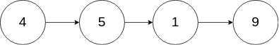

## 31、删除链表中的节点(自删 LC 237)

请编写一个函数，使其可以删除某个链表中给定的（非末尾）节点。传入函数的唯一参数为 要被删除的节点 。

现有一个链表 -- head = [4,5,1,9]，它可以表示为:



```c
示例 1：
	输入：head = [4,5,1,9], node = 5
	输出：[4,1,9]
	解释：给定你链表中值为 5 的第二个节点，那么在调用了你的函数之后，该链表应变为 4 -> 1 -> 9.
示例 2：
	输入：head = [4,5,1,9], node = 1
	输出：[4,5,9]
	解释：给定你链表中值为 1 的第三个节点，那么在调用了你的函数之后，该链表应变为 4 -> 5 -> 9.
```

**代码**

模仿数组删除 覆盖移除尾结点

```c
void deleteNode(struct ListNode* node) {
    struct ListNode * p,* q;
    p = node;
    q = node->next;
    while(q){
        p->val = q->val;
        //赋值完毕,直接退出,不再移动结点
        if(q->next == NULL)
            break;
        p = p->next;
        q = q->next;
    }
    p->next = NULL;
}
```


## 32、比特数计数(LC 338)

给你一个整数 `n` ，对于 `0 <= i <= n` 中的每个 `i` ，计算其二进制表示中 **`1` 的个数** ，返回一个长度为 `n + 1` 的数组 `ans` 作为答案。

**示例**

```
示例 1：
	输入：n = 2
	输出：[0,1,1]
	解释：
	0 --> 0
	1 --> 1
	2 --> 10
示例 2：
	输入：n = 5
	输出：[0,1,1,2,1,2]
    解释：
    0 --> 0
    1 --> 1
    2 --> 10
    3 --> 11
    4 --> 100
    5 --> 101
```

**代码**

```c
/**
 * Note: The returned array must be malloced, assume caller calls free().
 */
int * countBits(int n, int* returnSize){
    //间接数组
    int * result = malloc(sizeof(int)*(n+1));     //存放结果
    //转换为2进制
    int i = 0;
    int tag = 0;    //计数 1 的个数
    int num = 0;    //存放转换后的结果数组
    for(i = 0;i <= n;i++){
        num = i;
        //转换为2进制
        while(num){
            int flag = num % 2;       //2进制各位
            num /= 2;
            if(flag == 1)
                tag++;
        }
        result[i] = tag;
        tag = 0;    //重置用于下次计数
    }
    *returnSize = n+1;
    return result;
}
```


## 33、两个数组的交集(LC 349)

给定两个数组，编写一个函数来计算它们的交集。

**示例**

 ```
示例 1：

输入：nums1 = [1,2,2,1], nums2 = [2,2]
输出：[2]
示例 2：

输入：nums1 = [4,9,5], nums2 = [9,4,9,8,4]
输出：[9,4]
 ```

**代码**

暴力遍历 + 去重

```c
int* intersection(int* nums1, int nums1Size, int* nums2, int nums2Size, int* returnSize){
    //暴力法
    int len = nums1Size > nums2Size ? nums2Size : nums1Size;    //返回较小的,最大结果
    int * nums = malloc(sizeof(int)*len);
    //暴力遍历
    int i,j,k,tag = 0;
    for(i = 0;i < nums1Size;i++){
        for(j = 0;j < nums2Size;j++){
            //去重
            for(k = 0;k < tag;k++)
                if(nums1[i] == nums[k])
                    break;
            if(nums1[i] == nums2[j] && k == tag)
                nums[tag++] = nums1[i];
        }
    }
    * returnSize = tag;
    return nums;
}
```

