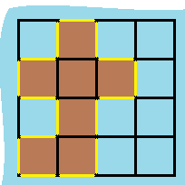

## 49、最小操作次数使数组元素相等

给你一个长度为 n 的整数数组，每次操作将会使 n - 1 个元素增加 1 。返回让数组所有元素相等的最小操作次数。

 **示例**

```
示例 1：
	输入：nums = [1,2,3]
	输出：3
	解释：
	只需要3次操作（注意每次操作会增加两个元素的值）：
	[1,2,3]  =>  [2,3,3]  =>  [3,4,3]  =>  [4,4,4]
示例 2：
	输入：nums = [1,1,1]
	输出：0
```

**代码**

```c
// 思路一
// sum + m * (n - 1) = x * n  
// sum 为数组当前和, m 为待求的move次数, x 为相加完成后的元素值, n 为数组大小
// 假设当前数组最小元素为 min 那么有 m = x - min (这里因为最小的元素一定是相加次数最多的且恰好等于 m)
// 故 x = m + min 那么 原方程变为 sum + m * (n - 1) = (m + min) * n  => m = sum - min * n

// 思路二 反向思维
// 每次使 n - 1 个元素 +1 增加到 所有元素相等的问题 等价于
// 每次使 1 个元素 -1 减小到 所有元素等于最小值

int compare(const void * a, const void * b)
{
   return ( *(int*)a - *(int*)b );
}

int minMoves(int* nums, int numsSize){
    //排序获得最小的值
    qsort(nums,numsSize,sizeof(int),compare);
    int min = nums[0];
    int ans = 0,i;
    for(i = 0; i < numsSize; i++){
        ans += nums[i] - min;
    }
    return ans;
}
```


## 50、分发饼干(LC 455)

假设你是一位很棒的家长，想要给你的孩子们一些小饼干。但是，每个孩子最多只能给一块饼干。

对每个孩子 i，都有一个胃口值 g[i]，这是能让孩子们满足胃口的饼干的最小尺寸；并且每块饼干 j，都有一个尺寸 s[j] 。如果 s[j] >= g[i]，我们可以将这个饼干 j 分配给孩子 i ，这个孩子会得到满足。你的目标是尽可能满足越多数量的孩子，并输出这个最大数值。

**示例**

```c
示例 1:
    输入: g = [1,2,3], s = [1,1]
    输出: 1
    解释: 
    你有三个孩子和两块小饼干，3个孩子的胃口值分别是：1,2,3。
    虽然你有两块小饼干，由于他们的尺寸都是1，你只能让胃口值是1的孩子满足。
    所以你应该输出1。
示例 2:
    输入: g = [1,2], s = [1,2,3]
    输出: 2
    解释: 
    你有两个孩子和三块小饼干，2个孩子的胃口值分别是1,2。
    你拥有的饼干数量和尺寸都足以让所有孩子满足。
    所以你应该输出2.
```

**代码**

```c
// 该题的思路在于, 给出的串s 一定是一个重复串
// 且该串的最多由其串长一般的子串构成  abcabc 由 abc 组成(而不可能是 abcd 组成)  ->  i <= len / 2
// 而且由于是重复构成那么,子串长度是父串长度的因数  ->   lenof(s) % lenof(subS) == 0    
// 枚举即可 
bool repeatedSubstringPattern(char * s){
    int len = strlen(s);        //字符串长度
    int match = 0,i;
    for(i = 1;i *2 <= len;i++){
        if(len % i == 0){
            //分割串
            int j;  
            for (j = i; j < len; j++) {
                if (s[j] == s[j - i]) {
                    match = 1;
                } else {
                    match = 0;
                    break;
                }
            }
            if (match == 1) {
                return true;
            }
        }
    }
    return false;
}
```


## 51、岛屿的周长(LC 463)

给定一个 row x col 的二维网格地图 grid ，其中：grid[i][j] = 1 表示陆地， grid[i][j] = 0 表示水域。

网格中的格子 水平和垂直 方向相连（对角线方向不相连）。整个网格被水完全包围，但其中恰好有一个岛屿（或者说，一个或多个表示陆地的格子相连组成的岛屿）。

岛屿中没有“湖”（“湖” 指水域在岛屿内部且不和岛屿周围的水相连）。格子是边长为 1 的正方形。网格为长方形，且宽度和高度均不超过 100 。计算这个岛屿的周长。

**示例**



```c
示例 1：
	输入：grid = [[0,1,0,0],[1,1,1,0],[0,1,0,0],[1,1,0,0]]
	输出：16
	解释：它的周长是上面图片中的 16 个黄色的边
示例 2：
	输入：grid = [[1]]
	输出：4
示例 3：
	输入：grid = [[1,0]]
	输出：4
```

**代码**

暴力迭代 - 计算所有1, 减去重复边, 即得结果

```c
int islandPerimeter(int** grid, int gridSize, int* gridColSize){
    //总的周长 4 * 16 = 64 
    //1所对应格子的边长,有重复 4 * 7 = 28
    //对于一个格子 有几个相邻的 1 就减去多少重复计算的边  最后即为结果

    int i,j;
    int totalSize = 0;
    //减去 0 对应的边长 - 现在得到的是带重复边的边长
    for(i = 0;i < gridSize;i++){
        for(j = 0;j < gridColSize[i];j++){
            if(grid[i][j] == 1)
                totalSize += 4;
        }
    }
    //考虑1之间的关系 这里使用间接数组, 给它周围补一圈 0  
    //避免复杂的边界判断,空间可以尽可能大一点
    //生成间接数组 
    int ** temp = malloc(sizeof(int *) * (gridSize+2));     //行数+2
    //找到最大列数, 防止空间不足
    int max = 0;
    for(i = 0;i < gridSize;i++)
        max = fmax(max,gridColSize[i]);
    //分配空间
    for(i = 0;i < gridSize+2;i++){
        temp[i] = malloc(sizeof(int)*(max+2));
    }
    //初始化赋值为0
    for(i = 0;i < gridSize+2;i++)
        for(j = 0;j < max+2;j++)
            temp[i][j] = 0;
    //为间接数组赋值陆地的情况
    for(i = 1;i < gridSize+1;i++)
        for(j = 1;j < max+1;j++)
            temp[i][j] = grid[i-1][j-1]; 
    
    //构建完毕开始比较
    for(i = 1;i < gridSize+1;i++){
        for(j = 1;j < max+1;j++){
            if(temp[i][j] == 1){
                //上为 1
                if(temp[i-1][j] == 1)
                    totalSize--;
                //下为 1
                if(temp[i+1][j] == 1)
                    totalSize--;
                //左为 1
                if(temp[i][j-1] == 1)
                    totalSize--;
                //右为 1
                if(temp[i][j+1] == 1)
                    totalSize--;
            }
        }
    }
    return totalSize;
}
```

