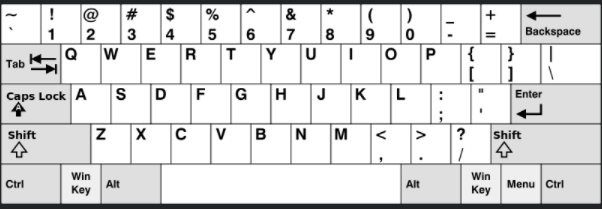

## 55、提莫攻击(LC 495)

在《英雄联盟》的世界中，有一个叫 “提莫” 的英雄，他的攻击可以让敌方英雄艾希（编者注：寒冰射手）进入中毒状态。现在，给出提莫对艾希的攻击时间序列和提莫攻击的中毒持续时间，你需要输出艾希的中毒状态总时长。

你可以认为提莫在给定的时间点进行攻击，并立即使艾希处于中毒状态。

 **示例**

```c
示例1:
    输入: [1,4], 2
    输出: 4
    原因: 第 1 秒初，提莫开始对艾希进行攻击并使其立即中毒。中毒状态会维持 2 秒钟，直到第 2 秒末结束。
    第 4 秒初，提莫再次攻击艾希，使得艾希获得另外 2 秒中毒时间。
    所以最终输出 4 秒。
示例2:
    输入: [1,2], 2
    输出: 3
    原因: 第 1 秒初，提莫开始对艾希进行攻击并使其立即中毒。中毒状态会维持 2 秒钟，直到第 2 秒末结束。
    但是第 2 秒初，提莫再次攻击了已经处于中毒状态的艾希。
    由于中毒状态不可叠加，提莫在第 2 秒初的这次攻击会在第 3 秒末结束。
    所以最终输出 3 。
```

**代码**

暴力法 - 迭代判断即可

```
int findPoisonedDuration(int* timeSeries, int timeSeriesSize, int duration){
    //根据两个时序序列的差值来判断中毒时间
    int i = 0;
    //由于判断是否重复中毒只判断 timeSeriesSize - 1次, 因此少了依次 duration 累加的步骤, 这里进行添加
    int seconds = duration;         
    //去掉时间间隔
    for(i = 0;i < timeSeriesSize - 1;i++){
        seconds += duration;
        //减去时间间隔内的重复中毒时间
        if(timeSeries[i+1] - timeSeries[i] <= duration)
            seconds -= duration - (timeSeries[i+1] - timeSeries[i]);
    }
    return seconds;
}
```


## 56、下一个更大元素 i(LC 496)

给你两个 没有重复元素 的数组 nums1 和 nums2 ，其中nums1 是 nums2 的子集。

请你找出 nums1 中每个元素在 nums2 中的下一个比其大的值。

nums1 中数字 x 的下一个更大元素是指 x 在 nums2 中对应位置的右边的第一个比 x 大的元素。如果不存在，对应位置输出 -1 。

**示例**

```
示例 1:
    输入: nums1 = [4,1,2], nums2 = [1,3,4,2].
    输出: [-1,3,-1]
    解释:
        对于 num1 中的数字 4 ，你无法在第二个数组中找到下一个更大的数字，因此输出 -1 。
        对于 num1 中的数字 1 ，第二个数组中数字1右边的下一个较大数字是 3 。
        对于 num1 中的数字 2 ，第二个数组中没有下一个更大的数字，因此输出 -1 。
示例 2:
    输入: nums1 = [2,4], nums2 = [1,2,3,4].
    输出: [3,-1]
    解释:
        对于 num1 中的数字 2 ，第二个数组中的下一个较大数字是 3 。
        对于 num1 中的数字 4 ，第二个数组中没有下一个更大的数字，因此输出 -1 。
```

**代码**

暴力法 - 遍历

```c
int* nextGreaterElement(int* nums1, int nums1Size, int* nums2, int nums2Size, int* returnSize){
    //暴力遍历
    int i = 0,j;
    int * nums = malloc(sizeof(int) * nums1Size);
    *returnSize = nums1Size;
    int tag;        //是否查找到nums1元素在nums2中的位置 1 查找到
    for(i = 0;i <nums1Size;i++){
        tag = 0;
        for(j = 0;j < nums2Size;j++){
            if(nums1[i] == nums2[j]) tag = 1;
            if(nums1[i] < nums2[j] && tag == 1){
                nums[i] = nums2[j];
                break;
            }
        }
        if(j == nums2Size)
            nums[i] = -1;
    }
    return nums;
}
```


## 57、键盘行(LC 500)

给你一个字符串数组 words ，只返回可以使用在 美式键盘 同一行的字母打印出来的单词。键盘如下图所示。

美式键盘 中：

第一行由字符 "qwertyuiop" 组成。
第二行由字符 "asdfghjkl" 组成。
第三行由字符 "zxcvbnm" 组成。

**示例**



```
示例 1：
	输入：words = ["Hello","Alaska","Dad","Peace"]
	输出：["Alaska","Dad"]
示例 2：
	输入：words = ["omk"]
	输出：[]
示例 3：
	输入：words = ["adsdf","sfd"]
	输出：["adsdf","sfd"]
```

**代码**

```c
char ** findWords(char ** words, int wordsSize, int* returnSize){
    //暴力 判断是否属于3个子串即可
    char * str = "12210111011122000010020202";
    int i,j,tag=0;
    int * result = malloc(sizeof(int) * wordsSize);
    for(i = 0;i < wordsSize;i++){
        char * temp = words[i];
        int cur = str[*temp < 'a' ? *temp + ' ' - 'a' : *temp - 'a'];     //记录首个字符属于哪一类
        while(*temp){
            //大写转小写
            if(str[*temp < 'a' ? *temp + ' ' - 'a' : *temp - 'a'] != cur)
                break;
            temp++;
        }
        if(*temp == '\0'){
            result[i] = 1;
            tag++;
        }      
    }


    //分配空间
    char ** reWords = malloc(sizeof(char *) * tag);
    int cur = 0;
    for(i = 0;i < wordsSize;i++){
        if(result[i] == 1){
            reWords[cur] = malloc(sizeof(char) * (strlen(words[i])+1));
            strcpy(reWords[cur],words[i]);
            cur++;
        }
    }   
    * returnSize = tag;
    return reWords;
}
```

