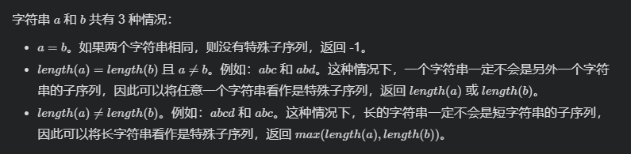

## 61、斐波那契数(LC 509)

斐波那契数，通常用 F(n) 表示，形成的序列称为 斐波那契数列 。该数列由 0 和 1 开始，后面的每一项数字都是前面两项数字的和。也就是：

F(0) = 0，F(1) = 1
F(n) = F(n - 1) + F(n - 2)，其中 n > 1
给你 n ，请计算 F(n) 。

 **示例**

```
示例 1：
	输入：2
	输出：1
	解释：F(2) = F(1) + F(0) = 1 + 0 = 1
示例 2：
	输入：3
	输出：2
	解释：F(3) = F(2) + F(1) = 1 + 1 = 2
示例 3：
	输入：4
	输出：3
	解释：F(4) = F(3) + F(2) = 2 + 1 = 3
```

**代码**

递归

```
int fib(int n){
    if(n == 0)
        return 0;
    if(n == 1)
        return 1;
    return fib(n-1) + fib(n-2);
}
```


## 62、检测大写字母(LC 520)

给定一个单词，你需要判断单词的大写使用是否正确。

我们定义，在以下情况时，单词的大写用法是正确的：

全部字母都是大写，比如"USA"。
单词中所有字母都不是大写，比如"leetcode"。
如果单词不只含有一个字母，只有首字母大写， 比如 "Google"。
否则，我们定义这个单词没有正确使用大写字母。

**示例**

```
示例 1:
	输入: "USA"
	输出: True
示例 2:
	输入: "FlaG"
	输出: False
注意: 输入是由大写和小写拉丁字母组成的非空单词。
```

**代码**

判断错误条件 判决器

```c
bool detectCapitalUse(char * word){
    int len = strlen(word); //字符串长度
    int flag1 = 0,flag2 = 0;    //flag1 判断是否有小写字母 flag2 判断是否有大写字母
    char * temp = word;
    temp++;     //不比较第1位
    while(*temp){
        if(*temp - 'a' >= 0)
            flag1 = 1;
        if(*temp - 'a' < 0)
            flag2 = 1;
        temp++;
    }

    //判断  "Flag"     "mL" 两种情形, 其余都是对的   
    return (flag1 == 1 && flag2 == 1) || (*word - 'a' >= 0 && flag2 == 1)? false : true;
}
```


## 63、最长特殊序列 I (LC 521)

给你两个字符串，请你从这两个字符串中找出最长的特殊序列。

「最长特殊序列」定义如下：该序列为某字符串独有的最长子序列（即不能是其他字符串的子序列）。

子序列 可以通过删去字符串中的某些字符实现，但不能改变剩余字符的相对顺序。空序列为所有字符串的子序列，任何字符串为其自身的子序列。

输入为两个字符串，输出最长特殊序列的长度。如果不存在，则返回 -1。

 **示例**

```
示例 1：
	输入: "aba", "cdc"
	输出: 3
	解释: 最长特殊序列可为 "aba" (或 "cdc")，两者均为自身的子序列且不是对方的子序列。
示例 2：
	输入：a = "aaa", b = "bbb"
	输出：3
示例 3：
	输入：a = "aaa", b = "aaa"
	输出：-1
```

**代码**

官方解法 取了所有情形思考,  判决所有情形即可, 不再附其它方法。



```
int findLUSlength(char * a, char * b){
    return !strcmp(a,b) ? -1 : fmax(strlen(a),strlen(b));
}
```

