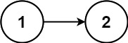

## 76、存在重复元素II(LC 219)

给定一个整数数组和一个整数 k，判断数组中是否存在两个不同的索引 i 和 j，使得 nums [i] = nums [j]，并且 i 和 j 的差的 绝对值 至多为 k。

 **示例**

```
示例 1:
	输入: nums = [1,2,3,1], k = 3
	输出: true
示例 2:
	输入: nums = [1,0,1,1], k = 1
	输出: true
示例 3:
	输入: nums = [1,2,3,1,2,3], k = 2
	输出: false
```

**代码**

解法一 

超时代码, 复杂度为 $O(kn)$ 受 k 的取值影响

```c
bool containsNearbyDuplicate(int* nums, int numsSize, int k){
    //双指针, 慢指针指向前边, 快指针指向后面
    //出现数据慢指针移动到和快指针相同的位置, 然后快指针根据 k 大小开始滑动,直到找到解
    int slow,fast,i,flag = 0;
    slow = 0;
    fast = 1;
    //边界条件
    while(1){
        //越界判定
        if(fast > numsSize - 1)
            return false;

        int tag = k;
        while(tag){
            //printf("%d %d ",nums[slow],nums[fast]);
            if(nums[slow] == nums[fast]){
                flag = 1;
                break;
            }
                
            fast++;
            tag--;
            //越界判定
            if(fast > numsSize - 1)
                break;
        }
        //printf("\n");
        if(flag == 1)
            return true;
        slow++;
        fast = slow+1;
    }
    return false;
}
```

解法二 

Hash 表, 思路在于通过向Hash 表中存放数据, 当存放两个相同的数据时, 根据映射关系, 他们一定会存放在同一个位置上, 这时就出现了 Hash 冲突。 那么我们就根据这两个值 下标 的差值 < k 与否来判断是否满足题意。

```c
typedef struct hash{
    int key;  // 键
    int index;  // 索引值
    UT_hash_handle hh; // 让结构体哈希柄
} *hash_ptr;

bool containsNearbyDuplicate(int* nums, int numsSize, int k){
    hash_ptr p=NULL, tables=NULL;
    for(int i=0;i<numsSize;i++){
        if(tables) HASH_FIND_INT(tables, &(nums[i]), p);
        if(p&&(i-p->index)<=k) return true;
        p=(hash_ptr)malloc(sizeof(*p));
        p->key=nums[i];
        p->index=i;
        HASH_ADD_INT(tables, key, p);
    }
    return false;
}
```


## 77、回文链表(LC 234)

给你一个单链表的头节点 `head` ，请你判断该链表是否为回文链表。如果是，返回 `true` ；否则，返回 `false` 。

**示例 1：**


```
输入：head = [1,2,2,1]
输出：true
```

**示例 2：**



```
输入：head = [1,2]
输出：false
```

 **代码**

间接数组 对数组进行首尾比较即可

```c
bool isPalindrome(struct ListNode* head){
    struct ListNode* p = head;
    int size = 0;
    //计算链表长度
    while(p){
        p = p->next;
        size++;
    }
    //间接数组
    int * nums = malloc(sizeof(int) * size);
    //存放数据
    int i = 0;
    p = head;
    while(p){
        nums[i++] = p->val;
        p = p->next;
    }
    
    for(i = 0;i < size/ 2;i++){
        if(nums[i] != nums[size - i - 1])
            break;
    }
    return i == size/2 ? true : false;
}
```


## 78、丑数

给你一个整数 n ，请你判断 n 是否为 丑数 。如果是，返回 true ；否则，返回 false 。

丑数 就是只包含质因数 2、3 和/或 5 的正整数。

 **示例**

```
示例 1：
    输入：n = 6
    输出：true
    解释：6 = 2 × 3
示例 2：
    输入：n = 8
    输出：true
    解释：8 = 2 × 2 × 2
示例 3：
    输入：n = 14
    输出：false
    解释：14 不是丑数，因为它包含了另外一个质因数 7 。
示例 4：
    输入：n = 1
    输出：true
    解释：1 通常被视为丑数。
```

**代码**

对质因数进行遍历, 判断数能否仅通过 2/3/5 的多次组合而构成

```c
bool isUgly(int n) {
    if (n <= 0) {
        return false;
    }
    int factors[] = {2, 3, 5};
    for (int i = 0; i < 3; i++) {
        while (n % factors[i] == 0) {
            n /= factors[i];
        }
    }
    return n == 1;
}
```

