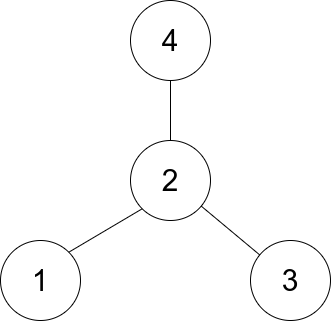

## 46、统计匹配检索规则的物品数量(LC 1773)

给你一个数组 items ，其中 items[i] = [typei, colori, namei] ，描述第 i 件物品的类型、颜色以及名称。

另给你一条由两个字符串 ruleKey 和 ruleValue 表示的检索规则。

如果第 i 件物品能满足下述条件之一，则认为该物品与给定的检索规则 匹配 ：

ruleKey == "type" 且 ruleValue == typei 。
ruleKey == "color" 且 ruleValue == colori 。
ruleKey == "name" 且 ruleValue == namei 。
统计并返回 匹配检索规则的物品数量 。

**示例**

```
示例 1：
    输入：items = [["phone","blue","pixel"],["computer","silver","lenovo"],["phone","gold","iphone"]], ruleKey = "color", ruleValue = "silver"
    输出：1
    解释：只有一件物品匹配检索规则，这件物品是 ["computer","silver","lenovo"] 。
示例 2：
    输入：items = [["phone","blue","pixel"],["computer","silver","phone"],["phone","gold","iphone"]], ruleKey = "type", ruleValue = "phone"
    输出：2
    解释：只有两件物品匹配检索规则，这两件物品分别是 ["phone","blue","pixel"] 和 ["phone","gold","iphone"] 。注意，["computer","silver","phone"] 未匹配检索规则。
```

**代码**

```c
int countMatches(char *** items, int itemsSize, int* itemsColSize, char * ruleKey, char * ruleValue){
    char str[3][10] = {"type","color","name"};
    int i,index = 0;
    for(i = 0;i < 3;i++)
        if(!strcmp(str[i],ruleKey)){
            index = i;
            break;
        }
            
    int j,count = 0;
    for(j = 0;j < itemsSize;j++){
        if(!strcmp(items[j][index],ruleValue))
            count++;
    }
    return count;
}
```


## 47、找出星型图的中心结点(LC 1791)

有一个无向的 星型 图，由 n 个编号从 1 到 n 的节点组成。星型图有一个 中心 节点，并且恰有 n - 1 条边将中心节点与其他每个节点连接起来。

给你一个二维整数数组 edges ，其中 edges[i] = [ui, vi] 表示在节点 ui 和 vi 之间存在一条边。请你找出并返回 edges 所表示星型图的中心节点。

**示例**



```
示例 1：
    输入：edges = [[1,2],[2,3],[4,2]]
    输出：2
    解释：如上图所示，节点 2 与其他每个节点都相连，所以节点 2 是中心节点。
示例 2：
    输入：edges = [[1,2],[5,1],[1,3],[1,4]]
    输出：1
```

**代码**

```c
int cmp(const void *a,const void *b){
    return *(int*)a - *(int*)b;
}

int findCenter(int** edges, int edgesSize, int* edgesColSize){
    //显然找中心就是找每条边中都出现的那个点
    //思路: 降维到一维数组 + 排序计数
    int i,j,tag=0;
    int * nums = malloc(sizeof(int) * edgesSize * 2);
    for(i = 0;i < edgesSize;i++)
        for(j = 0;j < edgesColSize[i];j++)
            nums[tag++] = edges[i][j];
    
    //排序
    qsort(nums,edgesSize * 2,sizeof(int),cmp);

    //查找计数
    int max = 0,count = 0;
    for(i = 0;i < edgesSize * 2 - 1;i++){
        printf("%d ",nums[i]);
        if(nums[i] == nums[i+1])
            count++;
        else{
            max = fmax(max,count);
            count = 0;
        }
        
        //次数比较只能比较到前一位
        if(max == edgesSize - 1)
            return nums[i];
    }
    //这里需要处理边界条件
    return count == edgesSize - 1 ? nums[i-1] : 0;
}
```


## 48、拥有最多糖果的孩子

给你一个数组 candies 和一个整数 extraCandies ，其中 candies[i] 代表第 i 个孩子拥有的糖果数目。

对每一个孩子，检查是否存在一种方案，将额外的 extraCandies 个糖果分配给孩子们之后，此孩子有 最多 的糖果。注意，允许有多个孩子同时拥有 最多 的糖果数目。

 **示例**

```
示例 1：
    输入：candies = [2,3,5,1,3], extraCandies = 3
    输出：[true,true,true,false,true] 
    解释：
    孩子 1 有 2 个糖果，如果他得到所有额外的糖果（3个），那么他总共有 5 个糖果，他将成为拥有最多糖果的孩子。
    孩子 2 有 3 个糖果，如果他得到至少 2 个额外糖果，那么他将成为拥有最多糖果的孩子。
    孩子 3 有 5 个糖果，他已经是拥有最多糖果的孩子。
    孩子 4 有 1 个糖果，即使他得到所有额外的糖果，他也只有 4 个糖果，无法成为拥有糖果最多的孩子。
    孩子 5 有 3 个糖果，如果他得到至少 2 个额外糖果，那么他将成为拥有最多糖果的孩子。
示例 2：
    输入：candies = [4,2,1,1,2], extraCandies = 1
    输出：[true,false,false,false,false] 
    解释：只有 1 个额外糖果，所以不管额外糖果给谁，只有孩子 1 可以成为拥有糖果最多的孩子。
示例 3：
    输入：candies = [12,1,12], extraCandies = 10
    输出：[true,false,true]
```

**代码**

简单题 - 考思路

```c
bool* kidsWithCandies(int* candies, int candiesSize, int extraCandies, int* returnSize){
    //实质上就是找最大值 然后判断 cur + extraCandy >= max 
    //找最大值
    int max = candies[0],i;
    for(i = 0;i < candiesSize;i++)
        max = fmax(max,candies[i]);

    bool * result = malloc(sizeof(bool) * candiesSize);
    for(i = 0;i < candiesSize;i++){
        if(candies[i] + extraCandies >= max)
            result[i] = true;
        else
            result[i] = false;
    }
    *returnSize = candiesSize;
    return result;
}
```

