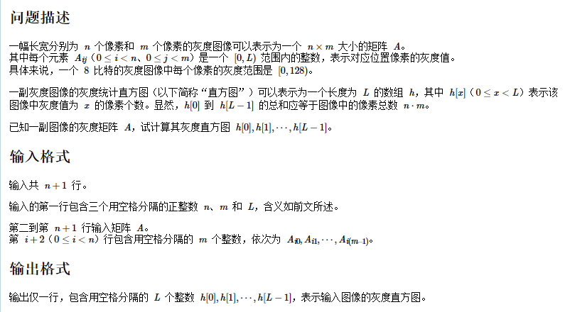

## 4、判断是否是回文整数

 给你一个整数 x ，如果 x 是一个回文整数，返回 true ；否则，返回 false 。

 回文数是指正序（从左向右）和倒序（从右向左）读都是一样的整数。例如，121 是回文，而 123  

 不是。

```c
 bool isPalindrome(int x) {
        int rev = 0;
        int input = x;
        while (x != 0) {
            if (rev < INT_MIN / 10 || rev > INT_MAX / 10) {
                return 0;
            }
            int digit = x % 10;
            x /= 10;
            rev = rev * 10 + digit;
        }
        
        if(rev == input && input >= 0)
            return true;
        else{
            return false;
        }
}
```


## 5、灰度直方图(CCF 2021-04-1)



**示例**

```
样例输入
	4 4 16 0 1 2 3 4 5 6 7 8 9 10 11 12 13 14 15
样例输出
	1 1 1 1 1 1 1 1 1 1 1 1 1 1 1 1
解析
	给定矩阵大小  n × m  矩阵元素最大值 ≤ L
	输入n m L 三个值判断图像的灰度直方图数组,也即数组位置0 - L对应在矩阵中元素的出现次数。
```

**解答**

这里直接使用了暴力法,使用三层遍历进行统计,数组大小限制在500 × 500 以及动态分配数组空间

**代码**

```c
#include <stdio.h>
#include <stdlib.h>
#include <malloc.h>


int main()
{
    int n,m,L;
    int * nums;
    int i,j,k;
    scanf("%d%d%d",&n,&m,&L);
    nums = (int *)malloc(sizeof(int) * L);
    for(i = 0;i < L;i++)
        nums[i] = 0;

    int array[500][500];
    for(i = 0;i < n;i++){
        for(j = 0;j < m;j++){
            scanf("%d",&array[i][j]);
        }
    }

    for(i = 0;i < n;i++){
        for(j = 0;j < m;j++){
            for(k = 0;k < L;k++)
                if(array[i][j] == k)
                    nums[k]++;
        }
    }

    for(i = 0;i < L;i++)
        printf("%d ",nums[i]);

    return 0;
}
```


## 6、罗马数字转整数

罗马数字包含以下七种字符: I， V， X， L，C，D 和 M。

```
字符          数值
I             1
V             5
X             10
L             50
C             100
D             500
M             1000
```

例如， 罗马数字 2 写做 II ，即为两个并列的 1 。12 写做 XII ，即为 X + II 。 27 写做  XXVII, 即为 XX + V + II 。

通常情况下，罗马数字中小的数字在大的数字的右边。但也存在特例，例如 4 不写做 IIII，而是 IV。数字 1 在数字 5 的左边，所表示的数等于大数 5 减小数 1 得到的数值 4 。同样地，数字 9 表示为 IX。这个特殊的规则只适用于以下六种情况：

I 可以放在 V (5) 和 X (10) 的左边，来表示 4 和 9。
X 可以放在 L (50) 和 C (100) 的左边，来表示 40 和 90。 
C 可以放在 D (500) 和 M (1000) 的左边，来表示 400 和 900。
给定一个罗马数字，将其转换成整数。

**示例**

```
示例 1:
	输入: "III"
	输出: 3
示例 2:
    输入: s = "IV"
    输出: 4
示例 3:
    输入: s = "IX"
    输出: 9
示例 4:
    输入: s = "LVIII"
    输出: 58
    解释: L = 50, V= 5, III = 3.
示例 5:
    输入: s = "MCMXCIV"
    输出: 1994
    解释: M = 1000, CM = 900, XC = 90, IV = 4.
```

**代码**

暴力法, 也即先解决大部分,然后处理边界尽量使其符合规则(这里可以使用数组简化代码,后面有机会再修改)。

```c
int romanToInt(char * s){
    int result = 0;
    while(*s){
        //以下的IF做边界的处理
        if(*s == 'I' && *(s+1) == 'V')
        {
            result += 4;
            s+=2;
            continue;
        }
        else if(*s == 'I' && *(s+1) == 'X')
        {
            result += 9;
            s+=2;
            continue;
        }
        else if(*s == 'X' && *(s+1) == 'L')
        {
            result += 40;
            s+=2;
            continue;
        }
        else if(*s == 'X' && *(s+1) == 'C')
        {
            result += 90;
            s+=2;
            continue;
        }
        else if(*s == 'C' && *(s+1) == 'D')
        {
            result += 400;
            s+=2;
            continue;
        }
        else if(*s == 'C' && *(s+1) == 'M')
        {
            result += 900;
            s+=2;
            continue;
        }

        //以下做常规操作
        if(*s == 'I')
            result += 1;
        else if(*s == 'V')
            result += 5;
        else if(*s == 'X')
            result += 10;
        else if(*s == 'L')
            result += 50;
        else if(*s == 'C')
            result += 100;
        else if(*s == 'D')
            result += 500;
        else if(*s == 'M')
            result += 1000;
        s++;
    }
    return result;
}
```

官方解法

```c
int romanToInt(char* s) {
    int symbolValues[26];
    symbolValues['I' - 'A'] = 1;
    symbolValues['V' - 'A'] = 5;
    symbolValues['X' - 'A'] = 10;
    symbolValues['L' - 'A'] = 50;
    symbolValues['C' - 'A'] = 100;
    symbolValues['D' - 'A'] = 500;
    symbolValues['M' - 'A'] = 1000;
    int ans = 0;
    int n = strlen(s);
    for (int i = 0; i < n; ++i) {
        int value = symbolValues[s[i] - 'A'];
        if (i < n - 1 && value < symbolValues[s[i + 1] - 'A']) {
            ans -= value;
        } else {
            ans += value;
        }
    }
    return ans;
}
```

