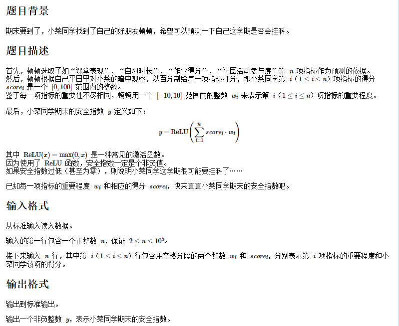

## 10、两数之和

给定一个整数数组 nums 和一个整数目标值 target，请你在该数组中找出 **和为目标值** target 的那 两个 整数，并返回它们的数组下标。

你可以假设每种输入只会对应一个答案。但是，数组中同一个元素在答案里不能重复出现。

**示例**

```
示例 1：
	输入：nums = [2,7,11,15], target = 9
	输出：[0,1]
	解释：因为 nums[0] + nums[1] == 9 ，返回 [0, 1] 。
```

**代码**

算法通过暴力迭代的方式完成计算

```c
int* twoSum(int* nums, int numsSize, int target, int* returnSize){
    int i,j;
    //暴力迭代完成查找
    for(i = 0;i < numsSize;i++){
        for(j = i+1;j < numsSize;j++){
            if(nums[i] + nums[j] == target){
                int * result = (int *)malloc(sizeof(int)*2);
                result[0] = i;
                result[1] = j;
                *returnSize = 2;
                return result;
            }
        }
    }
    *returnSize = 0;
    return NULL;
}
```


## 11、期末预测之安全指数(CCF 202012-1)



**示例**

```
样例1
	输入	6 2 60 10 100 0 70 0 0 -10 50 10 60
	输出	1220
```

**代码**

该题比较简单,读懂意思即可做出来,实质上就是做一个max(0,x)操作和求和。

```c
#include <stdio.h>
#include <stdlib.h>

int ReLU(int nums[100000][2],int n){
    int i,j;
    int result = 0;
    for(i = 0;i < n;i++){
        result += nums[i][0] * nums[i][1];
    }
    return result > 0 ? result : 0;
}

int main()
{
    int nums[100000][2];        //数据
    int n,i,j;
    scanf("%d",&n);
    for(i = 0;i < n;i++){
        for(j = 0;j < 2;j++){
            scanf("%d",&nums[i][j]);
        }
    }
    printf("%d",ReLU(nums,n));
    return 0;
}
```


## 12、翻转字符串

编写一个函数，其作用是将输入的字符串反转过来。输入字符串以字符数组 char[] 的形式给出。不要给另外的数组分配额外的空间，你必须原地修改输入数组、使用 O(1) 的额外空间解决这一问题。

你可以假设数组中的所有字符都是 ASCII 码表中的可打印字符。

**示例**

```
示例 1：
	输入：["h","e","l","l","o"] 
	输出：["o","l","l","e","h"]
```

**代码**

算法将对应位置的字符进行交换,执行次数为 length / 2 长度

```c
void reverseString(char* s, int sSize){
    int i;
    for(i = 0;i < sSize/2;i++){
        char temp;
        temp = s[i];
        s[i] = s[sSize-i-1];
        s[sSize-i-1] = temp;
    }
}
```

