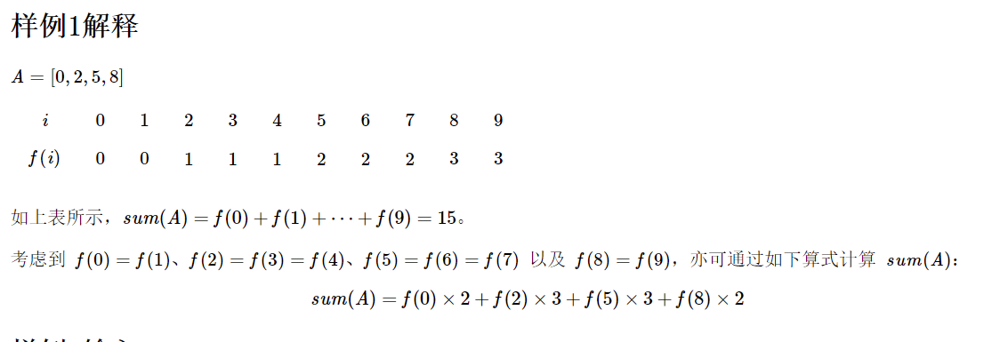
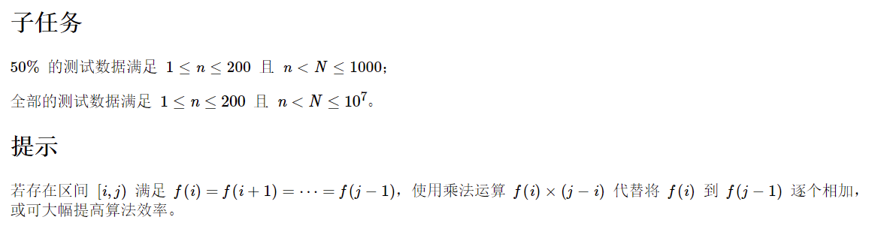
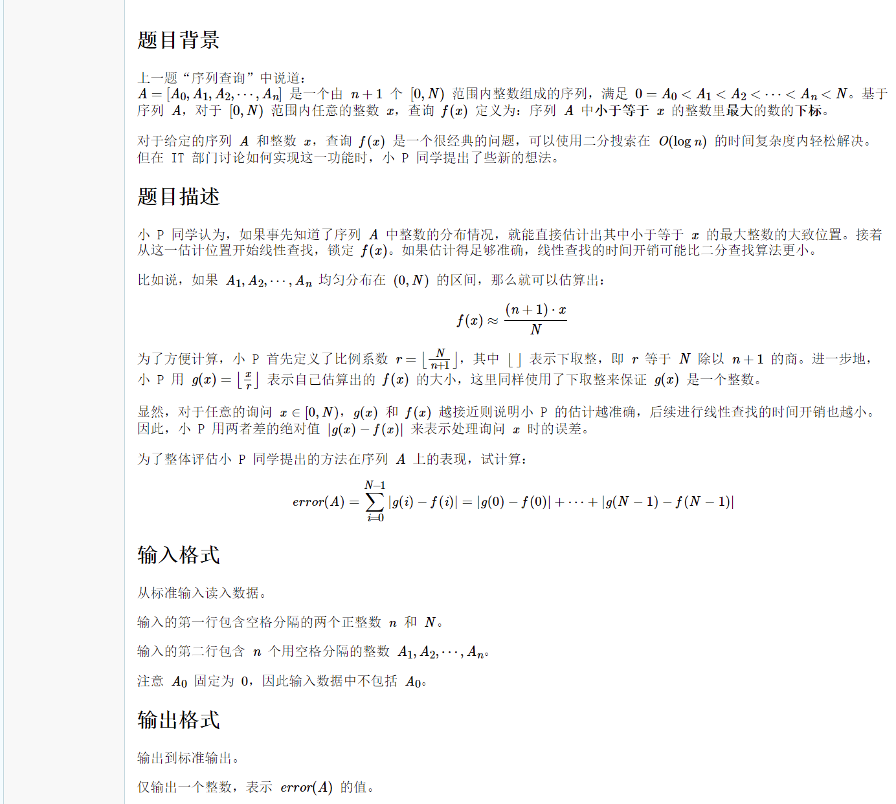
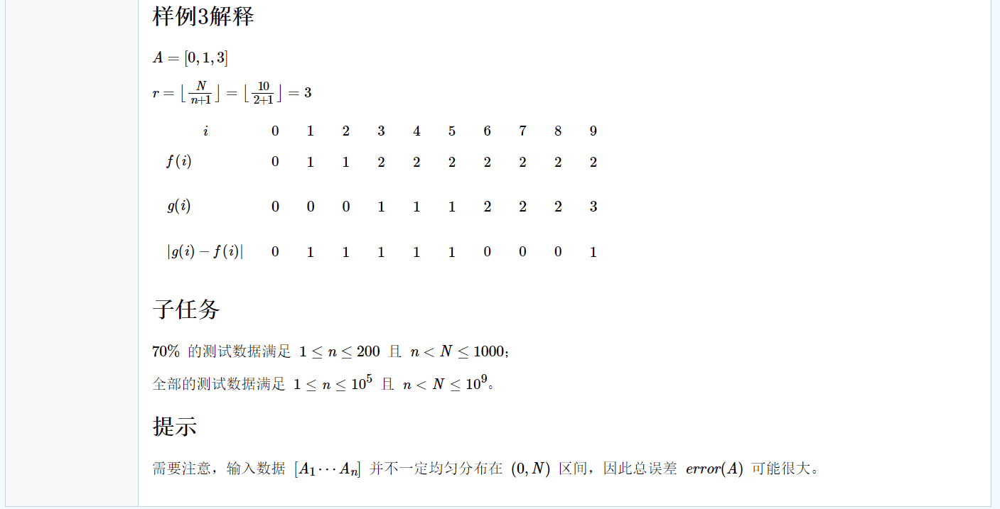

## 1 CCF 20211201 1

| 试题编号： | 202112-1 |
| ---------- | -------- |
| 试题名称： | 序列查询 |
| 时间限制： | 300ms    |
| 内存限制： | 512.0MB  |


### 输出格式

输出到标准输出。

仅输出一个整数，表示 sum(A) 的值。


### 样例1输入

```data
3 10
2 5 8
>>
15
```




### 样例2输入

```data
9 10
1 2 3 4 5 6 7 8 9
>>
45
```




### 代码

`依照提示,取 [0,n) 为区间计算累加`

```c
#include <stdio.h>
#include <stdlib.h>

int main()
{
    int m = 0,n = 0;
    scanf("%d %d",&m,&n);
    int i = 0;
    int result = 0,times = 0;
    int pre = 0,cur = 0;
    char ch;
    for(i = 0;1;i++){
        scanf("%d",&cur);
        result += times * (cur - pre);
        //更新参数
        pre = cur;
        times++;
        if(getchar() == '\n'){
            result += times * (n - cur);
            break;
        }
    }
    printf("%d",result);
    return 0;
}
```


## 2 CCF 20211201 2

| 试题编号： | 202112-2     |
| ---------- | ------------ |
| 试题名称： | 序列查询新解 |
| 时间限制： | 1.0s         |
| 内存限制： | 512.0MB      |



## 样例1输入

```data
3 10
2 5 8
>>
5
```


## 样例2输入

```data
9 10
1 2 3 4 5 6 7 8 9
>>
0
```


## 样例3输入

```data
2 10
1 3
>>
6
```




### 代码

`70% 解法 改进仅需对数据进行扩充  `$->10^9$

```c
#include <stdio.h>
#include <stdlib.h>

int main()
{
    //70% 暴力法
    int m = 0,n = 0;
    scanf("%d %d",&m,&n);
    //生成数组
    int fx[100000];
    int gx[100000];
    //生成fx
    int i = 0,j = 0;
    int result = 0,times = 0;
    int pre = 0,cur = 0;
    for(i = 0;1;i++){
        scanf("%d",&cur);
        //更新fx
        for(j = pre;j < cur;j++)
            fx[j] = times;
        //更新参数
        times++;
        pre = cur;

        if(getchar() == '\n'){
            for(j = cur;j < n;j++)
                fx[j] = times;
            break;
        }
    }
    int r = 0;
    r = n / (times + 1);
    //生成gx  计算error
    for(i = 0;i < n;i++){
        gx[i] = i / r;
        result += abs(fx[i] - gx[i]);
    }
    printf("%d",result);
    return 0;
}
```


**总结: CCF 的题1、2道是送分题, 从第3道开始难度拔高, 单纯的 C语言 在做题时会有很多困难, 使用 STL 的 C++ 更好。**
