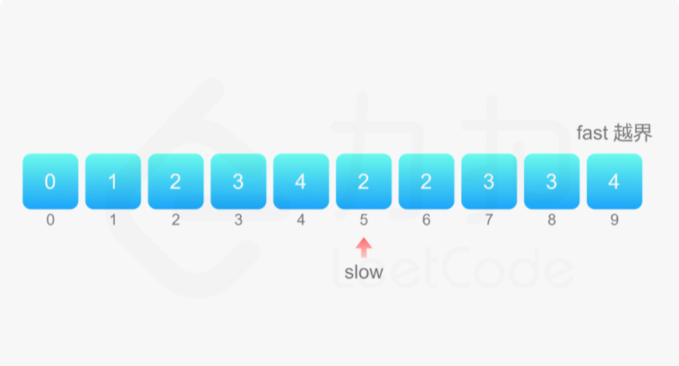

## 1 摩尔投票法

​		想象着这样一个画面：会议大厅站满了投票代表，每个都有一个牌子上面写着自己所选的候选人的名字。然后选举意见不合的（所选的候选人不同）两个人，会打一架，并且会同时击倒对方。显而易见，如果一个人拥有的选票比其它所有人加起来的选票还要多的话，这个候选人将会赢得这场“战争”，当混乱结束，最后剩下的那个代表（可能会有多个）将会来自多数人所站的阵营。但是如果所有参加候选人的选票都不是大多数（选票都未超过一半），那么最后站在那的代表（一个人）并不能代表所有的选票的大多数。因此，当某人站到最后时，需要统计他所选的候选人的选票是否超过一半（包括倒下的），来判断选票结果是否有效。

**经典问题 多数元素**

​		给定一个大小为 n 的数组，找到其中的多数元素。多数元素是指在数组中出现次数 大于 ⌊ n/2 ⌋ 的元素。你可以假设数组是非空的，并且给定的数组总是存在多数元素。

**示例** 

```c
int majorityElement(int* nums, int numsSize){
     int * stack=malloc(sizeof(int)*numsSize);      //生成 numsSize 大小的数组
     int top=-1;
     for(int i=0;i<numsSize;i++){
         if(top==-1){
             stack[++top]=nums[i];
         }
         else if(stack[top]==nums[i]){
             stack[++top]=nums[i];
         }
         else top--;
     }
     return stack[0];
}
```

---


## 2 双指针思想

**什么是双指针?**

​		双指针，指的是在遍历对象的过程中，不是普通的使用单个指针进行访问，而是使用两个相同方向（*快慢指针*）或者相反方向（*对撞指针*）的指针进行扫描，从而达到相应的目的。

### 1) 对撞指针

​		对撞指针是指在有序数组中，将指向最左侧的索引定义为左指针(left)，最右侧的定义为右指针(right)，然后从两头向中间进行数组遍历。

> 对撞数组适用于有序数组，也就是说当你遇到题目给定有序数组时，应该第一时间想到用对撞指针解题。
>

---


### 2) 快慢指针

​		快慢指针也是双指针，但是两个指针从同一侧开始遍历数组，将这两个指针分别定义为快指针（fast）和慢指针（slow），两个指针以不同的策略移动，直到两个指针的值相等（或其他特殊条件）为止，如fast每次增长两个，slow每次增长一个。

**经典问题 - 删除有序数组中的重复项**

​		给你一个有序数组 nums ，请你 原地 删除重复出现的元素，使每个元素 只出现一次 ，返回删除后数组的新长度。不要使用额外的数组空间，你必须在 原地 修改输入数组 并在使用 O(1) 额外空间的条件下完成。

**示例** 

```
输入：nums = [1,1,2]
输出：2, nums = [1,2]
解释：函数应该返回新的长度 2 ，并且原数组 nums 的前两个元素被修改为 1, 2 。不需要考虑数组中超出新长度后面的元素。
```

**代码**

该算法使用了双指针的思想, 快指针用于向前遍历把有序数组的数据向 slow 位置(也即待插入位置)插入 ,知道 fast 越界即可完成查询。

```c
int removeDuplicates(int* nums, int numsSize) {
    if (numsSize == 0) {
        return 0;
    }
    int fast = 1, slow = 1;
    while (fast < numsSize) {
        if (nums[fast] != nums[fast - 1]) {
            nums[slow] = nums[fast];
            ++slow;
        }
        ++fast;
    }
    return slow;
}
```

**图解**



---


## 3 动态规划

**动态规划算法的核心**

```
A * "1+1+1+1+1+1+1+1 =？" *

A : "上面等式的值是多少"
B : *计算* "8!"

A *在上面等式的左边写上 "1+" *
A : "此时等式的值为多少"
B : *quickly* "9!"
A : "你怎么这么快就知道答案了"
A : "只要在8的基础上加1就行了"
A : "所以你不用重新计算因为你记住了第一个等式的值为8!动态规划算法也可以说是 '记住求过的解来节省时间'"
```

由上面的图片和小故事可以知道动态规划算法的核心就是记住已经解决过的子问题的解。

**动态规划算法的两种形式**

上面已经知道动态规划算法的核心是记住已经求过的解，记住求解的方式有两种：

> ①自顶向下的备忘录法 
>
> ②自底向上。


为了说明动态规划的这两种方法，举一个最简单的例子：求斐波拉契数列**Fibonacci **。先看一下这个问题：

```
Fibonacci (n) = 1;   n = 0
Fibonacci (n) = 1;   n = 1
Fibonacci (n) = Fibonacci(n-1) + Fibonacci(n-2)
```

以前学c语言的时候写过这个算法使用递归十分的简单。先使用递归版本来实现这个算法：

```
public int fib(int n)
{
	if(n<=0)
		return 0;
	if(n==1)
		return 1;
	return fib( n-1)+fib(n-2);
}
//输入6
//输出：8
```


**经典问题 - 最大子序和(动态规划)**

给定一个整数数组 nums ，找到一个具有最大和的连续子数组（子数组最少包含一个元素），返回其最大和。

**示例**

```
输入：nums = [-2,1,-3,4,-1,2,1,-5,4]
输出：6
解释：连续子数组 [4,-1,2,1] 的和最大，为 6 。
```

**官方算法**

**动态规划解法 (减去多余计算的树结点)**

以当前点作为结束点,存储之前运算的最优结果。

对于该题而言,如序列: -1 1 -1 3

将其对应f(1)、f(2)、f(3)、f(4),从0下标开始的计算存储了每个下标为结束点的最优结果。

也即: $f(1) = -1,f(2) = 1,f(3) = 1,f(4) = 3$,  因此最终结果为 3。

```c
int maxSubArray(int* nums, int numsSize) {
    int pre = 0, maxAns = nums[0];
    for (int i = 0; i < numsSize; i++) {
        pre = fmax(pre + nums[i], nums[i]);
        maxAns = fmax(maxAns, pre);
    }
    return maxAns;
}
```

---


## 4 贪心思想

### 贪心

> 今朝有酒今朝醉，明日愁来明日愁


### 贪心的定义

贪心是一种**算法思想**， 在某些问题中，当前状态对后续状态没有影响（也叫做问题**无后效性**），这样一来，当前状态的最优解最终会造成全局的最优解，此时我们每一步（每个状态）都选取当前最优解（而不考虑之后的情况），这就是贪心


### 贪心的适用问题

问题必须能“分解”， 并且每一步都有最优解，才能使用贪心算法，即**最优子结构问题**


### 贪心的正确性

贪心的正确性的关键在于验证问题的无后效性，判断正确性时需要**“胆大心细”**，大胆假设，小心求证，验证贪心算法是否正确称为贪心算法的证明，贪心算法的证明主要有以下几种方法

- 反证法
- 归纳法

同时，证伪贪心算法往往采用构造出一个**反例**的方式


### 贪心算法与动态规划的区别

动态规划顾名思义会“动态”地求解问题，会将之前的结果记录下来从而找到最优解，而贪心是一直往前，会对每一个方案都做出选择


### 例1、买卖股票的最佳时机 II(LC 122)

`难度中等1512`

给定一个数组 `prices` ，其中 `prices[i]` 是一支给定股票第 `i` 天的价格。

设计一个算法来计算你所能获取的最大利润。你可以尽可能地完成更多的交易（多次买卖一支股票）。

**注意：**你不能同时参与多笔交易（你必须在再次购买前出售掉之前的股票）。

 

**示例 1:**

```
输入: prices = [7,1,5,3,6,4]
输出: 7
解释: 在第 2 天（股票价格 = 1）的时候买入，在第 3 天（股票价格 = 5）的时候卖出, 这笔交易所能获得利润 = 5-1 = 4 。
     随后，在第 4 天（股票价格 = 3）的时候买入，在第 5 天（股票价格 = 6）的时候卖出, 这笔交易所能获得利润 = 6-3 = 3 。
```

**示例 2:**

```
输入: prices = [1,2,3,4,5]
输出: 4
解释: 在第 1 天（股票价格 = 1）的时候买入，在第 5 天 （股票价格 = 5）的时候卖出, 这笔交易所能获得利润 = 5-1 = 4 。
     注意你不能在第 1 天和第 2 天接连购买股票，之后再将它们卖出。因为这样属于同时参与了多笔交易，你必须在再次购买前出售掉之前的股票。
```

**示例 3:**

```
输入: prices = [7,6,4,3,1]
输出: 0
解释: 在这种情况下, 没有交易完成, 所以最大利润为 0。
```

**代码**

贪心,  实质上就是计算每一个波谷到波峰的差值, 从一开始的波谷选取累加值直到抵达波峰

```c
int maxProfit(int* prices, int pricesSize){
    int max = 0;
    int i;
     for(i = 0;i < pricesSize - 1;i++){
         if(prices[i] < prices[i+1])
            max += prices[i+1] - prices[i];
     }
     return max;
}
```


