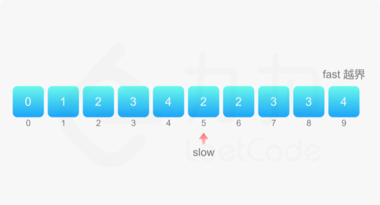
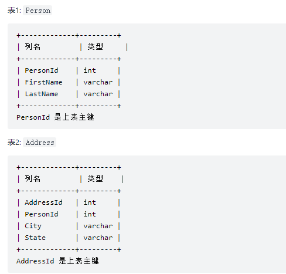
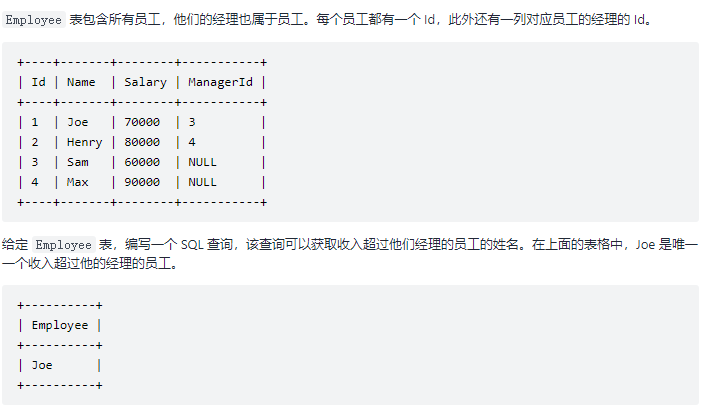

## 1 摩尔投票法

​		想象着这样一个画面：会议大厅站满了投票代表，每个都有一个牌子上面写着自己所选的候选人的名字。然后选举意见不合的（所选的候选人不同）两个人，会打一架，并且会同时击倒对方。显而易见，如果一个人拥有的选票比其它所有人加起来的选票还要多的话，这个候选人将会赢得这场“战争”，当混乱结束，最后剩下的那个代表（可能会有多个）将会来自多数人所站的阵营。但是如果所有参加候选人的选票都不是大多数（选票都未超过一半），那么最后站在那的代表（一个人）并不能代表所有的选票的大多数。因此，当某人站到最后时，需要统计他所选的候选人的选票是否超过一半（包括倒下的），来判断选票结果是否有效。

**经典问题 多数元素**

​		给定一个大小为 n 的数组，找到其中的多数元素。多数元素是指在数组中出现次数 大于 ⌊ n/2 ⌋ 的元素。你可以假设数组是非空的，并且给定的数组总是存在多数元素。

**示例** 

```c
int majorityElement(int* nums, int numsSize){
     int * stack=malloc(sizeof(int)*numsSize);      //生成 numsSize 大小的数组
     int top=-1;
     for(int i=0;i<numsSize;i++){
         if(top==-1){
             stack[++top]=nums[i];
         }
         else if(stack[top]==nums[i]){
             stack[++top]=nums[i];
         }
         else top--;
     }
     return stack[0];
}
```

---


## 2 双指针思想

**什么是双指针?**

​		双指针，指的是在遍历对象的过程中，不是普通的使用单个指针进行访问，而是使用两个相同方向（*快慢指针*）或者相反方向（*对撞指针*）的指针进行扫描，从而达到相应的目的。

### 1) 对撞指针

​		对撞指针是指在有序数组中，将指向最左侧的索引定义为左指针(left)，最右侧的定义为右指针(right)，然后从两头向中间进行数组遍历。

> 对撞数组适用于有序数组，也就是说当你遇到题目给定有序数组时，应该第一时间想到用对撞指针解题。
>

---


### 2) 快慢指针

​		快慢指针也是双指针，但是两个指针从同一侧开始遍历数组，将这两个指针分别定义为快指针（fast）和慢指针（slow），两个指针以不同的策略移动，直到两个指针的值相等（或其他特殊条件）为止，如fast每次增长两个，slow每次增长一个。

**经典问题 - 删除有序数组中的重复项**

​		给你一个有序数组 nums ，请你 原地 删除重复出现的元素，使每个元素 只出现一次 ，返回删除后数组的新长度。不要使用额外的数组空间，你必须在 原地 修改输入数组 并在使用 O(1) 额外空间的条件下完成。

**示例** 

```
输入：nums = [1,1,2]
输出：2, nums = [1,2]
解释：函数应该返回新的长度 2 ，并且原数组 nums 的前两个元素被修改为 1, 2 。不需要考虑数组中超出新长度后面的元素。
```

**代码**

该算法使用了双指针的思想, 快指针用于向前遍历把有序数组的数据向 slow 位置(也即待插入位置)插入 ,知道 fast 越界即可完成查询。

```c
int removeDuplicates(int* nums, int numsSize) {
    if (numsSize == 0) {
        return 0;
    }
    int fast = 1, slow = 1;
    while (fast < numsSize) {
        if (nums[fast] != nums[fast - 1]) {
            nums[slow] = nums[fast];
            ++slow;
        }
        ++fast;
    }
    return slow;
}
```

**图解**



---


## 3 动态规划

**动态规划算法的核心**

```
A * "1+1+1+1+1+1+1+1 =？" *

A : "上面等式的值是多少"
B : *计算* "8!"

A *在上面等式的左边写上 "1+" *
A : "此时等式的值为多少"
B : *quickly* "9!"
A : "你怎么这么快就知道答案了"
A : "只要在8的基础上加1就行了"
A : "所以你不用重新计算因为你记住了第一个等式的值为8!动态规划算法也可以说是 '记住求过的解来节省时间'"
```

由上面的图片和小故事可以知道动态规划算法的核心就是记住已经解决过的子问题的解。

**动态规划算法的两种形式**

上面已经知道动态规划算法的核心是记住已经求过的解，记住求解的方式有两种：

> ①自顶向下的备忘录法 
>
> ②自底向上。


为了说明动态规划的这两种方法，举一个最简单的例子：求斐波拉契数列**Fibonacci **。先看一下这个问题：

```
Fibonacci (n) = 1;   n = 0
Fibonacci (n) = 1;   n = 1
Fibonacci (n) = Fibonacci(n-1) + Fibonacci(n-2)
```

以前学c语言的时候写过这个算法使用递归十分的简单。先使用递归版本来实现这个算法：

```
public int fib(int n)
{
	if(n<=0)
		return 0;
	if(n==1)
		return 1;
	return fib( n-1)+fib(n-2);
}
//输入6
//输出：8
```


**经典问题 - 最大子序和(动态规划)**

给定一个整数数组 nums ，找到一个具有最大和的连续子数组（子数组最少包含一个元素），返回其最大和。

**示例**

```
输入：nums = [-2,1,-3,4,-1,2,1,-5,4]
输出：6
解释：连续子数组 [4,-1,2,1] 的和最大，为 6 。
```

**官方算法**

**动态规划解法 (减去多余计算的树结点)**

以当前点作为结束点,存储之前运算的最优结果。

对于该题而言,如序列: -1 1 -1 3

将其对应f(1)、f(2)、f(3)、f(4),从0下标开始的计算存储了每个下标为结束点的最优结果。

也即: f(1) = -1,f(2) = 1,f(3) = 1,f(4) = 3,因此最终结果为 3。

```c
int maxSubArray(int* nums, int numsSize) {
    int pre = 0, maxAns = nums[0];
    for (int i = 0; i < numsSize; i++) {
        pre = fmax(pre + nums[i], nums[i]);
        maxAns = fmax(maxAns, pre);
    }
    return maxAns;
}
```

---


## 4 SQL 算法

### 1) 左外连接



编写一个 SQL 查询，满足条件：无论 person 是否有地址信息，都需要基于上述两表提供 person 的以下信息：

FirstName, LastName, City, State

```sql
select FirstName, LastName , City, State
from Person left join Address
on Person.PersonId = Address.PersonId;
```

---


### 2) 双层查询



**解法:**

由于在一个表上要获取超过经理薪酬的员工, 那么就需要使用双层循环。 这里定义表头为 'Enployee' 外层 a 内层 b, 当员工 a 的经理编号 等于 b 的编号 并且 a的薪酬大于 b(经理)的薪酬则返回结果。

```sql
SELECT 
    a.Name AS 'Employee'
FROM
    Employee AS a,
    Employee AS b
WHERE
    a.ManagerId = b.Id AND a.Salary > b.Salary;
```

---


### 3) not in 

某网站包含两个表，Customers 表和 Orders 表。编写一个 SQL 查询，找出所有从不订购任何东西的客户。


**解答**:

not in 关键字用于判断不在 查询结果内的数据

```sql
select customers.name as 'Customers'
from customers
where customers.id not in
(
    select customerid from orders
);
```

---


### 4) dateDiff() 获取两个日期相差天数

 **表结构**

```
Weather
+----+------------+-------------+
| id | recordDate | Temperature |
+----+------------+-------------+
| 1  | 2015-01-01 | 10          |
| 2  | 2015-01-02 | 25          |
| 3  | 2015-01-03 | 20          |
| 4  | 2015-01-04 | 30          |
+----+------------+-------------+
```

**解答**

编写一个 SQL 查询，来查找与之前（昨天的）日期相比温度更高的所有日期的 id ,日期相差1天。

```
SELECT a.id
FROM 
    Weather a, 
    Weather b
WHERE
    a.Temperature > b.Temperature AND dateDiff(a.recordDate,b.recordDate) = 1;
```

---


### 5) HAVING & COUNT() & GROUP BY

 有一个courses 表 ，有: student (学生) 和 class (课程)。

 请列出所有超过或等于5名学生的课。

 例如，表：

```
+---------+------------+
| student | class      |
+---------+------------+
| A       | Math       |
| B       | English    |
| C       | Math       |
| D       | Biology    |
| E       | Math       |
| F       | Computer   |
| G       | Math       |
| H       | Math       |
| I       | Math       |
+---------+------------+
输出
+---------+
| class   |
+---------+
| Math    |
+---------+
```

 **解答**

```sql
SELECT class
FROM courses
GROUP BY class
HAVING COUNT(DISTINCT student) >= 5;
```

---


### 6) ORDER BY 

 例如，下表 cinema:

```
+---------+-----------+--------------+-----------+
|   id    | movie     | description | rating   |
+---------+-----------+--------------+-----------+
|   1     | War       |   great 3D   |   8.9     |
|   2     | Science   |   fiction    |   8.5     |
|   3     | irish     |   boring     |   6.2     |
|   4     | Ice song  |   Fantacy    |   8.6     |
|   5     | House card|   Interesting|   9.1     |
+---------+-----------+--------------+-----------+
```

 **代码**

 根据 rating 值 降序排列;  DESC 降序   ASC  升序

```sql
ORDER BY rating DESC;
```

---


### 7) IF 表达式 IF(expr1,expr2,expr3)

 如下表:

```
Salary 表：
+----+------+-----+--------+
| id | name | sex | salary |
+----+------+-----+--------+
| 1  | A    | m   | 2500   |
| 2  | B    | f   | 1500   |
| 3  | C    | m   | 5500   |
| 4  | D    | f   | 500    |
+----+------+-----+--------+
```

 **代码**

 编写一个 SQL 查询来交换所有的 'f' 和 'm' （即，将所有 'f' 变为 'm' ，反之亦然）

```sql
UPDATE Salary 
SET sex = IF(sex = "f","m","f")
```

 **笔记**

 如下代码, 如果 IF 中 a = 1 条件成立,则返回 '女', 不成立则返回 '男'

```sql
 IF 表达式 IF(a = 1,"男","女")	
```

 触发器和存储过程中常使用如下写法

```sql
 IF condition THEN:
     ...
 ELSE IF condition THEN:
     ...
```

---


### 8) LIMIT 概述

 在 SELECT 语句中使用 LIMIT 子句来约束结果集中的行数。LIMIT 子句接受一个或两个参数。两个 

 参数的值必须为零或正整数

 下面说明了两个参数的LIMIT子句语法：

```sql
SELECT
  column1,column2,...
FROM
   table
LIMIT offset , count;
SQL
```

 我们来查看 LIMIT 子句参数：

> offset 参数指定要返回的第一行的偏移量。第一行的偏移量为0，而不是1。
>
> count 指定要返回的最大行数。
>

---


### 9) DENSE_RANK()

`DENSE_RANK()`是一个[窗口函数](https://www.begtut.com/mysql/mysql-window-functions.html)，它为分区或结果集中的每一行分配排名，而排名值没有间隙。

行的等级从行前的不同等级值的数量增加1。

`DENSE_RANK()` 函数的语法如下：

```
DENSE_RANK() OVER (
    PARTITION BY <expression>[{,<expression>...}]
    ORDER BY <expression> [ASC|DESC], [{,<expression>...}]
) 
```

在这个语法中：

> 首先，`PARTITION BY`子句将`FROM`子句生成的结果集划分为分区。`DENSE_RANK()`函数应用于每个分区。
>
> 其次，`ORDER BY` 子句指定`DENSE_RANK()`函数操作的每个分区中的行顺序。

如果分区具有两个或更多具有相同排名值的行，则将为这些行中的每一行分配相同的排名。

---


### 10) OVER

over不能单独使用，要和分析函数：*rank*() , *dense_rank*() , *row_number*()等一起使用

---


## 5 树

