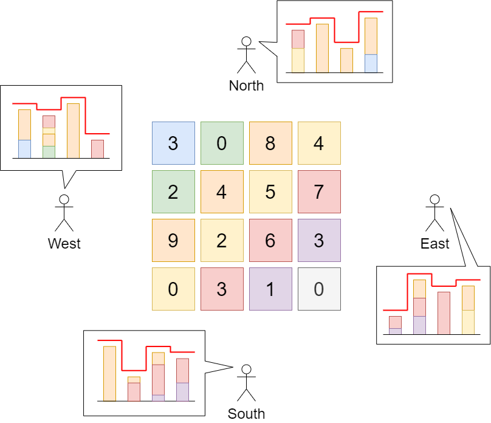

# 数组部分

## 1 两数之和

给定一个整数数组 nums 和一个整数目标值 target，请你在该数组中找出 和为目标值 target  的那 两个 整数，并返回它们的数组下标。

你可以假设每种输入只会对应一个答案。但是，数组中同一个元素在答案里不能重复出现。

你可以按任意顺序返回答案。

```
示例 1：
    输入：nums = [2,7,11,15], target = 9
    输出：[0,1]
    解释：因为 nums[0] + nums[1] == 9 ，返回 [0, 1] 。
示例 2：
    输入：nums = [3,2,4], target = 6
    输出：[1,2]
示例 3：
    输入：nums = [3,3], target = 6
    输出：[0,1]
```

**解答**

```java
class Solution {
    public int[] twoSum(int[] nums, int target) {
        int []result = new int[2];
        //非有序,暴力
        for(int i = 0;i < nums.length;i++){
            for(int j = i + 1;j < nums.length;j++){
                if(nums[i] + nums[j] == target){
                    result[0] = i;
                    result[1] = j;
                }
            }
        }
        return result;
    }
}
```


## 2 盛最多水的容器

给定一个长度为 n 的整数数组 height 。有 n 条垂线，第 i 条线的两个端点是 (i, 0) 和 (i, height[i]) 。

找出其中的两条线，使得它们与 x 轴共同构成的容器可以容纳最多的水。

返回容器可以储存的最大水量。

说明：你不能倾斜容器。


**示例 1**


```
输入：[1,8,6,2,5,4,8,3,7]
输出：49 
解释：图中垂直线代表输入数组 [1,8,6,2,5,4,8,3,7]。在此情况下，容器能够容纳水（表示为蓝色部分）的最大值为 49。
```

**示例 2**

```
输入：height = [1,1]
输出：1
```

**解答**

`动态规划`   使用左右指针进行截取, 想要取到最大的值,就要考虑距离和高度的二优化。这时我们使用左指针和右指针分别处于数组开头和结尾。每执行一次进行一次比较并将值保存到 max 变量中,再移动左右指针中高度较小的,最终就一定可以取得最大值。

```java
public class Solution {
    public int maxArea(int[] height) {
        //实质上就是找 row1 * row2 的 maxvalue
        //使用双指针
        int left =0,right = height.length - 1,max=0;
        while(left < right){
            int min = Math.min(height[left],height[right]);
            int distance = right - left;
            max = Math.max(max,min * distance);
            //移动高度较小的
            if(height[left] < height[right])
                left++;
            else
                right--;
        }
        return max;
    }
}
```


## 3 保持城市天际线 LC-807

给你一座由 n x n 个街区组成的城市，每个街区都包含一座立方体建筑。给你一个下标从 0 开始的 n x n 整数矩阵 grid ，其中 grid[r][c] 表示坐落于 r 行 c 列的建筑物的 高度 。

城市的 天际线 是从远处观察城市时，所有建筑物形成的外部轮廓。从东、南、西、北四个主要方向观测到的 天际线 可能不同。

我们被允许为 任意数量的建筑物 的高度增加 任意增量（不同建筑物的增量可能不同） 。 高度为 0 的建筑物的高度也可以增加。然而，增加的建筑物高度 不能影响 从任何主要方向观察城市得到的 天际线 。

在 不改变 从任何主要方向观测到的城市 天际线 的前提下，返回建筑物可以增加的 最大高度增量总和 。

 

示例 1



```
输入：grid = [[3,0,8,4],[2,4,5,7],[9,2,6,3],[0,3,1,0]]
输出：35
解释：建筑物的高度如上图中心所示。
用红色绘制从不同方向观看得到的天际线。
在不影响天际线的情况下，增加建筑物的高度：
gridNew = [ [8, 4, 8, 7],
            [7, 4, 7, 7],
            [9, 4, 8, 7],
            [3, 3, 3, 3] ]
```

示例 2

```
输入：grid = [[0,0,0],[0,0,0],[0,0,0]]
输出：0
解释：增加任何建筑物的高度都会导致天际线的变化。
```

**解答**

```java
import java.util.Arrays;

class Solution {
    public int maxIncreaseKeepingSkyline(int[][] grid) {
        //需要增加高度,因此需要考虑两个方向的情况
        //1、(0,0)考虑增加高度 因此 a[0][0] = min(max(a[0][i]),max(a[j][0]))
        //首先计算高度
        int []height = new int[8];
        for(int i = 0; i < grid.length; i++){
            int lmax = 0;       //line max
            int rmax = 0;       //row max
            for(int j = 0; j< grid[i].length; j++)
                lmax = Math.max(lmax,grid[i][j]);

            for (int j = 0; j < grid[i].length; j++)
                rmax = Math.max(rmax,grid[j][i]);

            height[i] = lmax;
            System.out.println(lmax + " " +rmax);
            height[grid.length+i] = rmax;
        }
        //补高度
        int returned = 0;
        for(int i = 0; i < grid.length; i++)
            for(int j = 0; j <grid[i].length; j++)
                returned += Math.min(height[i],height[grid.length+j]) > grid[i][j] ? Math.min(height[i],height[grid.length+j]) - grid[i][j] : 0;
        return returned;
    }

}
```


## 4 统计一个圆中点的数目 LC-1828

给你一个数组 `points` ，其中 `points[i] = [xi, yi]` ，表示第 `i` 个点在二维平面上的坐标。多个点可能会有 **相同** 的坐标。

同时给你一个数组 `queries` ，其中 `queries[j] = [xj, yj, rj]` ，表示一个圆心在 `(xj, yj)` 且半径为 `rj` 的圆。

对于每一个查询 `queries[j]` ，计算在第 `j` 个圆 **内** 点的数目。如果一个点在圆的 **边界上** ，我们同样认为它在圆 **内** 。

请你返回一个数组 `answer` ，其中 `answer[j]`是第 `j` 个查询的答案。

 

**示例 1：**


```
输入：points = [[1,3],[3,3],[5,3],[2,2]], queries = [[2,3,1],[4,3,1],[1,1,2]]
输出：[3,2,2]
解释：所有的点和圆如上图所示。
queries[0] 是绿色的圆，queries[1] 是红色的圆，queries[2] 是蓝色的圆。
```

**示例 2：**


```
输入：points = [[1,1],[2,2],[3,3],[4,4],[5,5]], queries = [[1,2,2],[2,2,2],[4,3,2],[4,3,3]]
输出：[2,3,2,4]
解释：所有的点和圆如上图所示。
queries[0] 是绿色的圆，queries[1] 是红色的圆，queries[2] 是蓝色的圆，queries[3] 是紫色的圆。
```

 **解答**

```java
class Solution {
    public int[] countPoints(int[][] points, int[][] queries) {
        //对于该题而言,实质上就是计算点到直线之间的距离是否符合要求
        int []ans = new int[queries.length];
        for(int i = 0; i < queries.length; i++){
            for(int j = 0; j< points.length; j++){
                //距离比较
                if(inCircle(queries[i], points[j]))
                    ans[i]++;
            }
        }
        return ans;
    }

    private boolean inCircle(int[] circle, int[] point) {
        double x = circle[0] - point[0];
        double y = circle[1] - point[1];
        double distance = Math.sqrt(x*x+y*y);
        return distance <= circle[2];
    }
}
```


## 5 句子中的最多单词数 LC-2114

一个 **句子** 由一些 **单词** 以及它们之间的单个空格组成，句子的开头和结尾不会有多余空格。

给你一个字符串数组 `sentences` ，其中 `sentences[i]` 表示单个 **句子** 。

请你返回单个句子里 **单词的最多数目** 。

 

**示例 1：**

```
输入：sentences = ["alice and bob love leetcode", "i think so too", "this is great thanks very much"]
输出：6
解释：
- 第一个句子 "alice and bob love leetcode" 总共有 5 个单词。
- 第二个句子 "i think so too" 总共有 4 个单词。
- 第三个句子 "this is great thanks very much" 总共有 6 个单词。
所以，单个句子中有最多单词数的是第三个句子，总共有 6 个单词。
```

**示例 2：**

```
输入：sentences = ["please wait", "continue to fight", "continue to win"]
输出：3
解释：可能有多个句子有相同单词数。
这个例子中，第二个句子和第三个句子（加粗斜体）有相同数目的单词数。
```

 **解答**

```java
class Solution {
    public int mostWordsFound(String[] sentences) {
        int max = 0;
        //根据' '分割为一个数组,取数组长度
        for(int i = 0; i < sentences.length; i++){
            max = Math.max(max, sentences[i].split(" ").length);
        }
        return max;
    }
}
```


## 6  根据给定数字划分数组 LC-2161

给你一个下标从 **0** 开始的整数数组 `nums` 和一个整数 `pivot` 。请你将 `nums` 重新排列，使得以下条件均成立：

- 所有小于 `pivot` 的元素都出现在所有大于 `pivot` 的元素 **之前** 。
- 所有等于 `pivot` 的元素都出现在小于和大于 `pivot` 的元素 **中间** 。
- 小于 `pivot` 的元素之间和大于 `pivot` 的元素之间的相对顺序不发生改变。
  - 更正式的，考虑每一对 `pi`，`pj` ，`pi` 是初始时位置 `i` 元素的新位置，`pj` 是初始时位置 `j` 元素的新位置。对于小于 `pivot` 的元素，如果 `i < j` 且 `nums[i] < pivot` 和 `nums[j] < pivot` 都成立，那么 `pi < pj` 也成立。类似的，对于大于 `pivot` 的元素，如果 `i < j` 且 `nums[i] > pivot` 和 `nums[j] > pivot` 都成立，那么 `pi < pj` 。

请你返回重新排列 `nums` 数组后的结果数组。

 

**示例 1：**

```
输入：nums = [9,12,5,10,14,3,10], pivot = 10
输出：[9,5,3,10,10,12,14]
解释：
    元素 9 ，5 和 3 小于 pivot ，所以它们在数组的最左边。
    元素 12 和 14 大于 pivot ，所以它们在数组的最右边。
    小于 pivot 的元素的相对位置和大于 pivot 的元素的相对位置分别为 [9, 5, 3] 和 [12, 14] ，它们在结果数组中的相对顺序需		要保留。
```

**示例 2：**

```
输入：nums = [-3,4,3,2], pivot = 2
输出：[-3,2,4,3]
解释：
    元素 -3 小于 pivot ，所以在数组的最左边。
    元素 4 和 3 大于 pivot ，所以它们在数组的最右边。
    小于 pivot 的元素的相对位置和大于 pivot 的元素的相对位置分别为 [-3] 和 [4, 3] ，它们在结果数组中的相对顺序需要保留。
```

**解答**

`相对排序`    `与快排的思想相近,但是要保证相对顺序。`

```java
class Solution {
    public int[] pivotArray(int[] nums, int pivot) {
        int result[] = new int[nums.length];
        int index = 0;
        int len = nums.length - 1;
        //首先对数组中小于 priot 的元素进行排序
        for (int i = 0; i < nums.length;i++) {
            if(nums[i] < pivot)
                result[index++] = nums[i];
        }

        //然后对数组中大于 priot 的元素进行排序
        for (int i = nums.length - 1; i >= 0;i--) {
            if(nums[i] > pivot)
                result[len--] = nums[i];
        }

        //赋值等于 pivot 的元素
        for(int i = index;i <= len;i++)
            result[i] = pivot;
        return result;
    }
}
```


## 7 颜色分类 LC-75

难度中等1193收藏分享切换为英文接收动态反馈

给定一个包含红色、白色和蓝色、共 `n` 个元素的数组 `nums` ，原地对它们进行排序，使得相同颜色的元素相邻，并按照红色、白色、蓝色顺序排列。

我们使用整数 `0`、 `1` 和 `2` 分别表示红色、白色和蓝色。

必须在不使用库的sort函数的情况下解决这个问题。

**示例 1：**

```
输入：nums = [2,0,2,1,1,0]
输出：[0,0,1,1,2,2]
```

**示例 2：**

```
输入：nums = [2,0,1]
输出：[0,1,2]
```

**解答**

`与 6 题相似`

```java
class Solution {
    public void sortColors(int[] nums) {
        //相对排列取 O(3n)
        int [] res = new int[nums.length];
        int index = 0;
        int end = nums.length - 1;
        for(int i = 0;i < nums.length; i++){
            if(0 == nums[i])
                res[index++] = 0;
            else if(2 == nums[i])
                res[end--] = 2;
        }
        //补全 1
        for(int i = index;i <= end; i++)
            res[index++] = 1;
        //赋值
        for(int i = 0;i < nums.length; i++)
            nums[i] = res[i];
    }
}
```


# 动态规划部分
