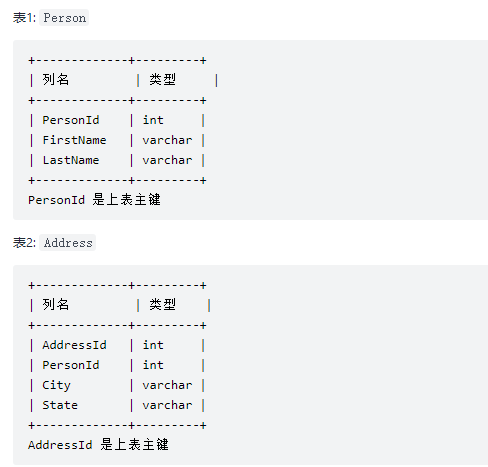
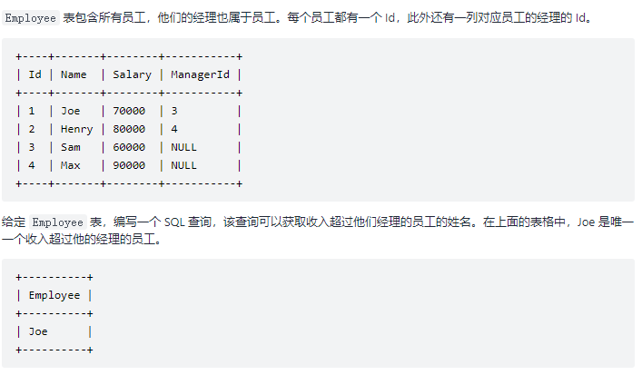

## 4 SQL 算法

### 1) 左外连接



编写一个 SQL 查询，满足条件：无论 person 是否有地址信息，都需要基于上述两表提供 person 的以下信息：

FirstName, LastName, City, State

```sql
select FirstName, LastName , City, State
from Person left join Address
on Person.PersonId = Address.PersonId;
```

---


### 2) 双层查询



**解法:**

由于在一个表上要获取超过经理薪酬的员工, 那么就需要使用双层循环。 这里定义表头为 'Enployee' 外层 a 内层 b, 当员工 a 的经理编号 等于 b 的编号 并且 a的薪酬大于 b(经理)的薪酬则返回结果。

```sql
SELECT 
    a.Name AS 'Employee'
FROM
    Employee AS a,
    Employee AS b
WHERE
    a.ManagerId = b.Id AND a.Salary > b.Salary;
```

---


### 3) not in 

某网站包含两个表，Customers 表和 Orders 表。编写一个 SQL 查询，找出所有从不订购任何东西的客户。


**解答**:

not in 关键字用于判断不在 查询结果内的数据

```sql
select customers.name as 'Customers'
from customers
where customers.id not in
(
    select customerid from orders
);
```

---


### 4) dateDiff() 获取两个日期相差天数

 **表结构**

```
Weather
+----+------------+-------------+
| id | recordDate | Temperature |
+----+------------+-------------+
| 1  | 2015-01-01 | 10          |
| 2  | 2015-01-02 | 25          |
| 3  | 2015-01-03 | 20          |
| 4  | 2015-01-04 | 30          |
+----+------------+-------------+
```

**解答**

编写一个 SQL 查询，来查找与之前（昨天的）日期相比温度更高的所有日期的 id ,日期相差1天。

```
SELECT a.id
FROM 
    Weather a, 
    Weather b
WHERE
    a.Temperature > b.Temperature AND dateDiff(a.recordDate,b.recordDate) = 1;
```

---


### 5) HAVING & COUNT() & GROUP BY

 有一个courses 表 ，有: student (学生) 和 class (课程)。

 请列出所有超过或等于5名学生的课。

 例如，表：

```
+---------+------------+
| student | class      |
+---------+------------+
| A       | Math       |
| B       | English    |
| C       | Math       |
| D       | Biology    |
| E       | Math       |
| F       | Computer   |
| G       | Math       |
| H       | Math       |
| I       | Math       |
+---------+------------+
输出
+---------+
| class   |
+---------+
| Math    |
+---------+
```

 **解答**

```sql
SELECT class
FROM courses
GROUP BY class
HAVING COUNT(DISTINCT student) >= 5;
```

---


### 6) ORDER BY 

 例如，下表 cinema:

```
+---------+-----------+--------------+-----------+
|   id    | movie     | description | rating   |
+---------+-----------+--------------+-----------+
|   1     | War       |   great 3D   |   8.9     |
|   2     | Science   |   fiction    |   8.5     |
|   3     | irish     |   boring     |   6.2     |
|   4     | Ice song  |   Fantacy    |   8.6     |
|   5     | House card|   Interesting|   9.1     |
+---------+-----------+--------------+-----------+
```

 **代码**

 根据 rating 值 降序排列;  DESC 降序   ASC  升序

```sql
ORDER BY rating DESC;
```

---


### 7) IF 表达式 IF(expr1,expr2,expr3)

 如下表:

```
Salary 表：
+----+------+-----+--------+
| id | name | sex | salary |
+----+------+-----+--------+
| 1  | A    | m   | 2500   |
| 2  | B    | f   | 1500   |
| 3  | C    | m   | 5500   |
| 4  | D    | f   | 500    |
+----+------+-----+--------+
```

 **代码**

 编写一个 SQL 查询来交换所有的 'f' 和 'm' （即，将所有 'f' 变为 'm' ，反之亦然）

```sql
UPDATE Salary 
SET sex = IF(sex = "f","m","f")
```

 **笔记**

 如下代码, 如果 IF 中 a = 1 条件成立,则返回 '女', 不成立则返回 '男'

```sql
 IF 表达式 IF(a = 1,"男","女")	
```

 触发器和存储过程中常使用如下写法

```sql
 IF condition THEN:
     ...
 ELSE IF condition THEN:
     ...
```

---


### 8) LIMIT 概述

 在 SELECT 语句中使用 LIMIT 子句来约束结果集中的行数。LIMIT 子句接受一个或两个参数。两个 

 参数的值必须为零或正整数

 下面说明了两个参数的LIMIT子句语法：

```sql
SELECT
  column1,column2,...
FROM
   table
LIMIT offset , count;
SQL
```

 我们来查看 LIMIT 子句参数：

> offset 参数指定要返回的第一行的偏移量。第一行的偏移量为0，而不是1。
>
> count 指定要返回的最大行数。

---


### 9) DENSE_RANK()

`DENSE_RANK()`是一个[窗口函数](https://www.begtut.com/mysql/mysql-window-functions.html)，它为分区或结果集中的每一行分配排名，而排名值没有间隙。

行的等级从行前的不同等级值的数量增加1。

`DENSE_RANK()` 函数的语法如下：

```
DENSE_RANK() OVER (
    PARTITION BY <expression>[{,<expression>...}]
    ORDER BY <expression> [ASC|DESC], [{,<expression>...}]
) 
```

在这个语法中：

> 首先，`PARTITION BY`子句将`FROM`子句生成的结果集划分为分区。`DENSE_RANK()`函数应用于每个分区。
>
> 其次，`ORDER BY` 子句指定`DENSE_RANK()`函数操作的每个分区中的行顺序。

如果分区具有两个或更多具有相同排名值的行，则将为这些行中的每一行分配相同的排名。

---


### 10) OVER

over不能单独使用，要和分析函数：*rank*() , *dense_rank*() , *row_number*()等一起使用

---

